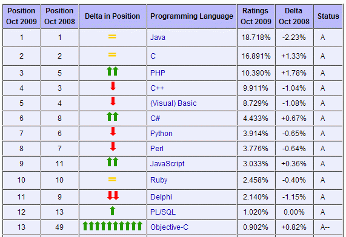

# GNUstep Getting Started
> | Objective-C |

Objective-C popularity aggressively increased based on
[TIOBE Index (for October 2009)](http://www.tiobe.com/index.php/content/paperinfo/tpci/index.html)

The reason is simple - iPhone and all related stuff. We should be ready to
develop Objective-C based application in future. The worst thing I don't
have a Mac, so I don't have development environment. I need to get basic
Objective-C knowledge, and here several solutions:

* buy Mac
* install [Hackintosh](http://en.wikipedia.org/wiki/OSx86) on PC
* try GNU compiler and play with Objective-C

The better choice is the last one (for me). As I'm a Windows XP user and
I don't have a time to set up Linux, I'm going to use some Windows GNU
GCC port: Cygwin or MinGW.

There are two cross-platform projects which implements Objective-C
Cocoa/OpenStep APIs:

* [The Cocotron](http://www.cocotron.org/) - this project uses Mac machine for build (I didn't dig into this), but built application can be run on Windows.
* [GNUstep](http://www.gnustep.org/) - this project supports many platforms (Windows included).

My choice is **GNUstep**.

Here is the useful links for quick start:

* [www.gnustep.org](http://www.gnustep.org/) - official site
* [GNUstep programming mini tutorials](http://www.gnustep.it/nicola/Tutorials/index.html) - the second place you should start with.
* [www.gnustep.it](http://www.gnustep.it/) - This site is dedicated to [GNUstep](http://www.gnustep.org/). There are a lot of useful info.
* [GNUstep Application Project](http://gap.nongnu.org/) - The purpose of
this project is to implement a set of administrative applications and
user level applications using GNUstep. Another aim of this project is to
port as many applications from OPENSTEP/Cocoa to GNUstep as possible.
Great place to look into real application.
* [Objective-C: Links,Resources, Stuff](http://www.foldr.org/%7Emichaelw/objective-c/) - dig deeper in Objective-C culture
* [GNUstep Library](http://gnustep.made-it.com/) - additional info: Build
Guides, User Documentation, Developer Documentation
* [GNUstep forum](http://old.nabble.com/GNUstep-f1880.html) - it covers
the next categories: General, Help, Dev, Webmasters, Bugs, Announce, Apps
* [GNUstep HelpCenter](http://www.roard.com/docs/) - links to various
tutorials and articles on GNUstep.
* [GNUstepWiki](http://wiki.gnustep.org/) - just _wiki_

## How to build your first GNUstep application in Windows?

In general it's simple, but if you have some troubles with it here is the links:

1. [Installing and using GNUstep and Objective-C on Windows](http://www.techotopia.com/index.php/Installing_and_using_GNUstep_and_Objective-C_on_Windows#Downloading_the_GNUstep_Packages)
2. [Writing GNUstep Makefiles](http://www.gnustep.it/nicola/Tutorials/WritingMakefiles/) (I highly recommend it)
3. [Compile Objective-C Programs Using gcc](http://blog.lyxite.com/2008/01/compile-objective-c-programs-using-gcc.html)