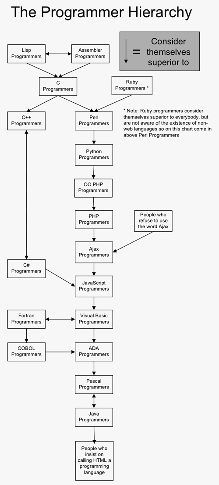

# Lisp, Ruby, Acceptable and not Acceptable
> | review | lisp | ruby |

There is one really (in)famous essay [Why Ruby is an acceptable LISP](http://www.randomhacks.net.s3-website-us-east-1.amazonaws.com/2005/12/03/why-ruby-is-an-acceptable-lisp/) by Eric Kidd. The most interesting of all this stuff are comments and other responsive blog posts (e.g. [Lisp is Not an Acceptable Lisp by Steve Yegge](http://steve-yegge.blogspot.com/2006/04/lisp-is-not-acceptable-lisp.html))
I can say this is something like "vs" essay which is very popular nowadays. 

Here is the list of some quotes and key ideas:

* Lisp macros are far more powerful than the trivial use cases you’ve listed. I could give a lot of examples here, but just ask yourself: why is most of the programming community so fond with “Design Patterns”, while the Lisp community generally isn’t? **Well, that’s because patterns are nothing but high-level specifications for code being rewritten again and again and again. The Lisp approach is to create some macros and auxiliary functions that actually implement the pattern, thus extending the language capabilities and avoiding continuous reinvention of the wheel.**
* This article sounds like it was written for folks who really want to use Lisp, but have chosen Ruby because all the* cool kids* are using it and want to reasonably justify an emotional decision.
* If you want to learn a language that can change with the times and incorporate whatever latest fad the programming cool kids have to offer, Lisp is the choice. Lisp is the red pill.
* A final example: look at the 2 open source Computer Algebra Systems written in Common Lisp available as Open Source: 1) Axiom – originally from IBM Thomas Watson Research Center; 2) Maxima – originally Department of Energy (US). This is software written in the 70s. You can’t write software that lasts so long with a language that is a moving target. This is the kind of survival and complex domain which shows the power of Lisp.
* The real reason that brought me to Lisp (and never will get me away from it) is simply this:
 You can build it out of 7 (s-e-v-e-n) primitive operators!
 And, as a consequence, no other language can be expressed in itself as short as Lisp. (As you probably know, quite any language can be expressed in itself.)
 So let me repeat: **really no other language can be expressed in itself that short, and (as a natural consequence) can be built out of less primitive operators.**
* Ruby has a syntax, and Ruby needs a full parser to get from that syntax to an AST. Because Lisp code is naturally an AST, things are very different

And small summary of the Steve's blog post [Lisp is Not an Acceptable Lisp](http://steve-yegge.blogspot.com/2006/04/lisp-is-not-acceptable-lisp.html):

>There is no acceptable Lisp. This is a problem. It's not a little teeny one, either. The Lisp communities (yeah, there are a bunch) are going to have to realize that if Lisp is ever going to be massively successful, it needs an overhaul. Or maybe a revolution. Contrary to what some might tell you, it doesn't need a committee, and it doesn't need a bunch of money. Linux proved exactly the opposite. **Lisp needs a benevolent dictator.** Lisp needs to ditch the name "Lisp", since it scares people. And Lisp needs to learn from the lessons of the 45 years of languages that have followed it.

Based on this comments and I'm attaching this funny picture:

