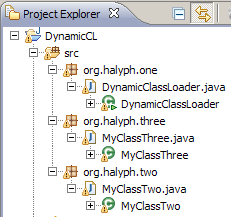

# How to Add Jars at Runtime?
> | java |

Suppose you have the next project structure:



Here is the source code:

```java
package org.halyph.one;

import java.io.File;
import java.lang.reflect.InvocationTargetException;
import java.lang.reflect.Method;
import java.net.MalformedURLException;
import java.net.URL;
import java.net.URLClassLoader;
import java.security.CodeSource;

import org.halyph.three.MyClassThree;
import org.halyph.two.MyClassTwo;

public class DynamicClassLoader {
 public static void main(String[] args) throws Exception {
  System.out.println("DynamicClassLoader.main()");

  MyClassTwo myClassTwo = new MyClassTwo();
  MyClassThree myClassThree = new MyClassThree();
  myClassTwo.printMessage();
  myClassThree.printMessage();

 }
}

package org.halyph.two;

public class MyClassTwo {
 public void printMessage() {
  System.out.println("MyClassTwo.printMessage()");
 }
}

package org.halyph.three;

public class MyClassThree {
 public void printMessage() {
  System.out.println("MyClassThree.printMessage()");
 }
}
```

And each of these classes are packed in separate jar:

- `org.halyph.one.DynamicClassLoader` - `dynone.jar`
- `org.halyph.two.MyClassTwo` - `dyntwo.jar`
- `org.halyph.three.MyClassThree` - `dynthree.jar`

To run this application you should put all these jars on classpath,
E.g. the application output

```bash
# java -cp dynone.jar;dyntwo.jar;dynthree.jar org.halyph.one.DynamicClassLoader
DynamicClassLoader.main()
MyClassTwo.printMessage()
MyClassThree.printMessage()
```

But there are some cases when `dyntwo.jar` and `dynthree.jar` jars location can be known during runtime only. And we have to run our application in the next way:

```bash
# java -cp dynone.jar org.halyph.one.DynamicClassLoader
```

Of cause, you'll get the next (or similar) error:

```bash
# java -cp dynone.jar org.halyph.one.DynamicClassLoader
DynamicClassLoader.main()
Exception in thread "main" java.lang.NoClassDefFoundError: org/halyph/two/MyClassTwo
        at org.halyph.one.DynamicClassLoader.main(DynamicClassLoader.java:28)
Caused by: java.lang.ClassNotFoundException: org.halyph.two.MyClassTwo
        at java.net.URLClassLoader$1.run(Unknown Source)
        at java.security.AccessController.doPrivileged(Native Method)
        at java.net.URLClassLoader.findClass(Unknown Source)
        at java.lang.ClassLoader.loadClass(Unknown Source)
        at sun.misc.Launcher$AppClassLoader.loadClass(Unknown Source)
        at java.lang.ClassLoader.loadClass(Unknown Source)
        ... 1 more
```

So, how can we solve this problem?
Here is the patched `org.halyph.one.DynamicClassLoader`:

```java
package org.halyph.one;

import java.io.File;
import java.lang.reflect.InvocationTargetException;
import java.lang.reflect.Method;
import java.net.MalformedURLException;
import java.net.URL;
import java.net.URLClassLoader;
import java.security.CodeSource;

import org.halyph.three.MyClassThree;
import org.halyph.two.MyClassTwo;

public class DynamicClassLoader {

 public static void main(String[] args) throws Exception {
  System.out.println("DynamicClassLoader.main()");

  String[] jars = new String[] { "dyntwo.jar",  "dynthree.jar"};
  addJarsToClasspath(getRootFolder(), jars);
  MyClassTwo myClassTwo = new MyClassTwo();
  MyClassThree myClassThree = new MyClassThree();
  myClassTwo.printMessage();
  myClassThree.printMessage();

 }

 public static void addJarsToClasspath(String rootFolder, String[] jarNames)
   throws SecurityException, NoSuchMethodException,
   MalformedURLException, IllegalArgumentException,
   IllegalAccessException, InvocationTargetException {

  Method addURL = URLClassLoader.class.getDeclaredMethod("addURL",
    new Class[] { URL.class });
  addURL.setAccessible(true); // you're telling the JVM to override the
         // default visibility

  File[] files = new File[jarNames.length];
  int i = 0;
  for (String jarName : jarNames) {
   files[i++] = new File(rootFolder + jarName);
  }

  // returning the jars to add
  ClassLoader cl = ClassLoader.getSystemClassLoader();
  for (i = 0; i < files.length; i++) {
   URL url = files[i].toURL();
   addURL.invoke(cl, new Object[] { url });
  }
 }

 public static String getRootFolder() {
  String result = null;
  try {
   String qualifiedClassName = DynamicClassLoader.class.getName();

   Class qc = Class.forName(qualifiedClassName);
   CodeSource source = qc.getProtectionDomain().getCodeSource();
   if (source != null) {
    URL location = source.getLocation();
    File file = new File(location.toURI());

    result = file.getParent() + "/";
   } else {
    System.out.println(qualifiedClassName + " : "
      + "unknown source");
   }
  } catch (Exception e) {
   System.err.println("Unable to locate class on command line.");
   e.printStackTrace();
  }
  return result;
 }

}
```

Here is the output of patched application:

```bash
# java -cp dynone.jar org.halyph.one.DynamicClassLoader
DynamicClassLoader.main()
MyClassTwo.printMessage()
MyClassThree.printMessage()
```

So, two additional methods were added to support this "magic":

- `public static String getRootFolder()` - this method simply identifies the folder where `dynone.jar` (on behalf of `org.halyph.one.DynamicClassLoader` class) is located. Because for this demo we put all application-related jars in one folder
- `public static void addJarsToClasspath(String rootFolder, String[] jarNames)` - and here the "magic" happen. Based on this post on [www.velocityreviews.com forums](https://www.thecodingforums.com/threads/dynamically-change-the-classpath.148021/):

>There is a well-known hack for dynamically extending the class path.
>It generally works, and we use it in production releases of our software. It uses reflection, plus the knowledge that the default ClassLoader *is* a URLClassLoader.  
>...  
>As I said, this is a hack, undocumented, and subject to change at any
>time. Indeed, there's no guarantee that extant JREs use a URLClassLoader as a default class loader. Moreover, it only works if your program doesn't have a security manager (it probably doesn't), or your code is trusted.  
>...  
>We've never seen problems with it, although our software is used on a plethora of different boxes and OSs.

It works for me and I hope it will be useful for you as well.  
Happy hacking!