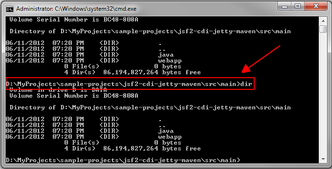
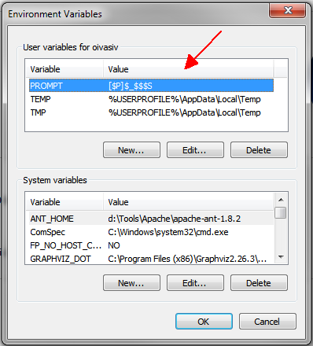
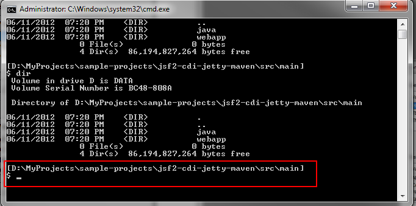

# How to improve cmd.exe prompt
> | tool | terminal |

I'm sure that you have some trouble with _"too long command prompt in windows cmd.exe"_ and it is annoying:


  
Fortunately, it can be easily fixed with PROMPT command (see official help):  
  
```
\> prompt /?
```
  
```
PROMPT \[text\]  
  
  text    Specifies a new command prompt.  
  
Prompt can be made up of normal characters
and the following special codes:  
  
  $A   & (Ampersand)  
  $B   | (pipe)  
  $C   ( (Left parenthesis)  
  $D   Current date  
  $E   Escape code (ASCII code 27)  
  $F   ) (Right parenthesis)  
  $G   > (greater-than sign)  
  $H   Backspace (erases previous character)  
  $L   < (less-than sign)  
  $N   Current drive  
  $P   Current drive and path  
  $Q   = (equal sign)  
  $S     (space)  
  $T   Current time  
  $V   Windows version number  
  $\_   Carriage return and linefeed  
  $$   $ (dollar sign)  
```  

I've configured **PROMPT** User variable to apply my custom PROMPT setting: `[$P]$_$$$S`



Now the previous console screen looks like this:  



 
As you can see the full current path is shown one line before the input line. Now, we have a plenty of place for typing what ever we need ;-)