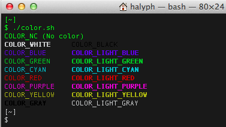

# Mac OS X terminal supports colored output
> | terminal | MacOS |

Mac OS X Mountain Lion Terminal hasn't been configured to support coloured output.  
You can check it via simple command run "ls -la":


Let's fix this.

1\. Add the next string to  `.bash_profile`

```bash
export CLICOLOR=1
```

2\. Create `color.sh` script:

```bash
$ cat ./color.sh  
#!/bin/bash  
  
echo -e "\\033\[0mCOLOR\_NC (No color)"  
echo -e "\\033\[1;37mCOLOR\_WHITE\\t\\033\[0;30mCOLOR\_BLACK"  
echo -e "\\033\[0;34mCOLOR\_BLUE\\t\\033\[1;34mCOLOR\_LIGHT\_BLUE"  
echo -e "\\033\[0;32mCOLOR\_GREEN\\t\\033\[1;32mCOLOR\_LIGHT\_GREEN"  
echo -e "\\033\[0;36mCOLOR\_CYAN\\t\\033\[1;36mCOLOR\_LIGHT\_CYAN"  
echo -e "\\033\[0;31mCOLOR\_RED\\t\\033\[1;31mCOLOR\_LIGHT\_RED"  
echo -e "\\033\[0;35mCOLOR\_PURPLE\\t\\033\[1;35mCOLOR\_LIGHT\_PURPLE"  
echo -e "\\033\[0;33mCOLOR\_YELLOW\\t\\033\[1;33mCOLOR\_LIGHT\_YELLOW"  
echo -e "\\033\[1;30mCOLOR\_GRAY\\t\\033\[0;37mCOLOR\_LIGHT\_GRAY"  
  
$ chmod +x color.sh  
```
  
3\. Run `./color.sh`, you should get something like this:



Also, command `ls -la` should produce colored output. 


  
## References

* [A black OS X Leopard Terminal theme that is actually readable](http://blog.toddwerth.com/entries/6)
* [Add Color to the Terminal in Mac OS X](http://osxdaily.com/2012/02/21/add-color-to-the-terminal-in-mac-os-x/)
* [Tip: Prompt magic](http://www.ibm.com/developerworks/linux/library/l-tip-prompt/)
* [8 Useful and Interesting Bash Prompts](http://maketecheasier.com/8-useful-and-interesting-bash-prompts/2009/09/04)