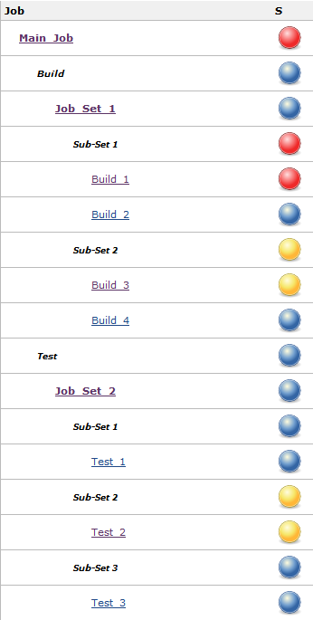
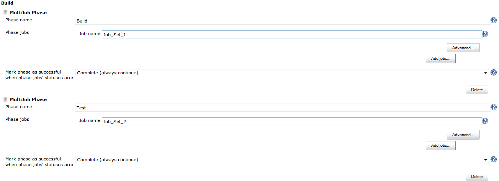
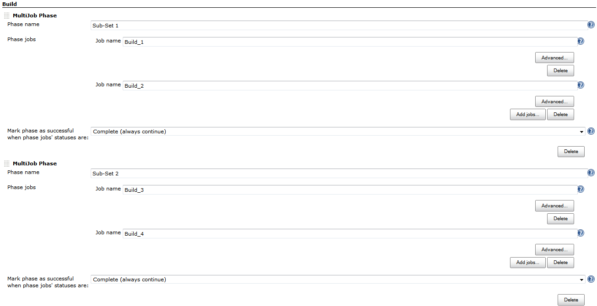
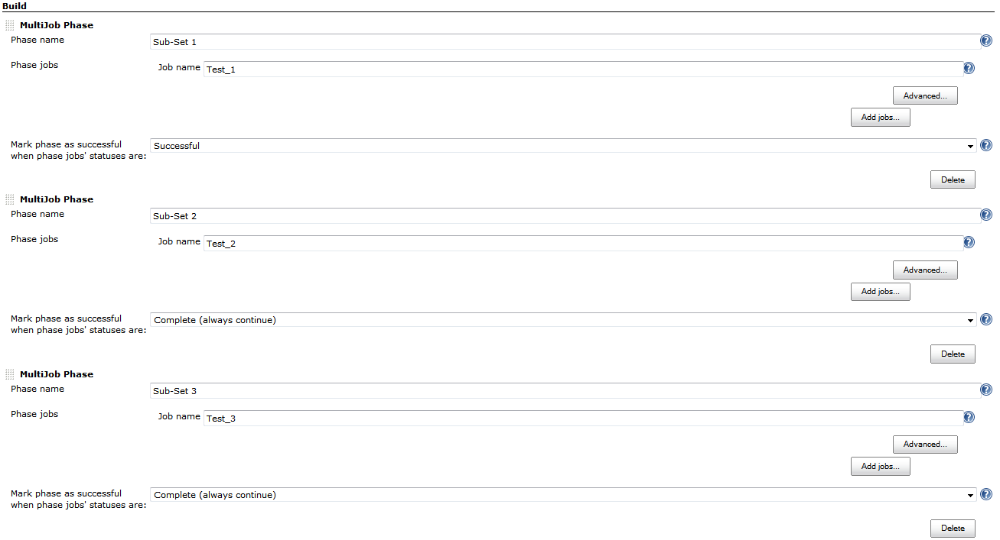
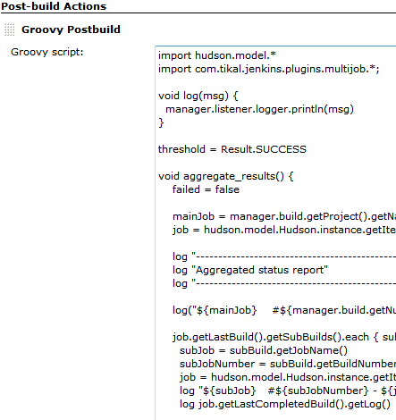

# Jenkins hierarchical jobs and jobs status aggregation
> | jenkins | ci |
  
As you probably know, Jenkins is highly configurable CI server. We can setup different custom build process. And I'm going to share some approach I've been using to setup the hierarchy of Jenkins' jobs.  
  
Here is use case.  

1. We have one main entry job which is invoked to start the whole build process.
2. This job can have from one to many child jobs. (Level 2)
3. Each child job can have from one to many child jobs, aslo. (Level 3)
4. The main idea is to collect/aggregate all children jobs' status into main entry job.

See sample screenshot below which visualize the general idea. Here:  

* **Main\_Job** is single entry job, which must contain all sibling jobs  statuses
* **Job\_Set\_1** and **Job\_Set\_2** are two child jobs
* **Build\_\[1-4\]** are child jobs of **Job\_Set\_1**
* **Tests\_\[1-3\]** are child jobs of **Job\_Set\_2**


  
Now, we should use some Jenkins plugin to build such hierarchy. I've been using [Multijob Plugin](https://wiki.jenkins-ci.org/display/JENKINS/Multijob+Plugin).  
See below screenshots of configuration for:

Main\_Job/configure



Job\_Set\_1/configure 



Job\_Set\_2/configure 



But, it's not enough. We have to aggregate statuses into **Main\_Job** from all sibling jobs. I've been using patched [Groovy Postbuild Plugin](https://wiki.jenkins-ci.org/display/JENKINS/Groovy+Postbuild+Plugin). Modified plugin is located here [https://github.com/halyph/groovy-postbuild-plugin](https://github.com/halyph/groovy-postbuild-plugin)  
  
Groovy Postbuild Plugin allows us to write groovy scripts for job's Post-build Actions. This script has access to whole Jenkins environment and can consume functionality of all installed Jenkins plugin:



Here is the source of this script:  

```groovy
import hudson.model.*
import com.tikal.jenkins.plugins.multijob.*;

void log(msg) {
  manager.listener.logger.println(msg)
}

threshold = Result.SUCCESS

void aggregate_results() {
    failed = false

    mainJob = manager.build.getProject().getName()
    job = hudson.model.Hudson.instance.getItem(mainJob)

    log "---------------------------------------------------------------------------------------------------------------"
    log "Aggregated status report"
    log "---------------------------------------------------------------------------------------------------------------"

    log("${mainJob}    #${manager.build.getNumber()} - ${manager.build.getResult()}")

    job.getLastBuild().getSubBuilds().each { subBuild->
      subJob = subBuild.getJobName() 
      subJobNumber = subBuild.getBuildNumber()
      job = hudson.model.Hudson.instance.getItem(subBuild.getJobName())
      log "${subJob}   #${subJobNumber} - ${job.getLastCompletedBuild().getResult()}"
      log job.getLastCompletedBuild().getLog()

      //println subBuild
      dePhaseJob = hudson.model.Hudson.instance.getItem(subBuild.getJobName())
      dePhaseJobBuild = dePhaseJob.getBuildByNumber(subBuild.getBuildNumber())
      dePhaseJobBuild.getSubBuilds().each { childSubBuild ->
        try {
            log "   ${childSubBuild.jobName}"

            job = hudson.model.Hudson.instance.getItem(childSubBuild.getJobName())
            build = job.getBuildByNumber(childSubBuild.getBuildNumber())

            indent = "  "    
            log "${indent} #${build.getNumber()}  - ${build.getResult()}" 
            log build.getLog()

            if(!failed && build.getResult().isWorseThan(threshold) ) {
              failed = true
            }
        } catch (Exception e) {    
            log("ERROR: ${e.getMessage()}")
            failed = true
        }
      }
    }

    if(failed) {manager.build.setResult(hudson.model.Result.FAILURE)}
}

try {
  aggregate_results()
} catch(Exception e) {
  log("ERROR: ${e.message}")
  log("ERROR: Failed Status report aggregation")
  manager.build.setResult(hudson.model.Result.FAILURE)
}
```


You can find it on GitHub Gist also: [https://gist.github.com/4610274](https://gist.github.com/4610274).

This script is pretty dumb. It simply extracts (prints in Main\_Job console) the next info for each child jobs:  

* job name
* build number
* build result (status)
* build log

Also, it has ability to set the **Main\_Job** status based on statuses of child jobs. See `threshold` variable in script.  

And aggregated report looks like this:  

```
Started by user anonymous
Building in workspace C:\Users\oivasiv\.jenkins\jobs\Main_Job\workspace
Starting build job Job_Set_1.
Finished Build : #8 of Job : Job_Set_1 with status :SUCCESS
Starting build job Job_Set_2.
Finished Build : #8 of Job : Job_Set_2 with status :SUCCESS
---------------------------------------------------------------------------------------------------------------
Aggregated status report
---------------------------------------------------------------------------------------------------------------
Main_Job    #8 - SUCCESS
Job_Set_1   #8 - SUCCESS
Started by upstream project "Main_Job" build number 8
Building in workspace C:\Users\oivasiv\.jenkins\jobs\Job_Set_1\workspace
Starting build job Build_1.
Starting build job Build_2.
Finished Build : #8 of Job : Build_1 with status :FAILURE
Finished Build : #8 of Job : Build_2 with status :SUCCESS
Starting build job Build_3.
Starting build job Build_4.
Finished Build : #6 of Job : Build_3 with status :UNSTABLE
Finished Build : #6 of Job : Build_4 with status :SUCCESS
Notifying upstream projects of job completion
Finished: SUCCESS

   Build_1
   #8  - FAILURE
Started by upstream project "Job_Set_1" build number 8
Building in workspace C:\Users\oivasiv\.jenkins\jobs\Build_1\workspace
Setting result to [Failed]
Build step 'Set the build result' changed build result to FAILURE
Build step 'Set the build result' marked build as failure
Notifying upstream projects of job completion
Finished: FAILURE

   Build_2
   #8  - SUCCESS
Started by upstream project "Job_Set_1" build number 8
Building in workspace C:\Users\oivasiv\.jenkins\jobs\Build_2\workspace
Setting result to [Success]
Build step 'Set the build result' changed build result to SUCCESS
>>>>>>>>>>>>>>>>>>>>>>>>>>>>>>>>>>>>>>>>>>>>>>>>>>>>>>>>>>>>
null
Notifying upstream projects of job completion
Finished: SUCCESS

   Build_3
   #6  - UNSTABLE
Started by upstream project "Job_Set_1" build number 8
Building in workspace C:\Users\oivasiv\.jenkins\jobs\Build_3\workspace
Setting result to [Unstable]
Build step 'Set the build result' changed build result to UNSTABLE
Notifying upstream projects of job completion
Finished: UNSTABLE

   Build_4
   #6  - SUCCESS
Started by upstream project "Job_Set_1" build number 8
Building in workspace C:\Users\oivasiv\.jenkins\jobs\Build_4\workspace
Setting result to [Success]
Build step 'Set the build result' changed build result to SUCCESS
Notifying upstream projects of job completion
Finished: SUCCESS

Job_Set_2   #8 - SUCCESS
Started by upstream project "Main_Job" build number 8
Building in workspace C:\Users\oivasiv\.jenkins\jobs\Job_Set_2\workspace
Starting build job Test_1.
Finished Build : #8 of Job : Test_1 with status :SUCCESS
Starting build job Test_2.
Finished Build : #8 of Job : Test_2 with status :UNSTABLE
Starting build job Test_3.
Finished Build : #8 of Job : Test_3 with status :SUCCESS
Notifying upstream projects of job completion
Finished: SUCCESS

   Test_1
   #8  - SUCCESS
Started by upstream project "Job_Set_2" build number 8
Building in workspace C:\Users\oivasiv\.jenkins\jobs\Test_1\workspace
Setting result to [Success]
Build step 'Set the build result' changed build result to SUCCESS
Notifying upstream projects of job completion
Finished: SUCCESS

   Test_2
   #8  - UNSTABLE
Started by upstream project "Job_Set_2" build number 8
Building in workspace C:\Users\oivasiv\.jenkins\jobs\Test_2\workspace
Setting result to [Unstable]
Build step 'Set the build result' changed build result to UNSTABLE
Notifying upstream projects of job completion
Finished: UNSTABLE

   Test_3
   #8  - SUCCESS
Started by upstream project "Job_Set_2" build number 8
Building in workspace C:\Users\oivasiv\.jenkins\jobs\Test_3\workspace
Setting result to [Success]
Build step 'Set the build result' changed build result to SUCCESS
Notifying upstream projects of job completion
Finished: SUCCESS

Build step 'Groovy Postbuild' changed build result to FAILURE
Build step 'Groovy Postbuild' marked build as failure
Notifying upstream projects of job completion
Finished: FAILURE
```

So, what are the benefits of such jobs status aggregation and Groovy post-processing:  

* we have jobs status in one place
* e-mail notification sent from **Main\_Job** contains this status
* ability to implement any custom post-processing logic
* ability to re-use the other plugins features via groovy scrip