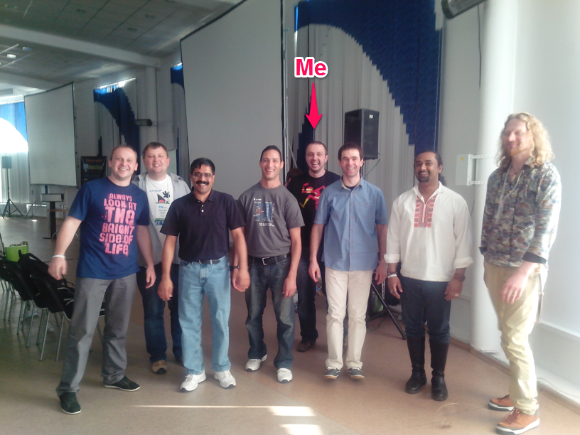

# JEEConf - Kyiv, 2013 - Report
> | conference | java |

The third [JEEConf](http://jeeconf.com/) was superb. It was well organized, with friendly atmosphere and high-quality speakers. And I had a dilemma what topics/speaker I should visit. :-)
  
So, I've selected the next speakers:  

* [Oleg Šelajev](http://jeeconf.com/speakers/#shelaev), ["Taming Java Agents"](http://jeeconf.com/program/#java-agents)
It was really nice intro into Java Agents. Now I have a clue how and when to use them.
* [Yakov Fain](http://jeeconf.com/speakers/#fain):
  * ["Speed up your Web applications with HTML5 WebSockets"](http://jeeconf.com/program/#html5-websockets)
Yakov explained what is Pooling, Long Pooling and WebSockets. He has shown clear and simple demos which highlighted pros&cons of each approaches.
  * ["Surviving as a professional software developer"](http://jeeconf.com/program/#professional-developer)
It was philosophical talk. Everybody has taken something and applied on your current job.
* [Jacek Laskowski](http://jeeconf.com/speakers/#laskowski): 
  * "[Introduction to functional programming in Scala](http://jeeconf.com/program/#functional-programming-in-scala)" (see speaker blog post [Introduction to functional programming in Scala at JEEConf in Kiev, Ukraine](http://blog.japila.pl/2013/05/introduction-to-functional-programming-in-scala-at-jeeconf-in-kiev-ukraine/))
Jakek nicely introduced FP. Very easy to understand and without Scala magic. Very good job.
  * "[Introduction to web application development in Clojure](http://jeeconf.com/program/#web-development-in-clojure)" (see [Introduction to Web Application Development in Clojure at JEEConf in Kiev, Ukraine](http://blog.japila.pl/2013/05/introduction-to-web-application-development-in-clojure-at-jeeconf-in-kiev-ukraine/)) Clojure is very simple language. How can we write Web app without bloated framework? All this was shown in this talk. Also, Jacek highlighted the major Clojure ecosystem tools, approaches and practices. Nice intro for further dive in Clojure Web development.
* [Dr. Venkat Subramaniam:](http://jeeconf.com/speakers/#subramaniam):
  * ["Programming with Actors](http://jeeconf.com/program/#programming-with-actors)"
Venkat has shown the benefits of using Actors in Java.
  * "[Picking a JVM Language, which one is right for you?](http://jeeconf.com/program/#jvm-languages)"
The main idea is NOT to be language agnostic. Use the right tool for the job.
  * "[The Art of Simplicity](http://jeeconf.com/program/#simplicity)"
These talk was very inspiring. The word "simplicity" was nicely explained from different angles.
* [Сергей Куксенко](http://jeeconf.com/speakers/#kuksenko), "[JDK8: Молот лямбд](http://jeeconf.com/program/#jdk8-lambda-changes)"
In this talk the speaker has shown changes in Java 8 related with lambda. And shown how to use new API based on lambda. It was very inspiring to learn more about lambda.  

Unfortunately, there were other topics which went in parallel. Now, I'm waiting on video from organizer.  
  
On the photo from left to right: 3) Venkat Subramaniam, 4) Mohamed Taman 5) me, 6) Jacek Laskowsk, 7) Reza Rahma and 8)Anton Keks.  

