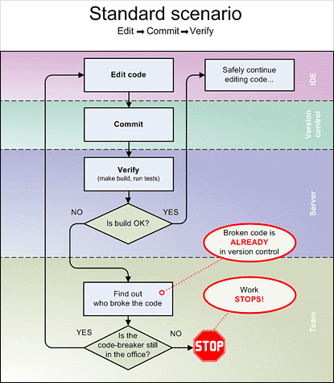
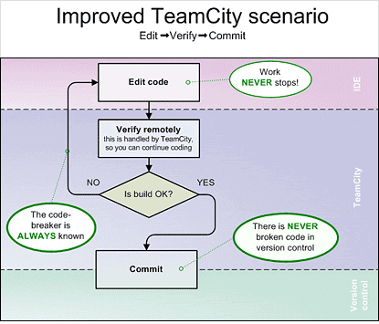
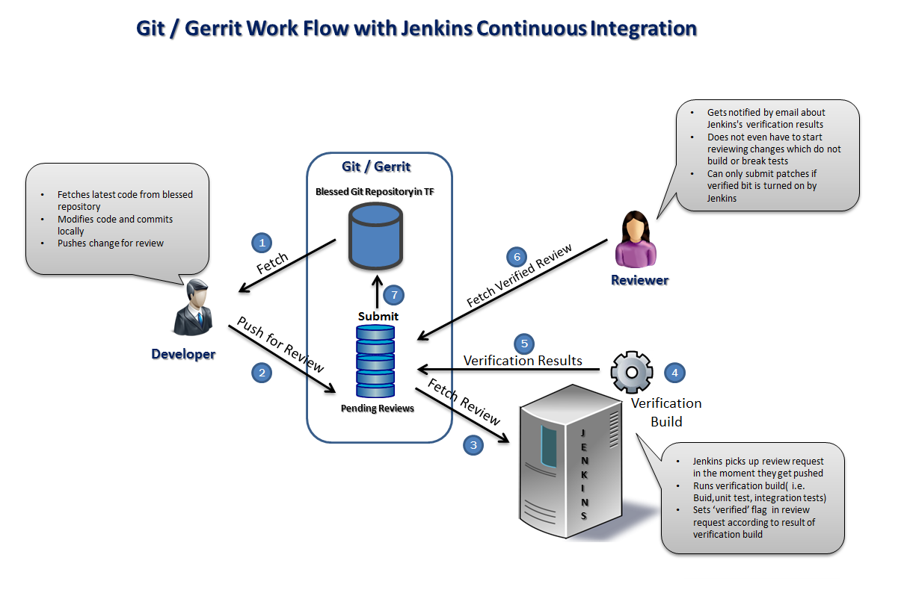

# Git, Jenkins, Gerrit, Code Review and pre-tested commits
> | git | tool | jenkins |
 
This post is a note to myself. There are bunch of tools on the market which can be successfully used in yours development process. But, I'm interested in [git](http://git-scm.com/), [Jenkins](http://jenkins-ci.org/)  only. Also, git/jenkins supports tons on different workflows, but here I'd like to talk about pre-tested commits.  
  
So, what does it mean _"pre-tested commit"_? Initially this type of commits was introduced in [TeamCity](http://www.jetbrains.com/teamcity/) CI Server:  

> Typically, your team submits code to Version Control BEFORE verifying that it works, and risks breaking the build every single time — causing more problems than necessary. [\[2\]](http://www.jetbrains.com/teamcity/features/delayed_commit.html)

  
But, it's TeamCity and we need similar functionality in Jenkins.  
  
There are several ways to get it:  

* Implement Jenkins plugin which can work with integration branches and simulate pre-tested workflow
* Reuse existing tool like [Gerrit](http://code.google.com/p/gerrit/). 

But you say [Gerrit](http://code.google.com/p/gerrit/) is a code review tool. And you are right. Fortunately, [Gerrit](http://code.google.com/p/gerrit/) support pre-tested commit in his code review workflows (see source [\[3\]](http://blogs.collab.net/teamforge/teamforge-git-gerrit-integration-with-jenkins-ci)):  

  
> [Gerrit Code Review](http://gerrit.googlecode.com/ "Gerrit Code Review") represents a step-forward in the way the team work on the code and share idea and the ownership of the design and coding decisions.  (see [\[4\]](http://jenkinsmobi.me/2012/03/21/jenkins-ci-and-gerrit-code-review-dance-together/))

 Tools required to support this workflow:  

* [git](http://git-scm.com/)
* [Jenkins](http://jenkins-ci.org/)
* [Jenkins Gerrit Trigger](https://wiki.jenkins-ci.org/display/JENKINS/Gerrit+Trigger)

To see all these in action I've added two videos which demonstrate this concept:  

- [Youtube: Pre-Tested Commits with Jenkins](https://www.youtube.com/watch?v=LvCVw5gnAo0)
- [Youtube: Gerrit, jenkins and sonar - video tutorial](https://www.youtube.com/watch?v=96wfa3ipF34)

Also, it worth to review this **slides**. Here is nicely demonstrated why [Gerrit](http://code.google.com/p/gerrit/) is cool and why un-tested commit is bad.  
  
- [Gerrit Code Review](https://www.slideshare.net/lucamilanesio/gerrit-code-review "Gerrit Code Review") from [Luca Milanesio](http://www.slideshare.net/lucamilanesio)
  
**References:**  

1. [Pretested commits – why does it matter to us?](http://www.tomslabs.com/index.php/2011/10/pretested-commits-why-does-it-matter-to-us/)
2. [Pre-Tested Commit: No broken code in your version control. Ever.](http://www.jetbrains.com/teamcity/features/delayed_commit.html)
3. [TeamForge Git /Gerrit Integration with Jenkins CI](http://blogs.collab.net/teamforge/teamforge-git-gerrit-integration-with-jenkins-ci)
4. [Jenkins CI and Gerrit Code Review dance together](http://jenkinsmobi.me/2012/03/21/jenkins-ci-and-gerrit-code-review-dance-together/)
5. [Jeknins - Designing pre-tested commit](https://wiki.jenkins-ci.org/display/JENKINS/Designing+pre-tested+commit)
6. [Open Stack - Gerrit Workflow](https://wiki.openstack.org/wiki/Gerrit_Workflow)
7. [Open Stack - Gerrit Jenkins Github](https://wiki.openstack.org/wiki/GerritJenkinsGithub)