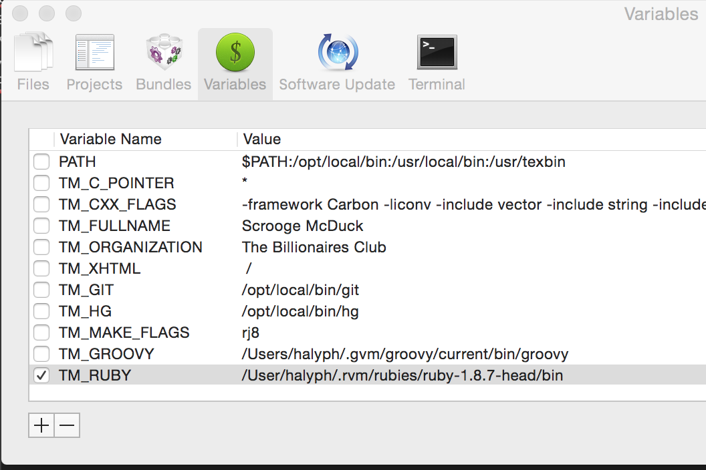

# How to Fix Textmate OSX Yosemite ruby 1.8 issues?
> | textmate |

Textmate 2.0 is using Ruby 1.8 in own bundles. OSX Yosemite dropped Ruby 1.8 as default Ruby implementation, now it's Ruby 2.0. Based on this all Textmate ruby-based (legacy) bundles do not work. It can be fixed in several steps:

- Install Ruby 1.8.x via some Ruby version manager (e.g. rvm)

``` bash
$ rvm install 1.8
Warning! Requested ruby installation which requires another ruby available - installing ruby-1.8.7-p374 first.

Checking requirements for osx.
Installing requirements for osx.
Updating system...........
Installing required custom packages: homebrew/versions homebrew/versions.
Installing required packages: libtool, gcc48, libyaml, libksba, openssl098.....-Certificates in '/usr/local/etc/openssl/cert.pem' are already up to date.
Requirements installation successful.
Installing Ruby from source to: /Users/halyph/.rvm/rubies/ruby-1.8.7-p374, this may take a while depending on your cpu(s)...
ruby-1.8.7-p374 - #downloading ruby-1.8.7-p374, this may take a while depending on your connection...
  % Total    % Received % Xferd  Average Speed   Time    Time     Time  Current
                                 Dload  Upload   Total   Spent    Left  Speed
100 4150k  100 4150k    0     0   279k      0  0:00:14  0:00:14 --:--:--  326k
ruby-1.8.7-p374 - #extracting ruby-1.8.7-p374 to /Users/halyph/.rvm/src/ruby-1.8.7-p374....
ruby-1.8.7-p374 - #applying patch /Users/halyph/.rvm/patches/ruby/1.8.7/stdout-rouge-fix.patch.
ruby-1.8.7-p374 - #applying patch /Users/halyph/.rvm/patches/ruby/1.8.7/no_sslv2.diff.
ruby-1.8.7-p374 - #applying patch /Users/halyph/.rvm/patches/ruby/GH-488.patch.
ruby-1.8.7-p374 - #applying patch /Users/halyph/.rvm/patches/ruby/ssl_no_ec2m.patch.
ruby-1.8.7-p374 - #configuring...............................
ruby-1.8.7-p374 - #post-configuration.
ruby-1.8.7-p374 - #compiling....................................................
ruby-1.8.7-p374 - #installing.
ruby-1.8.7-p374 - #making binaries executable..
ruby-1.8.7-p374 - #downloading rubygems-2.0.14
  % Total    % Received % Xferd  Average Speed   Time    Time     Time  Current
                                 Dload  Upload   Total   Spent    Left  Speed
100  329k  100  329k    0     0   108k      0  0:00:03  0:00:03 --:--:--  108k
ruby-1.8.7-p374 - #extracting rubygems-2.0.14....
ruby-1.8.7-p374 - #removing old rubygems.........
ruby-1.8.7-p374 - #installing rubygems-2.0.14..................................|
ruby-1.8.7-p374 - #gemset created /Users/halyph/.rvm/gems/ruby-1.8.7-p374@global
ruby-1.8.7-p374 - #importing gemset /Users/halyph/.rvm/gemsets/ruby/1.8.7/global.gems..............................................................
ruby-1.8.7-p374 - #generating global wrappers........
ruby-1.8.7-p374 - #gemset created /Users/halyph/.rvm/gems/ruby-1.8.7-p374
ruby-1.8.7-p374 - #importing gemsetfile /Users/halyph/.rvm/gemsets/default.gems evaluated to empty gem list
ruby-1.8.7-p374 - #generating default wrappers........
ruby-1.8.7-p374 - #adjusting #shebangs for (gem irb erb ri rdoc testrb rake).
Install of ruby-1.8.7-p374 - #complete
WARNING: Please be aware that you just installed a ruby that is no longer maintained (2014-02-23), for a list of maintained rubies visit:

    http://bugs.ruby-lang.org/projects/ruby/wiki/ReleaseEngineering

Please consider upgrading to ruby-2.1.4 which will have all of the latest security patches.
Ruby was built without documentation, to build it run: rvm docs generate-ri
Checking requirements for osx.
Certificates in '/usr/local/etc/openssl/cert.pem' are already up to date.
Requirements installation successful.
Installing Ruby from source to: /Users/halyph/.rvm/rubies/ruby-1.8.7-head, this may take a while depending on your cpu(s)...
Cloning from git://github.com/ruby/ruby.git, this may take a while depending on your connection.
HEAD is now at 2a9ea11 * lib/webrick/server.rb (initialize): Initialize shutdown pipe here
Branch ruby_1_8_7 set up to track remote branch ruby_1_8_7 from origin.
Switched to a new branch 'ruby_1_8_7'
Copying from repo to src path...
ruby-1.8.7-head - #applying patch /Users/halyph/.rvm/patches/ruby/1.8.7/stdout-rouge-fix.patch.
ruby-1.8.7-head - #applying patch /Users/halyph/.rvm/patches/ruby/1.8.7/no_sslv2.diff.
ruby-1.8.7-head - #applying patch /Users/halyph/.rvm/patches/ruby/ssl_no_ec2m.patch.
ruby-1.8.7-head - #autoreconf.
ruby-1.8.7-head - #configuring...............................
ruby-1.8.7-head - #post-configuration.
ruby-1.8.7-head - #compiling...................................................|
ruby-1.8.7-head - #installing.
ruby-1.8.7-head - #making binaries executable..
ruby-1.8.7-head - #downloading rubygems-2.0.14
ruby-1.8.7-head - #extracting rubygems-2.0.14.....
ruby-1.8.7-head - #removing old rubygems.........
ruby-1.8.7-head - #installing rubygems-2.0.14..................................|
ruby-1.8.7-head - #gemset created /Users/halyph/.rvm/gems/ruby-1.8.7-head@global
ruby-1.8.7-head - #importing gemset /Users/halyph/.rvm/gemsets/ruby/1.8.7/global.gems..............................................................
ruby-1.8.7-head - #generating global wrappers........
ruby-1.8.7-head - #gemset created /Users/halyph/.rvm/gems/ruby-1.8.7-head
ruby-1.8.7-head - #importing gemsetfile /Users/halyph/.rvm/gemsets/default.gems evaluated to empty gem list
ruby-1.8.7-head - #generating default wrappers........
ruby-1.8.7-head - #adjusting #shebangs for (gem irb erb ri rdoc testrb rake).
Install of ruby-1.8.7-head - #complete
Please be aware that you just installed a ruby that requires        3 patches just to be compiled on an up to date linux system.
This may have known and unaccounted for security vulnerabilities.
Please consider upgrading to ruby-2.1.4 which will have all of the latest security patches.
Ruby was built without documentation, to build it run: rvm docs generate-ri
```

- Update Textmate preferences


- Verify "updated" Textmate settings via some ruby-based bundles, 
e.g. `Bundles->Text->Duplicate Line`
