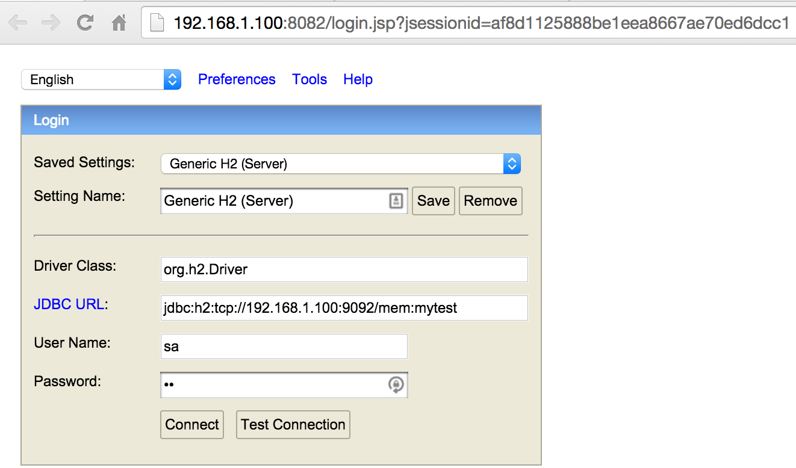
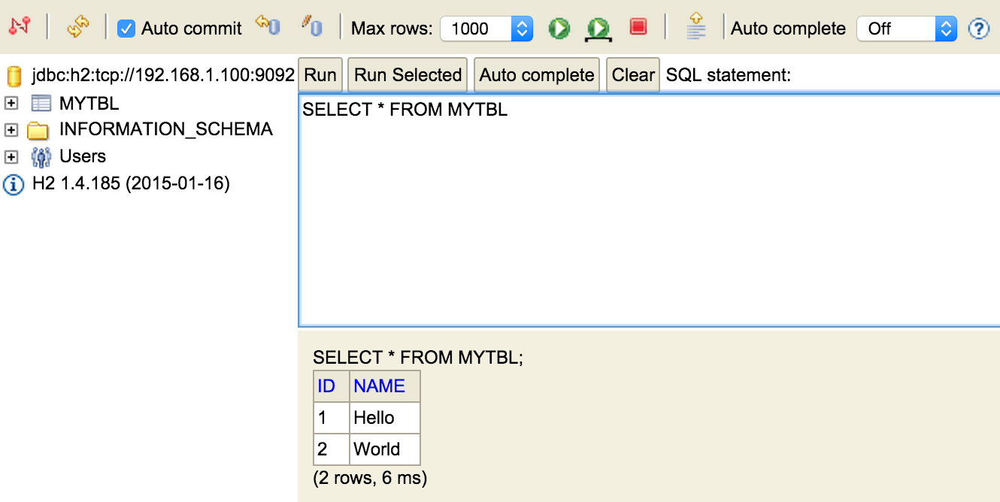
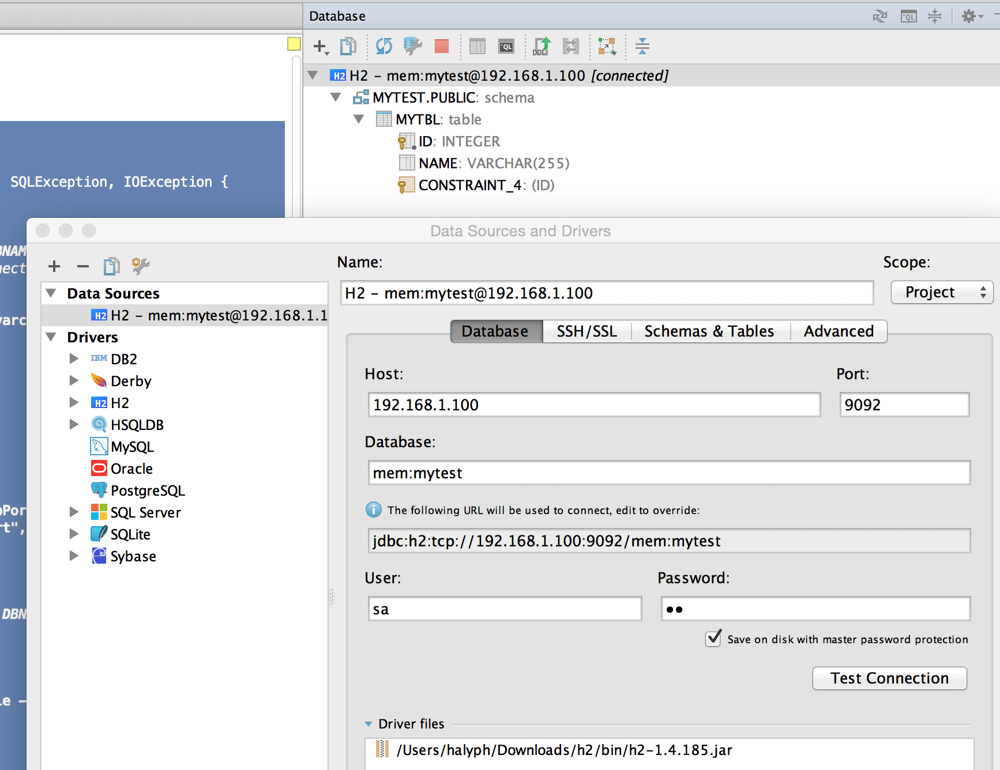

# How to Use Embedded H2 with web Console?
> | java |

There are several Java SQL databases which supports both server and embedded modes: [H2](http://www.h2database.com/), [HSQLDB](http://hsqldb.org/) and [Derby](http://db.apache.org/derby/). The most interesting for me is H2 with own web [Console](http://www.h2database.com/html/quickstart.html#h2_console). 

The aim of this post is to show how to connect from H2 Console to embedded in-memory H2.

>H2 currently supports three servers: a web server (for the H2 Console), a TCP server (for client/server connections) and an PG server (for PostgreSQL clients). **Please note that only the web server supports browser connections.** The servers can be started in different ways, one is using the Server tool. Starting the server doesn't open a database - databases are opened as soon as a client connects.

The next steps have to be performed to connect to embedded DB and populate initial data:

1. Load DB driver
2. Get `Connection`
3. Create `Statement` and `executeUpate` queries
4. Create TCP `Server`. _We should start serve to make in-memory DB available for another process_

### Let's try to implement this: 

* Run sample application

```java

public class App {
    private static final String DBNAME = "mytest";

    public static void main(String[] args) throws ClassNotFoundException, SQLException, IOException {
        // open the in-memory database within a VM

        Class.forName("org.h2.Driver"); // (1)
        Connection conn 
			= DriverManager.getConnection("jdbc:h2:mem:" + DBNAME, "sa", "sa"); // (2)
        // username:password are very important and must be used for connecting via H2 Console

        Statement stat = conn.createStatement(); // (3)
        stat.executeUpdate("create table mytbl(id int primary key, name varchar(255))");
        stat.executeUpdate("insert into mytbl values(1, 'Hello')");
        stat.executeUpdate("insert into mytbl values(2, 'World')");

        // Verify that sample data was really inserted
        ResultSet rs = stat.executeQuery("select * from mytbl");
        System.out.println("ResultSet output:");
        while (rs.next()) {
            System.out.println("> " + rs.getString("name"));
        }

        // start a TCP server
        Server server = Server.createTcpServer().start(); // (4)
        // .. use in embedded mode ..

        // or use it from another process:
        System.out.println("Server started and connection is open.");
        System.out.println("URL: jdbc:h2:" + server.getURL() + "/mem:" + DBNAME);

        System.out.println("\n");
        System.out.println(
                "now start the H2 Console in another process using:\n" +
                "$ cd h2/bin; java -cp h2-1.4.185.jar org.h2.tools.Console -web -browser");

        System.out.println("Press [Enter] to stop.");
        System.in.read();

        System.out.println("Stopping server and closing the connection");

        rs.close();
        server.stop();
        conn.close();
        System.out.println("Server is STOPPED");
    }
}
```

* Output for previous run:

```
ResultSet output:
> Hello
> World
Server started and connection is open.
URL: jdbc:h2:tcp://192.168.1.100:9092/mem:mytest


now start the H2 Console in another process using:
$ cd h2/bin; java -cp h2-1.4.185.jar org.h2.tools.Console -web -browser
Press [Enter] to stop.
```

* We assume that h2 installation bundle (zip file) was downloaded (from http://www.h2database.com/html/download.html) beforehand and unpacked in some folder
* Go into H2 "install/unpack" folder and run the next command `cd h2/bin; java -cp h2-1.4.185.jar org.h2.tools.Console -web -browser`
* Now we should copy URL (from sample App output) and credentials sa/sa to login into Console
  * **URL:** jdbc:h2:tcp://192.168.1.100:9092/mem:mytest
  * **Username:** sa
  * **Password:** sa
* Login window (opened from shell by `org.h2.tools.Console`)


Verify that our custom table contains just inserted values


### Add Embedded TCP and Web Servers

Now, it's time to add small improvements.
The idea is to switch *on* H2 Console **Web Server** and **TCP Server** to have external access.
We should add/update item (4) in previous code snippets like this  

```java
public class App {
    private static final String DBNAME = "mytest";

    public static void main(String[] args) throws ClassNotFoundException, SQLException, IOException {
...

        Server webServer = Server.createWebServer("-webAllowOthers","-webPort","8082").start(); // (4a)
        Server server = Server.createTcpServer("-tcpAllowOthers","-tcpPort","9092").start();    // (4b)
        // .. use in embedded mode ..
...
        server.stop();
        webServer.stop();
        conn.close();
        System.out.println("Server is STOPPED");
    }
}
```

* After this we can access to Web Console without running external service
  * Simply use URL in  browser (access to **Web Server**): http://localhost:8082/
* Use any JDBC client (see IntelliJ IDEA as a sample below)
  * access to **TCP Server**



## References

1. [H2 database in memory mode cannot be accessed by Console](http://stackoverflow.com/questions/5077584/h2-database-in-memory-mode-cannot-be-accessed-by-console)
2. [Official H2 Tutorial](http://www.h2database.com/html/tutorial.html)
3. [H2 Server methods](http://h2database.com/javadoc/org/h2/tools/Server.html)
4. [GitHub Sources](https://github.com/halyph/tutorials/tree/master/h2-embedded-console)