# Rails Architecture and Scalability
> | ruby | rails |

Everybody know when this _"Rails doesn't scale"_ has been begun:

- **2009** [Twitter message queue back-end moved from Ruby to Scala](http://www.artima.com/scalazine/articles/twitter_on_scala.html)
- **2011** [Twitter Search is Now 3x Faster](https://blog.twitter.com/2011/twitter-search-now-3x-faster)

> Panic, we must not use **Ruby on Rails** because Twitter had scalability problems.

I'm a Java developer who love Ruby language, but don't write anything in Rails. Despite this I've decided to look into this famous _"Rails doesn't scale"_ statement deeper to understand the root cause of this problem.

So, I [collected][my-GH] public available Ruby on Rails architecture and scalability case studies (videos of conference talks, reports and blog posts) and tried to extract the general patterns of architecture and scalability issues.

There are two type of scalability issues:

1. **Application performance** - when web application can't handle huge traffic
2. **Delivery velocity** - when it's become hard to make changes in big Rails application, run quick tests, deploy it and manage big team

_Note_: You are not another "twitter" to worry about scalability issues right from beginning of the project (there are fewer web apps on the Internet to get enough traffic to even care about scalability). Your goal is to push your product as quick as possible.
But, in the same time you'd like to use Rails (due to it's productivity) and make you potentially application scalable (in all possible terms)

The most interesting that scalability is about architecture, databases, caching, event queues, disk IO and less about Rails framework.

## Rails deployment architecture

Let's review the common Rails deployment approaches (see [Deployment with Ruby on Rails][1])

### Simple Rails Setup

One Rails instance handles all requests. Rails is single-threaded: There is only one concurrent request.

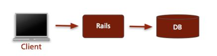

### Typical Rails Setup

- A load-balancer distributes the incoming requests
- Some load-balancers will deliver static requests themselves
- Several Rails instances handle all requests
- Number of concurrent requests equals number of Rails instances

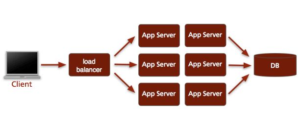

### Application server (Phusion Passenger)

- Involving Phusion Passenger application server
- Makes setup easier on the single machine level
- Multiple servers still require load balancer
- Suitable for mass-hosting
- upcoming standard way of deploying Rails

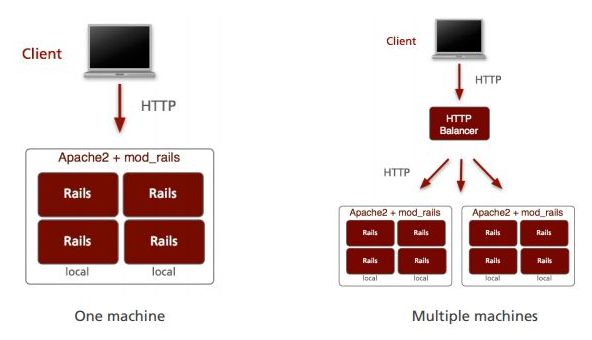

## Recommended Rails Application Setups

### Small Site

Apache with mod_rails/Phusion Passenger

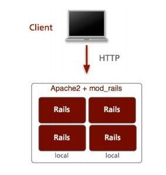

### Medium Site

- Apache/Nginx as frontend proxy
- Passanger as backend
- Deliver static files with Apache/Nginx

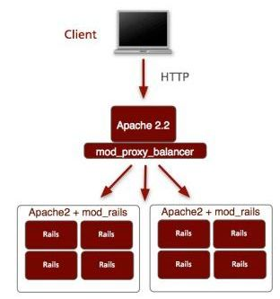

### Large Site

- Redundant load-ballancer
- Redundant proxy
- Phusion Passenger/mod_rails

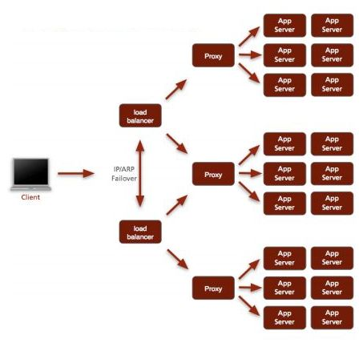

## Scale up Traditional Rails Application

### Caching
There might be the cases when it's not enought and in this case we should start looking in "cashing" direction via involving Memcahed and/or Redis _(based on Konstantin’s Gredeskoul slides)_

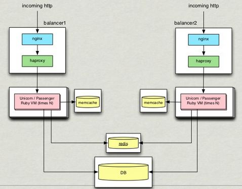

### Long-runnint task scaling
_(based on Konstantin’s Gredeskoul slides)_

- Background jobs with Reques (it sits on top of Redis)
- Use Solr/Elasticsearch instead of doing complex joins

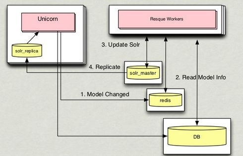

## Rails moving towards SOA and micro services

The shown above architectures are related to **Monolith Architecture**. This type of architecture has some problems:

- Development pain points: 
- effective controllers and models have a lot of logic
    + ~1000 Models/Controllers, 200K LOC, 100s of jobs 
- Merge issues arise in big team (20-30+)
- Lots of contributors and no ownership
- Difficult deployments with long integration cycles
- Tests are not green, it's really hard to support stable test quality

The monolithic Rails app should evolve into ecosystems of connected services. It's becoming quite common for Rails apps to be working mainly as [clients](https://github.com/halyph/architecture-case-study/blob/master/rails-as-an-soa-client-by-pete-hodgson.md) to other services.

### Splitting application into small pieces 

- Split into smaller applications (based on Konstantin's Gredeskoul [slides][2])
    + Contains web UI, logic and data
        * Extract look and feel into gem to share across apps
    + May combine with other apps
    + May rely on common libraries
    + Typically run in their own Ruby VM
- Extract services and create APIs
    + Create client API wrapper gems for consumers
- Extract libraries (gems)
    + Create shared based client gem library

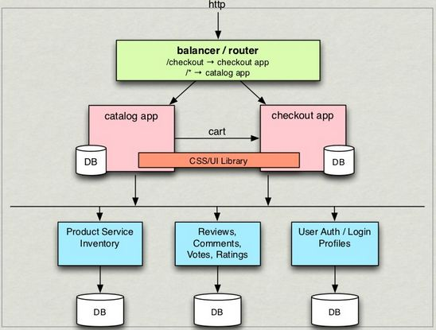

### Reference (sample) service orienter / micro service architecture

Now, we have more than one Rails application and many service which are communicating using messaging, distributed cashed, etc. 

#### [Groupon](https://github.com/halyph/architecture-case-study/blob/master/groupon.md)

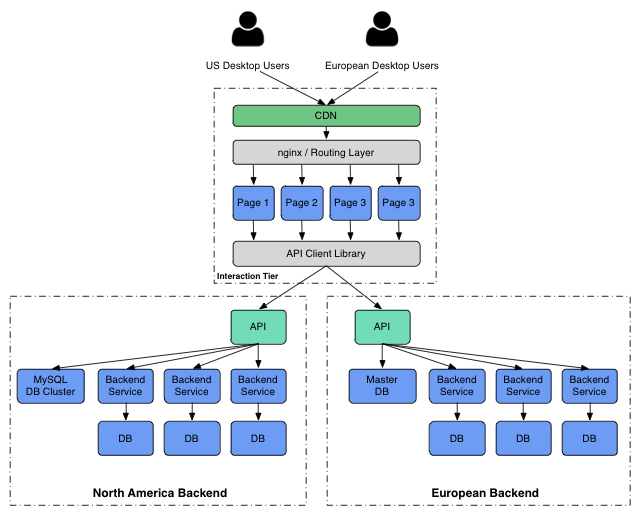

#### [Flipcart](https://github.com/halyph/architecture-case-study/blob/master/flipcart.md)

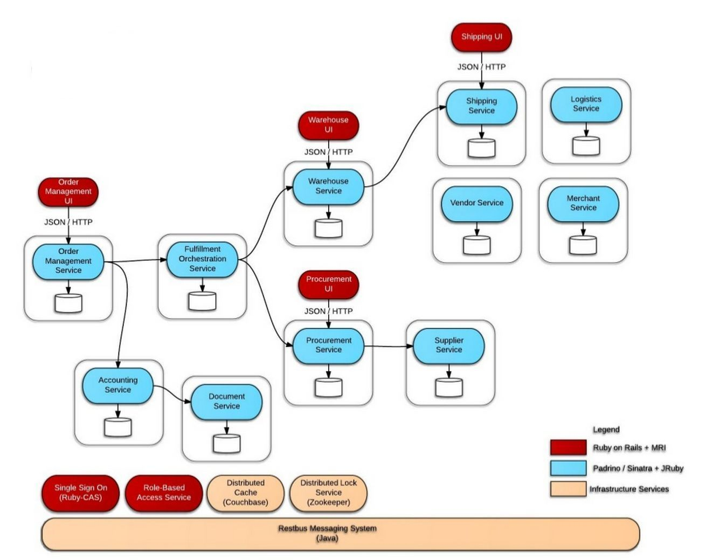

#### [Gilt](https://github.com/halyph/architecture-case-study/blob/master/gilt.md)

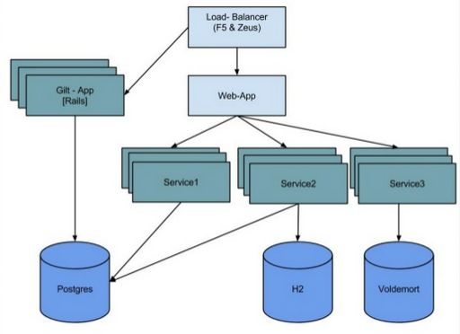

I've collect much more case studies, see [here][my-GH].

## Conclusion

Moving Monolith Rails application to micro service architecture it's not one shot action. It's long run with lots of trade offs. And more over, micro service architecture is not silver bullet, it's just one alternative way to scale your application (see [Recommended Rails Application Setups][#Recommended.Rails.Application.Setups]).

The key idea is to develop your application with [SRP (Single responsibility principle)](http://en.wikipedia.org/wiki/Single_responsibility_principle) in mind. The more modular your application the more scalable it's.

I'm planning to add more architecture case studies to my [collection][my-GH] (not only Rails related). Stay tuned.

## Rails related tech components

Collection of major technology components mentioned in case studies.

### Web Servers / Proxy

- [Apache](http://httpd.apache.org/)
- [Nginx](http://nginx.org/)
- [HAProxy](http://www.haproxy.org/)

### Application Servers

- [Unicorn](http://unicorn.bogomips.org/)
- [Phusion Passenger](https://www.phusionpassenger.com)
- [Puma](http://puma.io/)
- [Thin](http://code.macournoyer.com/thin/)

### Libraries / Tools

- [Redis](http://redis.io/)
- [Memcached](http://memcached.org/)
- [Reque](https://github.com/resque/resque)
- [Sidekiq](http://sidekiq.org/)
- [Solr](http://lucene.apache.org/solr/)
- [Elasticsearch](https://www.elastic.co/products/elasticsearch)

## References

- [Collection of Ruby on Rails Architecture Case Studies][my-GH]
    - [Deployment with Ruby on Rails][1]
    - [Enterprise Architectures with Ruby (and Rails)][2]
- [Does Ruby on Rails scale][link Does Ruby on Rails scale] - Quora
- "Keeping Your Massive Rails App From Turning Into a S#!t Show with Benjamin Smith" (see [video](https://vimeo.com/76094344) and [slides](https://speakerdeck.com/benjaminleesmith/keeping-your-massive-rails-app-from-turning-into-a-s-number-t-show-windycityrails-2013))

[link Does Ruby on Rails scale]: http://www.quora.com/Does-Ruby-on-Rails-scale
[my-GH]: https://github.com/halyph/architecture-case-study#ruby-on-rails-architecture-case-studies
[1]: http://www.slideshare.net/jweiss/deployment-with-ruby-on-rails
[2]: http://www.slideshare.net/kigster/enterprise-architectures-with-ruby-and-rails