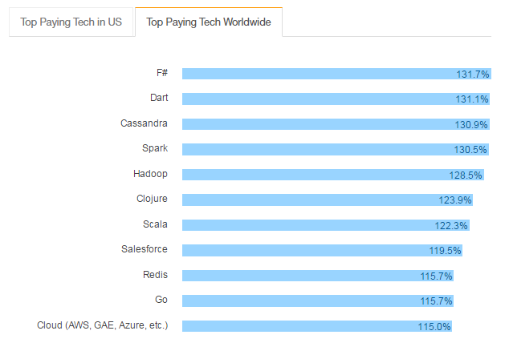

# The state of Groovy and other JVM Languages
> | groovy | scala |

Well, I like the [Groovy](http://groovy-lang.org/) language in general. This language has nice pragmatic applications and all other related “cookie”, but it looks like other languages, Scala especially, are more popular or trendy.

  
*Figure 1. JVM language History (image created by [zeroturnaround](https://zeroturnaround.com/rebellabs/the-adventurous-developers-guide-to-jvm-languages-java-scala-groovy-fantom-clojure-ceylon-kotlin-xtend/))*

The actual motivation was based on the numbers provided by https://libraries.io

Here we have the next numbers projects per language (on Github):

* Golang — 352K
* JavaScript — 232K
* Ruby - 73K
* Java — 44.5K
* Python — 35.9K
* Clojure — 11.2K
* Scala — 10.1K
* C — 5.29K
* Haskell — 4.71K
* Shell — 3.61K
* *Groovy — 729* (WTF? What? Why?)

I do not understand why Github has so few Groovy based projects. But, let’s double check these numbers.

## About Groovy Language ecosystem

If somebody asks you about Groovy the next projects come up to your mind:

* [Gradle](https://gradle.org/) — ☆ 3483
* [Grails](https://grails.org/) — ☆ 1789
* [Spock](https://github.com/spockframework/spock) - ☆ 1063
* [Ratpack](https://ratpack.io/) (Java/Groovy) — ☆ 1075

Can you name some other “popular” Groovy projects? Well, maybe [awesome-groovy](https://github.com/kdabir/awesome-groovy) can help.

## Language Trends

### [Tiobe](https://www.tiobe.com/tiobe-index/)

This language rating is very strange because it’s not aligned with other trends. But, it’s better to have it for comparison.
Groovy is 17 , Scala — 32. It’s strange result.

### [PYPL PopularitY of Programming Language](https://pypl.github.io/PYPL.html)

### [GitHut](https://githut.info/) languages

> GitHut is an attempt to visualize and explore the complexity of the universe of programming languages used across the repositories hosted on GitHub.

### Indeed Job Trends

[Scala, Groovy, Clojure Job Trends — _Absolute_](https://www.indeed.com/jobtrends/q-Scala-q-Groovy-q-Clojure.html)

[Scala, Groovy, Clojure Job Trends — _Relative_](https://www.indeed.com/jobtrends/q-Scala-q-Groovy-q-Clojure.html?relative=1)

### Stackoverflow Developer Survey

#### [Most Popular Technologies](https://insights.stackoverflow.com/survey/2016#technology-most-popular-technologies)

> More people use JavaScript than use any other programming language. PHP appears to be falling out of favor as Node and Angular emerge.

#### [Most Loved, Dreaded, and Wanted](https://insights.stackoverflow.com/survey/2016#technology-most-loved-dreaded-and-wanted)

_% of developers who are not developing with the language or tech but have expressed interest in developing with it_

#### [Top Paying Tech](https://insights.stackoverflow.com/survey/2016#technology-top-paying-tech)

> Make it rain! Cloud technology pays big bucks. So does tech frequently used in finance. Spark, Scala, Cassandra, and F# top the list of the top paying technologies. (This year’s list looks a lot like last year’s list.)

#### Trends Summary

As you can see Groovy has some issues in popularity. I don’t understand why.

## GitHub Repos Analysis

Let’s define some baseline for further analysis based on popular Java repos

* JUnit 4 — ☆ 4847, fork 1905
* JUnit 5 — ☆ 419, fork 77
* Google Guava — ☆9108, fork 2109
* Spring Framework — ☆ 8824, fork 7286

### Groovy Repos

* Apache Groovy — ☆ 1135, fork 409
* Netflix/asgard — ☆ 2091, fork 415 (Asgard is deprecated at Netflix)
* gradle/gradle — ☆ 3483, fork 1374
* grails/grails-core - ☆ 1789, fork 805
* ratpack/ratpack — ☆ 1075, fork 253
* rundeck/rundeck - ☆ 1332, fork 307 (Job scheduler and runbook automation)
* betamaxteam/betamax — ☆ 300, fork 107

### Scala Repos

* scala/scala — ☆ 6127 , fork 1541
* apache/spark — ☆ 8511, fork 7906
* playframework - ☆ 7855, fork 2726
* akka/akka - ☆ 5504 , fork 1712
* twitter/finagle - ☆ 4614, fork 870
* openzipkin/zipkin - ☆ 3537, fork 493
* scalatra/scalatra - ☆ 1924 , fork 274

### JVM Languages

* Clojure- ☆ 5310, fork 916
* Kotlin- ☆ 5083, fork 543
* JRuby-☆ 2519, fork 655

### Non-JVM Repos

* rails/rails - ☆ 31119, fork 12608
* expressjs/express - ☆ 25105 , fork 4731
* docker/docker - ☆ 31206, fork 8874
* kubernetes/kubernetes — ☆ 14371, fork 4319
* github/hub - ☆ 8447 , fork 754

## Summary

You should make your own conclusion base on this data.
I don’t understand why Groovy is not in trend. But numbers show the general picture.
Looking forward for your thoughts

## References

* [awesome-groovy](https://github.com/kdabir/awesome-groovy)
* [awesome-scala](https://github.com/lauris/awesome-scala)
* [A Comprehensive Analysis: Java vs Scala](https://www.linkedin.com/pulse/comprehensive-analysis-java-vs-scala-rassul-fazelat)
* [The Adventurous Developer’s Guide to JVM Languages](https://zeroturnaround.com/rebellabs/the-adventurous-developers-guide-to-jvm-languages-java-scala-groovy-fantom-clojure-ceylon-kotlin-xtend/)
