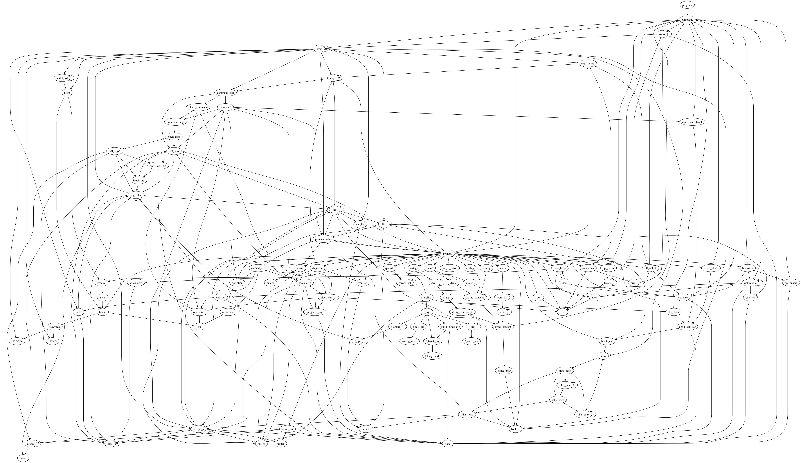

# Python vs. Ruby: A Battle to The Death by Gary Bernhardt
> | ruby | python | vs | comparison |

- [Ruby Experience](#ruby-experience)
- [I. Ruby Complaints](#i-ruby-complaints)
  - [The Zen of Python (PEP-20)](#the-zen-of-python-pep-20)
    - [8. Special cases aren't special enough to break the rules](#8-special-cases-arent-special-enough-to-break-the-rules)
    - [13. There should be one-- and preferably only one --obvious way to do it](#13-there-should-be-one---and-preferably-only-one---obvious-way-to-do-it)
    - [16. Although never is often better than *right* now](#16-although-never-is-often-better-than-right-now)
    - [17. If the implementation is hard to explain, it's a bad idea](#17-if-the-implementation-is-hard-to-explain-its-a-bad-idea)
      - [Ruby Grammar](#ruby-grammar)
      - [Python Grammar](#python-grammar)
    - [19. Namespaces are one honking great idea -- let's do more of those!](#19-namespaces-are-one-honking-great-idea----lets-do-more-of-those)
- [II. Ruby Praise](#ii-ruby-praise)
  - [Composability](#composability)
    - [RSpec](#rspec)
      - [Python Mote (spec runner)](#python-mote-spec-runner)
    - [WARNING! Extreme Opinions Ahead!](#warning-extreme-opinions-ahead)
    - [Cucumber](#cucumber)
- [References](#references)

## Ruby Experience

- `end` for block
- () are optional
- method name can be ended in `!` or `?`

## I. Ruby Complaints

### The Zen of Python ([PEP-20](https://www.python.org/dev/peps/pep-0020/))

1. Beautiful is better than ugly.
2. Explicit is better than implicit.
3. Simple is better than complex.
4. Complex is better than complicated.
5. Flat is better than nested.
6. Sparse is better than dense.
7. Readability counts.
8. **Special cases aren't special enough to break the rules.**
9. Although practicality beats purity.
10. Errors should never pass silently.
11. Unless explicitly silenced.
12. In the face of ambiguity, refuse the temptation to guess.
13. **There should be one-- and preferably only one --obvious way to do it.**
14. Although that way may not be obvious at first unless you're Dutch.
15. Now is better than never.
16. **Although never is often better than *right* now.**
17. **If the implementation is hard to explain, it's a bad idea.**
18. If the implementation is easy to explain, it may be a good idea.
19. **Namespaces are one honking great idea -- let's do more of those!**

#### 8. Special cases aren't special enough to break the rules

Very strange behavior

```ruby
>> x = Proc.new { 5 }
>> x()
NoMethodError: undefined method `x' for main:Object
>> x.call
5
>> x[]
5
```

#### 13. There should be one-- and preferably only one --obvious way to do it

> *Yukihiro Matsumoto*: Ruby inherited the Perl philosophy of having more than one way to do the same thing. I inherited that philosophy from Larry Wall, who is my hero actually. *I want to make Ruby users free. I want to give them the freedom to choose. People are different. People choose different criteria. But if there is a better way among many alternatives, I want to encourage that way by making it comfortable. So that's what I've tried to do. Maybe Python code is a bit more readable. Everyone can write the same style of Python code, so it can be easier to read, maybe. But the difference from one person to the next is so big, providing only one way is little help even if you're using Python, I think. I'd rather provide many ways if it's possible, but encourage or guide users to choose a better way if it's possible.*
- Reference: [The Philosophy of Ruby.A Conversation with Yukihiro Matsumoto, Part I by Bill Venners. September 29, 2003](http://www.artima.com/intv/ruby3.html)

#### 16. Although never is often better than *right* now

~~Then Ruby v.1.8.6~~
```ruby
>> ['a', 'b'].map(&:upcase)
TypeError: wrong argument type Symbol (expected Proc) form (irb):4
>> require 'activerecord'
=> true
>> ['a', 'b'].map(&:upcase)
=> ["A", "B"]
```
Ruby 1.8.6: No `&:foo`
Ruby 1.8.7: `&:foo` syntax added

Now
```ruby
>> ['a', 'b'].map(&:upcase)
=> ["A", "B"]
```

#### 17. If the implementation is hard to explain, it's a bad idea

* [Python grammar dependency graph. Generated from this Python 2.3.3 grammar from antlr.org.](https://www.flickr.com/photos/nicksieger/281055485/in/photostream/)
* [Ruby 1.8.4 grammar dependency graph](https://www.flickr.com/photos/nicksieger/280661836/in/photostream/)
  * [Visualization of Ruby's Grammar](http://blog.nicksieger.com/articles/2006/10/27/visualization-of-rubys-grammar/)

##### Ruby Grammar



##### Python Grammar


#### 19. Namespaces are one honking great idea -- let's do more of those!


```ruby
>> require 'activerecord'
>> ActiveSupport
=> ActiveSupport
```

## II. Ruby Praise

Good part

### Composability

Python lacks this feature

```python
'\n'.join(obj.name
  for obj in (
    repository.retrieve(id)
    for id in ids
  )
)
```

```ruby
ids.map do |id|
  repository.retrieve(id)
end.compact.map do |obj|
  obj.name
end.join('\n')
```

- Python has `comprehensions` and `sum`
- Ruby has the full Lisp *chainsaw*

#### RSpec

```ruby
# game_spec.rb

describe Game do
  describe "#score" do
    it "returns 0 for an all gutter game" do
      game = Game.new
      20.times { game.roll(0) }
      expect(game.score).to eq(0)
    end
  end
end
```


```ruby
lambda do
  MyClass.add(2, 'foo')
end.should raise_error(TypeError)


matz.should have_item(chain_show)
```

##### Python Mote (spec runner)

```python
from __future__ import with_statement
from expecter import expect

def describe_integer():
    def describe_when_adding_one_and_one():
        x = 1 + 1
        def should_get_two():
            assert x == 2

    def raises_error_when_dividing_by_zero():
        with expect.raises(ZeroDivisionError):
            1 / 0

# Output:
#
# integer
# integer when adding one and one
#   - should get two
#   - raises error when dividing by zero
# OK
```

#### WARNING! Extreme Opinions Ahead!

*At the beginning*: Ruby is ugly; Python is beautifyl.
*Then*:             Nose is ugle; RSpec is beautiful.

#### Cucumber

```ruby
# features/step_definitions/coffee_steps.rb

Given /there are (\d+) coffees left in the machine/ do |n|
  @machine = Machine.new(n.to_i)
end


# features/step_definitions/coffee_steps.rb

Then "I should be served coffee" do
  @machine.dispensed_drink.should == "coffee"
end
```

## References

* [Vimeo: Python vs. Ruby: A Battle to The Death](https://vimeo.com/9471538)
  * This talk was given at Northwest Python Day 2010. The companion blog post is at [blog.extracheese.org/2010/02/python-vs-ruby-a-battle-to-the-death.html](http://blog.extracheese.org/2010/02/python-vs-ruby-a-battle-to-the-death.html)
* [Blog post: Python vs. Ruby: A Battle to The Death](http://blog.extracheese.org/2010/02/python-vs-ruby-a-battle-to-the-death.html)