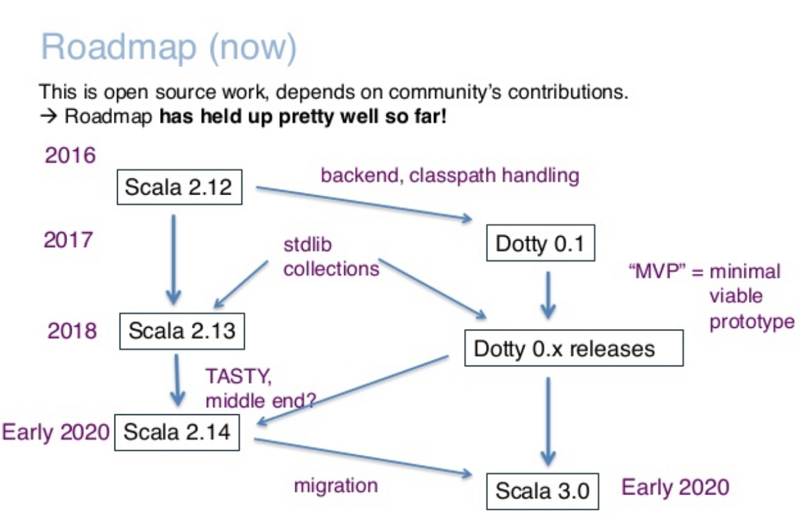

# Scala Days - Berlin, 2018 - Report
> | scala | conference |

I attended Scala Days Berlin conference (May 15th - May 17th, 20018). It was almost two days conference: two full days: day 2 and 3, and one keynote talk for day 1.

There were some talks I didn't like and I do not want to mention them here.
This report is for myself only just to keep track talks I’ve attended.

## Summary

- It nice to see that Scala is not another better Java (see Kotlin). The Scala community has own way of doing stuff, own ecosystem, philosophy if you will etc.
- Scala Native looks interesting, but I do not see it as an alternative to Rust, Golang. 
- Scala.js is a nice tool, but I think that it's an additional mental pressure in Web development: JS (related hell) + Scala.js issues. I am not sure if this is a good direction for me.
- GraalVM looks super cool. I think this project will have a huge success in future.
- Akka and Langom talks were interesting in terms of new features.
- Sbt is evolving, guys put a lot of efforts to make it better and faster.
- And of course "functional programming" talks is a key component of any Scala-related conference ;-)

## Day 1 (May 15, 2018)

### **Opening Keynote: 2.13 And Beyond** by [Martin Odersky](https://twitter.com/odersky) and [Adriaan Moors](https://twitter.com/adriaanm) ([slides](https://www.slideshare.net/Odersky/preparing-for-scala-3))

> The next version of Scala, 2.13, is ready. We will give an overview of the improvements in tooling and the standard library that this release delivers.
>
>The planned steps after this release are directed towards Scala 3. This will be an important transition for the Scala ecosystem, introducing a simpler, more regular, and more expressive version of the language. We will give an outline of what to expect, lay out our roadmap towards its release, and provide recommendations how to prepare for the change.

This talk was dedicated to the current state of Scala and road map for Scala 3.

## Day 2 (May 16, 2018)

### **Keynote: Functionalist programming language design** by [Tomas Petricek](https://twitter.com/tomaspetricek)

>The word "function" in "functional programming" refers to mathematical concept of a function, but in this talk, I will pretend that that's not the case. Imagine that functional programming was instead inspired by functionalist architecture and the word "function" referred to the modernist design principle that "form follows function". How would this perspective transform our thinking about programming?
>
>Using a number of practical F# examples, I will try to convince you that "function" in the design sense is already more useful for understanding what makes functional programming great than "function" in the mathematical sense.
>
>Along the way, I will go through a number of interesting language features and libraries available in F# that have close, but not quite equivalent cousins in Scala. We will look at the design principles behind "type providers" which provide an easy way to integrate external data sources into the language; we will look at ""asynchronous workflows"" which is the F# way for writing non-blocking computations and I will reflect on the cautious F# approach to meta-programming.
>
>I might not be able to retroactively change what "functional programming" means in just one talk, but I will try nevertheless!

### **Akka: Present and Future** by [Christopher Batey](https://twitter.com/chbatey) ([slides](http://batey.info/talks/akka-state/))

>In this talk we'll go through all the major additions over the last year to Akka, Akka HTTP and Akka Streams as well as a look to the future. This is a really exciting time for Akka with the typed API on its way to maturity. Some of the things we'll cover:
>
> - Akka typed:
>   - When is it ready for production?
>   - Persistence and cluster API
>   - Coexistence with untyped Akka
> - Multi DC clustering
> - Artery (Aeron and TCP)
____

### **What can Lagom do for you?** by [Renato Cavalcanti](https://twitter.com/renatocaval)

>Much has been said about building Microservices and the advantages of it, but do people really understand what that all means and the implications of it?
>
>In this talk, we will go through the main motivations for moving to a Microservices architecture and the existing challenges one may encounter. We will take that journey together and discover how Lagom tackles each of these challenges and helps you to focus on solving business problems.
>
>You will get a good understanding of Lagom?s Service Descriptor API and Persistence API. How it favours Event-First Application Design and how it?s design principles lays the foundation for Reactive Microservice Architecture.

### **Dive into Deep Learning with Scala** by [Sören Brunk](https://twitter.com/soebrunk)

>Deep learning is an emerging field with the potential to transform whole industries, and to significantly affect software development.
>This talk is an introduction to deep learning for Scala developers. We?ll see why deep learning enables a new programming paradigm, and how it?s related to functional programming.
>We'll discuss what makes Scala an interesting choice for deep learning, and look at the current landscape of deep learning libraries for Scala. Equipped with that knowledge, we'll walk through a concrete example that shows you how to create, train and deploy a neural network using Scala.

### **A pragmatic introduction to Category Theory** by [Daniela Sfregol](https://twitter.com/danielasfregola) ([slides](https://speakerdeck.com/danielasfregola/scala-days-2018-berlin-a-pragmatic-introduction-to-category-theory))

>Category Theory has become one of the hot topics in the community. Why is it so interesting for us? Why are the cool kids passionate about it?
>
>This talk will introduce the general principles of Category Theory in a pragmatic, non-mathematical way. We will show practical examples of how this theory has managed to simplify and solve common challenges that we encounter in our code daily, such as nullable values, error handling, parallel and sequential operations and data validation. We will apply them to create our own category theory library from scratch using ScalaCheck as the only dependency.

### **sbt 1** by [Eugene Yokota](https://twitter.com/eed3si9n) and [Dale Wijnand](https://twitter.com/dwijnand)

>sbt (an interactive build tool for Java, Scala, and more) has finally reached 1.0!
>
>In this talk, we will first over the basics of how a build is organized using sbt. Next, we will talk about the development process, new features (such as Zinc 1, sbt server, unified slash syntax), and the migration from sbt 0.13.

### **Starting from Scratch with Scala Native** by [Richard Whaling](https://twitter.com/RichardWhaling)

>In this talk, we'll learn how Scala Native uses POSIX and ANSI C API's
to build concise, expressive programs that run unusually close to bare metal. 
By examining real-world programs, we'll learn just how accessible and expressive 
low-level programming can be with a modern language like Scala.

### **Compiling Scala Faster with GraalVM** by [Vojin Jovanovic](https://twitter.com/vojjov)

>Scala's features such as higher-order functions and implicit conversions encourage writing concise and readable programs. These features, however, introduce many indirections and come with a hidden cost: if not removed by the compiler they can cause severe performance hits.
>
>In this talk, we present GraalVM: a high-performance polyglot VM whose unique JIT compiler greatly improves the performance of Scala programs. We demo how GraalVM can increase the productivity of the Scala community: With GraalVM the Scala compiler is more than 1.3x faster and the compiler native image requires no warmup.

## Day 3 (May 17, 2018)

### **Functional interpreters and you** by [Dave Gurnell](https://twitter.com/davegurnell) ([slides and code](https://github.com/underscoreio/interpreters-and-you))

>Phrases like "free monads" and "finally tagless" get thrown around in the Scala community like they're going out of fashion. But what do they mean and why are they so popular?In this talk we will discuss "interpreters", an essential functional programming pattern that underpins these terms. We will show how any problem in functional programming can be described using the interpreter pattern, and how modelling things this way naturally gives rise to abstractions like the free monad and encodings like finally tagless.

### **Strings are Evil: Methods to hide the use of primitive types** by [Noel Welsh](https://twitter.com/noelwelsh)

>Most primitive types we use are "too wide" for how we are using them; for example, there are an infinite number of Strings, but we are only using the String (hex!) representation of a 128-bit UUID. This is a huge source of bugs in our programs. This talk will go over the many ways we can reduce these kinds of errors in Scala, such as wrapper types, refined types, type restrictions, and more.

### **Full Stack Scala** by [Trond Bjerkestrand](https://twitter.com/tbjerkes) ([video - ScalaIO FR](https://www.youtube.com/watch?v=NNietlUelMQ))

>Demand for a richer experience client side is continuously increasing. We can no longer generate HTML server side and will instead create JSON APIs, investigate JS frameworks, learn JavaScript, its tools and libraries or leave the task to a dedicated front-end developer.
>
>Wait, ScalaJS is here, mature and with a growing community. It allows creating beautiful and rich front-ends without leaving our comfort zone of strong static typing protected from JavaScript surprises. The talk will explore shared data objects, validation logic and easy client server communication in a full stack Scala app.

### **Applications of Implicit Function Types** by [Olivier Blanvillain](https://github.com/OlivierBlanvillain) ([slides](https://docs.google.com/presentation/d/19-ZfP-51wstP2CDALISJhSRL2YX-ozJD6uqF4ic7a7g/edit))

>This talk presents a generalization of implicit parameters to implicit function types, a powerful way to abstract over the context in which some piece of code is run. 
>
>To illustrate their abstraction capabilities, we present several applications that make use of implicit function types. We show how to encode the builder pattern, the reader monad, tagless interpreters, and free structures.
