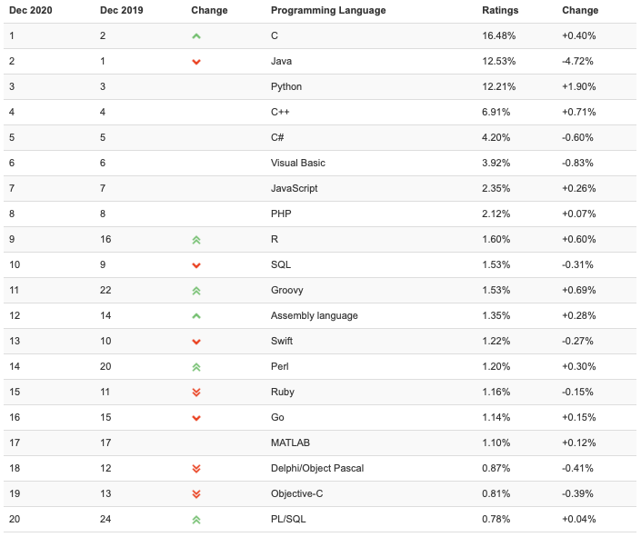
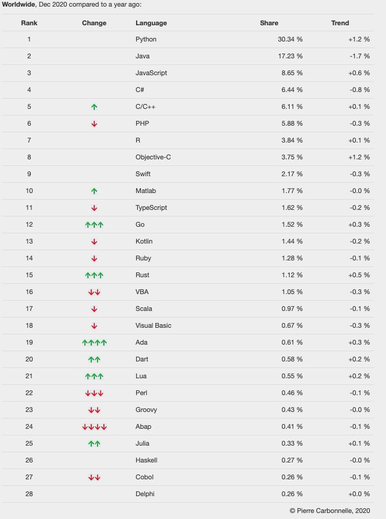
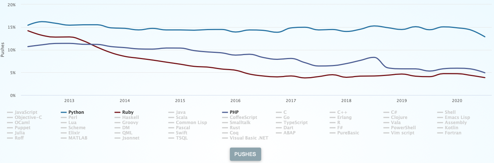
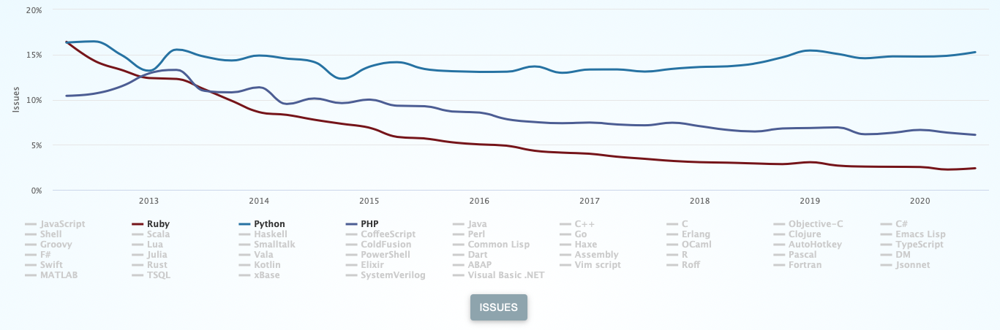
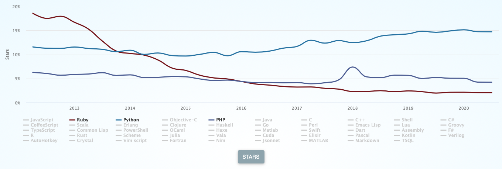
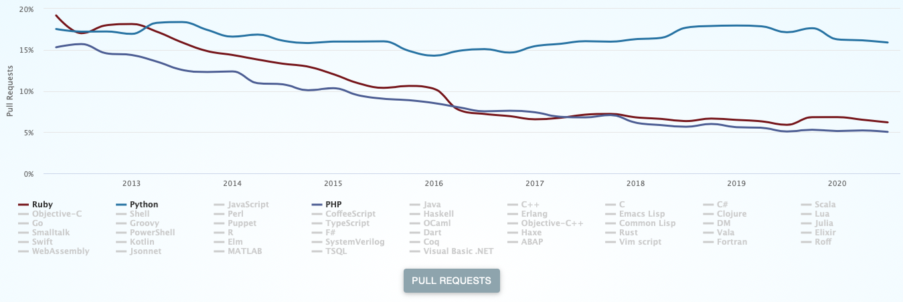
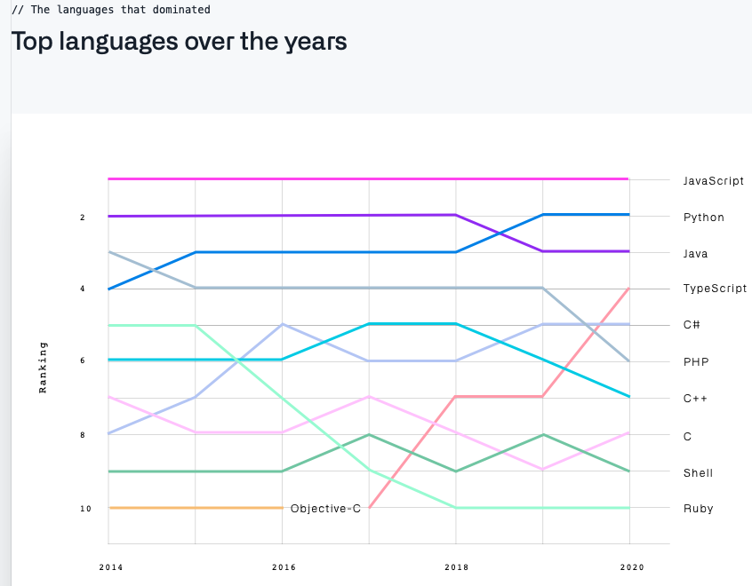
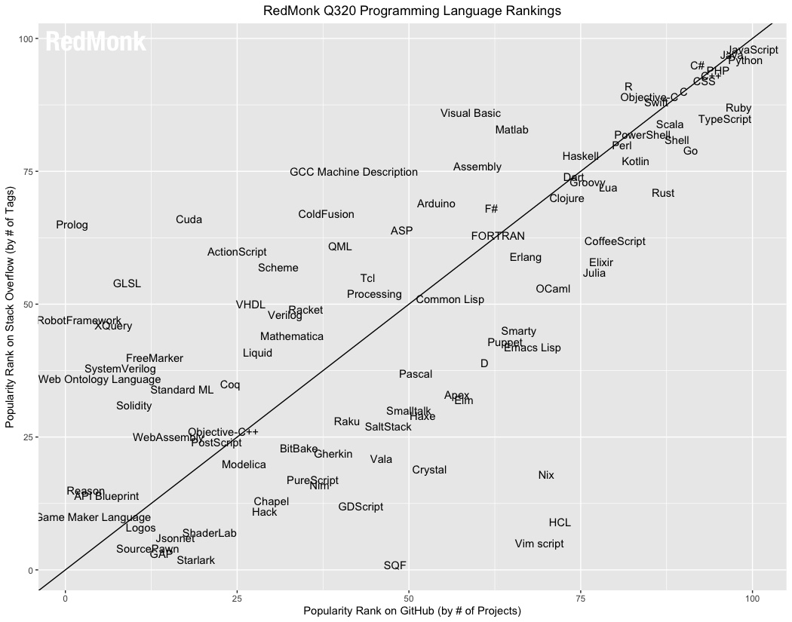

# Ruby 3 and static typing
> | ruby |

[Ruby 3.0.0](https://www.ruby-lang.org/en/news/2020/12/25/ruby-3-0-0-released/) was released on Christmas Day in 2020.  

> Ruby 3.0.0 covers those goals by
>
> - Performance
>   - MJIT
> - Concurrency
>   - Ractor
>   - Fiber Scheduler
> - Typing (Static Analysis)
>   - RBS
>   - TypeProf

The Ruby team is moving into the right direction with JIT and Concurency. But, another "new" feature spot my eyes - *Static Analysis*.  
I started using Ruby in 2007-2008 and I still remember the mood in Ruby-community at that time: **dynamic typing is cool, and static typing just sucks**. Time flies and even Ruby team decided to have some "Static types" features.

I am not sure whether it will help, since the Ruby community is not diversified as the Python community. IMHO Ruby equals to *Ruby on Rails*. Even PHP has a more diversified set of web frameworks: Laravel, Symfony, CodeIgniter, etc.  
And when I am looking at the Ruby community from 13 years perspective I can say it will be really hard to bring here *fresh air*. And *fresh air* it's not only yet another web framework, it's another problem domain.

## Interesting programming languages ratings

I like programming languages ratings and it in the future will be interesting to check these 2020 ratings, it's like a time machine.

### 1 - Tiobe Index

[**TIOBE Index**]() - Ruby is on position 15, Python is 3d:

### 2 - PYPL

[**PYPL**](https://pypl.github.io/PYPL.html) - Ruby is on position 14, Python is 1st:

### 3 - GitHut 2.0

[**GitHut 2.0**](https://madnight.github.io/githut/) for Q3 2020

#### Pushes

Python - 2, Ruby - 9

#### Issues

Python - 2, Ruby - 10

#### Stars

Python - 2, Ruby - 12

#### Pull Requests

Python - 2, Ruby - 14

### 4 - Github Octoverse - 2020

Github: The 2020 State of the [**Octoverse**](https://octoverse.github.com/#overview): Ruby is on position 10, Python - 2:

### 5 - [The RedMonk Programming Language Rankings](https://redmonk.com/sogrady/2020/07/27/language-rankings-6-20/): June 2020

Python - 2, Ruby - 7

