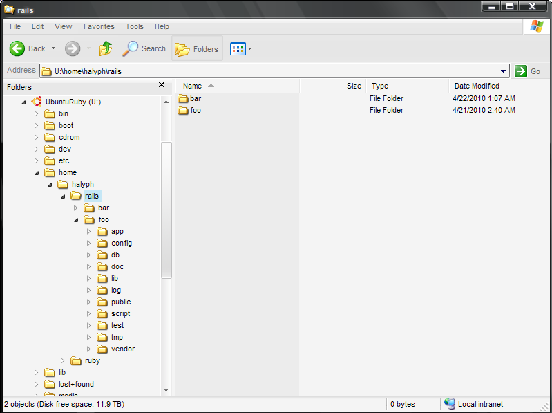
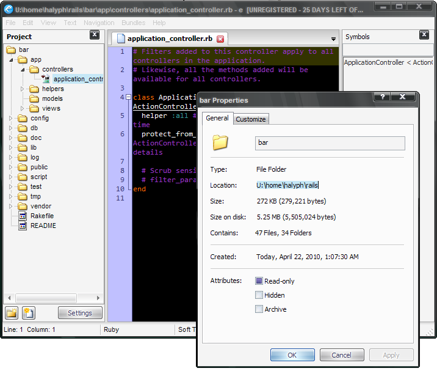

# How to setup Ruby/Rails development environment, Part 2 - E-TextEditor
> | ruby | rails | linux |

There are tons of text editors which are good enough for Ruby/Rails/web development. And it's not so easier to choose the "best" editor.  
I'd like to talk about my top three editors which like the most:  

- [**Notepad++**](http://notepad-plus.sourceforge.net/)  
It's the base text editor on my workstation. It has active community, plug-in repository developing fast enough. But, this editor doesn't have Rails syntax highlight, here I mean ERB files. So, for Rails editing I have to skip it (for now)
- [**Vim**](http://www.vim.org/)  
Cross**\-**platform text editor. It has BIG, super active community with tons of plugins.
- [**E-TextEditor**](http://www.e-texteditor.com/)  
It's Textmate clone for Windows.

There are two choices for using these text editors:  

1. Use Notepad++/E-TextEditor (or other editors) on host machine and connect to Ubuntu VM via tool such as **[ExpanDrive](http://www.expandrive.com/windows).**
2. Use Vim via SSH (Putty) terminal. You'll have got plain linux terminal with all restrictions, but in this case you shouldn't install such tool as ExpanDrive which cost some money.

So, I will describe first solutions in this post and second - in the next post.  
  
**E-TextEditor and ExpanDrive**  

I assume that you install both e-texteditor and ExpanDrive.  
Now, we can create some Rails project:  

```bash
$ rails bar
```

And check IP address our Ubuntu VM:  

```bash
$ ifconfig  
eth0      Link encap:Ethernet  HWaddr 00:0c:29:2b:58:78  
          inet addr:192.168.72.132  Bcast:192.168.72.255  Mask:255.255.255.0  
          inet6 addr: fe80::20c:29ff:fe2b:5878/64 Scope:Link  
          UP BROADCAST RUNNING MULTICAST  MTU:1500  Metric:1  
          RX packets:185 errors:0 dropped:0 overruns:0 frame:0  
          TX packets:191 errors:0 dropped:0 overruns:0 carrier:0  
          collisions:0 txqueuelen:1000  
          RX bytes:20339 (20.3 KB)  TX bytes:33193 (33.1 KB)  
          Interrupt:18 Base address:0x2000
```

Now open ExpanDrive and setup connection to VM:  



  
As you can see my Ubuntu VM disk is mapped to host machine and I can use it for my Rails development.  
Now, we can use any Windows based text editor and made modification directly on Ubuntu VM disk:  


  
For Rails scaffolding we use SSH/Putty terminal.  
  
**References:**  

- [How to setup Ruby/Rails development environment, Part 1 - Ubuntu VM](http://halyph.com/2010/04/how-to-setup-rubyrails-development.html)