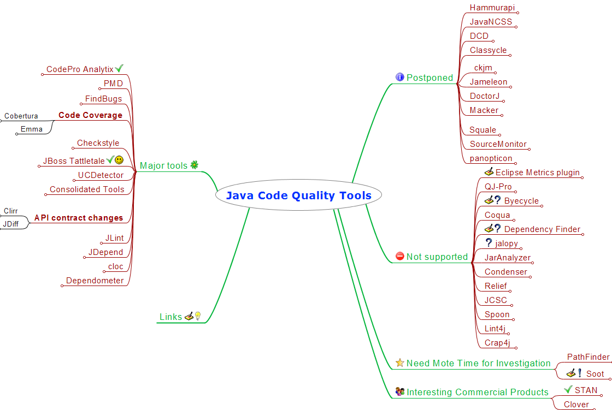

# Java Code Quality Tools - Overview
> | java |

Recently, I had a chance to present the subject at the local IT community meetup. Here is the basic presentation: 

**[Java Code Quality Tools](http://www.slideshare.net/halyph/java-code-quality-tools)**

 and more meaningful mind map:

 But, I think I need to cover this subject more deeply. This blog post should be something like start point for further investigation in this direction.

1. [CodePro Analytix](http://code.google.com/javadevtools/codepro/doc/index.html)
 It's a great tool (Eclipse plugin) for improving software quality. It has the next key features: Code Analysis, JUnit Test Generation, JUnit Test Editor, Similar Code Analysis, Metrics, Code Coverage and Dependency Analysis.
1. [PMD](http://pmd.sourceforge.net/)
 It scans Java source code and looks for potential problems: Possible bugs, Dead code, Suboptimal code, Overcomplicated expressions and Duplicate code.
1. [FindBugs](http://findbugs.sourceforge.net/)
 It looks for bugs in Java programs. It can detect a variety of common coding mistakes, including thread synchronization problems, misuse of API methods, etc.
1. [Cobertura](http://cobertura.sourceforge.net/)
 It's a free Java tool that calculates the percentage of code accessed by tests. It can be used to identify which parts of your Java program are lacking test coverage. It is based on jcoverage.
1. [Emma](http://emma.sourceforge.net/)
 It is a fast Java code coverage tool based on bytecode instrumentation. It differs from the existing tools by enabling coverage profiling on large scale enterprise software projects with simultaneous emphasis on fast individual development.
1. [Checkstyle](http://checkstyle.sourceforge.net/)
 It is a development tool to help programmers write Java code that adheres to a coding standard.
1. [JBoss Tattletale](http://www.jboss.org/tattletale)
 JBoss Tattletale is a tool that can help you get an overview of the project you are working on or a product that you depend on. The tool will recursive scan a directory for JAR files and generate linked and formatted HTML reports.
1. [UCDetector](http://www.ucdetector.org/)
 UCDetector (Unecessary Code Detector) is a Open Source eclipse PlugIn Tool to find unecessary (dead) java code. It also tries to make code final, protected or private. UCDetector also finds cyclic dependencies between classes. 
1. [Sonar](http://www.sonarsource.org/)
 Sonar is a continuous quality control tool for Java applications. Its basic purpose in life is to join your existing continuous integration tools to place all your development projects under quality control.
1. [XRadar](http://xradar.sourceforge.net/)
 The XRadar is an open extensible code report tool that produces HTML/SVG reports of the systems current state and the development over time. Uses DependencyFinder, JDepend, PMD, PMD-CPD, JavaNCSS, Cobertura, Checkstyle, XSource, JUnit, Java2HTML, ant and maven.
1. [QALab](http://qalab.sourceforge.net/)
 QALab consolidates data from Checkstyle, PMD, FindBugs and Simian and displays it in one consolidated view. QALab keeps a track of the changes over time, thereby allowing you to see trends over time. You can tell weather the number of violations has increased or decreased - on a per file basis, or for the entire project. It also plots charts of this data. QALab plugs in to maven or ant.
1. [Clirr](http://clirr.sourceforge.net/)
 Clirr is a tool that checks Java libraries for binary and source compatibility with older releases. Basically you give it two sets of jar files and Clirr dumps out a list of changes in the public api. The Clirr Ant task can be configured to break the build if it detects incompatible api changes. In a continuous integration process Clirr can automatically prevent accidental introduction of binary or source compatibility problems. 
1. [JDiff](http://jdiff.sourceforge.net/)
 JDiff is a Javadoc doclet which generates an HTML report of all the packages, classes, constructors, methods, and fields which have been removed, added or changed in any way, including their documentation, when two APIs are compared. This is very useful for describing exactly what has changed between two releases of a product. Only the API (Application Programming Interface) of each version is compared. It does not compare what the source code does when executed. 
1. [JLint](http://artho.com/jlint/)
It checks your Java code and find bugs, inconsistencies and synchronization problems by doing data flow analysis and building the lock graph.
1. [JDepend](http://www.clarkware.com/software/JDepend.html)
 JDepend traverses Java class file directories and generates design quality metrics for each Java package. JDepend allows you to automatically measure the quality of a design in terms of its extensibility, reusability, and maintainability to effectively manage and control package dependencies.
1. [cloc](http://cloc.sourceforge.net/)
 cloc counts blank lines, comment lines, and physical lines of source code in many programming languages.
1. [Dependometer](http://source.valtech.com/display/dpm/Dependometer)
 Dependometer performs a static analysis of physical dependencies within a software system. Dependometer validates dependencies against the logical architecture structuring the system into classes, packages, subsystems, vertical slices and layers and detects cycles between these structural elements. Furthermore, it calculates a number of quality metrics on the different abstraction layers and reports any violations against the configured thresholds.
1. [Hammurapi](http://www.hammurapi.com/dokuwiki/doku.php/products:hammurapi:start)
 Hammurapi is an open source code inspection tool. Its release comes with more than 100 inspectors which inspect different aspects of code: Compliance with EJB specification, threading issues, coding standards, and much more.
1. [JavaNCSS](http://www.kclee.de/clemens/java/javancss/)
 JavaNCSS is a simple command line utility which measures two standard source code metrics for the Java programming language. The metrics are collected globally, for each class and/or for each function.
1. [DCD](http://java.net/projects/dcd)
 DCD finds dead code in your Java applications.
1. [Classycle](http://classycle.sourceforge.net/)
 Classycle's Analyser analyses the static class and package dependencies in Java applications or libraries. It is especially helpful for finding cyclic dependencies between classes or packages. Classycle is similar to JDepend which does also a dependency analysis but only on the package level.
1. [ckjm](http://www.spinellis.gr/sw/ckjm/)
 The program *ckjm* calculates Chidamber and Kemerer object-oriented metrics by processing the bytecode of compiled Java files. The program calculates for each class the following six metrics proposed by Chidamber and Kemerer.
1. [Jameleon](http://jameleon.sourceforge.net/)
 Jameleon is an automated testing framework that can be easily used by technical and non-technical users alike. One of the main concepts behind Jameleon is to create a group of keywords or tags that represent different screens of an application. All of the logic required to automate each particular screen can be defined in Java and mapped to these keywords. The keywords can then be organized with different data sets to form test scripts without requiring an in-depth knowledge of how the application works. The test scripts are then used to automate testing and to generate manual test case documentation. 
1. [DoctorJ](http://www.incava.org/projects/doctorj)
 DoctorJ analyzes Java code, in the following functional areas: documentation verification, statistics generation and syntax analysis.
1. [Macker](http://innig.net/macker/)
 Macker is a build-time architectural rule checking utility for Java developers. It's meant to model the architectural ideals programmers always dream up for their projects, and then break -- it helps keep code clean and consistent. You can tailor a rules file to suit a specific project's structure, or write some general "good practice" rules for your code. Macker doesn't try to shove anybody else's rules down your throat; it's flexible, and writing a rules file is part of the development process for each unique project.
1. [Squale](http://www.squale.org/index.html)
 Squale is a qualimetry platform that allows to analyze multi-language software applications in order to give a sharp and comprehensive picture of their quality: High level factors for top-managers and Practical indicators for development teams.
1. [SourceMonitor](http://www.campwoodsw.com/sourcemonitor.html)
 The freeware program SourceMonitor lets you see inside your software source code to find out how much code you have and to identify the relative complexity of your modules. For example, you can use SourceMonitor to identify the code that is most likely to contain defects and thus warrants formal review.
1. [Panopticon](http://www.panopticode.org/index.html)
 The Panopticode project provides a set of open source tools for gathering, correlating, and displaying code metrics.
1. [Eclipse Metrics plugin](http://sourceforge.net/projects/metrics/)

 Provide metrics calculation and dependency analyzer plugin for the Eclipse platform. Measure various metrics with average and standard deviation and detect cycles in package and type dependencies and graph them.
1. [QJ-Pro](http://qjpro.sourceforge.net/)
 QJ-Pro is a comprehensive software inspection tool targeted towards the software developer. Developers can automatically inspect their Java source code and improve their Java programming skills as they write their programs. QJ-Pro provides descriptive Java patterns explaining error prone code constructs and providing solutions for it.
1. [Byecycle](http://byecycle.sourceforge.net/)
 Byecycle is an auto-arranging dependency analysis plugin for Eclipse. Its goal is to make you feel sick when you see bad code and to make you feel happy when you see good code.
1. [Coqua](http://sourceforge.net/projects/coqua/)
 Coqua measures 5 distinct Java code quality metrics, providing an overview and history for the management, and down-to-the-code, detailed views for the developer. Metrics can be defined per team. Ideal for mid- to large-sized and/or offshore projects.
1. [Dependency Finder](http://depfind.sourceforge.net/)
 Extracts dependencies and OO metrics from Java class files produced by most Java compilers.
1. [Jalopy](http://jalopy.sourceforge.net/)
 Jalopy is an easily configurable source code formatter that can detect, and fix, a number of code convention flaws that might appear in Java code. Jalopy is more of a code fixer than a code checker. Jalopy plug-ins are present for most IDEs and, in most cases, they gel quite seamlessly with the IDE.
1. [JarAnalyzer](http://www.kirkk.com/main/Main/JarAnalyzer)
 JarAnalyzer is a dependency management tool for .jar files. JarAnalyzer will analyze all .jar in a given directory and identify the dependencies between each. Output formats include xml, with a stylesheet included to transform it to html, and GraphViz DOT, allowing you to produce a visual component diagram showing the relationships between .jar files. The xml output includes important design metrics such as Afferent and Efferent coupling, Abstractness, Instability, and Distance. There is also an Ant task available that allows you to include JarAnalyzer as part of your build script.
1. [Condenser](http://condenser.sourceforge.net/)
 Condenser is a tool for finding and removing duplicated Java code. Unlike tools that only locate duplicated code, the aim of Condenser is to also automatically remove duplicated code where it is safe to do so.
1. [Relief](http://www.workingfrog.org/index.html)
 Relief provides a new look on Java projects. Relying on our ability to deal with real objects by examining their shape, size or relative place in space it gives a "physical" view on java packages, types and fields and their relationships, making them easier to handle. Lets discuss quickly how we interprete physical properties and how it can help us to grasp project characteristics.
1. [JCSC](http://jcsc.sourceforge.net/)
 JCSC is a powerful tool to check source code against a highly definable coding standard and potential bad code. The standard covers naming conventions for class, interfaces, fields, parameter, ... . Also the structural layout of the type (class/interface) can be defined. Like where to place fields, either before or after the methods and in which order. The order can be defined through the visibility or by type (instance, class, constant). The same is applicable for methods. Each of those rules is highly customizable. Readability is enhanced by defining where to put white spaces in the code and when to use braces. The existence of correct JavaDoc can be enforced and various levels. Apart from that, it finds weaknesses in the the code -- potential bugs -- like empty catch/finally block, switch without default, throwing of type 'Exception', slow code.
1. [Spoon](http://spoon.gforge.inria.fr/)
 Spoon is a Java program processor that fully supports Java 5. It provides a complete and fine-grained Java metamodel where any program element (classes, methods, fields, statements, expressions...) can be accessed both for reading and modification. Spoon can be used on validation purpose, to ensure that your programs respect some programming conventions or guidelines, or for program transformation, by using a pure-Java template engine.
1. [Lint4j](http://www.jutils.com/index.html)
 Lint4j ("Lint for Java") is a static Java source and byte code analyzer that detects locking and threading issues, performance and scalability problems, and checks complex contracts such as Java serialization by performing type, data flow, and lock graph analysis.
1. [Crap4j](http://www.crap4j.org/)
 Crap4j is a Java implementation of the CRAP (Change Risk Analysis and Predictions) software metric – a mildly offensive metric name to help protect you from truly offensive code.
1. [PathFinder](http://babelfish.arc.nasa.gov/trac/jpf)
 Java PathFinder (JPF) is a system to verify executable Java bytecode programs. In its basic form, it is a Java Virtual Machine (JVM) that is used as an explicit state software model checker, systematically exploring all potential execution paths of a program to find violations of properties like deadlocks or unhandled exceptions. Unlike traditional debuggers, JPF reports the entire execution path that leads to a defect. JPF is especially well-suited to finding hard-to-test concurrency defects in multithreaded program
1. [Soot](http://www.sable.mcgill.ca/soot/)
 Soot can be used as a stand alone tool to optimize or inspect class files, as well as a framework to develop optimizations or transformations on Java bytecode. 
1. [ESC/Java2](http://secure.ucd.ie/products/opensource/ESCJava2/)
The Extended Static Checker for Java version 2 (ESC/Java2) is a programming tool that attempts to find common run-time errors in JML-annotated Java programs by static analysis of the program code and its formal annotations. Users can control the amount and kinds of checking that ESC/Java2 performs by annotating their programs with specially formatted comments called pragmas.
1. [CODERU](http://coderu.org/)
CODERU is a java code quality tool to enforce good design in respect to package dependencies. The CODERU-rules rely on reserved package names and the allowed dependency rules between them expressed in a general way. 

 \* \* \*

This list includes open sourced and free tools. I intentionally have excluded commercial tools. I'm sure there are much more tools. In case your know some of them which isn't listed here please add comment to this post.
