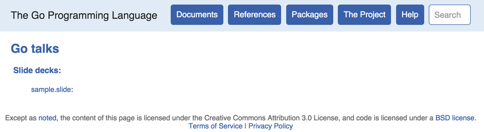
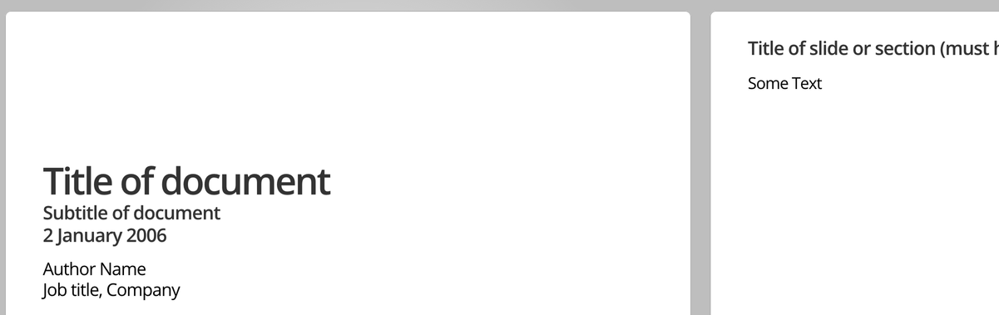

# Go presentation tool
> | golang |

Have you ever noticed how Go community presents Go-related talks? Their slides are very simple and without any fancy animation features: see [Go talks](http://talks.golang.org). You might say that they are no so feature-rich as [Reveal.js](https://github.com/hakimel/reveal.js/). And it's true. But, simplicity is beauty, as for me. Also, it's very well aligned with Go language philosophy.

So, here is listed steps required to *setup* and *run* Go **present** tool.

## Install Go

I use Mac OS X in this tutorial (see the next [article](https://golang.org/doc/install) to install Go on other *OS*es).

Install Go:

```bash
$ brew install go

==> Downloading https://homebrew.bintray.com/bottles/go-1.4.2.yosemite.bottle.1.
######################################################################## 100.0%
==> Pouring go-1.4.2.yosemite.bottle.1.tar.gz
==> Caveats
As of go 1.2, a valid GOPATH is required to use the `go get` command:   https://golang.org/doc/code.html#GOPATH  

You may wish to add the GOROOT-based install location to your PATH:
  export PATH=$PATH:/usr/local/opt/go/libexec/bin
==> Summary
🍺  /usr/local/Cellar/go/1.4.2: 4566 files, 155M
```

## Define Go workspace

Let's assume that our Go language workspace will be located at `/Users/halyph/Projects/go`:

```bash
$ mkdir go
$ pwd
/Users/halyph/Projects/go
```

### Configure `PATH` variable

```bash
$ cat .bash_profile

#Golang settings
export PATH=$PATH:/usr/local/opt/go/libexec/bin
export GOPATH=$HOME/Projects/go  #/Users/halyph/Projects/go
export PATH=$PATH:$GOPATH/bin
```

## Install Go present tool
**present** tool is located in separate package `golang.org/x/tools` which depends on `golang.org/x/net` package:

```bash
$ go get golang.org/x/net
$ go get golang.org/x/tools
$ go install golang.org/x/tools/cmd/present
```

Now, we can find **present** tool here:

```
$ which present
/Users/halyph/Projects/go/bin/present
```

## Run present tool

The easiest way to test **present** tool is to render some slides:

- Create sample `slide` file (see `.slide` [file format](http://godoc.org/golang.org/x/tools/present)) in any folder:

```
$ cat sample.slide

Title of document
Subtitle of document
15:04 2 Jan 2006
Tags: foo, bar, baz

Author Name
Job title, Company
joe@example.com
http://url/
@twitter_name
Some Text

* Title of slide or section (must have asterisk)

Some Text
```

- Run **present** in this folder:

```
$ present
2015/05/19 00:55:33 Open your web browser and visit http://127.0.0.1:3999
```

You should see something like this:





Go **present** works and you are ready to produce *Go-fashion* slides.

## References

- [Go present package documentation](http://godoc.org/golang.org/x/tools/present)
- [Reveal.js - The HTML Presentation Framework](https://github.com/hakimel/reveal.js/)
- [Go talks - slides](http://talks.golang.org)
- [Go tool Represent - Static slide presentation and article pages, generated from text](https://github.com/cmars/represent)
- [Video - go present - create html slides with extractable, executable go code](https://www.youtube.com/watch?v=83JBmS8WpHM)
- [Using Go’s present with Python code snippets](https://pythonadventures.wordpress.com/2014/02/14/using-gos-present-with-python-code-snippets/) and [Go-nuts discussion - how to embed runnable code snippets in a presentation](https://groups.google.com/forum/#!topic/golang-nuts/BdgXMRqjGqk)
- [How Do I Create A Presentation Using Go?](http://blog.joshsoftware.com/2014/03/10/how-do-i-create-a-presentation-using-go/)