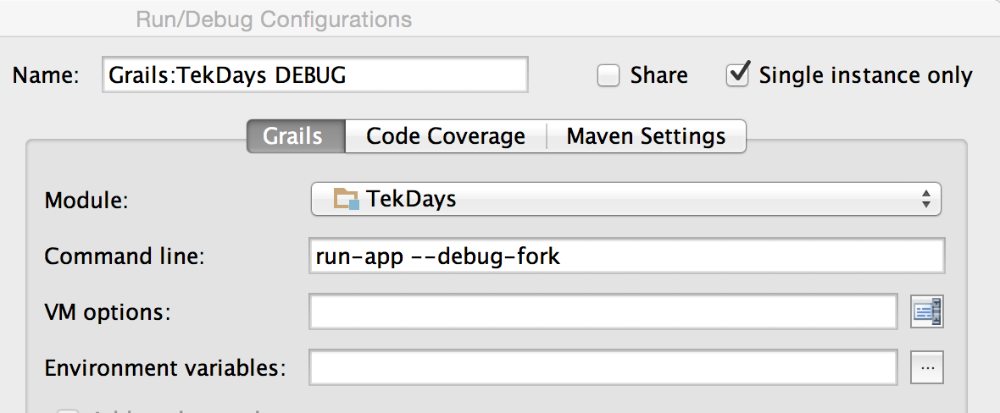
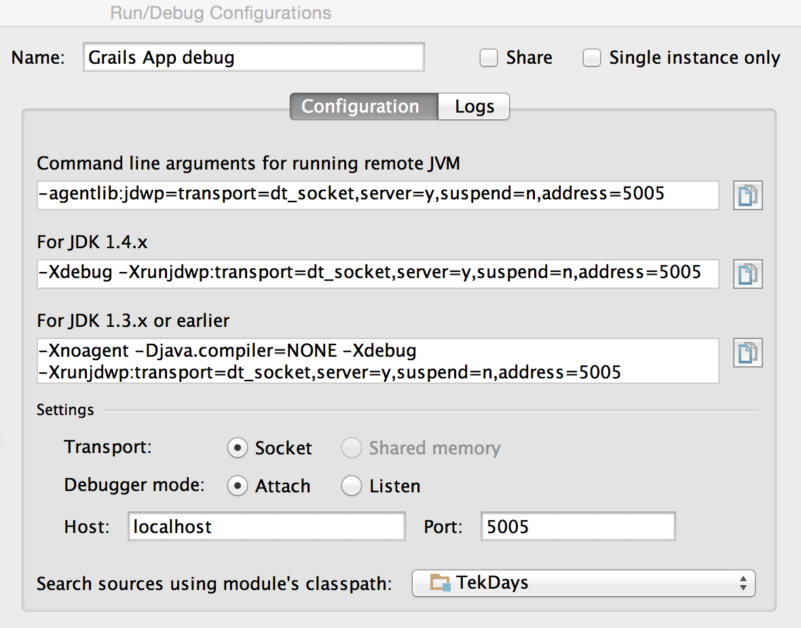

# Grails 2.5.0 debug in IntelliJ IDEA
> | groovy | grails |

I've been using Grails v.2.5.0 and tried to debug Grails app via traditional Intellij IDEA 14 Debug with no success.

*To be short*: using IDEA *Debug* allows us debug Grails build system **only**. Why?
> Forked execution is configured via the `grails-app/conf/BuildConfig.groovy` file. The following is the default configuration:

```groovy
grails.project.fork = [
 ...
   run: [maxMemory: 768, minMemory: 64, debug: false, maxPerm: 256], // configure settings for the run-app JVM
 ...
]
```

*Based on this we should create two IDEA Run/Debug Configurations:*

- Create simple Grails *Run* configuration with `--debug-fork` parameter: `run-app --debug-fork`.
E.g.



And run this Configuration. We should get the next output 

```
Listening for transport dt_socket at address: 5005
|Server running. Browse to http://localhost:8080/TekDays
```

This socket address will be used for *Remote* connection.

- Create IDEA `Remote` Configuration (*Run/Debug Configuration* -> *Remote*)



And run this Configuration. Now, we are able to *debug* our application.

The main idea is that we should have two running *Configurations*!

## References

- [Grails Goodness: Debugging App in Forked Mode](http://mrhaki.blogspot.com/2013/12/grails-goodness-debugging-app-in-forked.html)
- [Grails 2.5 Forked Execution](http://grails.github.io/grails-doc/2.5.0/guide/single.html#forkedMode)
- [Stackoverflow - IntelliJ IDEA Debugger isn't working on a Grails Project](http://stackoverflow.com/questions/19247944/intellij-idea-debugger-isnt-working-on-a-grails-project)
- [Road to Grails 2.3: Forked Execution](http://grails.io/post/43484836985/road-to-grails-2-3-forked-execution)