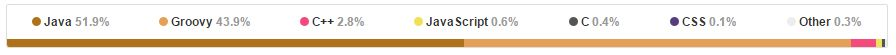

# Gradle, Groovy, Kotlin. FTW?
> | gradle | groovy | kotlin |

You’ve probably heard about [_"Kotlin-based approach to writing Gradle build scripts"_](http://gradle.org/blog/kotlin-meets-gradle/). A lot of noise was produced based on this announcement and Cédric Champeau tried to explain the real state of [Groovy, Gradle and their future relationship](http://melix.github.io/blog/2016/05/gradle-kotlin.html).

Just to avoid different speculation about _"Gradle is written in Groovy"_ and now _"it will be re-written in Kotlin"_ here are some *numbers*:

* Let's check the [Gradle repo](https://github.com/gradle/gradle) language statistic provided by  GitHub



- Gradle root folder has several very important sub-folders:
  - `buildSrc` - https://docs.gradle.org/current/userguide/-ganizing_build_logic.html#sec:build_sources[It's related to Gradle -ild process]
  - `config` - nothing interesting: `condenarc` and `checkstyle` configs
  - `design-docs` - markdown documentation
  - `gradle` - Gradle scripts
  - `subprojects` - Gradle sources. It's our goal to analyze this folder and understand the language statistics
- `subprojects` contains several interesting sub-folders:
  - `src/main` - actual "gradle" source code
  - `src/test`, `src/integTest` and `src/testFixtures` test source code.
- Now, count the language stats by https://github.com/AlDanial/cloc[cloc] tool:
  - `src/main`:

```
$ cloc-1.66.exe  --match-d="src/main/" --found=oicloc2.log .
    6052 text files.
Wrote oicloc2.log
    5975 unique files.
    1881 files ignored.

https://github.com/AlDanial/cloc v 1.66  T=19.50 s (298.2 files/s, 23192.5 lines/s)
-------------------------------------------------------------------------------
Language                     files          blank        comment           code
-------------------------------------------------------------------------------
Java                          5466          56689         128109         238097
Groovy                         278           3100           5179          14336
JavaScript                       3            160            272           4528
XML                             15              8              0            669
CSS                              6             64             38            354
XSLT                             1             24             31            140
C++                              7              7              0             51
C                                6             22             22             50
Scala                           15             12             39             50
C/C++ Header                     6              9              4             33
HTML                             3              9             17             24
Objective C++                    2              7              0             18
Assembly                         2              1              0             17
JSP                              3              0              0             14
IDL                              1              2              0             14
Objective C                      1              3              0              7
-------------------------------------------------------------------------------
SUM:                          5815          60117         133711         258402
-------------------------------------------------------------------------------
```

Based on this raw analysis we have *93% Java* files and *4.7% Groovy* files.

- Let's add *_test_* ( `src/test`, `src/integTest` and `src/testFixtures`) folders to our statistics:

```
$ cloc-1.66.exe  --match-d="src/(test|integTest|testFixtures)/" --found=oicloc3.log .
    3867 text files.
Wrote oicloc3.log
    3775 unique files.
    2657 files ignored.

https://github.com/AlDanial/cloc v 1.66  T=15.24 s (243.1 files/s, 29213.4 lines/s)
-------------------------------------------------------------------------------
Language                     files          blank        comment           code
-------------------------------------------------------------------------------
Groovy                        3043          65654          47398         291716
Java                           536           5830           7278          23568
XML                             57             19             36           1845
Maven                           22             57             20            571
HTML                            10             18             10            430
Scala                           24             48            122            162
JavaScript                       5             14             13            105
CSS                              1             19              0             91
DTD                              1             54            164             33
XSLT                             2              6              0             20
CoffeeScript                     1              7              8             13
YAML                             1              0              0              7
JSP                              1              0              0              6
SQL                              1              2              1              2
C                                1              0              0              1
-------------------------------------------------------------------------------
SUM:                          3706          71728          55050         318570
-------------------------------------------------------------------------------
```

As You can see we have *14.5% Java* files and *82% Groovy* files.

## Summary

*Gradle* is _Java_-based project and it uses _Groovy_ for testing and as a DSL implementation tool, nothing more.
The noise around "Groovy vs Kotlin" for DSL implementation inside Gradle sounds strange. _Gradle Inc._ has just made pragmatic decision. That's it.
