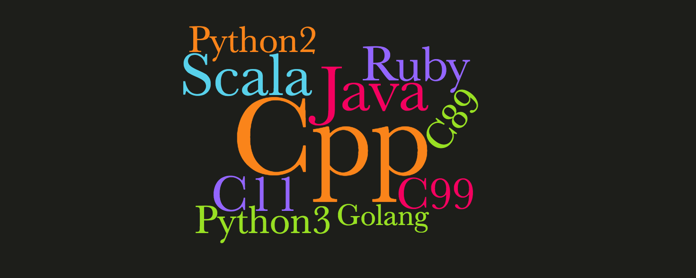

# Reserved Words of Programming languages 
> | ruby | python | java | scala | golang | cpp | c |



Amount of reserved words per programming language:

* **C++** - 92
* **C89** - 32
* **C99** - 37
* **C11** - 42
* **Python 2** - 31   
* **Python 3** - 33
* **Ruby** - 41
* **Golang** - 25
* **Java** - 53
* **Scala** - 50

As You can see **Golang** has the minimal amount of reserved words.

## [C++ keywords](http://en.cppreference.com/w/cpp/keyword): 92 words

```
alignas (since C++11)    dynamic_cast           reinterpret_cast
alignof (since C++11)    else                   requires (concepts TS)
and                      enum                   return
and_eq                   explicit               short
asm                      export(1)              signed
atomic_cancel (TM TS)    extern(1)              sizeof(1)
atomic_commit (TM TS)    false                  static
atomic_noexcept (TM TS)  float                  static_assert (since C++11)
auto(1)                  for                    static_cast
bitand                   friend                 struct(1)
bitor                    goto                   switch
bool                     if                     synchronized (TM TS)
break                    import (modules TS)    template
case                     inline(1)              this
catch                    int                    thread_local (since C++11)
char                     long                   throw
char16_t (since C++11)   module (modules TS)    true
char32_t (since C++11)   mutable(1)             try
class(1)                 namespace              typedef
compl                    new                    typeid
concept (concepts TS)    noexcept (since C++11) typename
const                    not                    union
constexpr (since C++11)  not_eq                 unsigned
const_cast               nullptr (since C++11)  using(1)
continue                 operator               virtual
decltype (since C++11)   or                     void
default(1)               or_eq                  volatile
delete(1)                private                wchar_t
do                       protected              while
double                   public                 xor
                         register(2)            xor_eq
```

## [C keywords](http://en.cppreference.com/w/c/keyword)

### C89: 32 words

```
auto         goto         
break        if           
case         int          
char         long         
const        register     
continue     return       
default      short        
do           signed       
double       sizeof       
else         static       
enum         struct       
extern       switch       
float        typedef      
for          union        
```

### C99: C89 + 5 words

```
_Bool
_Complex
_Imaginary
inline
restrict
```

### C11: C99 + 5 words

```
_Alignas        _Noreturn
_Alignof        _Static_assert
_Atomic         _Thread_local
_Generic        _Noreturn
```
## [Python 2](https://docs.python.org/2/reference/lexical_analysis.html#keywords): 31 words

```
and       del       from      not       while
as        elif      global    or        with
assert    else      if        pass      yield
break     except    import    print
class     exec      in        raise
continue  finally   is        return
def       for       lambda    try
```


## [Python 3](https://docs.python.org/3/reference/lexical_analysis.html#keywords): 33 words

```
False      class      finally    is         return
None       continue   for        lambda     try
True       def        from       nonlocal   while
and        del        global     not        with
as         elif       if         or         yield
assert     else       import     pass
break      except     in         raise
```

## [Ruby](https://docs.ruby-lang.org/en/2.3.0/keywords_rdoc.html): 41 words

```
__ENCODING__
__FILE__  and    def       end     in      or      self   unless
__LINE__  begin  defined?  ensure  module  redo    super  until
BEGIN     break  do        false   next    rescue  then   when
END       case   else      for     nil     retry   true   while
alias     class  elsif     if      not     return  undef  yield
```

## [Golang](https://golang.org/ref/spec#Keywords): 25 words

```
break        default      func         interface    select
case         defer        go           map          struct
chan         else         goto         package      switch
const        fallthrough  if           range        type
continue     for          import       return       var
```

## [Java](http://docs.oracle.com/javase/tutorial/java/nutsandbolts/_keywords.html): 53 words

```
abstract    continue   for         new          switch
assert***   default    goto*       package      synchronized
boolean     do         if          private      this
break       double     implements  protected    throw
byte        else       import      public       throws
case        enum****   instanceof  return       transient
catch       extends    int         short        try
char        final      interface   static       void
class       finally    long        strictfp**   volatile
const*      float      native      super        while
false       true       null

*       not used
**      added in 1.2
***     added in 1.4
****    added in 5.0
```

## [Scala](https://www.scala-lang.org/files/archive/spec/2.11/01-lexical-syntax.html) : 50 words

```
abstract    case        catch       class       def
do          else        extends     false       final
finally     for         forSome     if          implicit
import      lazy        macro       match       new
null        object      override    package     private
protected   return      sealed      super       this
throw       trait       try         true        type
val         var         while       with        yield
_    :    =    =>    <-    <:    <%     >:    #    @
```

**Scala**'s special symbols (`_    :    =    =>    <-    <:    <%     >:    #    @`) can be excluded and in this case **Scala** might have only 40 reserverd words.