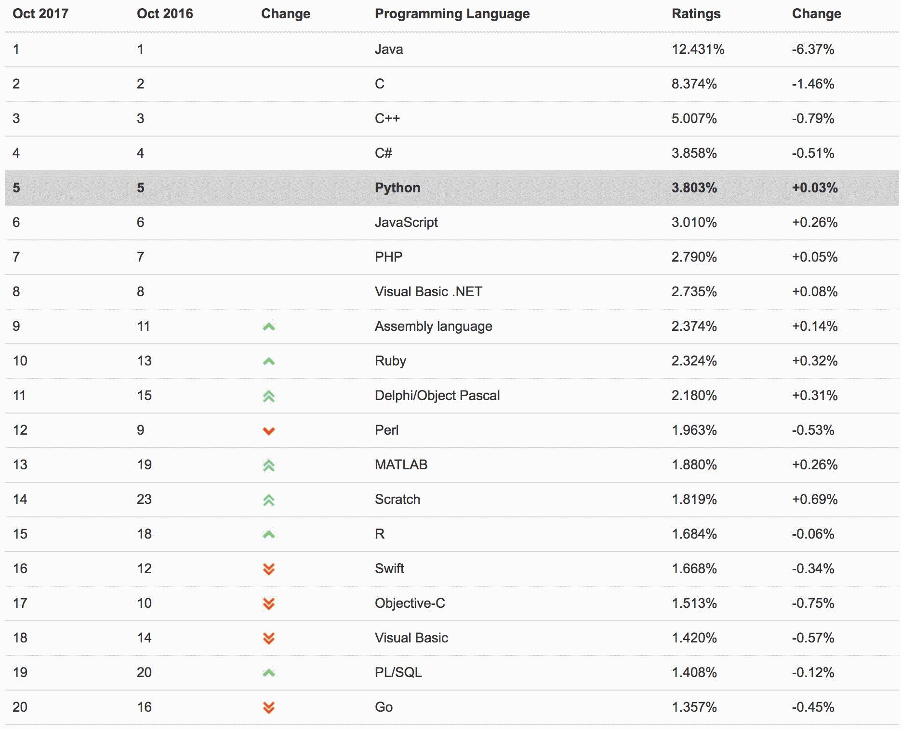
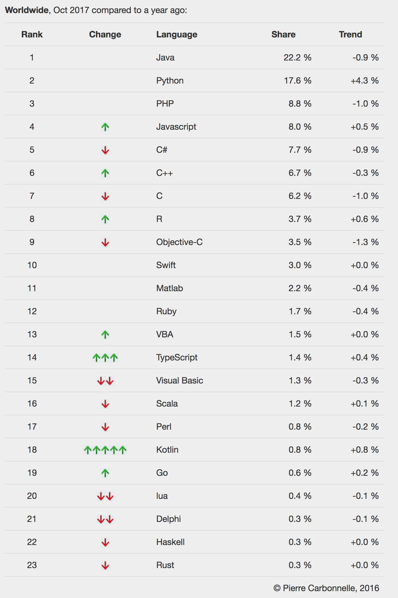
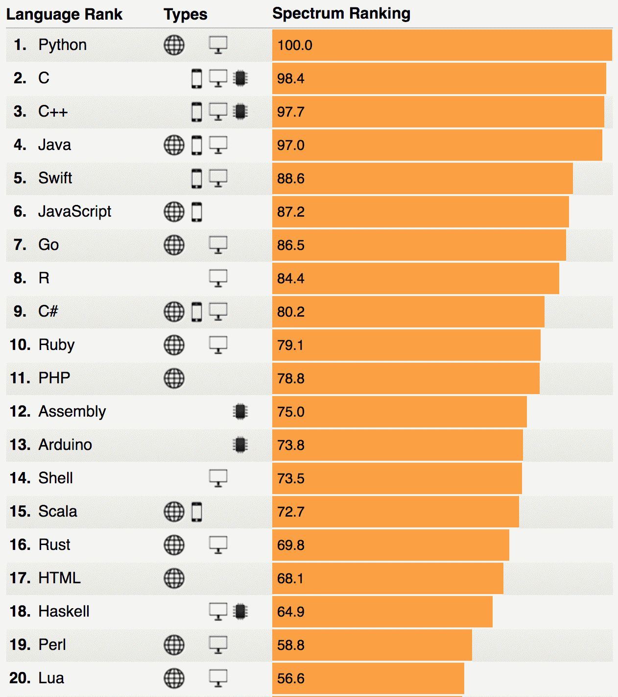
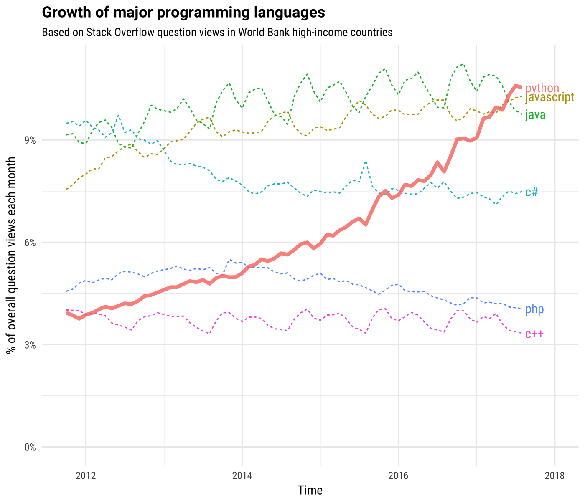
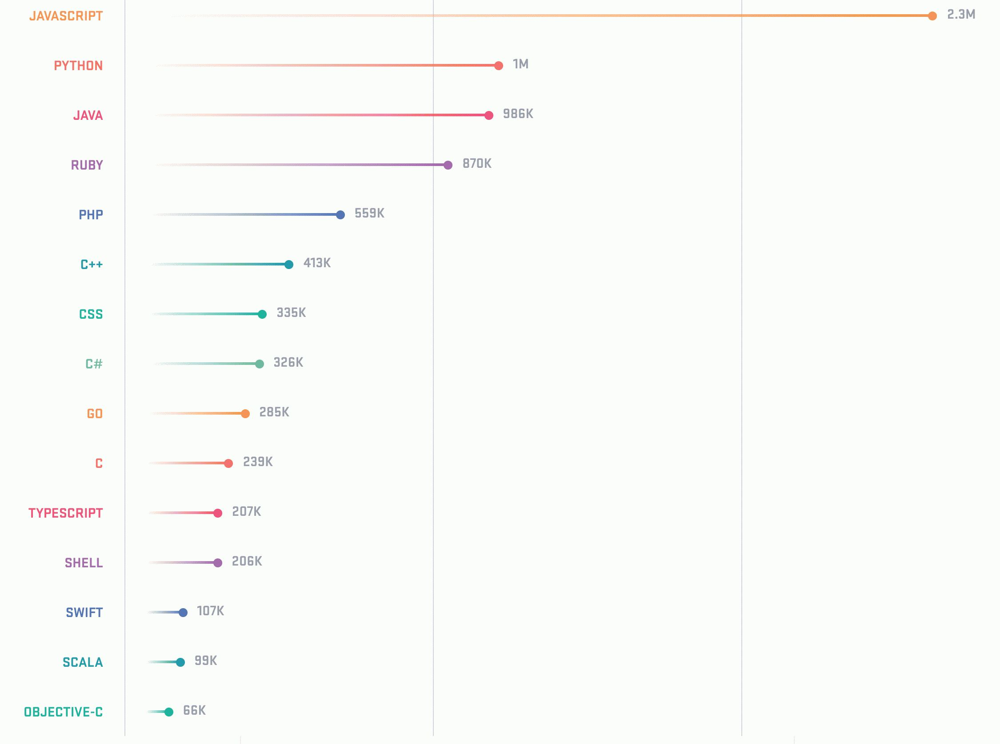

# Reflection about the next main scripting language
> | python | ruby | groovy |

I differentiate _normal programming language_ and _scripting programming language_.

_Scripting language_ must be used for quick prototyping, automation, has a nice integration with shell, etc.
Also, it should be very quick at startup time.

So, any automation task can have the next implementations evolution, _e.g._:

- `bash` script
- then any scripting language (`Python`, `Ruby`, `Groovy`, `Perl`, etc.)
- [CLI](https://en.wikipedia.org/wiki/Command-line_interface) application

I have been using several languages which have such characteristics (or similar): _Ruby_ and _Groovy_.

## Ruby

I started using Ruby (as a scripting language) in 2008. It was cool. In that time Ruby community was "bashing" Java.
The community was and is _Ruby on Rails_ centric, mainly _non_-Windows. Almost nothing has happen outside of Rails (Vagrant, Chef and Puppet are exceptions), and it's sad.
But this language has a _"soul"_. I could not explain, but I feel _happiness_ while I am writing something in Ruby :-)

## Groovy

Groovy is nice JVM language which has own _pros & cons_. But now, this language has some problems with popularity (_see_ link:{2016-groovy-post}[The state of Groovy and other JVM Languages]). And for me it's a very important point.
Also, due to JVM nature, the script startup  is very slow (I do not count [GroovyServ](https://kobo.github.io/groovyserv/quickstart.html)).

Groovy language syntax is much better for me than Ruby. I like Groovy _packages_ and hate Ruby _Modules and Namespaces_. Again, it just a matter of taste.

## Thoughts

If we compare different scripting languages they are almost the same in terms of what can be implement using them.
But, some of them have community problems, some - ecosystem problems, some - is just not well suited to your development approaches (e.g _Perl_, _Lua_, _Js/Node.js_).

And as always there must be some shift or motivation to look around and try something new and hopefully better.
The time invested in learning new _"tool"_ must be rewarded in future.

If we look around the decision of picking another better scripting language is very simple - it's _Python_. And by *_"better"_* I don't mean syntax.

## Python

I have never used Python because Ruby (or Groovy) had the similar language features and I have not seen any benefits in switching to another language.
On the another hand, Python has huge ecosystem, it has library for almost everything, it is not a framework-centric language (_see_ Ruby on Rails, Groovy: Grails or Gradle).
And the most important it has a momentum in terms of _Data Science_, _Machine Learning_ and _Artificial Intelligence_ (where I have big interests as the other people).
Unfortunately, Ruby has lost this fight.

For several month, I have been using a lot of Python-based tools ([AWS CLI](https://aws.amazon.com/cli/), [ZMON](https://zmon.io/), [Stups](https://stups.io/)) during my work day
and this is another big motivation for me to look into the Python as my potential next scripting language.

There is a very interesting moment. I **do not** like Python syntax (I am not dogmatic). For some reason Python syntax (and language features) is very *_ugly_* for me.
And I would pick Python only because of pragmatism and not because I like it.
But, I am not sure whether Python will be my main scripting language since Python is *not* equal to "happiness" :-(

_Python_ is very popular right now (check the numbers below) and it's a very good time to start using it if you don't have biases like I have.

## Languages Popularity Statistics

### RedMonk

The RedMonk Programming Language Rankings: June 2017

### TIOBE Index

TIOBE Index for October 2017

### PYPL

PYPL PopularitY of Programming Language

### IEEE Spectrum

Interactive: The Top Programming Languages 2017

### Stack Overflow

Growth of major programming languages

### Github

The fifteen most popular languages on GitHub (2017) by opened pull request

## References

- [The RedMonk Programming Language Rankings: June 2017](http://redmonk.com/sogrady/2017/06/08/language-rankings-6-17/)
- [TIOBE Index](https://www.tiobe.com/tiobe-index/)
- [PYPL PopularitY of Programming Language](https://pypl.github.io/PYPL.html)
- [Interactive: The Top Programming Languages 2017](https://spectrum.ieee.org/static/interactive-the-top-programming-languages-2017)
- [The Incredible Growth of Python, published September 6, 2017](https://stackoverflow.blog/2017/09/06/incredible-growth-python/)
- [The State of the Octoverse 2017, Github statistics](https://octoverse.github.com/)
- [GitHut 2.0. A small place to discover languages in Github](https://madnight.github.io/githut/)
