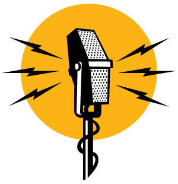

# My Favorite Podcasts
> | podcast |

I’ve been listening podcasts for many years. Mostly (99%) technical podcasts. Here is the list in my favorite order
(Please note, some of them are not in English)

- (RUS) [DevZen](http://devzen.ru/): Very interesting. It covers broad range of different technical topics
- (RUS) [Scalaz Podcast](http://scalalaz.ru): Podcast about Scala
- (RUS) [Radio-t](https://radio-t.com/): Tech podcast. Sometimes might be boring because it has a lot of blaming and trolling
- (RUS) [GolangShow](http://golangshow.com/): only #Golang, only hardcore
- (ENG) [The Ruby Rogues](https://devchat.tv/ruby-rogues): broad range of topics, not only #Ruby
- (ENG) [Functional Geekery](https://www.functionalgeekery.com/): A podcast on Functional Programming, covering topics across multiple languages
- (ENG) [LambdaCast](http://www.podcasts.com/lambdacast-99): LambdaCast is a podcast about functional programming for working developers
- (ENG) [Mapping The Journey](https://www.mappingthejourney.com): interviews with famous people from IT
- (ENG) [The Chanelog](https://changelog.com/): broad range of topics
- (RUS) [CTOcast](http://ctocast.com/): mostly interviews, tech podcast with different guests from different companies
- (RUS) [SDCast](https://sdcast.ksdaemon.ru/): mostly interviews, tech podcast with different guests from different companies
- (RUS) [Americhka.us](https://americhka.us/): non-technical podcast about life
- (ENG) [The Chariot TechCast](http://chariotsolutions.com/podcasts/show/techcast/): “The Chariot TechCast is an interview show that covers emerging and important tends in the world of software development.”
- (ENG) [Software Engineering Radio](http://www.se-radio.net/): different tech topics
- (RUS) [Razbor poletov](http://razbor-poletov.com/): Java-related talks
