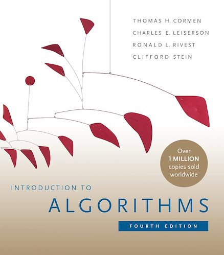
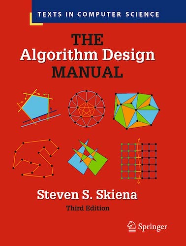
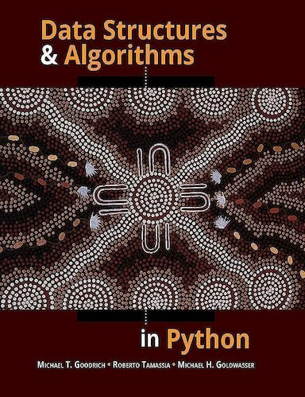

# Top "Algorithms and Data Structures" Books
> | book | algorithm | data structure |

I have a my list several books related to this topic. I've decided to list it here for easy referencing

- [Algorithms, 4th Edition](#algorithms-4th-edition)
- [Introduction to Algorithms, 4th Edition](#introduction-to-algorithms-4th-edition)
- [The Algorithm Design Manual, 3rd Edition](#the-algorithm-design-manual-3rd-edition)
- [Data Structures and Algorithms in Python, 1st Edition](#data-structures-and-algorithms-in-python-1st-edition)

---

## Algorithms, 4th Edition

Details

- [book site](https://algs4.cs.princeton.edu)
- **videos**: [part1](https://www.youtube.com/watch?v=9diDWV-fOnE) and [part2](https://www.youtube.com/watch?v=6TW3JSVEJQE)
- ["Algorithms" 4th Edition by *Robert Sedgewick, Kevin Wayne*](https://www.amazon.com/dp/032157351X/)
- Hardcover: 976 pages
- Publisher: Addison-Wesley Professional; 4th edition (March 19, 2011)

**Table of Contents**:

- 1 Fundamentals
  - 1.1 Basic Programming Model 
  - 1.2. Data Abstraction 
  - 1.3. Bags, Queues, and Stacks 
  - 1.4. Analysis of Algorithms 
  - 1.5. Case Study: Union-Find 
- 2 Sorting
  - 2.1. Elementary Sorts 
  - 2.2. Mergesort 
  - 2.3. Quicksort 
  - 2.4. Priority Queues 
  - 2.5. Applications 
- 3 Searching
  - 3.1. Symbol Tables 
  - 3.2. Binary Search Trees 
  - 3.3. Balanced Search Trees 
  - 3.4. Hash Tables 
  - 3.5. Applications 
- 4 Graphs 
  - 4.1. Undirected Graphs 
  - 4.2. Directed Graphs 
  - 4.3. Minimum Spanning Trees 
  - 4.4. Shortest Paths 
- 5 Strings
  - 5.1. String Sorts 
  - 5.2. Tries 
  - 5.3. Substring Search 
  - 5.4. Regular Expressions 
  - 5.5. Data Compression 
- 6 Context

## Introduction to Algorithms, 4th Edition

Details

- ["Introduction to Algorithms", 4rd Edition
by *Thomas H. Cormen, Charles E. Leiserson, Ronald L. Rivest, Clifford Stein*](https://www.amazon.com/Introduction-Algorithms-fourth-Thomas-Cormen-ebook/dp/B094WZNKP2)
- Hardcover: 1312 pages
- Publisher: The MIT Press; 4rd edition (April 5, 2022)

**Table of Contents**:

- I Foundations
  - 1 The Role of Algorithms in Computing
  - 2 Getting Started
  - 3 Growth of Function
  - 4 Divide-and-Conquer
  - 5 Probabilistic Analysis and Randomized Algorithms
- II Sorting and Order Statistics
  - 6 Heapsort
  - 7 Quicksort
  - 8 Sorting in Linear Time
  - 9 Medians and Order Statistics
- III Data Structures
  - 10 Elementary Data Structures
  - 11 Hash Tables
  - 12 Binary Search Trees
  - 13 Red-Black Trees
  - 14 Augmenting Data Structures
- IV Advanced Design and Analysis Techniques
  - 15 Dynamic Programming
  - 16 Greedy Algorithms
  - 17 Amortized Analysis
- V Advanced Data Structures
  - 18 B-Trees
  - 19 Fibonacci Heap
  - 20 Van Emde Boas Trees
  - 21 Data Structures for Disjoint Sets
- VI Graph Algorithms
  - 22 Elementary Graph Algorithms
  - 23 Minimum Spanning Trees
  - 24 Single-Source Shortest Paths
  - 25 All-Pairs Shortest Paths
  - 26 Maximum Flow
- VII Selected Topics
  - 27 Multithreaded Algorithms
  - 28 Matrix Operations
  - 29 Linear Programming
  - 30 Polynomials and the FFT
  - 31 Number-Theoretic Algorithms
  - 32 String Matching
  - 33 Computational Geometry
  - 34 NP-Completeness
  - 35 Approximation Algorithms
- VIII Appendix: Mathematical Background
  - A Summations
  - B Sets, Etc.
  - C Counting and Probability
  - D Matrices

## The Algorithm Design Manual, 3rd Edition

Details

- [book site](https://www.algorist.com)
- ["The Algorithm Design Manual", 3rd ed., 2020  by *Steven S. Skiena*](https://www.amazon.com/Algorithm-Design-Manual-Computer-Science-dp-3030542580/dp/3030542580)
- Paperback: 810 pages
- Publisher: Springer; 3rd ed. 2020 edition (October 7, 2021)

**Table of Contents**:

- I Practical Algorithm Design
  - 1 Introduction to Algorithm Design
  - 2 Algorithm Analysis
  - 3 Data Structures
  - 4 Sorting and Searching
  - 5 Graph Traversal
  - 6 Weighted Graph Algorithms
  - 7 Combinatorial Search and Heuristic Methods
  - 8 Dynamic Programming
  - 9 Intractable Problems and Approximation Algorithms
  - 10 How to Design Algorithms
- II The Hitchhiker’s Guide to Algorithms
  - 11 A Catalog of Algorithmic Problems
  - 12 Data Structures
  - 13 Numerical Problems
  - 14 Combinatorial Problems
  - 15 Graph Problems: Polynomial-Time
  - 16 Graph Problems: Hard Problems
  - 17 Computational Geometry
  - 18 Set and String Problems
  - 19 Algorithmic Resources

## Data Structures and Algorithms in Python, 1st Edition

Details

- ["Data Structures and Algorithms in Python", 1st Edition
by Michael T. Goodrich, Roberto Tamassia, Michael H. Goldwasser](https://www.amazon.com/Structures-Algorithms-Python-Michael-Goodrich-dp-1118290275/dp/1118290275/)
- Hardcover: 768 pages
- Publisher: Wiley; 1 edition (March 18, 2013)

**Table of Contents**:

1. Python Primer
2. Object-Oriented Programming
3. Algorithm Analysis
4. Recursion
5. Array-Based Sequences
6. Stacks, Queues, and Deques
7. Linked Lists
8. Trees
9. Priority Queues
10. Maps, Hash Tables, and Skip Lists
11. Search Trees
12. Sorting and Selection
13. Text Processing
14. Graph Algorithms
15. Memory Management and B-Trees
16. A. Character Strings in Python
17. B. Useful Mathematical Facts

