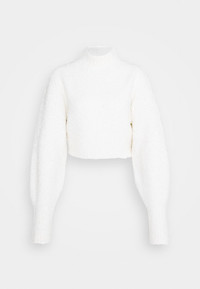

# How to remove image background color using JVM?
<!-- tags: scala, jvm, computer vision -->

- [References](#references)
- [Results](#results)
  - [Notes](#notes)
- [Code snippets](#code-snippets)
  - [Generate images](#generate-images)

---

## References

- [SO: How to make a color transparent in a BufferedImage and save as PNG](https://stackoverflow.com/questions/665406/how-to-make-a-color-transparent-in-a-bufferedimage-and-save-as-png)

## Results

The table below shows results of the background removals for sample images.

*Columns* description:

- **Original** image
- **Remove color**: result of single color removal (color of `pixel (0,0)`)
- **Remove color range**: result of color range removal (`EEEEEE` - `EFEFEF`)

Since transparency is not easy to present I decided to use "red" color instead.

All **Orinial** images exept #2 have **gray** background, image #2 has **white** background. That's why **Remove color** works the best for #2.

| # | Original | Remove color | Remove color range |
|- |----------|-----------------------|------------------------|
|1. || | | 
|2. ||||
|3. |  |  ||
|4. ||||
|5. ||||

### Notes

1. The selected "default" range is too aggressive for image #4, we removed/"made transparent" even the product's part.
2. Also, I dediced to use a wider color range (`EDEDED` - `F0F0F0`) for sample #5. It works well for such type of images.


## Code snippets

```scala
import java.awt.image._
import java.awt.{Color, Image, Toolkit}
import java.io.File

import javax.imageio.ImageIO

class AddTransparency {

  /**
   * https://www.infoworld.com/article/2074105/making-white-image-backgrounds-transparent-with-java-2d-groovy.html
   *
   * Make provided image transparent wherever color matches the provided color.
   *
   * @param im BufferedImage whose color will be made transparent.
   * @param color Color in provided image which will be made transparent.
   * @return Image with transparency applied.
   */
  def transformColorToTransparency(im: BufferedImage, color: Color): Image = {
    val filter: ImageFilter = new RGBImageFilter() {
      // the color we are looking for (white)... Alpha bits are set to opaque
      val markerRGB = color.getRGB | 0xFF000000

      def filterRGB(x: Int, y: Int, rgb: Int) = {
        if ((rgb | 0xFF000000) == markerRGB) { // Mark the alpha bits as zero - transparent
          0x00FFFFFF & rgb
        } else { // nothing to do
          rgb
        }
      }
    }

    val ip: ImageProducer = new FilteredImageSource(im.getSource, filter)
    Toolkit.getDefaultToolkit.createImage(ip)
  }

  /**
   * https://stackoverflow.com/questions/665406/how-to-make-a-color-transparent-in-a-bufferedimage-and-save-as-png
   */
  def transformColorRangeToTransparency(image: BufferedImage, c1: Color, c2: Color): Image = {
    val (r1, g1, b1) = (c1.getRed, c1.getGreen, c1.getBlue)
    val (r2, g2, b2) = (c2.getRed,c2.getGreen, c2.getBlue)

    val filter = new RGBImageFilter() {
      override final def filterRGB(x: Int, y: Int, rgb: Int): Int = {
        val r = (rgb & 0xFF0000) >> 16
        val g = (rgb & 0xFF00) >> 8
        val b = rgb & 0xFF
        if ( r >= r1 && r <= r2
          && g >= g1 && g <= g2
          && b >= b1 && b <= b2) { // Set fully transparent but keep color
          return rgb & 0xFFFFFF
        }
        rgb
      }
    }
    val ip = new FilteredImageSource(image.getSource, filter)
    Toolkit.getDefaultToolkit.createImage(ip)
  }

  def imageToBufferedImage(image: Image, bgColor: Option[Color] = None): BufferedImage = {
    val bufferedImage = new BufferedImage(image.getWidth(null), image.getHeight(null), BufferedImage.TYPE_INT_ARGB)
    val g2 = bufferedImage.createGraphics()
    bgColor.foreach(c => g2.setPaint(c))
    g2.fillRect(0, 0, bufferedImage.getWidth, bufferedImage.getHeight)
    g2.drawImage(image, 0, 0, null)
    g2.dispose()
    bufferedImage
  }

  def writeImage(fileName: String, bi: BufferedImage) = {
    val outputfile = new File(s"tmp/$fileName")
    println("outputfile: " + outputfile.getAbsolutePath)
    ImageIO.write(bi, "png", outputfile)
  }

  def readBufferedImage(path: String): BufferedImage = {
    val classLoader = getClass.getClassLoader
    val file = new File(classLoader.getResource(path).getFile)
    ImageIO.read(file)
  }
}
```

### Generate images

```scala
class AddTransparencySpec extends AnyFlatSpec {

  behavior of "AddTransparency"

  val at = new AddTransparency()

  it should "transformColorRangeToTransparency" in {
    val files = List.range(1,6).map(s => s"img$s")
    println(files)

    files.foreach { file =>
      val source: BufferedImage = at.readBufferedImage(s"poc/$file.jpg")

      val color = new Color(source.getRGB(0, 0))
      println(s"color = $color")

      val c1 = Color.decode("#EEEEEE")
      val c2 = Color.decode("#EFEFEF")
      val imageWithTransparency: Image = at.transformColorRangeToTransparency(source, c1, c2)
      val transparentImage = at.imageToBufferedImage(imageWithTransparency, bgColor = Some(Color.RED))

      at.writeImage(s"${file}_color_range_transparent.png", transparentImage)
    }
  }

  it should "transformColorToTransparency" in {
    val files = List.range(1,6).map(s => s"img$s")
    println(files)
    files.foreach { file =>
      val image: BufferedImage = at.readBufferedImage(s"poc/$file.jpg")
      println(imgInfo(image))
      val color = new Color(image.getRGB(0, 0))
      println(s"color = $color")
      val imageWithTransparency: Image = at.transformColorToTransparency(image, color)
      val transparentImage = at.imageToBufferedImage(imageWithTransparency, Some(Color.RED))
      at.writeImage(s"${file}_color_transparent.png", transparentImage)
    }
  }

  it should "img5" in {
    val file = "img5"
    val source: BufferedImage = at.readBufferedImage(s"poc/$file.jpg")

    val color = new Color(source.getRGB(0, 0))
    println(s"color = $color")

    val c1 = Color.decode("#EDEDED")
    val c2 = Color.decode("#F0F0F0")
    val imageWithTransparency: Image = at.transformColorRangeToTransparency(source, c1, c2)
    val transparentImage = at.imageToBufferedImage(imageWithTransparency, bgColor = Some(Color.RED))

    at.writeImage(s"${file}_color_range_transparent_special.png", transparentImage)
  }

  def imgInfo(img: BufferedImage): String = {
    val info = s"w:${img.getWidth}, h:${img.getHeight}"
    info
  }
}
```
