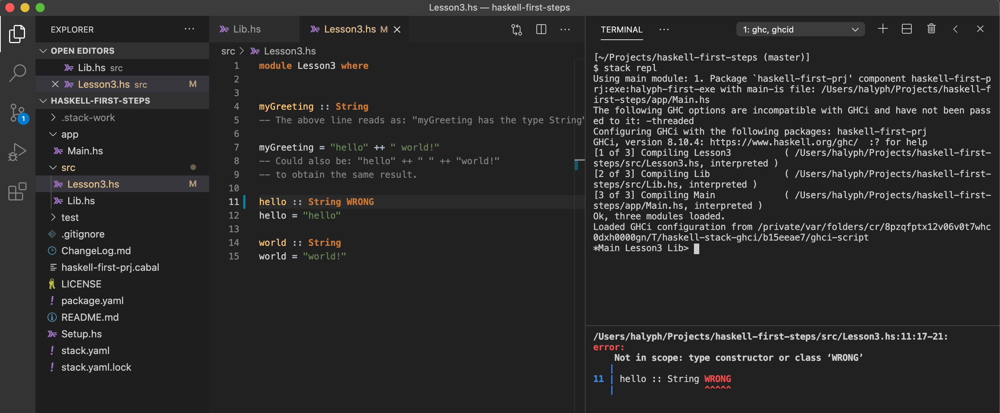

# Haskell: Development Environment Setup
<!-- tags: haskell -->

- [References](#references)
- [**Lesson 1** - Getting set up](#lesson-1---getting-set-up)
  - [1. Install **Stack**](#1-install-stack)
  - [2. Add Haskell stack to `PATH`](#2-add-haskell-stack-to-path)
  - [3. Create project from `Stack` template](#3-create-project-from-stack-template)
  - [4. Install VSCode Haskell extention](#4-install-vscode-haskell-extention)
  - [5. Initial project's build](#5-initial-projects-build)
  - [6. Update the app and rebuild](#6-update-the-app-and-rebuild)
  - [7. Install `ghcid`](#7-install-ghcid)
  - [8. Add a "hole" to our module and check how `ghcid` works](#8-add-a-hole-to-our-module-and-check-how-ghcid-works)
  - [9. Play with `Stack` repl](#9-play-with-stack-repl)
    - [9.1. How to fix `Warning: Multiple files use the same module name:`](#91-how-to-fix-warning-multiple-files-use-the-same-module-name)
    - [9.2. REPL in action](#92-repl-in-action)
  - [10. VSCode: Switch focus between editor and integrated terminal](#10-vscode-switch-focus-between-editor-and-integrated-terminal)
  - [11. VSCode adjust layout](#11-vscode-adjust-layout)

---

## References

- These notes are based on **Youtube** playlist [Learning Haskell for dummies](https://www.youtube.com/watch?v=1UyQ0fn6ke4&list=PLE-CSy3N6yEd_WTossnDB7pK9wb4eJD9r) by [**Cmdv** aka *Vincent Orr*](https://github.com/Cmdv)
- [The Haskell Tool Stack](https://docs.haskellstack.org/en/stable/README/) - Stack is a cross-platform program for developing Haskell projects. It is aimed at Haskellers both new and experienced.
- [Hoogle](https://hoogle.haskell.org) is a Haskell API search engine, which allows you to search the Haskell libraries on Stackage by either function name, or by approximate type signature.
- [Stackage](https://www.stackage.org) provides consistent sets of Haskell packages, known to build together and pass their tests before becoming Stackage Nightly snapshots and LTS (Long Term Support) releases.
- Github [ghcid](https://github.com/ndmitchell/ghcid) - Very low feature GHCi based IDE. Either "GHCi as a daemon" or "GHC + a bit of an IDE". To a first approximation, it opens `ghci` and runs `:reload` whenever your source code changes, formatting the output to fit a fixed height console.

## [**Lesson 1** - Getting set up](https://www.youtube.com/watch?v=1UyQ0fn6ke4)

### 1. Install **Stack**

- See [The Haskell Tool Stack - How to install](https://docs.haskellstack.org/en/stable/README/#how-to-install)

Run: `curl -sSL https://get.haskellstack.org/ | sh`  
Log:

```bash
$ curl -sSL https://get.haskellstack.org/ | sh
Using generic bindist...

  % Total    % Received % Xferd  Average Speed   Time    Time     Time  Current
                                 Dload  Upload   Total   Spent    Left  Speed
100   138  100   138    0     0    237      0 --:--:-- --:--:-- --:--:--   237
100   635  100   635    0     0    495      0  0:00:01  0:00:01 --:--:--  620k
100 8462k  100 8462k    0     0  3209k      0  0:00:02  0:00:02 --:--:-- 12.1M
Installing Stack to: /usr/local/bin/stack...

-------------------------------------------------------------------------------

Stack has been installed to: /usr/local/bin/stack

NOTE: You may need to run 'xcode-select --install' and/or
      'open /Library/Developer/CommandLineTools/Packages/macOS_SDK_headers_for_macOS_10.14.pkg'
      to set up the Xcode command-line tools, which Stack uses.

WARNING: '/Users/oivasiv/.local/bin' is not on your PATH.
    Stack will place the binaries it builds in '/Users/oivasiv/.local/bin' so
    for best results, please add it to the beginning of PATH in your profile.

```

### 2. Add Haskell stack to `PATH`

```bash
# Haskell Stack will place the binaries it builds in '/Users/$USER/.local/bin' so
# for best results, please add it to the beginning of PATH in your profile.
export PATH="/Users/oivasiv/.local/bin:$PATH"
```

### 3. Create project from `Stack` template

Run: `stack new haskell-first-prj`  
Log: 
```bash
$ stack new haskell-first-prj
Downloading template "new-template" to create project "haskell-first-prj" in haskell-first-prj/ ...

The following parameters were needed by the template but not provided: author-name
You can provide them in /Users/oivasiv/.stack/config.yaml, like this:
templates:
  params:
    author-name: value
Or you can pass each one as parameters like this:
stack new haskell-first-prj new-template -p "author-name:value"


The following parameters were needed by the template but not provided: author-email, author-name, category, copyright, github-username
You can provide them in /Users/oivasiv/.stack/config.yaml, like this:
templates:
  params:
    author-email: value
    author-name: value
    category: value
    copyright: value
    github-username: value
Or you can pass each one as parameters like this:
stack new haskell-first-prj new-template -p "author-email:value" -p "author-name:value" -p "category:value" -p "copyright:value" -p "github-username:value"

Looking for .cabal or package.yaml files to use to init the project.
Using cabal packages:
- haskell-first-prj/

Selecting the best among 19 snapshots...

* Matches https://raw.githubusercontent.com/commercialhaskell/stackage-snapshots/master/lts/17/11.yaml

Selected resolver: https://raw.githubusercontent.com/commercialhaskell/stackage-snapshots/master/lts/17/11.yaml
Initialising configuration using resolver: https://raw.githubusercontent.com/commercialhaskell/stackage-snapshots/master/lts/17/11.yaml
Total number of user packages considered: 1
Writing configuration to file: haskell-first-prj/stack.yaml
All done.
/Users/oivasiv/.stack/templates/new-template.hsfiles:    6.06 KiB downloaded...
```

Resulted project layout

```bash
$ tree .
.
├── ChangeLog.md
├── LICENSE
├── README.md
├── Setup.hs
├── app
│   └── Main.hs
├── haskell-first-prj.cabal
├── package.yaml
├── src
│   └── Lib.hs
├── stack.yaml
├── stack.yaml.lock
└── test
    └── Spec.hs
```

### 4. Install VSCode Haskell extention

See [Haskell Syntax Highlighting](https://marketplace.visualstudio.com/items?itemName=justusadam.language-haskell) Support for the Haskell programming language in Visual Studio Code.

### 5. Initial project's build

Run: `stack build`  
Log:

```bash
$ stack build
Preparing to install GHC to an isolated location.
This will not interfere with any system-level installation.
Downloaded ghc-8.10.4.                                      
xcode-select: error: tool 'xcodebuild' requires Xcode, but active developer directory '/Library/Developer/CommandLineTools' is a command line tools instance
ld: unknown option: --version
ld: unknown option: --version
Configured with: --prefix=/Library/Developer/CommandLineTools/usr --with-gxx-include-dir=/Library/Developer/CommandLineTools/SDKs/MacOSX10.14.sdk/usr/include/c++/4.2.1
Configured with: --prefix=/Library/Developer/CommandLineTools/usr --with-gxx-include-dir=/Library/Developer/CommandLineTools/SDKs/MacOSX10.14.sdk/usr/include/c++/4.2.1
/Library/Developer/CommandLineTools/usr/bin/ranlib: file: /Users/oivasiv/.stack/programs/x86_64-osx/ghc-8.10.4/lib/ghc-8.10.4/rts/libHSrts.a(Disassembler.o) has no symbols
/Library/Developer/CommandLineTools/usr/bin/ranlib: file: /Users/oivasiv/.stack/programs/x86_64-osx/ghc-8.10.4/lib/ghc-8.10.4/rts/libHSrts.a(LdvProfile.o) has no symbols
/Library/Developer/CommandLineTools/usr/bin/ranlib: file: /Users/oivasiv/.stack/programs/x86_64-osx/ghc-8.10.4/lib/ghc-8.10.4/rts/libHSrts.a(OldARMAtomic.o) has no symbols
/Library/Developer/CommandLineTools/usr/bin/ranlib: file: /Users/oivasiv/.stack/programs/x86_64-osx/ghc-8.10.4/lib/ghc-8.10.4/rts/libHSrts.a(ProfilerReport.o) has no symbols
/Library/Developer/CommandLineTools/usr/bin/ranlib: file: /Users/oivasiv/.stack/programs/x86_64-osx/ghc-8.10.4/lib/ghc-8.10.4/rts/libHSrts.a(ProfilerReportJson.o) has no symbols
/Library/Developer/CommandLineTools/usr/bin/ranlib: file: /Users/oivasiv/.stack/programs/x86_64-osx/ghc-8.10.4/lib/ghc-8.10.4/rts/libHSrts.a(Profiling.o) has no symbols
/Library/Developer/CommandLineTools/usr/bin/ranlib: file: /Users/oivasiv/.stack/programs/x86_64-osx/ghc-8.10.4/lib/ghc-8.10.4/rts/libHSrts.a(RetainerProfile.o) has no symbols
/Library/Developer/CommandLineTools/usr/bin/ranlib: file: /Users/oivasiv/.stack/programs/x86_64-osx/ghc-8.10.4/lib/ghc-8.10.4/rts/libHSrts.a(RetainerSet.o) has no symbols
/Library/Developer/CommandLineTools/usr/bin/ranlib: file: /Users/oivasiv/.stack/programs/x86_64-osx/ghc-8.10.4/lib/ghc-8.10.4/rts/libHSrts.a(RtsDllMain.o) has no symbols
/Library/Developer/CommandLineTools/usr/bin/ranlib: file: /Users/oivasiv/.stack/programs/x86_64-osx/ghc-8.10.4/lib/ghc-8.10.4/rts/libHSrts.a(SpinLock.o) has no symbols
/Library/Developer/CommandLineTools/usr/bin/ranlib: file: /Users/oivasiv/.stack/programs/x86_64-osx/ghc-8.10.4/lib/ghc-8.10.4/rts/libHSrts.a(TraverseHeap.o) has no symbols
/Library/Developer/CommandLineTools/usr/bin/ranlib: file: /Users/oivasiv/.stack/programs/x86_64-osx/ghc-8.10.4/lib/ghc-8.10.4/rts/libHSrts.a(Evac_thr.o) has no symbols
/Library/Developer/CommandLineTools/usr/bin/ranlib: file: /Users/oivasiv/.stack/programs/x86_64-osx/ghc-8.10.4/lib/ghc-8.10.4/rts/libHSrts.a(Sanity.o) has no symbols
/Library/Developer/CommandLineTools/usr/bin/ranlib: file: /Users/oivasiv/.stack/programs/x86_64-osx/ghc-8.10.4/lib/ghc-8.10.4/rts/libHSrts.a(Scav_thr.o) has no symbols
/Library/Developer/CommandLineTools/usr/bin/ranlib: file: /Users/oivasiv/.stack/programs/x86_64-osx/ghc-8.10.4/lib/ghc-8.10.4/rts/libHSrts.a(Elf.o) has no symbols
/Library/Developer/CommandLineTools/usr/bin/ranlib: file: /Users/oivasiv/.stack/programs/x86_64-osx/ghc-8.10.4/lib/ghc-8.10.4/rts/libHSrts.a(PEi386.o) has no symbols
/Library/Developer/CommandLineTools/usr/bin/ranlib: file: /Users/oivasiv/.stack/programs/x86_64-osx/ghc-8.10.4/lib/ghc-8.10.4/rts/libHSrts.a(elf_got.o) has no symbols
/Library/Developer/CommandLineTools/usr/bin/ranlib: file: /Users/oivasiv/.stack/programs/x86_64-osx/ghc-8.10.4/lib/ghc-8.10.4/rts/libHSrts.a(elf_plt.o) has no symbols
/Library/Developer/CommandLineTools/usr/bin/ranlib: file: /Users/oivasiv/.stack/programs/x86_64-osx/ghc-8.10.4/lib/ghc-8.10.4/rts/libHSrts.a(elf_plt_aarch64.o) has no symbols
/Library/Developer/CommandLineTools/usr/bin/ranlib: file: /Users/oivasiv/.stack/programs/x86_64-osx/ghc-8.10.4/lib/ghc-8.10.4/rts/libHSrts.a(elf_plt_arm.o) has no symbols
/Library/Developer/CommandLineTools/usr/bin/ranlib: file: /Users/oivasiv/.stack/programs/x86_64-osx/ghc-8.10.4/lib/ghc-8.10.4/rts/libHSrts.a(elf_reloc.o) has no symbols
/Library/Developer/CommandLineTools/usr/bin/ranlib: file: /Users/oivasiv/.stack/programs/x86_64-osx/ghc-8.10.4/lib/ghc-8.10.4/rts/libHSrts.a(elf_reloc_aarch64.o) has no symbols
/Library/Developer/CommandLineTools/usr/bin/ranlib: file: /Users/oivasiv/.stack/programs/x86_64-osx/ghc-8.10.4/lib/ghc-8.10.4/rts/libHSrts.a(elf_util.o) has no symbols
/Library/Developer/CommandLineTools/usr/bin/ranlib: file: /Users/oivasiv/.stack/programs/x86_64-osx/ghc-8.10.4/lib/ghc-8.10.4/rts/libHSrts_p.a(Disassembler.p_o) has no symbols
/Library/Developer/CommandLineTools/usr/bin/ranlib: file: /Users/oivasiv/.stack/programs/x86_64-osx/ghc-8.10.4/lib/ghc-8.10.4/rts/libHSrts_p.a(OldARMAtomic.p_o) has no symbols
/Library/Developer/CommandLineTools/usr/bin/ranlib: file: /Users/oivasiv/.stack/programs/x86_64-osx/ghc-8.10.4/lib/ghc-8.10.4/rts/libHSrts_p.a(RtsDllMain.p_o) has no symbols
/Library/Developer/CommandLineTools/usr/bin/ranlib: file: /Users/oivasiv/.stack/programs/x86_64-osx/ghc-8.10.4/lib/ghc-8.10.4/rts/libHSrts_p.a(SpinLock.p_o) has no symbols
/Library/Developer/CommandLineTools/usr/bin/ranlib: file: /Users/oivasiv/.stack/programs/x86_64-osx/ghc-8.10.4/lib/ghc-8.10.4/rts/libHSrts_p.a(Evac_thr.p_o) has no symbols
/Library/Developer/CommandLineTools/usr/bin/ranlib: file: /Users/oivasiv/.stack/programs/x86_64-osx/ghc-8.10.4/lib/ghc-8.10.4/rts/libHSrts_p.a(Sanity.p_o) has no symbols
/Library/Developer/CommandLineTools/usr/bin/ranlib: file: /Users/oivasiv/.stack/programs/x86_64-osx/ghc-8.10.4/lib/ghc-8.10.4/rts/libHSrts_p.a(Scav_thr.p_o) has no symbols
/Library/Developer/CommandLineTools/usr/bin/ranlib: file: /Users/oivasiv/.stack/programs/x86_64-osx/ghc-8.10.4/lib/ghc-8.10.4/rts/libHSrts_p.a(Elf.p_o) has no symbols
/Library/Developer/CommandLineTools/usr/bin/ranlib: file: /Users/oivasiv/.stack/programs/x86_64-osx/ghc-8.10.4/lib/ghc-8.10.4/rts/libHSrts_p.a(PEi386.p_o) has no symbols
/Library/Developer/CommandLineTools/usr/bin/ranlib: file: /Users/oivasiv/.stack/programs/x86_64-osx/ghc-8.10.4/lib/ghc-8.10.4/rts/libHSrts_p.a(elf_got.p_o) has no symbols
/Library/Developer/CommandLineTools/usr/bin/ranlib: file: /Users/oivasiv/.stack/programs/x86_64-osx/ghc-8.10.4/lib/ghc-8.10.4/rts/libHSrts_p.a(elf_plt.p_o) has no symbols
/Library/Developer/CommandLineTools/usr/bin/ranlib: file: /Users/oivasiv/.stack/programs/x86_64-osx/ghc-8.10.4/lib/ghc-8.10.4/rts/libHSrts_p.a(elf_plt_aarch64.p_o) has no symbols
/Library/Developer/CommandLineTools/usr/bin/ranlib: file: /Users/oivasiv/.stack/programs/x86_64-osx/ghc-8.10.4/lib/ghc-8.10.4/rts/libHSrts_p.a(elf_plt_arm.p_o) has no symbols
/Library/Developer/CommandLineTools/usr/bin/ranlib: file: /Users/oivasiv/.stack/programs/x86_64-osx/ghc-8.10.4/lib/ghc-8.10.4/rts/libHSrts_p.a(elf_reloc.p_o) has no symbols
/Library/Developer/CommandLineTools/usr/bin/ranlib: file: /Users/oivasiv/.stack/programs/x86_64-osx/ghc-8.10.4/lib/ghc-8.10.4/rts/libHSrts_p.a(elf_reloc_aarch64.p_o) has no symbols
/Library/Developer/CommandLineTools/usr/bin/ranlib: file: /Users/oivasiv/.stack/programs/x86_64-osx/ghc-8.10.4/lib/ghc-8.10.4/rts/libHSrts_p.a(elf_util.p_o) has no symbols
/Library/Developer/CommandLineTools/usr/bin/ranlib: file: /Users/oivasiv/.stack/programs/x86_64-osx/ghc-8.10.4/lib/ghc-8.10.4/rts/libHSrts_l.a(Disassembler.l_o) has no symbols
/Library/Developer/CommandLineTools/usr/bin/ranlib: file: /Users/oivasiv/.stack/programs/x86_64-osx/ghc-8.10.4/lib/ghc-8.10.4/rts/libHSrts_l.a(LdvProfile.l_o) has no symbols
/Library/Developer/CommandLineTools/usr/bin/ranlib: file: /Users/oivasiv/.stack/programs/x86_64-osx/ghc-8.10.4/lib/ghc-8.10.4/rts/libHSrts_l.a(OldARMAtomic.l_o) has no symbols
/Library/Developer/CommandLineTools/usr/bin/ranlib: file: /Users/oivasiv/.stack/programs/x86_64-osx/ghc-8.10.4/lib/ghc-8.10.4/rts/libHSrts_l.a(ProfilerReport.l_o) has no symbols
/Library/Developer/CommandLineTools/usr/bin/ranlib: file: /Users/oivasiv/.stack/programs/x86_64-osx/ghc-8.10.4/lib/ghc-8.10.4/rts/libHSrts_l.a(ProfilerReportJson.l_o) has no symbols
/Library/Developer/CommandLineTools/usr/bin/ranlib: file: /Users/oivasiv/.stack/programs/x86_64-osx/ghc-8.10.4/lib/ghc-8.10.4/rts/libHSrts_l.a(Profiling.l_o) has no symbols
/Library/Developer/CommandLineTools/usr/bin/ranlib: file: /Users/oivasiv/.stack/programs/x86_64-osx/ghc-8.10.4/lib/ghc-8.10.4/rts/libHSrts_l.a(RetainerProfile.l_o) has no symbols
/Library/Developer/CommandLineTools/usr/bin/ranlib: file: /Users/oivasiv/.stack/programs/x86_64-osx/ghc-8.10.4/lib/ghc-8.10.4/rts/libHSrts_l.a(RetainerSet.l_o) has no symbols
/Library/Developer/CommandLineTools/usr/bin/ranlib: file: /Users/oivasiv/.stack/programs/x86_64-osx/ghc-8.10.4/lib/ghc-8.10.4/rts/libHSrts_l.a(RtsDllMain.l_o) has no symbols
/Library/Developer/CommandLineTools/usr/bin/ranlib: file: /Users/oivasiv/.stack/programs/x86_64-osx/ghc-8.10.4/lib/ghc-8.10.4/rts/libHSrts_l.a(SpinLock.l_o) has no symbols
/Library/Developer/CommandLineTools/usr/bin/ranlib: file: /Users/oivasiv/.stack/programs/x86_64-osx/ghc-8.10.4/lib/ghc-8.10.4/rts/libHSrts_l.a(TraverseHeap.l_o) has no symbols
/Library/Developer/CommandLineTools/usr/bin/ranlib: file: /Users/oivasiv/.stack/programs/x86_64-osx/ghc-8.10.4/lib/ghc-8.10.4/rts/libHSrts_l.a(Evac_thr.l_o) has no symbols
/Library/Developer/CommandLineTools/usr/bin/ranlib: file: /Users/oivasiv/.stack/programs/x86_64-osx/ghc-8.10.4/lib/ghc-8.10.4/rts/libHSrts_l.a(Sanity.l_o) has no symbols
/Library/Developer/CommandLineTools/usr/bin/ranlib: file: /Users/oivasiv/.stack/programs/x86_64-osx/ghc-8.10.4/lib/ghc-8.10.4/rts/libHSrts_l.a(Scav_thr.l_o) has no symbols
/Library/Developer/CommandLineTools/usr/bin/ranlib: file: /Users/oivasiv/.stack/programs/x86_64-osx/ghc-8.10.4/lib/ghc-8.10.4/rts/libHSrts_l.a(Elf.l_o) has no symbols
/Library/Developer/CommandLineTools/usr/bin/ranlib: file: /Users/oivasiv/.stack/programs/x86_64-osx/ghc-8.10.4/lib/ghc-8.10.4/rts/libHSrts_l.a(PEi386.l_o) has no symbols
/Library/Developer/CommandLineTools/usr/bin/ranlib: file: /Users/oivasiv/.stack/programs/x86_64-osx/ghc-8.10.4/lib/ghc-8.10.4/rts/libHSrts_l.a(elf_got.l_o) has no symbols
/Library/Developer/CommandLineTools/usr/bin/ranlib: file: /Users/oivasiv/.stack/programs/x86_64-osx/ghc-8.10.4/lib/ghc-8.10.4/rts/libHSrts_l.a(elf_plt.l_o) has no symbols
/Library/Developer/CommandLineTools/usr/bin/ranlib: file: /Users/oivasiv/.stack/programs/x86_64-osx/ghc-8.10.4/lib/ghc-8.10.4/rts/libHSrts_l.a(elf_plt_aarch64.l_o) has no symbols
/Library/Developer/CommandLineTools/usr/bin/ranlib: file: /Users/oivasiv/.stack/programs/x86_64-osx/ghc-8.10.4/lib/ghc-8.10.4/rts/libHSrts_l.a(elf_plt_arm.l_o) has no symbols
/Library/Developer/CommandLineTools/usr/bin/ranlib: file: /Users/oivasiv/.stack/programs/x86_64-osx/ghc-8.10.4/lib/ghc-8.10.4/rts/libHSrts_l.a(elf_reloc.l_o) has no symbols
/Library/Developer/CommandLineTools/usr/bin/ranlib: file: /Users/oivasiv/.stack/programs/x86_64-osx/ghc-8.10.4/lib/ghc-8.10.4/rts/libHSrts_l.a(elf_reloc_aarch64.l_o) has no symbols
/Library/Developer/CommandLineTools/usr/bin/ranlib: file: /Users/oivasiv/.stack/programs/x86_64-osx/ghc-8.10.4/lib/ghc-8.10.4/rts/libHSrts_l.a(elf_util.l_o) has no symbols
/Library/Developer/CommandLineTools/usr/bin/ranlib: file: /Users/oivasiv/.stack/programs/x86_64-osx/ghc-8.10.4/lib/ghc-8.10.4/rts/libHSrts_debug.a(LdvProfile.debug_o) has no symbols
/Library/Developer/CommandLineTools/usr/bin/ranlib: file: /Users/oivasiv/.stack/programs/x86_64-osx/ghc-8.10.4/lib/ghc-8.10.4/rts/libHSrts_debug.a(OldARMAtomic.debug_o) has no symbols
/Library/Developer/CommandLineTools/usr/bin/ranlib: file: /Users/oivasiv/.stack/programs/x86_64-osx/ghc-8.10.4/lib/ghc-8.10.4/rts/libHSrts_debug.a(ProfilerReport.debug_o) has no symbols
/Library/Developer/CommandLineTools/usr/bin/ranlib: file: /Users/oivasiv/.stack/programs/x86_64-osx/ghc-8.10.4/lib/ghc-8.10.4/rts/libHSrts_debug.a(ProfilerReportJson.debug_o) has no symbols
/Library/Developer/CommandLineTools/usr/bin/ranlib: file: /Users/oivasiv/.stack/programs/x86_64-osx/ghc-8.10.4/lib/ghc-8.10.4/rts/libHSrts_debug.a(Profiling.debug_o) has no symbols
/Library/Developer/CommandLineTools/usr/bin/ranlib: file: /Users/oivasiv/.stack/programs/x86_64-osx/ghc-8.10.4/lib/ghc-8.10.4/rts/libHSrts_debug.a(RetainerProfile.debug_o) has no symbols
/Library/Developer/CommandLineTools/usr/bin/ranlib: file: /Users/oivasiv/.stack/programs/x86_64-osx/ghc-8.10.4/lib/ghc-8.10.4/rts/libHSrts_debug.a(RetainerSet.debug_o) has no symbols
/Library/Developer/CommandLineTools/usr/bin/ranlib: file: /Users/oivasiv/.stack/programs/x86_64-osx/ghc-8.10.4/lib/ghc-8.10.4/rts/libHSrts_debug.a(RtsDllMain.debug_o) has no symbols
/Library/Developer/CommandLineTools/usr/bin/ranlib: file: /Users/oivasiv/.stack/programs/x86_64-osx/ghc-8.10.4/lib/ghc-8.10.4/rts/libHSrts_debug.a(SpinLock.debug_o) has no symbols
/Library/Developer/CommandLineTools/usr/bin/ranlib: file: /Users/oivasiv/.stack/programs/x86_64-osx/ghc-8.10.4/lib/ghc-8.10.4/rts/libHSrts_debug.a(TraverseHeap.debug_o) has no symbols
/Library/Developer/CommandLineTools/usr/bin/ranlib: file: /Users/oivasiv/.stack/programs/x86_64-osx/ghc-8.10.4/lib/ghc-8.10.4/rts/libHSrts_debug.a(Evac_thr.debug_o) has no symbols
/Library/Developer/CommandLineTools/usr/bin/ranlib: file: /Users/oivasiv/.stack/programs/x86_64-osx/ghc-8.10.4/lib/ghc-8.10.4/rts/libHSrts_debug.a(Scav_thr.debug_o) has no symbols
/Library/Developer/CommandLineTools/usr/bin/ranlib: file: /Users/oivasiv/.stack/programs/x86_64-osx/ghc-8.10.4/lib/ghc-8.10.4/rts/libHSrts_debug.a(Elf.debug_o) has no symbols
/Library/Developer/CommandLineTools/usr/bin/ranlib: file: /Users/oivasiv/.stack/programs/x86_64-osx/ghc-8.10.4/lib/ghc-8.10.4/rts/libHSrts_debug.a(PEi386.debug_o) has no symbols
/Library/Developer/CommandLineTools/usr/bin/ranlib: file: /Users/oivasiv/.stack/programs/x86_64-osx/ghc-8.10.4/lib/ghc-8.10.4/rts/libHSrts_debug.a(elf_got.debug_o) has no symbols
/Library/Developer/CommandLineTools/usr/bin/ranlib: file: /Users/oivasiv/.stack/programs/x86_64-osx/ghc-8.10.4/lib/ghc-8.10.4/rts/libHSrts_debug.a(elf_plt.debug_o) has no symbols
/Library/Developer/CommandLineTools/usr/bin/ranlib: file: /Users/oivasiv/.stack/programs/x86_64-osx/ghc-8.10.4/lib/ghc-8.10.4/rts/libHSrts_debug.a(elf_plt_aarch64.debug_o) has no symbols
/Library/Developer/CommandLineTools/usr/bin/ranlib: file: /Users/oivasiv/.stack/programs/x86_64-osx/ghc-8.10.4/lib/ghc-8.10.4/rts/libHSrts_debug.a(elf_plt_arm.debug_o) has no symbols
/Library/Developer/CommandLineTools/usr/bin/ranlib: file: /Users/oivasiv/.stack/programs/x86_64-osx/ghc-8.10.4/lib/ghc-8.10.4/rts/libHSrts_debug.a(elf_reloc.debug_o) has no symbols
/Library/Developer/CommandLineTools/usr/bin/ranlib: file: /Users/oivasiv/.stack/programs/x86_64-osx/ghc-8.10.4/lib/ghc-8.10.4/rts/libHSrts_debug.a(elf_reloc_aarch64.debug_o) has no symbols
/Library/Developer/CommandLineTools/usr/bin/ranlib: file: /Users/oivasiv/.stack/programs/x86_64-osx/ghc-8.10.4/lib/ghc-8.10.4/rts/libHSrts_debug.a(elf_util.debug_o) has no symbols
/Library/Developer/CommandLineTools/usr/bin/ranlib: file: /Users/oivasiv/.stack/programs/x86_64-osx/ghc-8.10.4/lib/ghc-8.10.4/rts/libHSrts_thr.a(Disassembler.thr_o) has no symbols
/Library/Developer/CommandLineTools/usr/bin/ranlib: file: /Users/oivasiv/.stack/programs/x86_64-osx/ghc-8.10.4/lib/ghc-8.10.4/rts/libHSrts_thr.a(LdvProfile.thr_o) has no symbols
/Library/Developer/CommandLineTools/usr/bin/ranlib: file: /Users/oivasiv/.stack/programs/x86_64-osx/ghc-8.10.4/lib/ghc-8.10.4/rts/libHSrts_thr.a(OldARMAtomic.thr_o) has no symbols
/Library/Developer/CommandLineTools/usr/bin/ranlib: file: /Users/oivasiv/.stack/programs/x86_64-osx/ghc-8.10.4/lib/ghc-8.10.4/rts/libHSrts_thr.a(ProfilerReport.thr_o) has no symbols
/Library/Developer/CommandLineTools/usr/bin/ranlib: file: /Users/oivasiv/.stack/programs/x86_64-osx/ghc-8.10.4/lib/ghc-8.10.4/rts/libHSrts_thr.a(ProfilerReportJson.thr_o) has no symbols
/Library/Developer/CommandLineTools/usr/bin/ranlib: file: /Users/oivasiv/.stack/programs/x86_64-osx/ghc-8.10.4/lib/ghc-8.10.4/rts/libHSrts_thr.a(Profiling.thr_o) has no symbols
/Library/Developer/CommandLineTools/usr/bin/ranlib: file: /Users/oivasiv/.stack/programs/x86_64-osx/ghc-8.10.4/lib/ghc-8.10.4/rts/libHSrts_thr.a(RetainerProfile.thr_o) has no symbols
/Library/Developer/CommandLineTools/usr/bin/ranlib: file: /Users/oivasiv/.stack/programs/x86_64-osx/ghc-8.10.4/lib/ghc-8.10.4/rts/libHSrts_thr.a(RetainerSet.thr_o) has no symbols
/Library/Developer/CommandLineTools/usr/bin/ranlib: file: /Users/oivasiv/.stack/programs/x86_64-osx/ghc-8.10.4/lib/ghc-8.10.4/rts/libHSrts_thr.a(RtsDllMain.thr_o) has no symbols
/Library/Developer/CommandLineTools/usr/bin/ranlib: file: /Users/oivasiv/.stack/programs/x86_64-osx/ghc-8.10.4/lib/ghc-8.10.4/rts/libHSrts_thr.a(TraverseHeap.thr_o) has no symbols
/Library/Developer/CommandLineTools/usr/bin/ranlib: file: /Users/oivasiv/.stack/programs/x86_64-osx/ghc-8.10.4/lib/ghc-8.10.4/rts/libHSrts_thr.a(Sanity.thr_o) has no symbols
/Library/Developer/CommandLineTools/usr/bin/ranlib: file: /Users/oivasiv/.stack/programs/x86_64-osx/ghc-8.10.4/lib/ghc-8.10.4/rts/libHSrts_thr.a(Elf.thr_o) has no symbols
/Library/Developer/CommandLineTools/usr/bin/ranlib: file: /Users/oivasiv/.stack/programs/x86_64-osx/ghc-8.10.4/lib/ghc-8.10.4/rts/libHSrts_thr.a(PEi386.thr_o) has no symbols
/Library/Developer/CommandLineTools/usr/bin/ranlib: file: /Users/oivasiv/.stack/programs/x86_64-osx/ghc-8.10.4/lib/ghc-8.10.4/rts/libHSrts_thr.a(elf_got.thr_o) has no symbols
/Library/Developer/CommandLineTools/usr/bin/ranlib: file: /Users/oivasiv/.stack/programs/x86_64-osx/ghc-8.10.4/lib/ghc-8.10.4/rts/libHSrts_thr.a(elf_plt.thr_o) has no symbols
/Library/Developer/CommandLineTools/usr/bin/ranlib: file: /Users/oivasiv/.stack/programs/x86_64-osx/ghc-8.10.4/lib/ghc-8.10.4/rts/libHSrts_thr.a(elf_plt_aarch64.thr_o) has no symbols
/Library/Developer/CommandLineTools/usr/bin/ranlib: file: /Users/oivasiv/.stack/programs/x86_64-osx/ghc-8.10.4/lib/ghc-8.10.4/rts/libHSrts_thr.a(elf_plt_arm.thr_o) has no symbols
/Library/Developer/CommandLineTools/usr/bin/ranlib: file: /Users/oivasiv/.stack/programs/x86_64-osx/ghc-8.10.4/lib/ghc-8.10.4/rts/libHSrts_thr.a(elf_reloc.thr_o) has no symbols
/Library/Developer/CommandLineTools/usr/bin/ranlib: file: /Users/oivasiv/.stack/programs/x86_64-osx/ghc-8.10.4/lib/ghc-8.10.4/rts/libHSrts_thr.a(elf_reloc_aarch64.thr_o) has no symbols
/Library/Developer/CommandLineTools/usr/bin/ranlib: file: /Users/oivasiv/.stack/programs/x86_64-osx/ghc-8.10.4/lib/ghc-8.10.4/rts/libHSrts_thr.a(elf_util.thr_o) has no symbols
/Library/Developer/CommandLineTools/usr/bin/ranlib: file: /Users/oivasiv/.stack/programs/x86_64-osx/ghc-8.10.4/lib/ghc-8.10.4/rts/libHSrts_thr.a(Select.thr_o) has no symbols
/Library/Developer/CommandLineTools/usr/bin/ranlib: file: /Users/oivasiv/.stack/programs/x86_64-osx/ghc-8.10.4/lib/ghc-8.10.4/rts/libHSrts_thr_debug.a(LdvProfile.thr_debug_o) has no symbols
/Library/Developer/CommandLineTools/usr/bin/ranlib: file: /Users/oivasiv/.stack/programs/x86_64-osx/ghc-8.10.4/lib/ghc-8.10.4/rts/libHSrts_thr_debug.a(OldARMAtomic.thr_debug_o) has no symbols
/Library/Developer/CommandLineTools/usr/bin/ranlib: file: /Users/oivasiv/.stack/programs/x86_64-osx/ghc-8.10.4/lib/ghc-8.10.4/rts/libHSrts_thr_debug.a(ProfilerReport.thr_debug_o) has no symbols
/Library/Developer/CommandLineTools/usr/bin/ranlib: file: /Users/oivasiv/.stack/programs/x86_64-osx/ghc-8.10.4/lib/ghc-8.10.4/rts/libHSrts_thr_debug.a(ProfilerReportJson.thr_debug_o) has no symbols
/Library/Developer/CommandLineTools/usr/bin/ranlib: file: /Users/oivasiv/.stack/programs/x86_64-osx/ghc-8.10.4/lib/ghc-8.10.4/rts/libHSrts_thr_debug.a(Profiling.thr_debug_o) has no symbols
/Library/Developer/CommandLineTools/usr/bin/ranlib: file: /Users/oivasiv/.stack/programs/x86_64-osx/ghc-8.10.4/lib/ghc-8.10.4/rts/libHSrts_thr_debug.a(RetainerProfile.thr_debug_o) has no symbols
/Library/Developer/CommandLineTools/usr/bin/ranlib: file: /Users/oivasiv/.stack/programs/x86_64-osx/ghc-8.10.4/lib/ghc-8.10.4/rts/libHSrts_thr_debug.a(RetainerSet.thr_debug_o) has no symbols
/Library/Developer/CommandLineTools/usr/bin/ranlib: file: /Users/oivasiv/.stack/programs/x86_64-osx/ghc-8.10.4/lib/ghc-8.10.4/rts/libHSrts_thr_debug.a(RtsDllMain.thr_debug_o) has no symbols
/Library/Developer/CommandLineTools/usr/bin/ranlib: file: /Users/oivasiv/.stack/programs/x86_64-osx/ghc-8.10.4/lib/ghc-8.10.4/rts/libHSrts_thr_debug.a(TraverseHeap.thr_debug_o) has no symbols
/Library/Developer/CommandLineTools/usr/bin/ranlib: file: /Users/oivasiv/.stack/programs/x86_64-osx/ghc-8.10.4/lib/ghc-8.10.4/rts/libHSrts_thr_debug.a(Elf.thr_debug_o) has no symbols
/Library/Developer/CommandLineTools/usr/bin/ranlib: file: /Users/oivasiv/.stack/programs/x86_64-osx/ghc-8.10.4/lib/ghc-8.10.4/rts/libHSrts_thr_debug.a(PEi386.thr_debug_o) has no symbols
/Library/Developer/CommandLineTools/usr/bin/ranlib: file: /Users/oivasiv/.stack/programs/x86_64-osx/ghc-8.10.4/lib/ghc-8.10.4/rts/libHSrts_thr_debug.a(elf_got.thr_debug_o) has no symbols
/Library/Developer/CommandLineTools/usr/bin/ranlib: file: /Users/oivasiv/.stack/programs/x86_64-osx/ghc-8.10.4/lib/ghc-8.10.4/rts/libHSrts_thr_debug.a(elf_plt.thr_debug_o) has no symbols
/Library/Developer/CommandLineTools/usr/bin/ranlib: file: /Users/oivasiv/.stack/programs/x86_64-osx/ghc-8.10.4/lib/ghc-8.10.4/rts/libHSrts_thr_debug.a(elf_plt_aarch64.thr_debug_o) has no symbols
/Library/Developer/CommandLineTools/usr/bin/ranlib: file: /Users/oivasiv/.stack/programs/x86_64-osx/ghc-8.10.4/lib/ghc-8.10.4/rts/libHSrts_thr_debug.a(elf_plt_arm.thr_debug_o) has no symbols
/Library/Developer/CommandLineTools/usr/bin/ranlib: file: /Users/oivasiv/.stack/programs/x86_64-osx/ghc-8.10.4/lib/ghc-8.10.4/rts/libHSrts_thr_debug.a(elf_reloc.thr_debug_o) has no symbols
/Library/Developer/CommandLineTools/usr/bin/ranlib: file: /Users/oivasiv/.stack/programs/x86_64-osx/ghc-8.10.4/lib/ghc-8.10.4/rts/libHSrts_thr_debug.a(elf_reloc_aarch64.thr_debug_o) has no symbols
/Library/Developer/CommandLineTools/usr/bin/ranlib: file: /Users/oivasiv/.stack/programs/x86_64-osx/ghc-8.10.4/lib/ghc-8.10.4/rts/libHSrts_thr_debug.a(elf_util.thr_debug_o) has no symbols
/Library/Developer/CommandLineTools/usr/bin/ranlib: file: /Users/oivasiv/.stack/programs/x86_64-osx/ghc-8.10.4/lib/ghc-8.10.4/rts/libHSrts_thr_debug.a(Select.thr_debug_o) has no symbols
/Library/Developer/CommandLineTools/usr/bin/ranlib: file: /Users/oivasiv/.stack/programs/x86_64-osx/ghc-8.10.4/lib/ghc-8.10.4/rts/libHSrts_thr_l.a(Disassembler.thr_l_o) has no symbols
/Library/Developer/CommandLineTools/usr/bin/ranlib: file: /Users/oivasiv/.stack/programs/x86_64-osx/ghc-8.10.4/lib/ghc-8.10.4/rts/libHSrts_thr_l.a(LdvProfile.thr_l_o) has no symbols
/Library/Developer/CommandLineTools/usr/bin/ranlib: file: /Users/oivasiv/.stack/programs/x86_64-osx/ghc-8.10.4/lib/ghc-8.10.4/rts/libHSrts_thr_l.a(OldARMAtomic.thr_l_o) has no symbols
/Library/Developer/CommandLineTools/usr/bin/ranlib: file: /Users/oivasiv/.stack/programs/x86_64-osx/ghc-8.10.4/lib/ghc-8.10.4/rts/libHSrts_thr_l.a(ProfilerReport.thr_l_o) has no symbols
/Library/Developer/CommandLineTools/usr/bin/ranlib: file: /Users/oivasiv/.stack/programs/x86_64-osx/ghc-8.10.4/lib/ghc-8.10.4/rts/libHSrts_thr_l.a(ProfilerReportJson.thr_l_o) has no symbols
/Library/Developer/CommandLineTools/usr/bin/ranlib: file: /Users/oivasiv/.stack/programs/x86_64-osx/ghc-8.10.4/lib/ghc-8.10.4/rts/libHSrts_thr_l.a(Profiling.thr_l_o) has no symbols
/Library/Developer/CommandLineTools/usr/bin/ranlib: file: /Users/oivasiv/.stack/programs/x86_64-osx/ghc-8.10.4/lib/ghc-8.10.4/rts/libHSrts_thr_l.a(RetainerProfile.thr_l_o) has no symbols
/Library/Developer/CommandLineTools/usr/bin/ranlib: file: /Users/oivasiv/.stack/programs/x86_64-osx/ghc-8.10.4/lib/ghc-8.10.4/rts/libHSrts_thr_l.a(RetainerSet.thr_l_o) has no symbols
/Library/Developer/CommandLineTools/usr/bin/ranlib: file: /Users/oivasiv/.stack/programs/x86_64-osx/ghc-8.10.4/lib/ghc-8.10.4/rts/libHSrts_thr_l.a(RtsDllMain.thr_l_o) has no symbols
/Library/Developer/CommandLineTools/usr/bin/ranlib: file: /Users/oivasiv/.stack/programs/x86_64-osx/ghc-8.10.4/lib/ghc-8.10.4/rts/libHSrts_thr_l.a(TraverseHeap.thr_l_o) has no symbols
/Library/Developer/CommandLineTools/usr/bin/ranlib: file: /Users/oivasiv/.stack/programs/x86_64-osx/ghc-8.10.4/lib/ghc-8.10.4/rts/libHSrts_thr_l.a(Sanity.thr_l_o) has no symbols
/Library/Developer/CommandLineTools/usr/bin/ranlib: file: /Users/oivasiv/.stack/programs/x86_64-osx/ghc-8.10.4/lib/ghc-8.10.4/rts/libHSrts_thr_l.a(Elf.thr_l_o) has no symbols
/Library/Developer/CommandLineTools/usr/bin/ranlib: file: /Users/oivasiv/.stack/programs/x86_64-osx/ghc-8.10.4/lib/ghc-8.10.4/rts/libHSrts_thr_l.a(PEi386.thr_l_o) has no symbols
/Library/Developer/CommandLineTools/usr/bin/ranlib: file: /Users/oivasiv/.stack/programs/x86_64-osx/ghc-8.10.4/lib/ghc-8.10.4/rts/libHSrts_thr_l.a(elf_got.thr_l_o) has no symbols
/Library/Developer/CommandLineTools/usr/bin/ranlib: file: /Users/oivasiv/.stack/programs/x86_64-osx/ghc-8.10.4/lib/ghc-8.10.4/rts/libHSrts_thr_l.a(elf_plt.thr_l_o) has no symbols
/Library/Developer/CommandLineTools/usr/bin/ranlib: file: /Users/oivasiv/.stack/programs/x86_64-osx/ghc-8.10.4/lib/ghc-8.10.4/rts/libHSrts_thr_l.a(elf_plt_aarch64.thr_l_o) has no symbols
/Library/Developer/CommandLineTools/usr/bin/ranlib: file: /Users/oivasiv/.stack/programs/x86_64-osx/ghc-8.10.4/lib/ghc-8.10.4/rts/libHSrts_thr_l.a(elf_plt_arm.thr_l_o) has no symbols
/Library/Developer/CommandLineTools/usr/bin/ranlib: file: /Users/oivasiv/.stack/programs/x86_64-osx/ghc-8.10.4/lib/ghc-8.10.4/rts/libHSrts_thr_l.a(elf_reloc.thr_l_o) has no symbols
/Library/Developer/CommandLineTools/usr/bin/ranlib: file: /Users/oivasiv/.stack/programs/x86_64-osx/ghc-8.10.4/lib/ghc-8.10.4/rts/libHSrts_thr_l.a(elf_reloc_aarch64.thr_l_o) has no symbols
/Library/Developer/CommandLineTools/usr/bin/ranlib: file: /Users/oivasiv/.stack/programs/x86_64-osx/ghc-8.10.4/lib/ghc-8.10.4/rts/libHSrts_thr_l.a(elf_util.thr_l_o) has no symbols
/Library/Developer/CommandLineTools/usr/bin/ranlib: file: /Users/oivasiv/.stack/programs/x86_64-osx/ghc-8.10.4/lib/ghc-8.10.4/rts/libHSrts_thr_l.a(Select.thr_l_o) has no symbols
/Library/Developer/CommandLineTools/usr/bin/ranlib: file: /Users/oivasiv/.stack/programs/x86_64-osx/ghc-8.10.4/lib/ghc-8.10.4/rts/libHSrts_thr_p.a(Disassembler.thr_p_o) has no symbols
/Library/Developer/CommandLineTools/usr/bin/ranlib: file: /Users/oivasiv/.stack/programs/x86_64-osx/ghc-8.10.4/lib/ghc-8.10.4/rts/libHSrts_thr_p.a(OldARMAtomic.thr_p_o) has no symbols
/Library/Developer/CommandLineTools/usr/bin/ranlib: file: /Users/oivasiv/.stack/programs/x86_64-osx/ghc-8.10.4/lib/ghc-8.10.4/rts/libHSrts_thr_p.a(RtsDllMain.thr_p_o) has no symbols
/Library/Developer/CommandLineTools/usr/bin/ranlib: file: /Users/oivasiv/.stack/programs/x86_64-osx/ghc-8.10.4/lib/ghc-8.10.4/rts/libHSrts_thr_p.a(Sanity.thr_p_o) has no symbols
/Library/Developer/CommandLineTools/usr/bin/ranlib: file: /Users/oivasiv/.stack/programs/x86_64-osx/ghc-8.10.4/lib/ghc-8.10.4/rts/libHSrts_thr_p.a(Elf.thr_p_o) has no symbols
/Library/Developer/CommandLineTools/usr/bin/ranlib: file: /Users/oivasiv/.stack/programs/x86_64-osx/ghc-8.10.4/lib/ghc-8.10.4/rts/libHSrts_thr_p.a(PEi386.thr_p_o) has no symbols
/Library/Developer/CommandLineTools/usr/bin/ranlib: file: /Users/oivasiv/.stack/programs/x86_64-osx/ghc-8.10.4/lib/ghc-8.10.4/rts/libHSrts_thr_p.a(elf_got.thr_p_o) has no symbols
/Library/Developer/CommandLineTools/usr/bin/ranlib: file: /Users/oivasiv/.stack/programs/x86_64-osx/ghc-8.10.4/lib/ghc-8.10.4/rts/libHSrts_thr_p.a(elf_plt.thr_p_o) has no symbols
/Library/Developer/CommandLineTools/usr/bin/ranlib: file: /Users/oivasiv/.stack/programs/x86_64-osx/ghc-8.10.4/lib/ghc-8.10.4/rts/libHSrts_thr_p.a(elf_plt_aarch64.thr_p_o) has no symbols
/Library/Developer/CommandLineTools/usr/bin/ranlib: file: /Users/oivasiv/.stack/programs/x86_64-osx/ghc-8.10.4/lib/ghc-8.10.4/rts/libHSrts_thr_p.a(elf_plt_arm.thr_p_o) has no symbols
/Library/Developer/CommandLineTools/usr/bin/ranlib: file: /Users/oivasiv/.stack/programs/x86_64-osx/ghc-8.10.4/lib/ghc-8.10.4/rts/libHSrts_thr_p.a(elf_reloc.thr_p_o) has no symbols
/Library/Developer/CommandLineTools/usr/bin/ranlib: file: /Users/oivasiv/.stack/programs/x86_64-osx/ghc-8.10.4/lib/ghc-8.10.4/rts/libHSrts_thr_p.a(elf_reloc_aarch64.thr_p_o) has no symbols
/Library/Developer/CommandLineTools/usr/bin/ranlib: file: /Users/oivasiv/.stack/programs/x86_64-osx/ghc-8.10.4/lib/ghc-8.10.4/rts/libHSrts_thr_p.a(elf_util.thr_p_o) has no symbols
/Library/Developer/CommandLineTools/usr/bin/ranlib: file: /Users/oivasiv/.stack/programs/x86_64-osx/ghc-8.10.4/lib/ghc-8.10.4/rts/libHSrts_thr_p.a(Select.thr_p_o) has no symbols
/Library/Developer/CommandLineTools/usr/bin/ranlib: file: /Users/oivasiv/.stack/programs/x86_64-osx/ghc-8.10.4/lib/ghc-8.10.4/rts/libHSrts_thr_debug_p.a(OldARMAtomic.thr_debug_p_o) has no symbols
/Library/Developer/CommandLineTools/usr/bin/ranlib: file: /Users/oivasiv/.stack/programs/x86_64-osx/ghc-8.10.4/lib/ghc-8.10.4/rts/libHSrts_thr_debug_p.a(RtsDllMain.thr_debug_p_o) has no symbols
/Library/Developer/CommandLineTools/usr/bin/ranlib: file: /Users/oivasiv/.stack/programs/x86_64-osx/ghc-8.10.4/lib/ghc-8.10.4/rts/libHSrts_thr_debug_p.a(Elf.thr_debug_p_o) has no symbols
/Library/Developer/CommandLineTools/usr/bin/ranlib: file: /Users/oivasiv/.stack/programs/x86_64-osx/ghc-8.10.4/lib/ghc-8.10.4/rts/libHSrts_thr_debug_p.a(PEi386.thr_debug_p_o) has no symbols
/Library/Developer/CommandLineTools/usr/bin/ranlib: file: /Users/oivasiv/.stack/programs/x86_64-osx/ghc-8.10.4/lib/ghc-8.10.4/rts/libHSrts_thr_debug_p.a(elf_got.thr_debug_p_o) has no symbols
/Library/Developer/CommandLineTools/usr/bin/ranlib: file: /Users/oivasiv/.stack/programs/x86_64-osx/ghc-8.10.4/lib/ghc-8.10.4/rts/libHSrts_thr_debug_p.a(elf_plt.thr_debug_p_o) has no symbols
/Library/Developer/CommandLineTools/usr/bin/ranlib: file: /Users/oivasiv/.stack/programs/x86_64-osx/ghc-8.10.4/lib/ghc-8.10.4/rts/libHSrts_thr_debug_p.a(elf_plt_aarch64.thr_debug_p_o) has no symbols
/Library/Developer/CommandLineTools/usr/bin/ranlib: file: /Users/oivasiv/.stack/programs/x86_64-osx/ghc-8.10.4/lib/ghc-8.10.4/rts/libHSrts_thr_debug_p.a(elf_plt_arm.thr_debug_p_o) has no symbols
/Library/Developer/CommandLineTools/usr/bin/ranlib: file: /Users/oivasiv/.stack/programs/x86_64-osx/ghc-8.10.4/lib/ghc-8.10.4/rts/libHSrts_thr_debug_p.a(elf_reloc.thr_debug_p_o) has no symbols
/Library/Developer/CommandLineTools/usr/bin/ranlib: file: /Users/oivasiv/.stack/programs/x86_64-osx/ghc-8.10.4/lib/ghc-8.10.4/rts/libHSrts_thr_debug_p.a(elf_reloc_aarch64.thr_debug_p_o) has no symbols
/Library/Developer/CommandLineTools/usr/bin/ranlib: file: /Users/oivasiv/.stack/programs/x86_64-osx/ghc-8.10.4/lib/ghc-8.10.4/rts/libHSrts_thr_debug_p.a(elf_util.thr_debug_p_o) has no symbols
/Library/Developer/CommandLineTools/usr/bin/ranlib: file: /Users/oivasiv/.stack/programs/x86_64-osx/ghc-8.10.4/lib/ghc-8.10.4/rts/libHSrts_thr_debug_p.a(Select.thr_debug_p_o) has no symbols
/Library/Developer/CommandLineTools/usr/bin/ranlib: file: /Users/oivasiv/.stack/programs/x86_64-osx/ghc-8.10.4/lib/ghc-8.10.4/rts/libHSrts_debug_p.a(OldARMAtomic.debug_p_o) has no symbols
/Library/Developer/CommandLineTools/usr/bin/ranlib: file: /Users/oivasiv/.stack/programs/x86_64-osx/ghc-8.10.4/lib/ghc-8.10.4/rts/libHSrts_debug_p.a(RtsDllMain.debug_p_o) has no symbols
/Library/Developer/CommandLineTools/usr/bin/ranlib: file: /Users/oivasiv/.stack/programs/x86_64-osx/ghc-8.10.4/lib/ghc-8.10.4/rts/libHSrts_debug_p.a(SpinLock.debug_p_o) has no symbols
/Library/Developer/CommandLineTools/usr/bin/ranlib: file: /Users/oivasiv/.stack/programs/x86_64-osx/ghc-8.10.4/lib/ghc-8.10.4/rts/libHSrts_debug_p.a(Evac_thr.debug_p_o) has no symbols
/Library/Developer/CommandLineTools/usr/bin/ranlib: file: /Users/oivasiv/.stack/programs/x86_64-osx/ghc-8.10.4/lib/ghc-8.10.4/rts/libHSrts_debug_p.a(Scav_thr.debug_p_o) has no symbols
/Library/Developer/CommandLineTools/usr/bin/ranlib: file: /Users/oivasiv/.stack/programs/x86_64-osx/ghc-8.10.4/lib/ghc-8.10.4/rts/libHSrts_debug_p.a(Elf.debug_p_o) has no symbols
/Library/Developer/CommandLineTools/usr/bin/ranlib: file: /Users/oivasiv/.stack/programs/x86_64-osx/ghc-8.10.4/lib/ghc-8.10.4/rts/libHSrts_debug_p.a(PEi386.debug_p_o) has no symbols
/Library/Developer/CommandLineTools/usr/bin/ranlib: file: /Users/oivasiv/.stack/programs/x86_64-osx/ghc-8.10.4/lib/ghc-8.10.4/rts/libHSrts_debug_p.a(elf_got.debug_p_o) has no symbols
/Library/Developer/CommandLineTools/usr/bin/ranlib: file: /Users/oivasiv/.stack/programs/x86_64-osx/ghc-8.10.4/lib/ghc-8.10.4/rts/libHSrts_debug_p.a(elf_plt.debug_p_o) has no symbols
/Library/Developer/CommandLineTools/usr/bin/ranlib: file: /Users/oivasiv/.stack/programs/x86_64-osx/ghc-8.10.4/lib/ghc-8.10.4/rts/libHSrts_debug_p.a(elf_plt_aarch64.debug_p_o) has no symbols
/Library/Developer/CommandLineTools/usr/bin/ranlib: file: /Users/oivasiv/.stack/programs/x86_64-osx/ghc-8.10.4/lib/ghc-8.10.4/rts/libHSrts_debug_p.a(elf_plt_arm.debug_p_o) has no symbols
/Library/Developer/CommandLineTools/usr/bin/ranlib: file: /Users/oivasiv/.stack/programs/x86_64-osx/ghc-8.10.4/lib/ghc-8.10.4/rts/libHSrts_debug_p.a(elf_reloc.debug_p_o) has no symbols
/Library/Developer/CommandLineTools/usr/bin/ranlib: file: /Users/oivasiv/.stack/programs/x86_64-osx/ghc-8.10.4/lib/ghc-8.10.4/rts/libHSrts_debug_p.a(elf_reloc_aarch64.debug_p_o) has no symbols
/Library/Developer/CommandLineTools/usr/bin/ranlib: file: /Users/oivasiv/.stack/programs/x86_64-osx/ghc-8.10.4/lib/ghc-8.10.4/rts/libHSrts_debug_p.a(elf_util.debug_p_o) has no symbols
Installed GHC.    
[1 of 2] Compiling Main             ( /Users/oivasiv/.stack/setup-exe-src/setup-mPHDZzAJ.hs, /Users/oivasiv/.stack/setup-exe-src/setup-mPHDZzAJ.o )
[2 of 2] Compiling StackSetupShim   ( /Users/oivasiv/.stack/setup-exe-src/setup-shim-mPHDZzAJ.hs, /Users/oivasiv/.stack/setup-exe-src/setup-shim-mPHDZzAJ.o )
Linking /Users/oivasiv/.stack/setup-exe-cache/x86_64-osx/tmp-Cabal-simple_mPHDZzAJ_3.2.1.0_ghc-8.10.4 ...
Building all executables for `haskell-first-prj' once. After a successful build of all of them, only specified executables will be rebuilt.
haskell-first-prj> configure (lib + exe)
Configuring haskell-first-prj-0.1.0.0...
haskell-first-prj> build (lib + exe)
Preprocessing library for haskell-first-prj-0.1.0.0..
Building library for haskell-first-prj-0.1.0.0..
[1 of 2] Compiling Lib
[2 of 2] Compiling Paths_haskell_first_prj
Preprocessing executable 'haskell-first-prj-exe' for haskell-first-prj-0.1.0.0..
Building executable 'haskell-first-prj-exe' for haskell-first-prj-0.1.0.0..
[1 of 2] Compiling Main
[2 of 2] Compiling Paths_haskell_first_prj
Linking .stack-work/dist/x86_64-osx/Cabal-3.2.1.0/build/haskell-first-prj-exe/haskell-first-prj-exe ...
haskell-first-prj> copy/register
Installing library in /Users/oivasiv/Projects/haskell_prj/haskell-first-prj/.stack-work/install/x86_64-osx/5e51f2123ebe0cb8f05a0b49e4743eebc38bbceea3c01c0e46a8b4871413e296/8.10.4/lib/x86_64-osx-ghc-8.10.4/haskell-first-prj-0.1.0.0-Cwmb6rEwFEN2sOWocMM0iS
Installing executable haskell-first-prj-exe in /Users/oivasiv/Projects/haskell_prj/haskell-first-prj/.stack-work/install/x86_64-osx/5e51f2123ebe0cb8f05a0b49e4743eebc38bbceea3c01c0e46a8b4871413e296/8.10.4/bin
Registering library for haskell-first-prj-0.1.0.0..
```

### 6. Update the app and rebuild

update `/src/Lib.hs` file

```diff
$ git diff
diff --git a/src/Lib.hs b/src/Lib.hs
index d36ff27..daec72f 100644
--- a/src/Lib.hs
+++ b/src/Lib.hs
@@ -3,4 +3,4 @@ module Lib
     ) where

 someFunc :: IO ()
-someFunc = putStrLn "someFunc"
+someFunc = putStrLn "haskell-first-prj-exe - Hello from the hell"
```

- build

```bash
$ stack build
haskell-first-prj-0.1.0.0: unregistering (local file changes: src/Lib.hs)
haskell-first-prj> configure (lib + exe)
Configuring haskell-first-prj-0.1.0.0...
haskell-first-prj> build (lib + exe)
Preprocessing library for haskell-first-prj-0.1.0.0..
Building library for haskell-first-prj-0.1.0.0..
[2 of 2] Compiling Lib
Preprocessing executable 'haskell-first-prj-exe' for haskell-first-prj-0.1.0.0..
Building executable 'haskell-first-prj-exe' for haskell-first-prj-0.1.0.0..
[1 of 2] Compiling Main [Lib changed]
Linking .stack-work/dist/x86_64-osx/Cabal-3.2.1.0/build/haskell-first-prj-exe/haskell-first-prj-exe ...
haskell-first-prj> copy/register
Installing library in /Users/oivasiv/Projects/haskell_prj/haskell-first-prj/.stack-work/install/x86_64-osx/5e51f2123ebe0cb8f05a0b49e4743eebc38bbceea3c01c0e46a8b4871413e296/8.10.4/lib/x86_64-osx-ghc-8.10.4/haskell-first-prj-0.1.0.0-Cwmb6rEwFEN2sOWocMM0iS
Installing executable haskell-first-prj-exe in /Users/oivasiv/Projects/haskell_prj/haskell-first-prj/.stack-work/install/x86_64-osx/5e51f2123ebe0cb8f05a0b49e4743eebc38bbceea3c01c0e46a8b4871413e296/8.10.4/bin
Registering library for haskell-first-prj-0.1.0.0..
```

- run 

```bash
$ stack exec haskell-first-prj-exe
haskell-first-prj-exe - Hello from the hell
```

### 7. Install `ghcid` 

- Github [ghcid](https://github.com/ndmitchell/ghcid) - Very low feature GHCi based IDE

Run: `stack install ghcid`  
Log: 

```bash
$ stack install ghcid
cereal       > configure
cereal       > Configuring cereal-0.5.8.1...
cereal       > build
clock        > configure
cereal       > Preprocessing library for cereal-0.5.8.1..
cereal       > Building library for cereal-0.5.8.1..
cereal       > [1 of 4] Compiling Data.Serialize.Get
clock        > Configuring clock-0.8...
clock        > build
cmdargs      > configure
clock        > Preprocessing library for clock-0.8..
clock        > Building library for clock-0.8..
clock        > [1 of 1] Compiling System.Clock
cmdargs      > Configuring cmdargs-0.10.21...
cmdargs      > build
colour       > configure
cmdargs      > Preprocessing library for cmdargs-0.10.21..
cmdargs      > Building library for cmdargs-0.10.21..
cmdargs      > [ 1 of 25] Compiling Data.Generics.Any
colour       > Configuring colour-2.3.5...
colour       > build
cmdargs      > [ 2 of 25] Compiling Data.Generics.Any.Prelude
colour       > Preprocessing library for colour-2.3.5..
colour       > Building library for colour-2.3.5..
colour       > [ 1 of 14] Compiling Data.Colour.CIE.Chromaticity
cmdargs      > [ 3 of 25] Compiling System.Console.CmdArgs.Annotate
colour       > [ 2 of 14] Compiling Data.Colour.CIE.Illuminant
colour       > [ 3 of 14] Compiling Data.Colour.Chan
cmdargs      > [ 4 of 25] Compiling System.Console.CmdArgs.Default
colour       > [ 4 of 14] Compiling Data.Colour.Internal
cmdargs      > [ 5 of 25] Compiling System.Console.CmdArgs.Explicit.ExpandArgsAt
cmdargs      > [ 6 of 25] Compiling System.Console.CmdArgs.Explicit.SplitJoin
cmdargs      > [ 7 of 25] Compiling System.Console.CmdArgs.Explicit.Type
colour       > [ 5 of 14] Compiling Data.Colour.Matrix
clock        > copy/register
clock        > Installing library in /Users/oivasiv/.stack/snapshots/x86_64-osx/5e51f2123ebe0cb8f05a0b49e4743eebc38bbceea3c01c0e46a8b4871413e296/8.10.4/lib/x86_64-osx-ghc-8.10.4/clock-0.8-GgyC1t0yogI8KcRGJ3XM3f
colour       > [ 6 of 14] Compiling Data.Colour.RGB
clock        > Registering library for clock-0.8..
cereal       > [2 of 4] Compiling Data.Serialize.Put
cmdargs      > [ 8 of 25] Compiling System.Console.CmdArgs.Explicit.Process
colour       > [ 7 of 14] Compiling Data.Colour.RGBSpace.HSL
colour       > [ 8 of 14] Compiling Data.Colour.RGBSpace.HSV
colour       > [ 9 of 14] Compiling Data.Colour.SRGB.Linear
extra        > configure                     
cmdargs      > [ 9 of 25] Compiling System.Console.CmdArgs.Explicit.Complete
colour       > [10 of 14] Compiling Data.Colour.RGBSpace
colour       > [11 of 14] Compiling Data.Colour.SRGB
cmdargs      > [10 of 25] Compiling System.Console.CmdArgs.Helper
extra        > Configuring extra-1.7.9...    
colour       > [12 of 14] Compiling Data.Colour
extra        > build                         
colour       > [13 of 14] Compiling Data.Colour.Names
extra        > Preprocessing library for extra-1.7.9..
extra        > Building library for extra-1.7.9..
cereal       > [3 of 4] Compiling Data.Serialize.IEEE754
extra        > [ 1 of 21] Compiling Data.IORef.Extra
extra        > [ 2 of 21] Compiling Data.Tuple.Extra
extra        > [ 3 of 21] Compiling Data.Typeable.Extra
cereal       > [4 of 4] Compiling Data.Serialize
extra        > [ 4 of 21] Compiling Numeric.Extra
extra        > [ 5 of 21] Compiling Partial  
cereal       >                               
cereal       > /private/var/folders/y0/kq4s__nj791b01t7zw8pb6dxr2_wl5/T/stack-b64d6bffac318d73/cereal-0.5.8.1/src/Data/Serialize.hs:291:9: warning: [-Wincomplete-patterns]
cereal       >     Pattern match(es) are non-exhaustive
cereal       >     In an equation for ‘findNr’: Patterns not matched: _ _
cereal       >     |                         
cereal       > 291 |         findNr lo hi    
cereal       >     |         ^^^^^^^^^^^^... 
extra        > [ 6 of 21] Compiling Data.List.Extra
cmdargs      > [11 of 25] Compiling System.Console.CmdArgs.Implicit.Ann
colour       > [14 of 14] Compiling Data.Colour.CIE
cmdargs      > [12 of 25] Compiling System.Console.CmdArgs.Implicit.UI
cmdargs      > [13 of 25] Compiling System.Console.CmdArgs.Text
extra        > [ 7 of 21] Compiling Data.Version.Extra
extra        > [ 8 of 21] Compiling Data.List.NonEmpty.Extra
extra        > [ 9 of 21] Compiling Data.Either.Extra
colour       > copy/register                 
cmdargs      > [14 of 25] Compiling System.Console.CmdArgs.Explicit.Help
extra        > [10 of 21] Compiling Control.Exception.Extra
colour       > Installing library in /Users/oivasiv/.stack/snapshots/x86_64-osx/5e51f2123ebe0cb8f05a0b49e4743eebc38bbceea3c01c0e46a8b4871413e296/8.10.4/lib/x86_64-osx-ghc-8.10.4/colour-2.3.5-C29WD8Qg69AL3qeQgayHy7
extra        > [11 of 21] Compiling Control.Monad.Extra
colour       > Registering library for colour-2.3.5..
extra        > [12 of 21] Compiling Data.Foldable.Extra
cmdargs      > [15 of 25] Compiling System.Console.CmdArgs.Verbosity
extra        > [13 of 21] Compiling Control.Concurrent.Extra
cmdargs      > [16 of 25] Compiling System.Console.CmdArgs.Implicit.Type
extra        > [14 of 21] Compiling System.Directory.Extra
ansi-terminal> configure                            
extra        > [15 of 21] Compiling System.Environment.Extra
extra        > [16 of 21] Compiling System.IO.Extra 
ansi-terminal> Configuring ansi-terminal-0.10.3...  
cmdargs      > [17 of 25] Compiling System.Console.CmdArgs.Explicit
ansi-terminal> build                                
ansi-terminal> Preprocessing library for ansi-terminal-0.10.3..
ansi-terminal> Building library for ansi-terminal-0.10.3..
cmdargs      > [18 of 25] Compiling System.Console.CmdArgs.Implicit.Reader
ansi-terminal> [1 of 4] Compiling System.Console.ANSI.Types
cmdargs      > [19 of 25] Compiling System.Console.CmdArgs.Implicit.Local
extra        > [17 of 21] Compiling System.Info.Extra
extra        > [18 of 21] Compiling System.Process.Extra
extra        > [19 of 21] Compiling System.Time.Extra
extra        > [20 of 21] Compiling Extra           
extra        > [21 of 21] Compiling Text.Read.Extra 
cmdargs      > [20 of 25] Compiling System.Console.CmdArgs.Implicit.Reform
extra        > copy/register                        
cmdargs      > [21 of 25] Compiling System.Console.CmdArgs.Implicit.Global
extra        > Installing library in /Users/oivasiv/.stack/snapshots/x86_64-osx/5e51f2123ebe0cb8f05a0b49e4743eebc38bbceea3c01c0e46a8b4871413e296/8.10.4/lib/x86_64-osx-ghc-8.10.4/extra-1.7.9-JsV7nDKU3P4LIpqfI0ysJo
extra        > Registering library for extra-1.7.9..
hashable     > configure                               
cmdargs      > [22 of 25] Compiling System.Console.CmdArgs.Implicit
cmdargs      > [23 of 25] Compiling System.Console.CmdArgs.Quote
cereal       >                                         
cereal       > copy/register                           
hashable     > Configuring hashable-1.3.0.0...         
cereal       > Installing library in /Users/oivasiv/.stack/snapshots/x86_64-osx/5e51f2123ebe0cb8f05a0b49e4743eebc38bbceea3c01c0e46a8b4871413e296/8.10.4/lib/x86_64-osx-ghc-8.10.4/cereal-0.5.8.1-22Ay1xouyZe6jvGIwilboJ
ansi-terminal> [2 of 4] Compiling System.Console.ANSI.Codes
cereal       > Registering library for cereal-0.5.8.1..
cmdargs      > [24 of 25] Compiling System.Console.CmdArgs
hashable     > build                                      
ansi-terminal> [3 of 4] Compiling System.Console.ANSI.Unix
cmdargs      > [25 of 25] Compiling System.Console.CmdArgs.GetOpt
hashable     > Preprocessing library for hashable-1.3.0.0..
hashable     > Building library for hashable-1.3.0.0..    
hashable     > [1 of 5] Compiling Data.Hashable.Class     
hfsevents    > configure                                  
ansi-terminal> [4 of 4] Compiling System.Console.ANSI     
cmdargs      > copy/register                              
hfsevents    > Configuring hfsevents-0.1.6...             
cmdargs      > Installing library in /Users/oivasiv/.stack/snapshots/x86_64-osx/5e51f2123ebe0cb8f05a0b49e4743eebc38bbceea3c01c0e46a8b4871413e296/8.10.4/lib/x86_64-osx-ghc-8.10.4/cmdargs-0.10.21-KlHphs6sBhIECkIRkNdEOM
cmdargs      > Registering library for cmdargs-0.10.21..  
ansi-terminal> copy/register                              
hfsevents    > build                                            
hfsevents    > Preprocessing library for hfsevents-0.1.6..      
hfsevents    > Building library for hfsevents-0.1.6..           
ansi-terminal> Installing library in /Users/oivasiv/.stack/snapshots/x86_64-osx/5e51f2123ebe0cb8f05a0b49e4743eebc38bbceea3c01c0e46a8b4871413e296/8.10.4/lib/x86_64-osx-ghc-8.10.4/ansi-terminal-0.10.3-Hpd3ONu7miU6c85cFR1uCj
hfsevents    > [1 of 1] Compiling System.OSX.FSEvents           
ansi-terminal> Registering library for ansi-terminal-0.10.3..   
terminal-size> configure                                        
hashable     > [2 of 5] Compiling Data.Hashable.Generic.Instances
hashable     > [3 of 5] Compiling Data.Hashable.Generic       
hashable     > [4 of 5] Compiling Data.Hashable               
hashable     > [5 of 5] Compiling Data.Hashable.Lifted        
terminal-size> Configuring terminal-size-0.3.2.1...           
terminal-size> build                                          
unix-compat  > configure                                      
terminal-size> Preprocessing library for terminal-size-0.3.2.1..
terminal-size> Building library for terminal-size-0.3.2.1..   
hashable     > copy/register                                  
hashable     > Installing library in /Users/oivasiv/.stack/snapshots/x86_64-osx/5e51f2123ebe0cb8f05a0b49e4743eebc38bbceea3c01c0e46a8b4871413e296/8.10.4/lib/x86_64-osx-ghc-8.10.4/hashable-1.3.0.0-K3FFBNAmsvaIvBv4Qg15rQ
unix-compat  > Configuring unix-compat-0.5.3...               
terminal-size> [1 of 3] Compiling System.Console.Terminal.Common
hashable     > Registering library for hashable-1.3.0.0..     
unix-compat  > build                                          
unix-compat  > Preprocessing library for unix-compat-0.5.3..
hfsevents    >                                             
hfsevents    > /private/var/folders/y0/kq4s__nj791b01t7zw8pb6dxr2_wl5/T/stack-b64d6bffac318d73/hfsevents-0.1.6/cbits/c_fsevents.m:106:4: error:
hfsevents    >      warning: 'Gestalt' is deprecated: first deprecated in macOS 10.8 [-Wdeprecated-declarations]
hfsevents    >        Gestalt(gestaltSystemVersionMajor, majorVersion);
hfsevents    >        ^                                    
hfsevents    >     |                                       
hfsevents    > 106 |    Gestalt(gestaltSystemVersionMajor, majorVersion);
hfsevents    >     |    ^                                  
hfsevents    >                                             
hfsevents    > /private/var/folders/y0/kq4s__nj791b01t7zw8pb6dxr2_wl5/T/stack-b64d6bffac318d73/hfsevents-0.1.6//Library/Developer/CommandLineTools/SDKs/MacOSX10.14.sdk/System/Library/Frameworks/CoreServices.framework/Frameworks/CarbonCore.framework/Headers/Gestalt.h:123:1: error:
hfsevents    >      note: 'Gestalt' has been explicitly marked deprecated here
hfsevents    >     |                                       
hfsevents    > 123 | Gestalt(                              
hfsevents    >     | ^                                     
hfsevents    > Gestalt(                                    
hfsevents    > ^                                           
hfsevents    >                                             
hfsevents    > /private/var/folders/y0/kq4s__nj791b01t7zw8pb6dxr2_wl5/T/stack-b64d6bffac318d73/hfsevents-0.1.6/cbits/c_fsevents.m:106:12: error:
hfsevents    >      warning: 'gestaltSystemVersionMajor' is deprecated: first deprecated in macOS 10.8 - Use NSProcessInfo's operatingSystemVersion property instead. [-Wdeprecated-declarations]
hfsevents    >        Gestalt(gestaltSystemVersionMajor, majorVersion);
hfsevents    >                ^                            
hfsevents    >     |                                       
hfsevents    > 106 |    Gestalt(gestaltSystemVersionMajor, majorVersion);
hfsevents    >     |            ^                          
hfsevents    >                                             
hfsevents    > /private/var/folders/y0/kq4s__nj791b01t7zw8pb6dxr2_wl5/T/stack-b64d6bffac318d73/hfsevents-0.1.6//Library/Developer/CommandLineTools/SDKs/MacOSX10.14.sdk/System/Library/Frameworks/CoreServices.framework/Frameworks/CarbonCore.framework/Headers/Gestalt.h:2075:1: error:
hfsevents    >      note: '' has been explicitly marked deprecated here
hfsevents    >      |                                      
hfsevents    > 2075 | enum {                               
hfsevents    >      | ^                                    
hfsevents    > enum {                                      
hfsevents    > ^                                           
hfsevents    >                                             
hfsevents    > /private/var/folders/y0/kq4s__nj791b01t7zw8pb6dxr2_wl5/T/stack-b64d6bffac318d73/hfsevents-0.1.6/cbits/c_fsevents.m:107:4: error:
hfsevents    >      warning: 'Gestalt' is deprecated: first deprecated in macOS 10.8 [-Wdeprecated-declarations]
hfsevents    >        Gestalt(gestaltSystemVersionMinor, minorVersion);
hfsevents    >        ^                                    
hfsevents    >     |                                       
hfsevents    > 107 |    Gestalt(gestaltSystemVersionMinor, minorVersion);
hfsevents    >     |    ^                                  
hfsevents    >                                             
hfsevents    > /private/var/folders/y0/kq4s__nj791b01t7zw8pb6dxr2_wl5/T/stack-b64d6bffac318d73/hfsevents-0.1.6//Library/Developer/CommandLineTools/SDKs/MacOSX10.14.sdk/System/Library/Frameworks/CoreServices.framework/Frameworks/CarbonCore.framework/Headers/Gestalt.h:123:1: error:
hfsevents    >      note: 'Gestalt' has been explicitly marked deprecated here
hfsevents    >     |                                       
hfsevents    > 123 | Gestalt(                              
hfsevents    >     | ^                                     
hfsevents    > Gestalt(                                    
hfsevents    > ^                                           
hfsevents    >                                             
hfsevents    > /private/var/folders/y0/kq4s__nj791b01t7zw8pb6dxr2_wl5/T/stack-b64d6bffac318d73/hfsevents-0.1.6/cbits/c_fsevents.m:107:12: error:
hfsevents    >      warning: 'gestaltSystemVersionMinor' is deprecated: first deprecated in macOS 10.8 - Use NSProcessInfo's operatingSystemVersion property instead. [-Wdeprecated-declarations]
hfsevents    >        Gestalt(gestaltSystemVersionMinor, minorVersion);
hfsevents    >                ^                            
hfsevents    >     |                                       
hfsevents    > 107 |    Gestalt(gestaltSystemVersionMinor, minorVersion);
hfsevents    >     |            ^                          
hfsevents    >                                             
hfsevents    > /private/var/folders/y0/kq4s__nj791b01t7zw8pb6dxr2_wl5/T/stack-b64d6bffac318d73/hfsevents-0.1.6//Library/Developer/CommandLineTools/SDKs/MacOSX10.14.sdk/System/Library/Frameworks/CoreServices.framework/Frameworks/CarbonCore.framework/Headers/Gestalt.h:2075:1: error:
hfsevents    >      note: '' has been explicitly marked deprecated here
hfsevents    >      |                                      
hfsevents    > 2075 | enum {                               
hfsevents    >      | ^                                    
hfsevents    > enum {                                      
hfsevents    > ^                                           
hfsevents    >                                             
hfsevents    > /private/var/folders/y0/kq4s__nj791b01t7zw8pb6dxr2_wl5/T/stack-b64d6bffac318d73/hfsevents-0.1.6/cbits/c_fsevents.m:108:4: error:
hfsevents    >      warning: 'Gestalt' is deprecated: first deprecated in macOS 10.8 [-Wdeprecated-declarations]
hfsevents    >        Gestalt(gestaltSystemVersionBugFix, bugFixVersion);
hfsevents    >        ^                                    
hfsevents    >     |                                       
hfsevents    > 108 |    Gestalt(gestaltSystemVersionBugFix, bugFixVersion);
hfsevents    >     |    ^                                  
hfsevents    >                                             
hfsevents    > /private/var/folders/y0/kq4s__nj791b01t7zw8pb6dxr2_wl5/T/stack-b64d6bffac318d73/hfsevents-0.1.6//Library/Developer/CommandLineTools/SDKs/MacOSX10.14.sdk/System/Library/Frameworks/CoreServices.framework/Frameworks/CarbonCore.framework/Headers/Gestalt.h:123:1: error:
hfsevents    >      note: 'Gestalt' has been explicitly marked deprecated here
hfsevents    >     |                                       
hfsevents    > 123 | Gestalt(                              
hfsevents    >     | ^                                     
hfsevents    > Gestalt(                                    
hfsevents    > ^                                           
hfsevents    >                                             
hfsevents    > /private/var/folders/y0/kq4s__nj791b01t7zw8pb6dxr2_wl5/T/stack-b64d6bffac318d73/hfsevents-0.1.6/cbits/c_fsevents.m:108:12: error:
hfsevents    >      warning: 'gestaltSystemVersionBugFix' is deprecated: first deprecated in macOS 10.8 - Use NSProcessInfo's operatingSystemVersion property instead. [-Wdeprecated-declarations]
hfsevents    >        Gestalt(gestaltSystemVersionBugFix, bugFixVersion);
hfsevents    >                ^                            
hfsevents    >     |                                       
hfsevents    > 108 |    Gestalt(gestaltSystemVersionBugFix, bugFixVersion);
hfsevents    >     |            ^                          
hfsevents    >                                             
hfsevents    > /private/var/folders/y0/kq4s__nj791b01t7zw8pb6dxr2_wl5/T/stack-b64d6bffac318d73/hfsevents-0.1.6//Library/Developer/CommandLineTools/SDKs/MacOSX10.14.sdk/System/Library/Frameworks/CoreServices.framework/Frameworks/CarbonCore.framework/Headers/Gestalt.h:2075:1: error:
hfsevents    >      note: '' has been explicitly marked deprecated here
hfsevents    >      |                                      
hfsevents    > 2075 | enum {                               
hfsevents    >      | ^                                    
hfsevents    > enum {                                      
hfsevents    > ^                                           
hfsevents    > 6 warnings generated.                       
async        > configure                                   
terminal-size> [2 of 3] Compiling System.Console.Terminal.Posix
hfsevents    >                                             
hfsevents    > /private/var/folders/y0/kq4s__nj791b01t7zw8pb6dxr2_wl5/T/stack-b64d6bffac318d73/hfsevents-0.1.6/cbits/c_fsevents.m:106:4: error:
hfsevents    >      warning: 'Gestalt' is deprecated: first deprecated in macOS 10.8 [-Wdeprecated-declarations]
hfsevents    >        Gestalt(gestaltSystemVersionMajor, majorVersion);
hfsevents    >        ^                                    
hfsevents    >     |                                       
hfsevents    > 106 |    Gestalt(gestaltSystemVersionMajor, majorVersion);
hfsevents    >     |    ^                                  
hfsevents    >                                             
hfsevents    > /private/var/folders/y0/kq4s__nj791b01t7zw8pb6dxr2_wl5/T/stack-b64d6bffac318d73/hfsevents-0.1.6//Library/Developer/CommandLineTools/SDKs/MacOSX10.14.sdk/System/Library/Frameworks/CoreServices.framework/Frameworks/CarbonCore.framework/Headers/Gestalt.h:123:1: error:
hfsevents    >      note: 'Gestalt' has been explicitly marked deprecated here
hfsevents    >     |                                       
hfsevents    > 123 | Gestalt(                              
hfsevents    >     | ^                                     
hfsevents    > Gestalt(                                    
hfsevents    > ^                                           
hfsevents    >                                             
hfsevents    > /private/var/folders/y0/kq4s__nj791b01t7zw8pb6dxr2_wl5/T/stack-b64d6bffac318d73/hfsevents-0.1.6/cbits/c_fsevents.m:106:12: error:
hfsevents    >      warning: 'gestaltSystemVersionMajor' is deprecated: first deprecated in macOS 10.8 - Use NSProcessInfo's operatingSystemVersion property instead. [-Wdeprecated-declarations]
hfsevents    >        Gestalt(gestaltSystemVersionMajor, majorVersion);
hfsevents    >                ^                            
hfsevents    >     |                                       
hfsevents    > 106 |    Gestalt(gestaltSystemVersionMajor, majorVersion);
hfsevents    >     |            ^                          
hfsevents    >                                             
hfsevents    > /private/var/folders/y0/kq4s__nj791b01t7zw8pb6dxr2_wl5/T/stack-b64d6bffac318d73/hfsevents-0.1.6//Library/Developer/CommandLineTools/SDKs/MacOSX10.14.sdk/System/Library/Frameworks/CoreServices.framework/Frameworks/CarbonCore.framework/Headers/Gestalt.h:2075:1: error:
hfsevents    >      note: '' has been explicitly marked deprecated here
hfsevents    >      |                                      
hfsevents    > 2075 | enum {                               
hfsevents    >      | ^                                    
hfsevents    > enum {                                      
hfsevents    > ^                                           
hfsevents    >                                             
hfsevents    > /private/var/folders/y0/kq4s__nj791b01t7zw8pb6dxr2_wl5/T/stack-b64d6bffac318d73/hfsevents-0.1.6/cbits/c_fsevents.m:107:4: error:
hfsevents    >      warning: 'Gestalt' is deprecated: first deprecated in macOS 10.8 [-Wdeprecated-declarations]
hfsevents    >        Gestalt(gestaltSystemVersionMinor, minorVersion);
hfsevents    >        ^                                    
hfsevents    >     |                                       
hfsevents    > 107 |    Gestalt(gestaltSystemVersionMinor, minorVersion);
hfsevents    >     |    ^                                  
hfsevents    >                                             
hfsevents    > /private/var/folders/y0/kq4s__nj791b01t7zw8pb6dxr2_wl5/T/stack-b64d6bffac318d73/hfsevents-0.1.6//Library/Developer/CommandLineTools/SDKs/MacOSX10.14.sdk/System/Library/Frameworks/CoreServices.framework/Frameworks/CarbonCore.framework/Headers/Gestalt.h:123:1: error:
hfsevents    >      note: 'Gestalt' has been explicitly marked deprecated here
hfsevents    >     |                                       
hfsevents    > 123 | Gestalt(                              
hfsevents    >     | ^                                     
hfsevents    > Gestalt(                                    
hfsevents    > ^                                           
hfsevents    >                                             
hfsevents    > /private/var/folders/y0/kq4s__nj791b01t7zw8pb6dxr2_wl5/T/stack-b64d6bffac318d73/hfsevents-0.1.6/cbits/c_fsevents.m:107:12: error:
hfsevents    >      warning: 'gestaltSystemVersionMinor' is deprecated: first deprecated in macOS 10.8 - Use NSProcessInfo's operatingSystemVersion property instead. [-Wdeprecated-declarations]
hfsevents    >        Gestalt(gestaltSystemVersionMinor, minorVersion);
hfsevents    >                ^                            
hfsevents    >     |                                       
hfsevents    > 107 |    Gestalt(gestaltSystemVersionMinor, minorVersion);
hfsevents    >     |            ^                          
hfsevents    >                                             
hfsevents    > /private/var/folders/y0/kq4s__nj791b01t7zw8pb6dxr2_wl5/T/stack-b64d6bffac318d73/hfsevents-0.1.6//Library/Developer/CommandLineTools/SDKs/MacOSX10.14.sdk/System/Library/Frameworks/CoreServices.framework/Frameworks/CarbonCore.framework/Headers/Gestalt.h:2075:1: error:
hfsevents    >      note: '' has been explicitly marked deprecated here
hfsevents    >      |                                      
hfsevents    > 2075 | enum {                               
hfsevents    >      | ^                                    
hfsevents    > enum {                                      
hfsevents    > ^                                           
hfsevents    >                                             
hfsevents    > /private/var/folders/y0/kq4s__nj791b01t7zw8pb6dxr2_wl5/T/stack-b64d6bffac318d73/hfsevents-0.1.6/cbits/c_fsevents.m:108:4: error:
hfsevents    >      warning: 'Gestalt' is deprecated: first deprecated in macOS 10.8 [-Wdeprecated-declarations]
hfsevents    >        Gestalt(gestaltSystemVersionBugFix, bugFixVersion);
hfsevents    >        ^                                    
hfsevents    >     |                                       
hfsevents    > 108 |    Gestalt(gestaltSystemVersionBugFix, bugFixVersion);
hfsevents    >     |    ^                                  
hfsevents    >                                             
hfsevents    > /private/var/folders/y0/kq4s__nj791b01t7zw8pb6dxr2_wl5/T/stack-b64d6bffac318d73/hfsevents-0.1.6//Library/Developer/CommandLineTools/SDKs/MacOSX10.14.sdk/System/Library/Frameworks/CoreServices.framework/Frameworks/CarbonCore.framework/Headers/Gestalt.h:123:1: error:
hfsevents    >      note: 'Gestalt' has been explicitly marked deprecated here
hfsevents    >     |                                       
hfsevents    > 123 | Gestalt(                              
hfsevents    >     | ^                                     
hfsevents    > Gestalt(                                    
hfsevents    > ^                                           
hfsevents    >                                             
hfsevents    > /private/var/folders/y0/kq4s__nj791b01t7zw8pb6dxr2_wl5/T/stack-b64d6bffac318d73/hfsevents-0.1.6/cbits/c_fsevents.m:108:12: error:
hfsevents    >      warning: 'gestaltSystemVersionBugFix' is deprecated: first deprecated in macOS 10.8 - Use NSProcessInfo's operatingSystemVersion property instead. [-Wdeprecated-declarations]
hfsevents    >        Gestalt(gestaltSystemVersionBugFix, bugFixVersion);
hfsevents    >                ^                            
hfsevents    >     |                                       
hfsevents    > 108 |    Gestalt(gestaltSystemVersionBugFix, bugFixVersion);
hfsevents    >     |            ^                          
hfsevents    >                                             
hfsevents    > /private/var/folders/y0/kq4s__nj791b01t7zw8pb6dxr2_wl5/T/stack-b64d6bffac318d73/hfsevents-0.1.6//Library/Developer/CommandLineTools/SDKs/MacOSX10.14.sdk/System/Library/Frameworks/CoreServices.framework/Frameworks/CarbonCore.framework/Headers/Gestalt.h:2075:1: error:
hfsevents    >      note: '' has been explicitly marked deprecated here
hfsevents    >      |                                      
hfsevents    > 2075 | enum {                               
hfsevents    >      | ^                                    
hfsevents    > enum {                                      
hfsevents    > ^                                           
hfsevents    > 6 warnings generated.                       
unix-compat  > Building library for unix-compat-0.5.3..    
async        > Configuring async-2.2.3...                  
terminal-size> [3 of 3] Compiling System.Console.Terminal.Size
async        > build                                       
unix-compat  > [1 of 8] Compiling System.PosixCompat.Files 
hfsevents    > copy/register                               
async        > Preprocessing library for async-2.2.3..     
async        > Building library for async-2.2.3..          
hfsevents    > Installing library in /Users/oivasiv/.stack/snapshots/x86_64-osx/5e51f2123ebe0cb8f05a0b49e4743eebc38bbceea3c01c0e46a8b4871413e296/8.10.4/lib/x86_64-osx-ghc-8.10.4/hfsevents-0.1.6-DmcXi29r7B8LQG2VHsOEts
unix-compat  > [2 of 8] Compiling System.PosixCompat.Temp  
async        > [1 of 1] Compiling Control.Concurrent.Async 
hfsevents    > Registering library for hfsevents-0.1.6..   
terminal-size> copy/register                               
unix-compat  > [3 of 8] Compiling System.PosixCompat.Time  
terminal-size> Installing library in /Users/oivasiv/.stack/snapshots/x86_64-osx/5e51f2123ebe0cb8f05a0b49e4743eebc38bbceea3c01c0e46a8b4871413e296/8.10.4/lib/x86_64-osx-ghc-8.10.4/terminal-size-0.3.2.1-HihNy0RThZk4O1UkYpAxTd
unix-compat  > [4 of 8] Compiling System.PosixCompat.Types
unix-compat  > [5 of 8] Compiling System.PosixCompat.Extensions
terminal-size> Registering library for terminal-size-0.3.2.1..
async        >                                  
async        > /private/var/folders/y0/kq4s__nj791b01t7zw8pb6dxr2_wl5/T/stack-b64d6bffac318d73/async-2.2.3/Control/Concurrent/Async.hs:215:1: warning: [-Wunused-imports]
async        >     The import of ‘Data.Semigroup’ is redundant
async        >       except perhaps to import instances from ‘Data.Semigroup’
async        >     To import instances alone, use: import Data.Semigroup()
async        >     |             
async        > 215 | import Data.Semigroup (Semigroup((<>)))
async        >     | ^^^^^^^^^^^^^^^^^^^^^^^^^^^^^^^^^^^^^^^
unix-compat  > [6 of 8] Compiling System.PosixCompat.Unistd
unix-compat  > [7 of 8] Compiling System.PosixCompat.User
unix-compat  > [8 of 8] Compiling System.PosixCompat
unix-compat  > copy/register     
unix-compat  > Installing library in /Users/oivasiv/.stack/snapshots/x86_64-osx/5e51f2123ebe0cb8f05a0b49e4743eebc38bbceea3c01c0e46a8b4871413e296/8.10.4/lib/x86_64-osx-ghc-8.10.4/unix-compat-0.5.3-2aWOCxmwkXJ2vKfu7bHqHW
async        >                   
unix-compat  > Registering library for unix-compat-0.5.3..
async        > copy/register     
async        > Installing library in /Users/oivasiv/.stack/snapshots/x86_64-osx/5e51f2123ebe0cb8f05a0b49e4743eebc38bbceea3c01c0e46a8b4871413e296/8.10.4/lib/x86_64-osx-ghc-8.10.4/async-2.2.3-I4TgeWeEAzqFNG8LMs7HfA
async        > Registering library for async-2.2.3..
fsnotify     > configure
fsnotify     > Configuring fsnotify-0.3.0.1...
fsnotify     > build    
fsnotify     > Preprocessing library for fsnotify-0.3.0.1..
fsnotify     > Building library for fsnotify-0.3.0.1..
fsnotify     > [1 of 7] Compiling System.FSNotify.Path
fsnotify     > [2 of 7] Compiling System.FSNotify.Types
fsnotify     > [3 of 7] Compiling System.FSNotify.Listener
fsnotify     > [4 of 7] Compiling System.FSNotify.Polling
fsnotify     >          
fsnotify     > /private/var/folders/y0/kq4s__nj791b01t7zw8pb6dxr2_wl5/T/stack-b64d6bffac318d73/fsnotify-0.3.0.1/src/System/FSNotify/Polling.hs:19:1: warning: [-Wunused-imports]
fsnotify     >     The import of ‘getCurrentTime’
fsnotify     >     from module ‘Data.Time.Clock’ is redundant
fsnotify     >    |     
fsnotify     > 19 | import Data.Time.Clock (UTCTime, getCurrentTime)
fsnotify     >    | ^^^^^^^^^^^^^^^^^^^^^^^^^^^^^^^^^^^^^^^^^^^^^^^^
fsnotify     >          
fsnotify     > /private/var/folders/y0/kq4s__nj791b01t7zw8pb6dxr2_wl5/T/stack-b64d6bffac318d73/fsnotify-0.3.0.1/src/System/FSNotify/Polling.hs:64:17: warning: [-Wname-shadowing]
fsnotify     >     This binding for ‘path’ shadows the existing binding
fsnotify     >       bound at src/System/FSNotify/Polling.hs:58:22
fsnotify     >    |     
fsnotify     > 64 |     pathAndInfo path = handle (\(_ :: IOException) -> return Nothing) $ do
fsnotify     >    |                 ^^^^
fsnotify     > [5 of 7] Compiling System.FSNotify.OSX
fsnotify     >          
fsnotify     > /private/var/folders/y0/kq4s__nj791b01t7zw8pb6dxr2_wl5/T/stack-b64d6bffac318d73/fsnotify-0.3.0.1/src/System/FSNotify/OSX.hs:84:5: warning: [-Wunused-local-binds]
fsnotify     >     Defined but not used: ‘isFile’
fsnotify     >    |     
fsnotify     > 84 |     isFile = hasFlag e FSE.eventFlagItemIsFile
fsnotify     >    |     ^^^^^^
fsnotify     > [6 of 7] Compiling System.FSNotify
fsnotify     > [7 of 7] Compiling System.FSNotify.Devel
fsnotify     >          
fsnotify     > copy/register
fsnotify     > Installing library in /Users/oivasiv/.stack/snapshots/x86_64-osx/5e51f2123ebe0cb8f05a0b49e4743eebc38bbceea3c01c0e46a8b4871413e296/8.10.4/lib/x86_64-osx-ghc-8.10.4/fsnotify-0.3.0.1-EO9zWvFrT8K8EYsUHXztbo
fsnotify     > Registering library for fsnotify-0.3.0.1..
ghcid        > configure
ghcid        > Configuring ghcid-0.8.7...
ghcid        > build 
ghcid        > Preprocessing library for ghcid-0.8.7..
ghcid        > Building library for ghcid-0.8.7..
ghcid        > [1 of 6] Compiling Language.Haskell.Ghcid.Escape
ghcid        > [2 of 6] Compiling Language.Haskell.Ghcid.Types
ghcid        > [3 of 6] Compiling Language.Haskell.Ghcid.Parser
ghcid        > [4 of 6] Compiling Language.Haskell.Ghcid.Util
ghcid        > [5 of 6] Compiling Language.Haskell.Ghcid
ghcid        > [6 of 6] Compiling Paths_ghcid
ghcid        > Preprocessing executable 'ghcid' for ghcid-0.8.7..
ghcid        > Building executable 'ghcid' for ghcid-0.8.7..
ghcid        > [ 1 of 10] Compiling Language.Haskell.Ghcid.Escape
ghcid        > [ 2 of 10] Compiling Language.Haskell.Ghcid.Terminal
ghcid        > [ 3 of 10] Compiling Language.Haskell.Ghcid.Types
ghcid        > [ 4 of 10] Compiling Language.Haskell.Ghcid.Parser
ghcid        > [ 5 of 10] Compiling Language.Haskell.Ghcid.Util
ghcid        > [ 6 of 10] Compiling Language.Haskell.Ghcid
ghcid        > [ 7 of 10] Compiling Paths_ghcid
ghcid        > [ 8 of 10] Compiling Session
ghcid        > [ 9 of 10] Compiling Wait
ghcid        > [10 of 10] Compiling Ghcid
ghcid        > Linking .stack-work/dist/x86_64-osx/Cabal-3.2.1.0/build/ghcid/ghcid ...
ghcid        > copy/register
ghcid        > Installing library in /Users/oivasiv/.stack/snapshots/x86_64-osx/5e51f2123ebe0cb8f05a0b49e4743eebc38bbceea3c01c0e46a8b4871413e296/8.10.4/lib/x86_64-osx-ghc-8.10.4/ghcid-0.8.7-FScrtpUXk0oGhWchMGUkoD
ghcid        > Installing executable ghcid in /Users/oivasiv/.stack/snapshots/x86_64-osx/5e51f2123ebe0cb8f05a0b49e4743eebc38bbceea3c01c0e46a8b4871413e296/8.10.4/bin
ghcid        > Registering library for ghcid-0.8.7..
Completed 13 action(s).
Copying from /Users/oivasiv/.stack/snapshots/x86_64-osx/5e51f2123ebe0cb8f05a0b49e4743eebc38bbceea3c01c0e46a8b4871413e296/8.10.4/bin/ghcid to /Users/oivasiv/.local/bin/ghcid

Copied executables to /Users/oivasiv/.local/bin:
- ghcid
```

### 8. Add a "hole" to our module and check how `ghcid` works

```diff
diff --git a/src/Lib.hs b/src/Lib.hs
index d36ff27..93c9269 100644
--- a/src/Lib.hs
+++ b/src/Lib.hs
@@ -3,4 +3,4 @@ module Lib
     ) where

 someFunc :: IO ()
-someFunc = putStrLn "someFunc"
+someFunc = putStrLn _
\ No newline at end of file
```

file: `src/Lib.hs`
```haskell
module Lib
    ( someFunc
    ) where

someFunc :: IO ()
someFunc = putStrLn _
```

```bash
/Users/oivasiv/Projects/haskell_prj/haskell-first-prj/src/Lib.hs:6:21: error:
    • Found hole: _ :: String
    • In the first argument of ‘putStrLn’, namely ‘_’
      In the expression: putStrLn _
      In an equation for ‘someFunc’: someFunc = putStrLn _
    • Relevant bindings include
        someFunc :: IO ()
          (bound at /Users/oivasiv/Projects/haskell_prj/haskell-first-prj/src/Lib.hs:6:1)
      Valid hole fits include
        [] :: forall a. [a]
          with [] @Char
          (bound at <wired into compiler>)
        mempty :: forall a. Monoid a => a
          with mempty @[Char]
          (imported from ‘Prelude’ at /Users/oivasiv/Projects/haskell_prj/haskell-first-prj/src/Lib.hs:1:8-10
           (and originally defined in ‘GHC.Base’))
  |
6 | someFunc = putStrLn _
```

### 9. Play with `Stack` repl

Run:`stack repl`  
Log:
```
$ stack repl
Using main module: 1. Package `haskell-first-prj' component haskell-first-prj:exe:haskell-first-prj-exe with main-is file: /Users/oivasiv/Projects/haskell_prj/haskell-first-prj/app/Main.hs
haskell-first-prj> configure (lib + exe)
Configuring haskell-first-prj-0.1.0.0...
haskell-first-prj> initial-build-steps (lib + exe)
The following GHC options are incompatible with GHCi and have not been passed to it: -threaded
Configuring GHCi with the following packages: haskell-first-prj

* * * * * * * *

Warning: Multiple files use the same module name:
         * Paths_haskell_first_prj found at the following paths
           * /Users/oivasiv/Projects/haskell_prj/haskell-first-prj/.stack-work/dist/x86_64-osx/Cabal-3.2.1.0/build/autogen/Paths_haskell_first_prj.hs (haskell-first-prj:lib)
           * /Users/oivasiv/Projects/haskell_prj/haskell-first-prj/.stack-work/dist/x86_64-osx/Cabal-3.2.1.0/build/haskell-first-prj-exe/autogen/Paths_haskell_first_prj.hs (haskell-first-prj:exe:haskell-first-prj-exe)
* * * * * * * *

GHCi, version 8.10.4: https://www.haskell.org/ghc/  :? for help
[1 of 3] Compiling Lib              ( /Users/oivasiv/Projects/haskell_prj/haskell-first-prj/src/Lib.hs, interpreted )
[2 of 3] Compiling Main             ( /Users/oivasiv/Projects/haskell_prj/haskell-first-prj/app/Main.hs, interpreted )
[3 of 3] Compiling Paths_haskell_first_prj ( /Users/oivasiv/Projects/haskell_prj/haskell-first-prj/.stack-work/dist/x86_64-osx/Cabal-3.2.1.0/build/autogen/Paths_haskell_first_prj.hs, interpreted )
Ok, three modules loaded.
Loaded GHCi configuration from /private/var/folders/y0/kq4s__nj791b01t7zw8pb6dxr2_wl5/T/haskell-stack-ghci/78718bc1/ghci-script
*Main Lib Paths_haskell_first_prj> 
```

#### 9.1. How to fix `Warning: Multiple files use the same module name:`


```bash
* * * * * * * *

Warning: Multiple files use the same module name:
         * Paths_haskell_first_prj found at the following paths
           * /Users/oivasiv/Projects/haskell_prj/haskell-first-prj/.stack-work/dist/x86_64-osx/Cabal-3.2.1.0/build/autogen/Paths_haskell_first_prj.hs (haskell-first-prj:lib)
           * /Users/oivasiv/Projects/haskell_prj/haskell-first-prj/.stack-work/dist/x86_64-osx/Cabal-3.2.1.0/build/haskell-first-prj-exe/autogen/Paths_haskell_first_prj.hs (haskell-first-prj:exe:haskell-first-prj-exe)
* * * * * * * *
```

Well, I have found one interesting post on reddit and github:

- Reddit [Module automatically generated by stack seems to be duplicated?](https://www.reddit.com/r/haskell/comments/k3w6mi/module_automatically_generated_by_stack_seems_to/)
- Github: [Stack new myproj produces warning with stack ghci #5439](https://github.com/commercialhaskell/stack/issues/5439)

Ppl are suggesting to add:

```yaml
when:
- condition: false
  other-modules: Paths_pkg
```

Update `package.yaml` file

```diff
diff --git a/package.yaml b/package.yaml
index af9ead7..cf13e7b 100644
--- a/package.yaml
+++ b/package.yaml
@@ -35,6 +35,9 @@ executables:
     - -with-rtsopts=-N
     dependencies:
     - haskell-first-prj
+    when:
+    - condition: false
+      other-modules: Paths_haskell_first_prj

 tests:
   haskell-first-prj-test:
```

Run: `stack build`

Check updated `haskell-first-prj.cabal` file

```diff
diff --git a/haskell-first-prj.cabal b/haskell-first-prj.cabal
index 7d3d676..2ef8c5d 100644
--- a/haskell-first-prj.cabal
+++ b/haskell-first-prj.cabal
@@ -36,8 +36,6 @@ library

 executable halyph-first-exe
   main-is: Main.hs
-  other-modules:
-      Paths_haskell_first_prj
   hs-source-dirs:
       app
   ghc-options: -threaded -rtsopts -with-rtsopts=-N
```

And finally run `stack repl`

```bash
$ stack repl
Using main module: 1. Package `haskell-first-prj' component haskell-first-prj:exe:halyph-first-exe with main-is file: /Users/oivasiv/Projects/haskell_prj/haskell-first-prj/app/Main.hs
The following GHC options are incompatible with GHCi and have not been passed to it: -threaded
Configuring GHCi with the following packages: haskell-first-prj
GHCi, version 8.10.4: https://www.haskell.org/ghc/  :? for help
[1 of 3] Compiling Lib              ( /Users/oivasiv/Projects/haskell_prj/haskell-first-prj/src/Lib.hs, interpreted )
[2 of 3] Compiling Main             ( /Users/oivasiv/Projects/haskell_prj/haskell-first-prj/app/Main.hs, interpreted )
[3 of 3] Compiling Paths_haskell_first_prj ( /Users/oivasiv/Projects/haskell_prj/haskell-first-prj/.stack-work/dist/x86_64-osx/Cabal-3.2.1.0/build/autogen/Paths_haskell_first_prj.hs, interpreted )
Ok, three modules loaded.
Loaded GHCi configuration from /private/var/folders/y0/kq4s__nj791b01t7zw8pb6dxr2_wl5/T/haskell-stack-ghci/78718bc1/ghci-script
*Main Lib Paths_haskell_first_prj> 
```

As you can see this "Warning" has gone.

#### 9.2. REPL in action

```haskell
*Main Lib Paths_haskell_first_prj> 
*Main Lib Paths_haskell_first_prj> someFunc 
someFunc
*Main Lib Paths_haskell_first_prj> :t someFunc 
someFunc :: IO ()
*Main Lib Paths_haskell_first_prj> :r
[2 of 3] Compiling Lib              ( /Users/oivasiv/Projects/haskell_prj/haskell-first-prj/src/Lib.hs, interpreted )
Ok, three modules loaded.
*Main Lib Paths_haskell_first_prj> someFunc 
Sunny day in hell
*Main Lib Paths_haskell_first_prj> :t someFunc 
someFunc :: IO ()
*Main Lib Paths_haskell_first_prj> 
```

### 10. VSCode: Switch focus between editor and integrated terminal

Open the keybindings.json from the editor: `Cmd`+`Shift`+`P` -> "Preferences: Open Keyboard Shortcuts" JSON and add these entries:


```json
// Place your key bindings in this file to override the defaults
[
// Toggle between terminal and editor focus
{ "key": "ctrl+`", "command": "workbench.action.terminal.focus"},
{ "key": "ctrl+`", "command": "workbench.action.focusActiveEditorGroup", "when": "terminalFocus"}

]
```


### 11. VSCode adjust layout

1. Project Tree
2. Editor
3. REPL/Teminal
4. `ghcid` terminal


