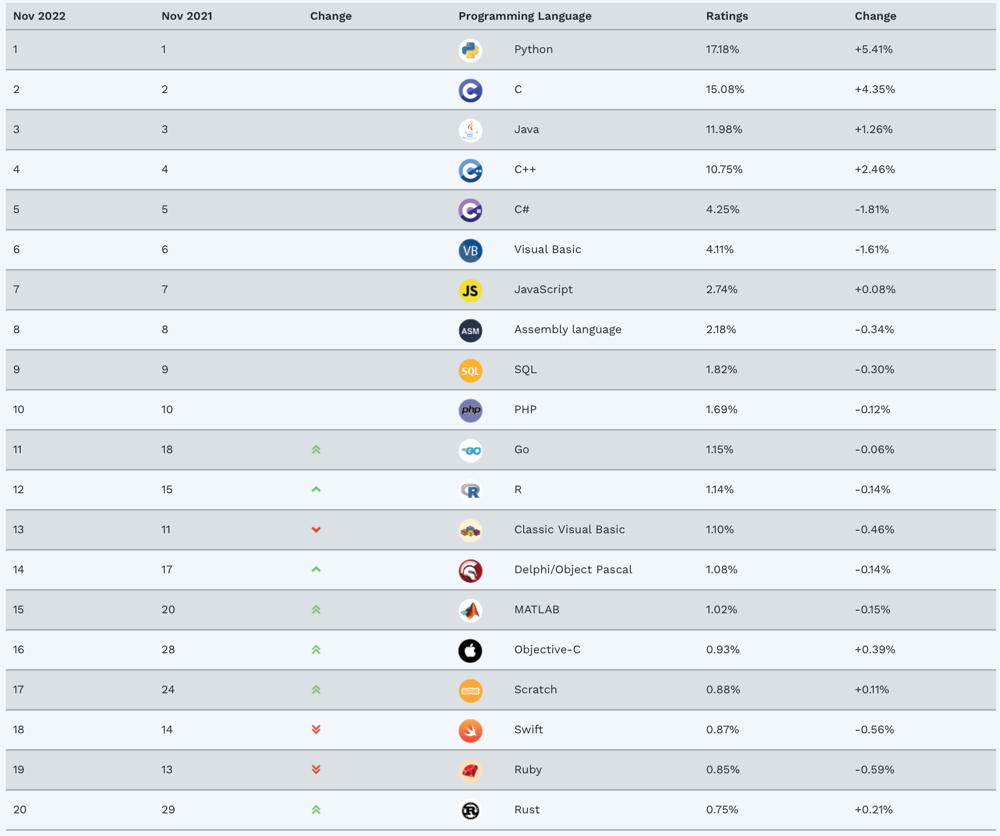
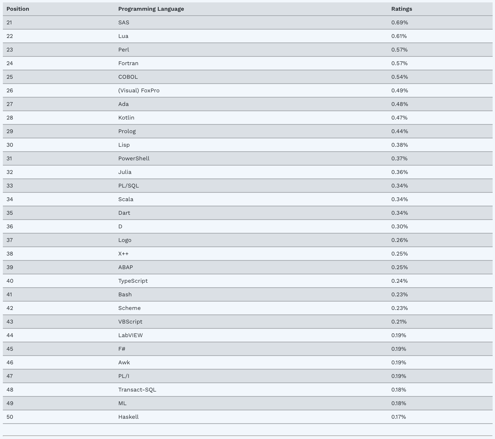
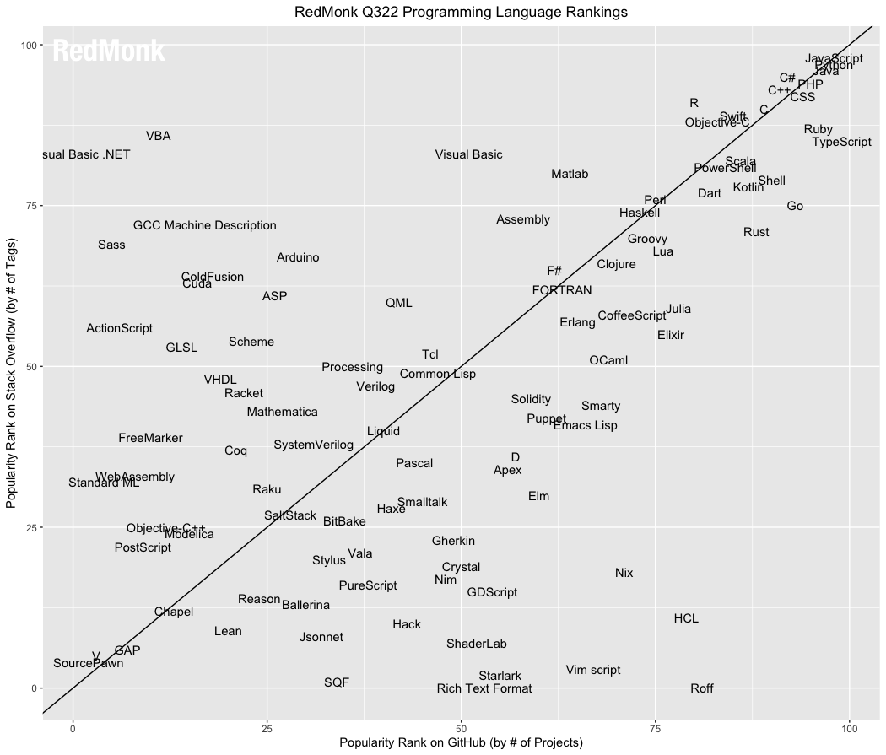
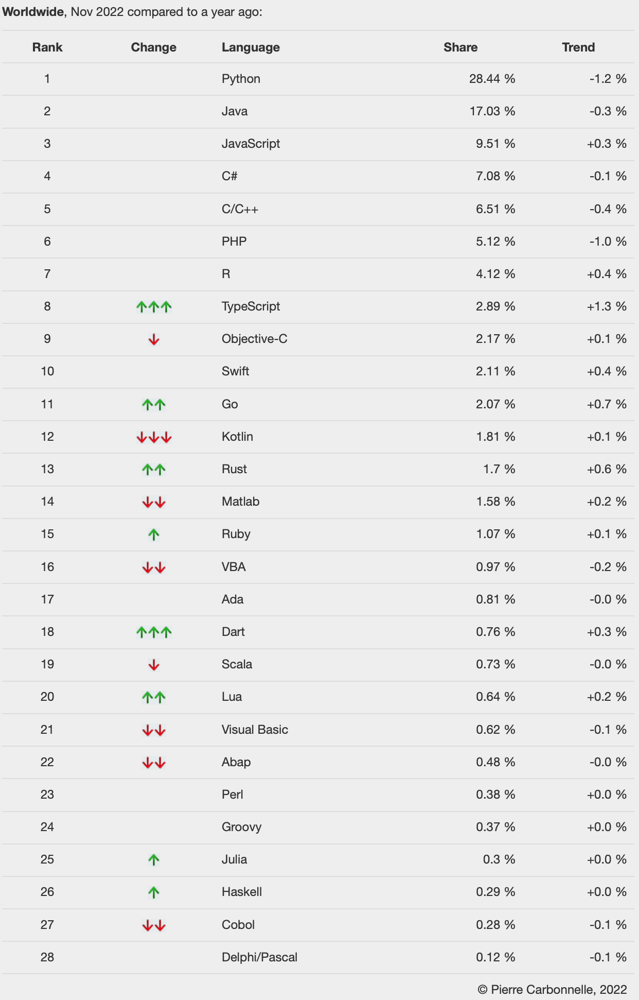
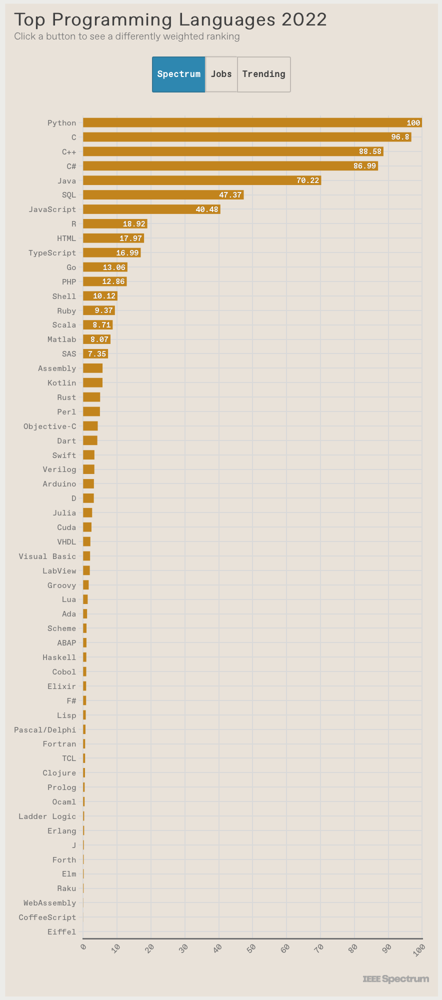
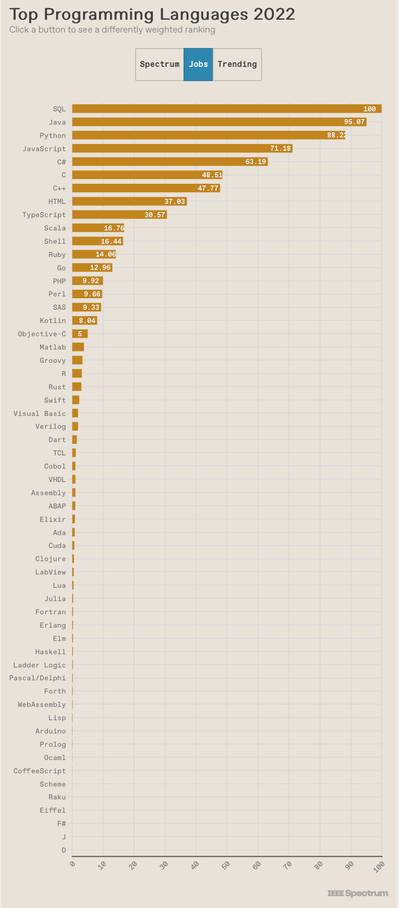
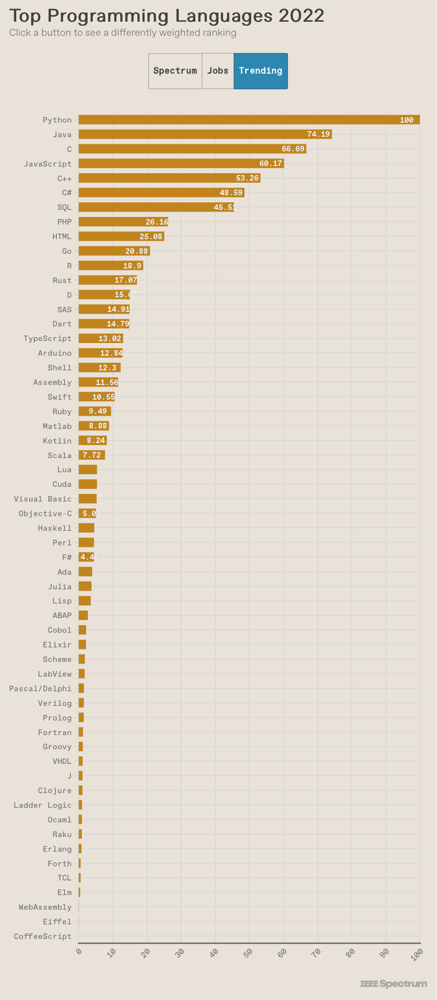

# Popularity of Programming Languages - 2022
<!-- tags: python, java, scala, golang, rust -->

## References

- [The state of Groovy and other JVM Languages](../2016/2016-05-14-the-state-of-groovy-and-other-jvm-languages.md)
- [Personal Techradar for Programming Languages - 2020 H2](../2020/2020-08-25-personal-tech-radar.md)

## Thoughts

This is a pretty useless post. But I like this topic. 😛  
Once per year I've been checking programming language popularity on different resources and trying to predict the future for myself.

I am interested in the following languages: Java, Scala, Python, JS, Typescript, Golang, Rust, Kotlin.

### Conclusion

1. **Python** is the most popular language
2. **Java** and **Javascript** are sharing 2nd and 3d places (depends on measuring approach)
3. **Typescript** is confidently climbing up
4. **Golang** is in plateau and I guess it defined its own niche
5. **Rust** and **Kotlin** are still climbing
6. **Scala** is stable low in a rating or even declining (depends on the rating)

## Ratings

Here you can check different ratings. I like to have such snapshots, because it will be interesting to check the status quo in the future.

### 1 - [Tiobe](https://www.tiobe.com/tiobe-index/) - November, 2022

### 2 - [The RedMonk Programming Language Rankings: June 2022](https://redmonk.com/sogrady/2022/10/20/language-rankings-6-22/)

> 1 JavaScript  
> 2 Python  
> 3 Java  
> 4 PHP  
> 5 C#  
> 6 CSS  
> 7 C++  
> 7 TypeScript  
> 9 Ruby  
> 10 C  
> 11 Swift  
> 12 R  
> 12 Objective-C  
> 14 Shell  
> 15 Scala  
> 15 Go  
> 17 PowerShell  
> 17 Kotlin  
> 19 Rust  
> 19 Dart  

### 3 - [PYPL PopularitY of Programming Language](https://pypl.github.io/PYPL.html)  - November, 2022

### 4 - [IEEE Spectrum - Top Programming Languages 2022](https://spectrum.ieee.org/top-programming-languages-2022)

Spectrum

Jobs

Trending

