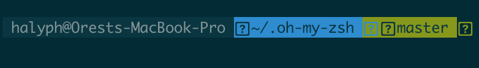
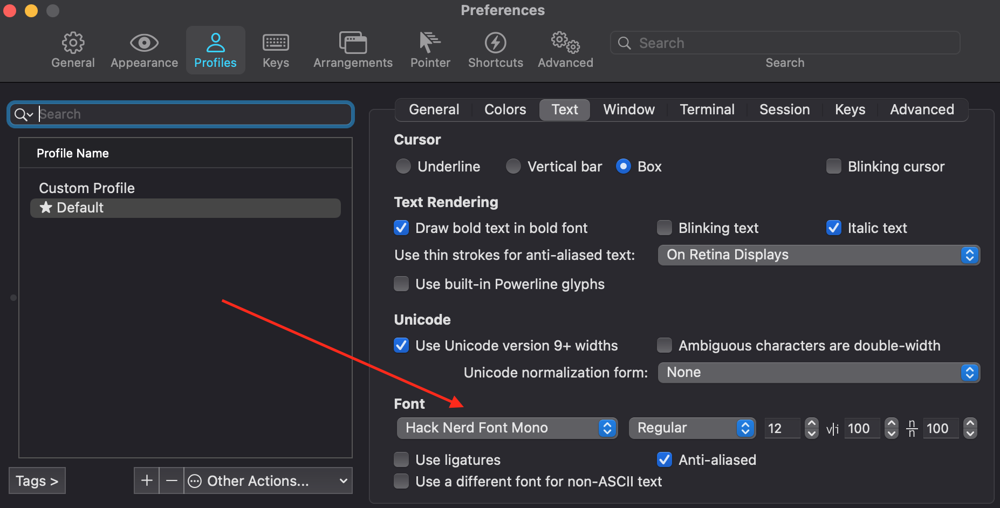
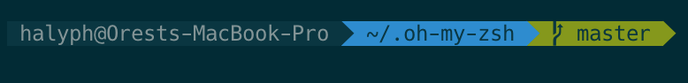
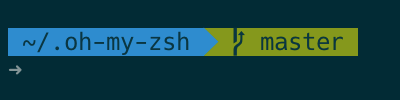
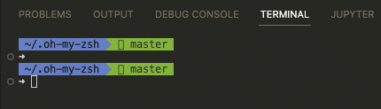
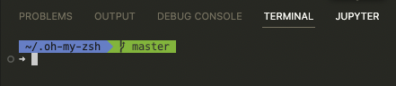

# ZSH on MacOS
<!-- tags: zsh, macos -->

- [References](#references)
- [Make ZSH a default shell on MacOS](#make-zsh-a-default-shell-on-macos)
- [Install Oh My Zsh](#install-oh-my-zsh)
- [Define `agnoster` theme](#define-agnoster-theme)
  - [Update iTerm2 font](#update-iterm2-font)
  - [Update a prompt](#update-a-prompt)
- [Update VSCode settings](#update-vscode-settings)

*Disclaimer*: This post doesn't have verbose "whys" only "hows"!

## References

- [Making ZSH default Shell in MacOSX](https://stackoverflow.com/questions/31034870/making-zsh-default-shell-in-macosx)
- [ohmyzsh/wiki](https://github.com/ohmyzsh/ohmyzsh/wiki)
- [Nerd Fonts](https://github.com/ryanoasis/nerd-fonts) is a project that patches developer targeted fonts with a high number of glyphs (icons)
- [How to set up an amazing terminal for data science with oh-my-zsh plugins](https://engineeringfordatascience.com/posts/configure_terminal_for_data_science_with_oh_my_zsh/)

## Make ZSH a default shell on MacOS

```shell
$ sudo chsh -s /bin/zsh
Changing shell for root.
```

and

```shell
$ chsh -s /bin/zsh
Changing shell for halyph.
```

Check version

```shell
$ zsh --version
zsh 5.8 (x86_64-apple-darwin20.0)
```

## Install Oh My Zsh

```shell
$ sh -c "$(curl -fsSL https://raw.githubusercontent.com/ohmyzsh/ohmyzsh/master/tools/install.sh)"
```

## Define `agnoster` theme

Open `.zshrc` and add the following line:

```txt
ZSH_THEME="agnoster"
```

Open [iTerm2](https://iterm2.com) and you will see this ugly prompt



### Update iTerm2 font

Install Nerd fonts (see more [here](https://github.com/ryanoasis/nerd-fonts#option-4-homebrew-fonts))
```shell
$ brew tap homebrew/cask-fonts
$ brew install --cask font-hack-nerd-font
```

Open iTerm2 and update profile settings



As you can see ugly `?` symbols have been disappeared.



### Update a prompt

The following changes must be added after `source $ZSH/oh-my-zsh.sh` line

- remove use name and laptop name

Add this line to `.zshrc`

```txt
DEFAULT_USER=$USER
```

- make PROMPT to occupy two lines and use `➜` symbol as the bigging of a prompt

Add this function to `.zshrc`

```shell
prompt_end() {
    echo -n " \e[m\n➜%"
}
```

So, now our prompt should look like this



## Update VSCode settings

Open VSCode terminal



These strange symbols can't be rendered properly that's why we should update related setting and adjust terminal's font:

select and open in VSCode *"Preferences: Open User Settings (JSON)"* and add the following line to `settings.json` file:

```json
"terminal.integrated.fontFamily": "Hack Nerd Font"
```

Now our VSCode termial looks much better


