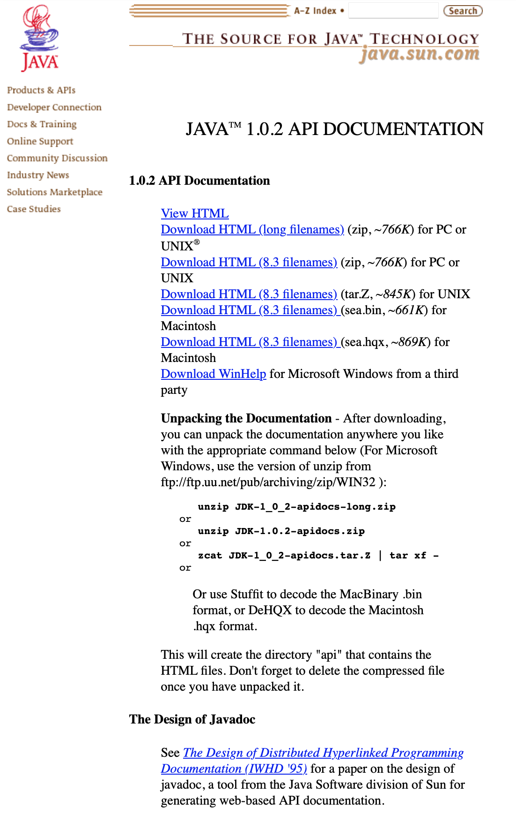
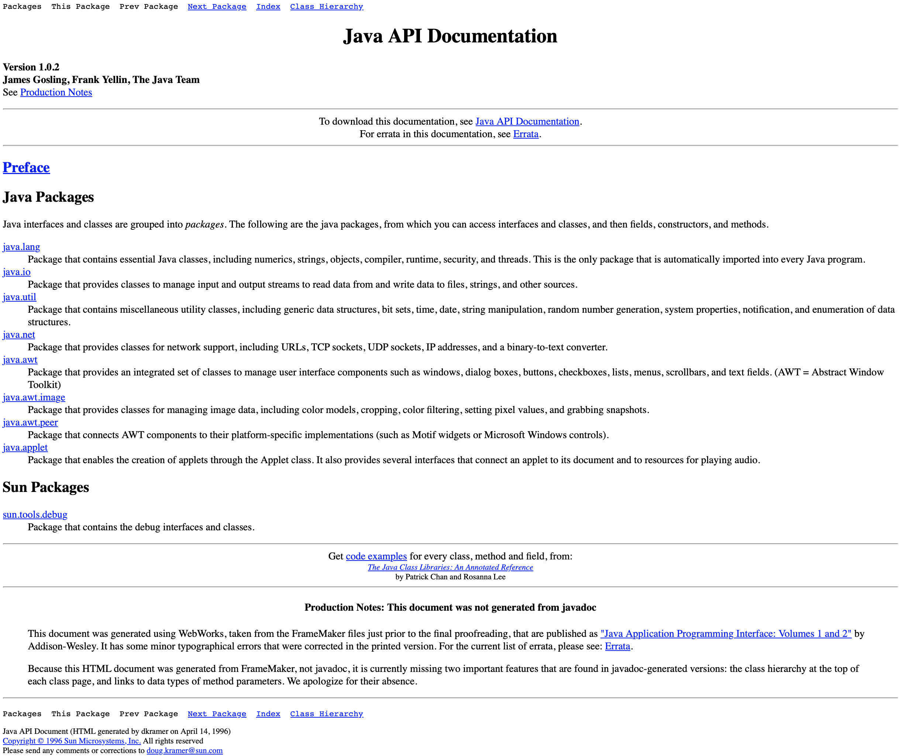
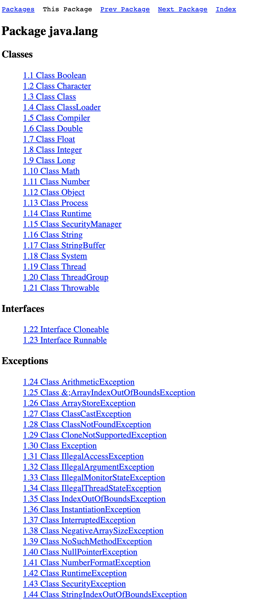
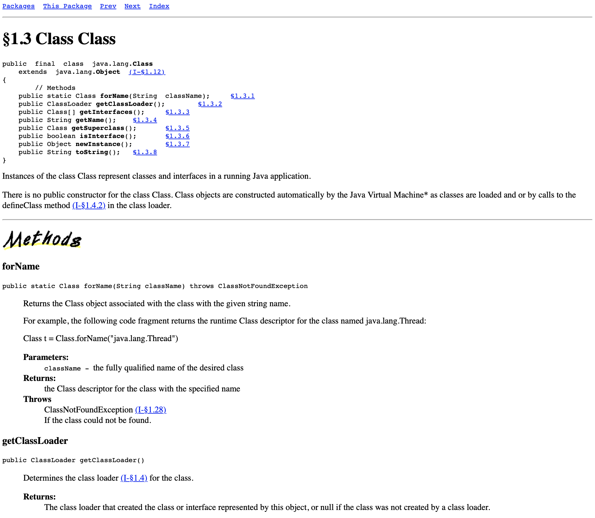
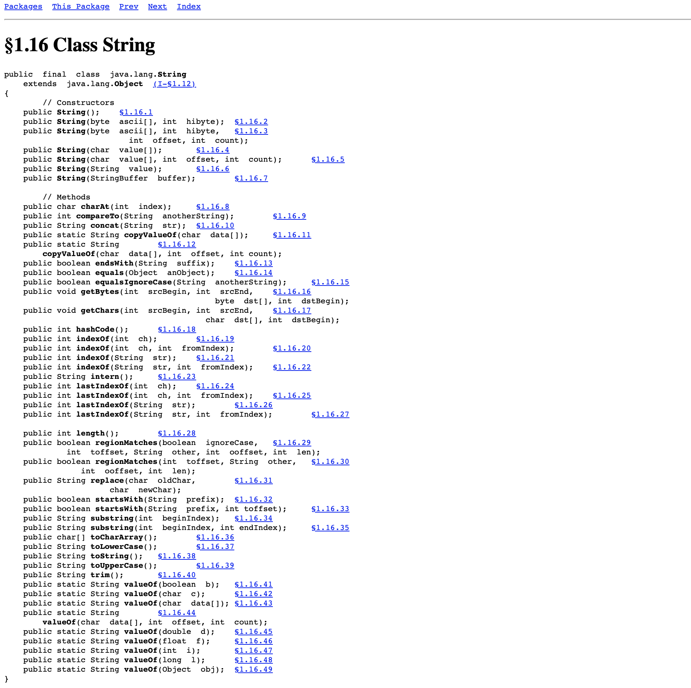
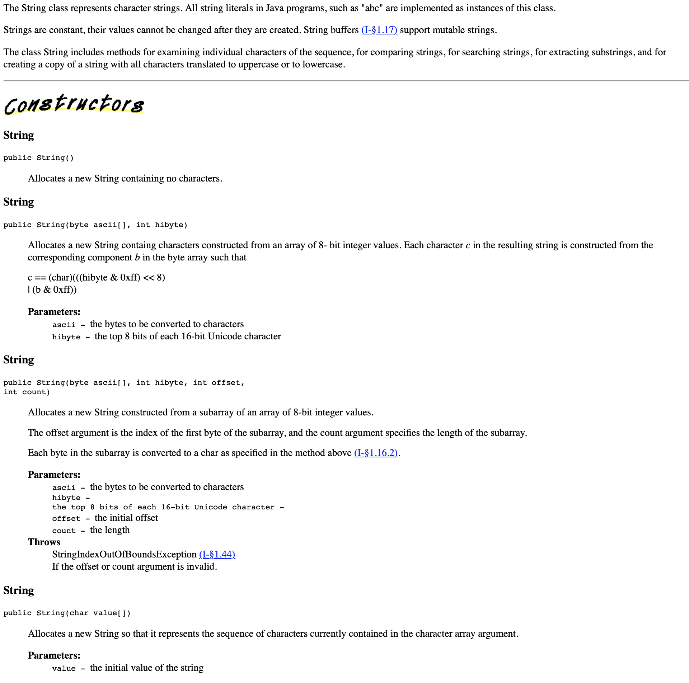
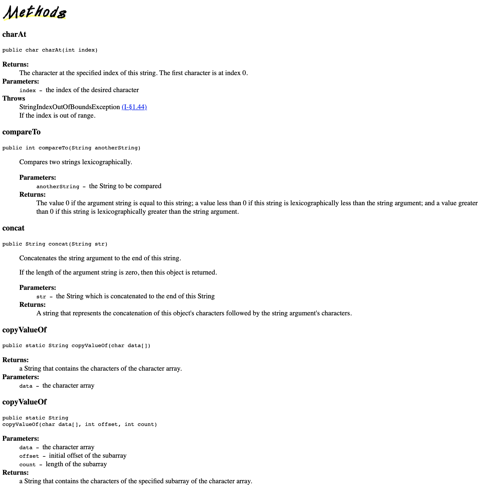

# First official Javadoc version
> | java |

## Overview

Recently I had a conversation with my colleague about how cool Go [`godoc`](https://pkg.go.dev/golang.org/x/tools/cmd/godoc) is.  
Especially the fact that documentation and related tooling has been built-in into the Go since the beginning.

Of cause Go is not unique here. Java had JavaDocs in the first SDK releases as well.
Unfortunately I've never checked JavaDocs pre Java version 1.4. That's why I've decided to snapshot old-fashion JavaDocs in this post.

> **JDK 1.0**
> 
> The first version was released on January 23, 1996. The first stable version, JDK 1.0.2, is called Java 1.
> This was the initial release and was originally called Oak. It had very unstable APIs and one java web browser named WebRunner.

## Java API Documentation version 1.0.2

## References

- [Wikipedia: Java version history](https://en.wikipedia.org/wiki/Java_version_history)
- [Wayback Machine: JAVA 1.0.2 API DOCUMENTATION](http://web.archive.org/web/20001019085101/http://java.sun.com/products/jdk/1.0.2/apidocs.html)
- [Java history from Java 1.0 to Java 18](https://medium.com/codex/java-history-from-1-0-to-java-18-d62f69b2a48a)
- [Where can I get a copy of JDK 1.0.2 JavaDocs?](https://stackoverflow.com/questions/2071575/where-can-i-get-a-copy-of-jdk-1-0-2-javadocs)
- [Reddit: Download of Java 1.0.2](https://www.reddit.com/r/java/comments/eqm3sh/download_of_java_102/)
- [The Oracle Java Archive](https://www.oracle.com/de/java/technologies/downloads/archive/)  offers self-service download access to some of our historical Java releases
- [JavaTM Platform 1.1.4 Core API](https://www.cs.princeton.edu/courses/archive/fall97/cs461/jdkdocs/api/packages.html)
- [Java API Documentation version 1.0.2](https://www.whitman.edu/mathematics/java_api/packages.html)
