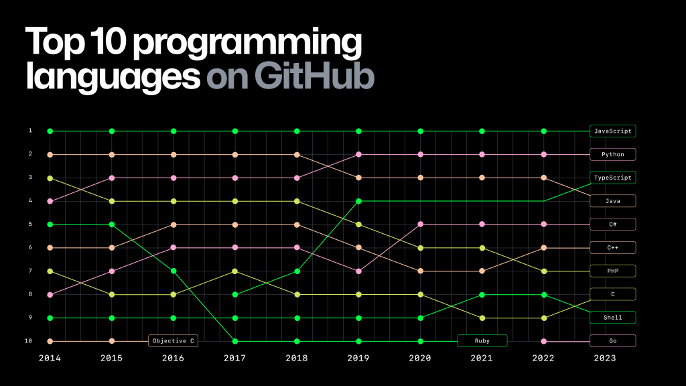
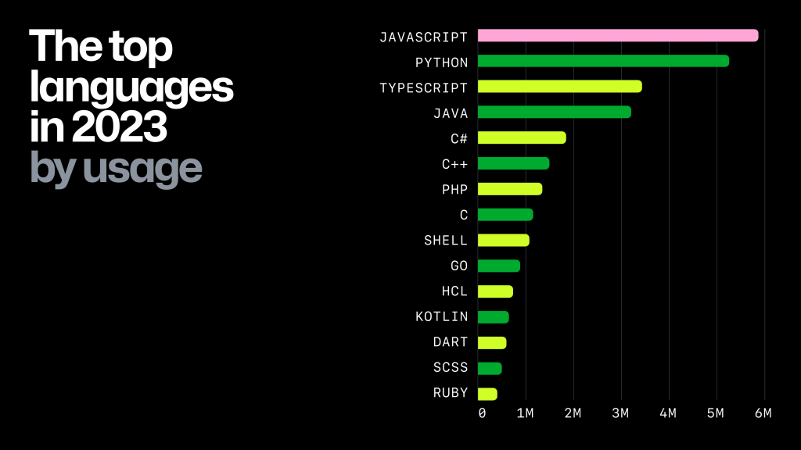
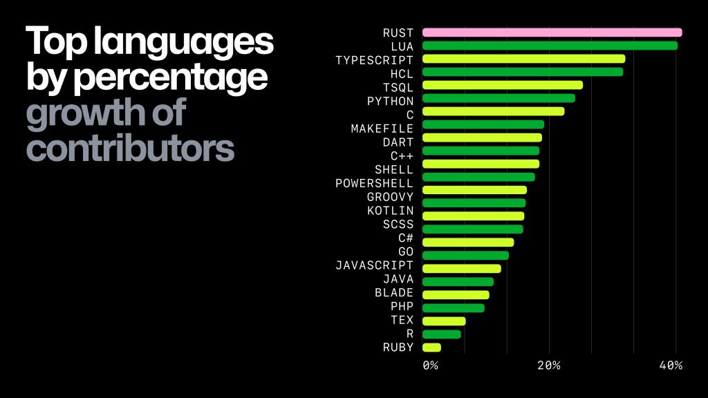

# Octoverse 2023: The most popular programming languages
<!-- tags: github -->

I decided to capture (for future me) the latest [Octoverse: The state of open source and rise of AI in 2023](https://github.blog/2023-11-08-the-state-of-open-source-and-ai/#the-most-popular-programming-languages) report.

I am interested only in "*The most popular programming languages*" section:

- **Javascript** remains the most popular language
- **Cloud-native development** grows with increase in Infrastructure as Code (IaC) languages and cloud-native platforms
- **Typescript** rises past Java to the 3rd biggest language

> In 2023, **Shell** and Hashicorp Configuration Language (**HCL**) once again emerged as top languages across open source projects, indicating that operations and IaC work are gaining prominence in the open source space.

> **JavaScript** has once again taken the crown for the #1 most popular language, and we continue to see familiar languages, such as **Python** and **Java**, remain in the top five languages year over year.

> This year, **TypeScript** overtook **Java** for the first time as the third most popular language across OSS projects on GitHub with 37% growth of its user base.

>Some notable outliers include **Kotlin**, **Rust**, **Go**, and **Lua**, which have seen larger growth across newer projects on GitHub.
