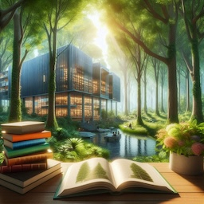

# Reflection on the Books reading
<!-- tags: book -->

I divide books into three formats: a) *paper*, b) *e-book*, and c) *audiobook*.
Each format has different impact on a reader and here I'm going to share my experience and what I decided to change.

## Book categories

Here are my major books' categories:

- **fun**: fiction, biography, history, IT history, cyber crimes
- **craft**: programming languages, software architecture, frameworks, math and so on.
- **self-improvement**: communication, management, psychology, time management, etc.

It is important to have them strictly defined, because it lets me stay focused and I **can't** read *more than one book* from *one* category.

## Audiobooks

I can't listen to any technical or complicated books. Typical candidates: *fiction*, *biography*, *business*, *self-improvement*. 
Let's say anything convenient for walking and listening.

I listened many (**39** in total) audiobooks from 2020 till 2023. At the beginning it was interesting, I was a "listening machine".
But I forgot everything, my brain "garbage collected" all content. I understood that it was/is a waste of money and time.
I can't listen and remember the stuff. It's just my "feature". 
That's why I stopped consuming audiobooks while walking, and completely switched to podcasts. Now I can occupy my brain while walking.

## E-books

E-book was my major format for reading (for years). But I always wanted to have a paper book in my hands.
I spent last two years on experimenting with e-books and paper books. And I read **fun** books only on Kindle.
I can read it anywhere anytime. I call this format "Netflix" books, i.e. I'm reading them instead of watching movie.

## Paper books

Nowadays I tend to read all "tough" **craft** books in paper format. It must be something fundamental, something what requires long time to comprehend, consume and burn in my brain.

Of course not all **craft** book I am reading in paper format. Some technical books can be outdated in 1-2 years and I don't want them to collect a dust on my shelves.

Also, if there are several books from **fun** and **self-improvement** category which I like and want to re-read I will buy them in paper format as well.

## How much can I read per year

I follow several bookworms on [Goodreads](https://www.goodreads.com). Some people read 50, 100, 120 books per year. It is super-natural for me.

Note: I don't like a speed-reading approach, not my thing.
In general I set 12 books per year as my goal. I.e. one book per month is doable. Right? :-) I successfully failed this goal for the past 10 years. Why? Because I didn't have a reading routine, habit.

This year, 2025, I've already read 12 books in 3 months. 
But there is big **BUT** - I read 90% **fun** and 10% **self-improvement**. No hard stuff, i.e. no **craft** books.

Reading **craft** books is a heavy brain work, it's big investment and dedication. For some books I spend days while reading several pages.
That's why I have three *categories*, so I can switch context and occupy my brain with something easy.

Now I am confident I can read one **fun** book per week, i.e. it can be ~45 books or a bit more per year. But definitely not 100 books. It's impossible without speed-reading technique or be super-natural.

## Summary

*Audiobooks* have no more place in my life. I can't consume information via listening, I am a visual dude.

## What's next

I’m now working on adding more craft books into the mix this year—slowly, mindfully. Let’s see how far I’ll get.
