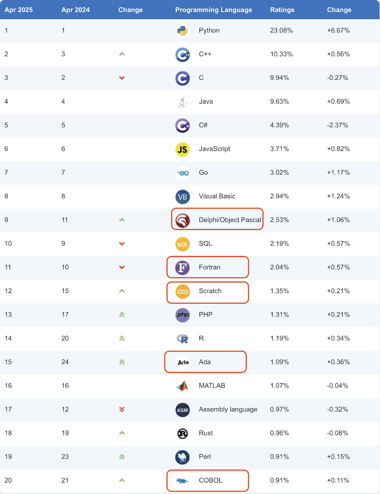
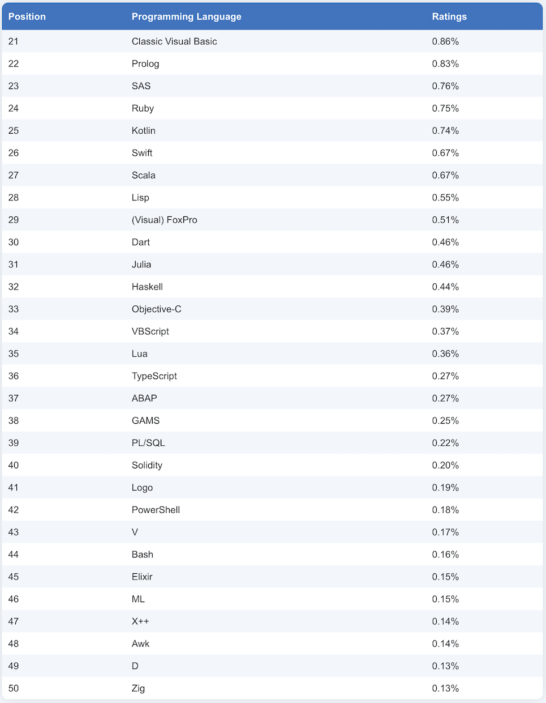

# TIOBE Index for April 2025 hit the floor
> | thoughts | 

I must capture a snapshot of this *awesome* **TIOBE Index for April 2025** before I start the rant.

>**April Headline: Former top 20 players Kotlin, Ruby and Swift have a hard time**
>
>The programming languages Kotlin, Ruby and Swift all held very stable top 20 positions in the TIOBE index until recently. But now they seem to have lost traction and are likely to go out of fashion. Kotlin and Swift have the same reason why they are declining. They are both mainly used for one particular mobile platform, Android and iOS, respectively, whereas there are other sufficiently good languages and frameworks to develop cross platform nowadays. Yes, Swift can be used for Android development but it is pretty difficult. And Kotlin on iOS never really took off. Ruby is another story. For many years Ruby has been competing with Python and Perl. While Perl was declining, Ruby stabilized. But now that Python has become the lingua franca in the programming world, there is not much room left for Ruby.
>
>Another interesting observation is that the programming language world is in a consolidation phase. The top 20 languages currently cover 83.56% of the total market. This is a very high number; it usually is around 75%. This means that the market is a bit defensive, preferring proven technology to trying out new technologies.

As you can see, the TIOBE Index for April 2025 is a little bit... *strange*.

Kotlin, Ruby, and Swift are supposedly having a "hard time," but Delphi, Fortran, Scratch, Ada, and Cobol are described as "stable" and even "growing." WTF?

I get that people might be using these older or niche languages for specific reasons, but I still can’t wrap my head around how they remain in the top 20.

Honestly, the TIOBE Index’s ranking methodology kind of sucks.

Did the person who published this ever stop and ask themselves: **"Does this even make any sense?"**

