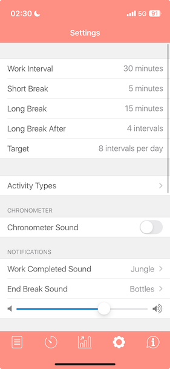

# How I use the Pomodoro technique in 2025
> | pomodoro |

I've been practicing the Pomodoro technique for over 15 years. I've tried many variations of it: 

- a) for work,
- b) for study, 
- c) mixed (work-study) mode.

Also I've tried many tools: 

- a) physical timers, 
- b) digital timers, 
- c) apps, 
- d) browser extensions, etc.

I've experimented with different tools for performance and productivity analysis as well.

Here I've collected my current setup and how I apply the Pomodoro technique in 2025. This may change in the future, but here's how I currently use it.

## Purpose

### Work

I don't use Pomodoro at **work**. My goal at work is to catch the flow and stay in it.  
Also I have different interruptions and meetings, so I can use it *only* within a limited time range, but it's not worth it, because it breaks the whole concept of Pomodoro. So what's the point?

### Study

I like tracking my "outside the work" time: 

- a) *study*, 
- b) *personal projects*, 
- c) *hobbies*, etc. 

I need to track this time and be productive in these areas. So I use Pomodoro for that.
This is critical for me, because I can spend time on some topic and then realize it's too much and then I must re-focus on something else, or allocate even more time to the current topic. So time tracking is critical for me.

## Planning

1. **Month**. I have list of topics for the month (10-12 items). Some topics are more important than others, so I prioritize them. Monthly planning is the most important part of my planning, because my biggest problem is switching focus.
2. **Week**. I also have a list of topics for the week. I try to keep it short and focused.   
It's flexible - I can make it strict based on my mood and goals. I am not dogmatic about it.
3. **Day**. I don't have a topic for the day, I have a "wish" for the day. I do as much as I can, but not more.

## Pomodoro duration

I've switched from 25 minutes to 30 minutes. Often I don't have a break after pomodoro, so I continue working - simply starting a new pomodoro.

## Tools

1. **Timer**. I use a simple timer app on my phone (it has settings for pomodoro duration, short and long breaks) or watch timer.  
 
2. **Tracking**. Piece of paper to track my pomodoros. At the end of *day* or *week* I transfer this data to my tracking Spreadsheet. I don't track interruptions. In case of interruptions I just stop the timer and continue when I can.  

3. **Spreadsheet**. Google Sheets and my custom template is the best tool for tracking pomodoros. It is flexible, simple to use and easy to spot trends. It's not ideal, but it works for me.

## Conclusion

1. **Simple** tools are the best.
2. Pomodoro is **not** a **dogma**. Life is too short to be rigid about it.
3. Start with **custom spreadsheet**. Eventually you will improve it, find similar app, implement own app or switch to paper.
4. A **consistent** number of pomodoros is a goal. If you are over productive this day/week/month - you will be less productive next time. So, better do less, but consistently.