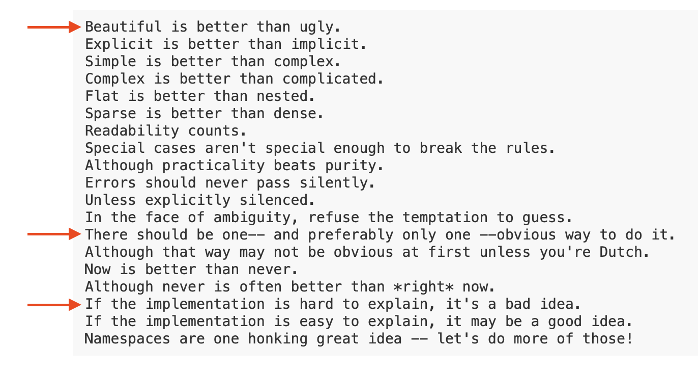
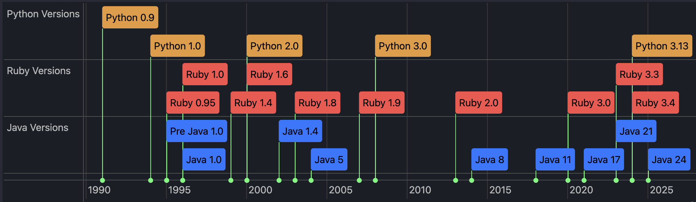
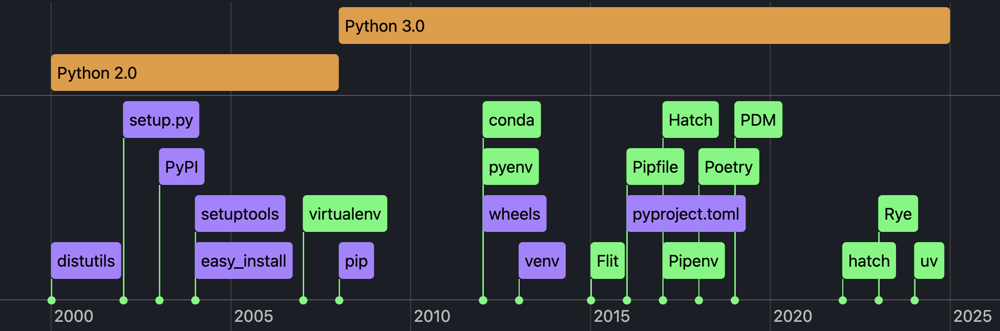

# Python project and package management madness and bright future (maybe)
> | python | thoughts |

## Disclaimer

This post is a follow-up to my previous post [Everybody Python, FTW?](../2024/2024-08-14-rant-python.md), because I  noticed a positive trend in Python's project/package management and must recognize it.   
Actually [**uv**](https://github.com/astral-sh/uv) is a reason of this post. One tool to rule them all. 

But not so fast. "Where is the rant?" you may ask.

## Preamble

[PEP 20 – The Zen of Python](https://peps.python.org/pep-0020/)

I guess this "Zen" is applied to Python language only and is not applicable to Python's ecosystem.

But *"There should be one-- and preferably only one --obvious way to do it"* statement always triggers me when I touch any Python project bigger than one script with several dependencies.

Python is old language with a lot of baggage. Is it a real excuse for the mess in Python's ecosystem? I don't think so.

*Note*: I added *Ruby* and *Java* to the picture below, because they are also old languages. But they have a clear and consistent package management system.

## Tools Madness 

Here is a list of features that Python's ecosystem should provide for a developer:

- Run scripts with dependencies (see `pipx`, `poetry`, `venv`)
- Manage Python executables (see `pyenv`)
- Manage packages/dependencies (see `pip`, `pipenv`, `poetry`)
- Manage isolated environments (see `venv`, `virtualenv`)
- Manage project metadata in `pyproject.toml` (see `poetry`)
- Build and publish packages to [PyPI](https://pypi.org) (see `setuptools`, `twine`, `flit`, `poetry`)

Unfortunately, there is (actually now we have several, I must add more drama here) no single tool that can do all of this.
And you must be a magician to use all of them together.

I like a typical Pythonista rant about Java: "But you must explain what is class even for simple application, public static void main and so on". And Python dev should spend a lot of time to understand who is who in Python's ecosystem.  

Remember *"There should be one and preferably only one obvious way to do it"* statement? Are you kidding me?

Here is a list of tools I found in the wild (I added only some of them which I know somehow) and their chronology. And this are only the most popular ones. There are a lot of other tools that are not listed here.

As you can see community is working hard to improve the situation. But it is still a mess. What is the difference between `pipenv` and `poetry`? Why do we need `pipx` if we have `venv`? `PDM`, "Pipfile", "Hatch" - what are they?  
BDSM in da house. Feel the pain and do Python.

## The Future

For me the future is here and it is called [`uv`](https://github.com/astral-sh/uv). `uv` is a single tool that can do all of the above. It is a package manager, environment manager, and script runner. It is a single tool that can do everything you need for Python development. And it's **fast**.

Some may say [`PDM`](https://github.com/pdm-project/pdm) can do the same. What about speed? Having really fast tool can trigger new way of thinking. You can use it for everything. You don't need Python to start using `uv`. 
`uv` bootstraps Python for you. 

The only thing that can bother some Python developers is that `uv` is implemented in Rust. But it is not a problem for me. Honestly, I don't care about the implementation language. I care about the functionality and performance.

## References

- Cool articles, tools overviews:
  - [Python has too many package managers](https://dublog.net/blog/so-many-python-package-managers/)
  - [An unbiased evaluation of environment management and packaging tools](https://alpopkes.com/posts/python/packaging_tools/)  
- [Video - Python project and package management — Mike Kittridge, Wellington Python Meetup - 17 Apr 2025](https://www.youtube.com/watch?v=uBqkAa8G9Bo)
- [Wikipedia - History of Python](https://en.wikipedia.org/wiki/History_of_Python)
- [Wikipedia - Ruby (programming language)](https://en.wikipedia.org/wiki/Ruby_(programming_language))
- [The Java Version Almanac](https://javaalmanac.io)
- [PyPA - Packaging History](https://www.pypa.io/en/latest/history/)
- [Python Packaging User Guide - PyPA Projects](https://packaging.python.org/en/latest/key_projects/#pypa-projects)
- [Packaging PEPs](https://peps.python.org/topic/packaging/)
