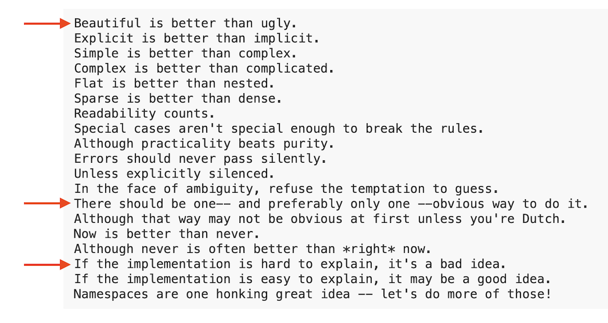
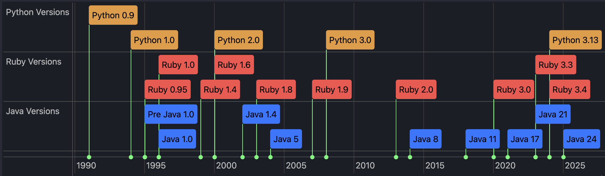
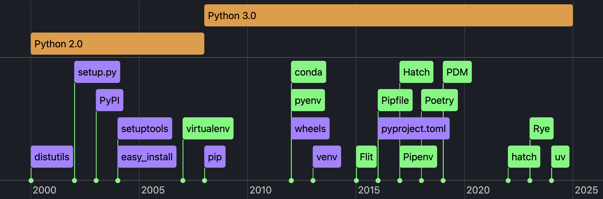

# One Python, Who-Knows-How-Many Toolchains, and a Dash of Hope
<!-- tags: python, thoughts -->

  
Image adapted from <a href="https://en.wikipedia.org/wiki/Flagellant">Flagellant</a>, used under <a href="https://creativecommons.org/licenses/by-sa/4.0/">CC BY-SA 4.0</a>.

## Disclaimer

This post is a follow-up to my previous post [Everybody Python, FTW?](../2024/2024-08-14-rant-python.md), because I noticed a positive trend in Python’s project/package management - and I have to give credit where it's due.
Actually, [**uv**](https://github.com/astral-sh/uv) is a reason of this post. *One tool to rule them all*. 

But not so fast - "Where is the rant?" you might ask.

## Preamble

[PEP 20 – The Zen of Python](https://peps.python.org/pep-0020/)

I guess this “Zen” applies only to the Python language, not its ecosystem.

But the line *"There should be one-- and preferably only one --obvious way to do it"* always triggers me when I touch any Python project bigger than a one-off script with a few dependencies.

Python is an old language with a lot of baggage. Is that an excuse for the mess in its ecosystem? I don’t think so.

*Note*: I added *Ruby* and *Java* to the picture above, since they’re also old languages - but they have clear and consistent package management systems.
## Tools Madness 

Here’s a list of features Python’s ecosystem should provide for developers:

- Run scripts with dependencies (see `poetry`, `venv`)
- Manage Python executables (see `pyenv`)
- Manage packages/dependencies (see `pip`, `pipenv`, `poetry`)
- Manage isolated environments (see `venv`, `virtualenv`)
- Manage project metadata in `pyproject.toml` (see `poetry`)
- Build and publish packages to [PyPI](https://pypi.org) (see `setuptools`, `twine`, `flit`, `poetry`)

Unfortunately (and yes, here comes the drama) there still isn’t a single tool that can do all of this.
And you practically need to be a magician to make them all work together.

Pythonistas love to rant about Java: “You have to explain what a class is, even for a simple app - public static void main and all that.”
But in Python, you’ll spend just as much time trying to understand who’s who in the package management zoo.

Remember that *"There should be one and preferably only one obvious way to do it"* line? Are you kidding me?

Here’s a list of popular tools I’ve encountered in the wild and their timeline. These are just the most visible ones - many others didn’t even make the cut.

As you can see, the community is working hard to improve the situation. But it’s still a mess. What’s the difference between `pipenv` and `poetry`? Why do we need `pipx` if we have `venv`? `PDM`, `Pipfile`, `Hatch` - what are they?

BDSM in da house. Feel the pain and do Python.

## The Future

For me the future is here and it is called [`uv`](https://github.com/astral-sh/uv). `uv` is a package manager, environment manager, and script runner — all in one. It does everything you need for Python development. And it's **fast**.

Some may say [`PDM`](https://github.com/pdm-project/pdm) can do the same - but what about speed? A fast tool can change how you think. You can use `uv` for everything.
You don’t even need Python installed to start using it - `uv` bootstraps Python for you.

Some Python developers might object that `uv` is implemented in Rust — but honestly, I don’t care what language it’s written in. I care about functionality and performance.

## What’s Next?

I might dive deeper into using `uv` in a future post - what it can do, what surprised me, and whether it lives up to the hype. No promises, but stay tuned.

## References

- **Video** [Python project and package management — Mike Kittridge, Wellington Python Meetup - 17 Apr 2025](https://www.youtube.com/watch?v=uBqkAa8G9Bo)
- Python package managers overviews:
  - [Python has too many package managers](https://dublog.net/blog/so-many-python-package-managers/)
  - [An unbiased evaluation of environment management and packaging tools](https://alpopkes.com/posts/python/packaging_tools/)  
- History:
  - [Wikipedia - History of Python](https://en.wikipedia.org/wiki/History_of_Python)
  - [Wikipedia - Ruby (programming language)](https://en.wikipedia.org/wiki/Ruby_(programming_language))
  - [The Java Version Almanac](https://javaalmanac.io)
- Python docs
  - [PyPA - Packaging History](https://www.pypa.io/en/latest/history/)
  - [Python Packaging User Guide - PyPA Projects](https://packaging.python.org/en/latest/key_projects/#pypa-projects)
  - [Packaging PEPs](https://peps.python.org/topic/packaging/)
