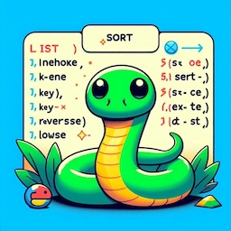

# Schwartzian transform: Python’s Secret Sorting Sauce
> | python |



If you’ve ever wondered why Python says "key" while Java says "comparator" — you’re in good company.

## TL;DR

- **Python** uses key-based sorting (DSU Pattern - Decorate-Sort-Undecorate) for efficiency.
- **Java**/**Go** use comparator-based sorting, re-evaluating comparisons.
- **Python** originally used `cmp`, but switched to `key` in v.2.4 (thanks to Raymond Hettinger).
- Using `key` avoids redundant computation and enables clean idioms.

This post digs into why Python made that choice—and what it means in practice.

## Problem Description

Let’s sort a list of integers, reversing their digits first:

### Python

```python
print(sorted([23, 56, 41], key=lambda x: int(str(x)[::-1])))
```

### Java

```java
import java.util.*;

public class ReverseSort {
    public static void main(String[] args) {
        List<Integer> numbers = Arrays.asList(23, 56, 41);

        numbers.sort(Comparator.comparingInt(n -> Integer.parseInt(new StringBuilder(n.toString()).reverse().toString())));

        System.out.println(numbers);
    }
}
```

### Go
```go
package main

import (
	"fmt"
	"sort"
	"strconv"
)

func reverseInt(n int) int {
	s := strconv.Itoa(n)
	runes := []rune(s)
	for i, j := 0, len(runes)-1; i < j; i, j = i+1, j-1 {
		runes[i], runes[j] = runes[j], runes[i]
	}
	reversed, _ := strconv.Atoi(string(runes))
	return reversed
}

func main() {
	numbers := []int{23, 56, 41}

	sort.Slice(numbers, func(i, j int) bool {
		return reverseInt(numbers[i]) < reverseInt(numbers[j])
	})

	fmt.Println(numbers)
}
```

All three implementations produce:

```
[41, 23, 56]
```

The Python version is the most concise. But here’s what caught my eye:

**Java** and **Go** use *comparators* — functions that compare two elements.  
**Python**, on the other hand, uses a *key* function, which transforms each element before sorting.

That triggered my inner **language archaeologist**: Why? Who decided this? When? You know the drill.

## Python sorting interface design 

### How Python's `sort()` and `sorted()` Work

Python sorting relies on the DSU pattern (Decorate–Sort–Undecorate):

1. [**D**]ecorate the input with values that determine sort order.
2. [**S**]ort the decorated items.
3. [**U**]ndecorate to retrieve the original items in sorted order.

*From the Python doccumentation:*
> This idiom is called [Decorate-Sort-Undecorate][Decorate-Sort-Undecorate] after its three steps (see also [Schwartzian transform][Schwartzian_transform]):
> 
> - First, the initial list is decorated with new values that control the sort order.
> - Second, the decorated list is sorted.
> - Finally, the decorations are removed, creating a list that contains only the initial values in the new order.

### Why Use Key Functions?

- Key functions transform each item once, before sorting.
- The sort algorithm uses only the precomputed keys, avoiding repeated computation.
- Since keys are computed beforehand, the key function takes only one argument: the element being processed.


## Historical Detour: cmp → key

Python didn’t always use `key`.  
Originally, it used a `cmp` function like **Java**/**Go**. But it had performance and code clarity downsides.

Then *Raymond Hettinger* introduced the `key`, `cmp`, and `reverse` parameters to the `sort()` method in Python 2.4 (see more in [Appendix A - Historical details](#appendix-a---historical-details)).

This made DSU (Decorate-Sort-Undecorate) idioms first-class and helped keep Python code clean and efficient.

## Summary

- **Pairwise Comparators** (e.g., Java):
  - Require no extra memory to store transformed keys
  - However, the transformation or comparison logic may be repeatedly computed for every pair during sorting, leading to potentially higher computational costs
- **Python Key Function**:
  - Uses more memory to store the transformed keys
  - Reduces computational overhead by avoiding repeated calculations

In memory-constrained scenarios, comparator-based sorting might be preferable. But in most real-world cases, Python's `key` function leads to **faster, cleaner, and more readable code**.

## References

- [Wikipedia: Schwartzian transform][Schwartzian_transform]
- [Python HOWTOs: Sorting Techniques - Decorate-Sort-Undecorate][Decorate-Sort-Undecorate]
- [The Python Standard Library: `functools.cmp_to_key`](https://docs.python.org/3/library/functools.html#functools.cmp_to_key)
- [What’s New in Python 2.4: Other Language Changes][what-new-2-4]
- [CPython: `listsort.txt`](https://github.com/python/cpython/blob/a32ea456992fedfc9ce61561c88056de3c18cffd/Objects/listsort.txt)
- [CPython: `cpython/Objects/listobject.c#list_sort_impl`](https://github.com/python/cpython/blob/2fd09b011031f3c00c342b44e02e2817010e507c/Objects/listobject.c#L2899)

[Schwartzian_transform]: https://en.wikipedia.org/wiki/Schwartzian_transform
[Decorate-Sort-Undecorate]: https://docs.python.org/3/howto/sorting.html#decorate-sort-undecorate
[what-new-2-4]: https://docs.python.org/3/whatsnew/2.4.html#other-language-changes

## Appendix A - Historical details

Before Python v2.4, the `sort()` method used an optional [`cmpfunc`](https://docs.python.org/2.3/lib/typesseq-mutable.html) argument (from the Python v2.3 Library Reference):

> The `sort()` method takes an optional argument specifying a comparison function of two arguments (list items) which should return a negative, zero or positive number depending on whether the first argument is considered smaller than, equal to, or larger than the second argument. Note that this slows the sorting process down considerably; for example to sort a list in reverse order it is much faster to call `sort()` followed by `reverse()` than to use `sort()` with a comparison function that reverses the ordering of the elements. Passing None as the comparison function is semantically equivalent to calling `sort()` with no comparison function. Changed in version 2.3: Support for `None` as an equivalent to omitting cmpfunc was added.
> 
> As an example of using the `cmpfunc` argument to the `sort()` method, consider sorting a list of sequences by the second element of that list:
> 
> ```python
> def mycmp(a, b):
>     return cmp(a[1], b[1])
> 
> mylist.sort(mycmp)
> ```
> 
> A more time-efficient approach for reasonably-sized data structures can often be used:
> 
> ```python
> tmplist = [(x[1], x) for x in mylist]
> tmplist.sort()
> mylist = [x for (key, x) in tmplist]
> ```

Later, *Raymond Hettinger* introduced the `key`, `cmp`, and `reverse` parameters to the `sort()` method (Python 2.4). See:

### [What’s New in Python 2.4: Other Language Changes][what-new-2-4]

> Three keyword parameters, *cmp*, *key*, and *reverse*, were added to the `sort()` method of lists. These parameters make some common usages of `sort()` simpler. All of these parameters are optional.
> 
> For the *cmp* parameter, the value should be a comparison function that takes two parameters and returns -1, 0, or +1 depending on how the parameters compare. This function will then be used to sort the list. Previously this was the only parameter that could be provided to `sort()`.
> 
> *key* should be a single-parameter function that takes a list element and returns a comparison key for the element. The list is then sorted using the comparison keys. The following example sorts a list case-insensitively:
> 
> ```python
> >>> L = ['A', 'b', 'c', 'D']
> >>> L.sort()                 # Case-sensitive sort
> >>> L
> ['A', 'D', 'b', 'c']
> >>> # Using 'key' parameter to sort list
> >>> L.sort(key=lambda x: x.lower())
> >>> L
> ['A', 'b', 'c', 'D']
> >>> # Old-fashioned way
> >>> L.sort(cmp=lambda x,y: cmp(x.lower(), y.lower()))
> >>> L
> ['A', 'b', 'c', 'D']
> ```
> 
> The last example, which uses the *cmp* parameter, is the old way to perform a case-insensitive sort. It works but is slower than using a *key* parameter. Using *key* calls `lower()` method once for each element in the list while using *cmp* will call it twice for each comparison, so using *key* saves on invocations of the `lower()` method.
> 
> For simple key functions and comparison functions, it is often possible to avoid a [`lambda`](https://docs.python.org/3/reference/expressions.html#lambda) expression by using an unbound method instead. For example, the above case-insensitive sort is best written as:
> 
> ```python
> >>> L.sort(key=str.lower)
> >>> L
> ['A', 'b', 'c', 'D']
> ```
> 
> Finally, the *reverse* parameter takes a Boolean value. If the value is true, the list will be sorted into reverse order. Instead of `L.sort(); L.reverse()`, you can now write `L.sort(reverse=True)`.
> 
> The results of sorting are now guaranteed to be stable. This means that two entries with equal keys will be returned in the same order as they were input. For example, you can sort a list of people by name, and then sort the list by age, resulting in a list sorted by age where people with the same age are in name-sorted order.
> 
> - There is a new built-in function `sorted(iterable)` that works like the in-place [`list.sort()`](https://docs.python.org/3/library/stdtypes.html#list.sort "list.sort") method but can be used in expressions.

See also:

- [Migrated GH issue: Optional list.sort() args for DSU pattern and reverse #39406](https://github.com/python/cpython/issues/39406)
- [Original issue in Python Bug Tracker](https://bugs.python.org/issue823292)