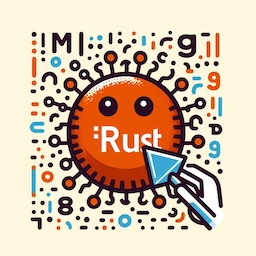

# Microsoft Gets Rusty: Thoughts on Rust Adoption and C/C++ Departure
<!-- tags: rust, thoughts, video -->

Today, I **watched** a video titled ["Microsoft is Getting Rusty: A Review of Successes and Challenges"](https://www.youtube.com/watch?v=1VgptLwP588) by [Mark Russinovich](https://en.wikipedia.org/wiki/Mark_Russinovich) (uploaded 2025-02-26).

It triggered some thoughts about the adoption of Rust at Microsoft, Big Tech, side stepping from C/C++, and avoiding the corporate "not invented here" (NIH) syndrome (speaking about programming language).

First, I highly recommend watching the video, it's worth the time. 

Key points from the video summarized in [Mark Russinovich](https://en.wikipedia.org/wiki/Mark_Russinovich) tweet (written on September 19, 2022): 

> "Speaking of languages, it's time to halt starting any new projects in C/C++ and use **Rust** for those scenarios where a **non-garbage-collected (GC) language** is required. For the sake of security and reliability. the industry should declare those languages as deprecated."

**Microsoft**:

- is using Rust in production
- donated [$1M to Fund Key Rust Foundation & Project Priorities](https://rustfoundation.org/media/1m-microsoft-donation-to-fund-key-rust-foundation-project-priorities/)
- is hiring Rust developers
- open-sourced several Rust projects (see below)
- gradually moving from C/C++ to Rust

**Mark Russinovich** said at the end: 

- **Community**: *"The Rust community is what makes a language popular."*
- **Rust is Mature Enough**: *"We're over 10 years into Rust, and you know, we're finally ready - because it takes a long time for a language to mature, for the tooling to mature - and we're not even completely done with maturing the Rust toolchain."*
- **High Bar for New Languages**: *"Anybody that wants to come along at this point and disrupt something that's already as good as Rust has a very high hill to climb. So I don't see anything replacing Rust anytime soon."*

It’s impressive to see how open-minded Microsoft has become in recent years. Instead of investing in an incremental improvement like [Carbon](https://en.wikipedia.org/wiki/Carbon_(programming_language)), they are embracing a community-driven language and actively migrating core projects to Rust.

Time will tell how this strategy unfolds, but the direction is certainly worth watching.

## Open Source Projects

*Mentioned in the video*

- [openvmm](https://github.com/microsoft/openvmm) OpenVMM is a modular, cross-platform Virtual Machine Monitor (VMM)
- [hyperlight](https://github.com/hyperlight-dev/hyperlight) Hyperlight is a lightweight Virtual Machine Manager (VMM) designed to be embedded within applications
- [rustls-symcrypt](https://github.com/microsoft/rustls-symcrypt) symcrypt crypto provider for rustls
- [azure-sdk-for-rust](https://github.com/Azure/azure-sdk-for-rust) Azure SDK for Rust
- [drasi-platform](https://github.com/drasi-project/drasi-platform) The Data Change Processing platform
