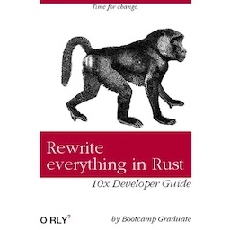

# The State of "Let's Rewrite It in Rust"
> | rust |

By now, you've probably seen the meme or heard the mantra: *"Let's rewrite it in Rust"*.
It gained traction around 2018-2020, when major players like [**Dropbox**](https://dropbox.tech/infrastructure/rewriting-the-heart-of-our-sync-engine), [**Cloudflare**](https://blog.cloudflare.com/html-parsing-1/), [**Discord**](https://discord.com/blog/why-discord-is-switching-from-go-to-rust) and [**Microsoft**](2025-06-04-ms-rusty.md) began experimenting with Rust for performance-critical parts of their systems.

This post was triggered by a shift in the Python community and a new trend: writing Python extensions and tooling in Rust instead of C. That made me curious - what other rewrites are happening that might be *interesting* to me?

## Python Ecosystem

Let's start with the obvious candidates:

- **Astral** and their new tools:
  - [**ruff**](https://github.com/astral-sh/ruff) - Python linter and code formatter
  - [**uv**](https://github.com/astral-sh/uv) - Python package and project manager
  - [**ty**](https://github.com/astral-sh/ty) - Python type checker and language server
  - **r**uff, **u**v, \_ , **t**y - their next tool/lib name will be started with "s", it's my guess 😉.
- [**pyrefly**](https://github.com/facebook/pyrefly) - Meta (aka Facebook) Python type checker. They have older [pyre](https://github.com/facebook/pyre-check) type checker written in OCaml
- [**PyO3**](https://github.com/PyO3/pyo3) - Framework for writing Python extensions in Rust
- [**maturin**](https://github.com/PyO3/maturin) - Tool for building and publishing Rust-based Python packages
- [**Polars**](https://github.com/pola-rs/polars) - Blazing-fast DataFrame library with Python bindings 
- [**pydantic-core**](https://github.com/pydantic/pydantic-core) - core validation logic for [pydantic](https://github.com/pydantic/pydantic)
- [**tiktoken**](https://github.com/openai/tiktoken) - fast [BPE](https://en.wikipedia.org/wiki/Byte_pair_encoding) tokeniser for use with OpenAI's models

I'm only mentioning tools and libraries that pop up frequently on Hacker News and Reddit.

Completely switching from Python to Rust would be tough in any large company (and arguably unnecessary), but writing Python extensions in Rust? That seems not only doable, but increasingly common.

## Rewrites / Ports

Here are some interesting projects that have been ported or rewritten in Rust (*not including tools originally implemented in Rust from scratch, like [Deno](https://github.com/denoland/deno)*).

### 1. Fish

[**fish-shell**](https://github.com/fish-shell/fish-shell) is a smart and user-friendly command line shell for Linux, macOS, and the rest of the family.

References

- [fish 4.0b1 (released December 17, 2024)](https://github.com/fish-shell/fish-shell/releases/tag/4.0b1)
- [GH - Rewrite it in Rust](https://github.com/fish-shell/fish-shell/pull/9512)

#### Why Rust for Fish?

> Because it seems to be up to the task, because we have people who know it on the team, because it has momentum and because it promises to help us with the threading problem.
> 
> - Nobody really likes C++ or CMake, and there's no clear path for getting off old toolchains. Every year the pain will get worse.
> - C++ is becoming a legacy language and finding contributors in the future will become difficult, while Rust has an active and growing community.
> - Rust is what we need to turn on concurrent function execution.
> - Being written in Rust will help fish continue to be perceived as modern and relevant.

### 2. asciinema

[**asciinema**](https://github.com/asciinema/asciinema) is a free and open source solution for recording terminal sessions and sharing them on the web.

**Timeline of Rewrites**

| Version       | Language     | Notes                                               |
| ------------- | ------------ | --------------------------------------------------- |
| 0.1 - 0.9.8   | Python       | Original implementation, improved over time         |
| 0.9.9 - 1.2.0 | Go           | First rewrite, performance-oriented                 |
| 1.3.0+        | Python again | Rebased on Python with Go features reintroduced     |
| 3.0.0 (WIP)   | Rust         | Latest rewrite for modern performance & reliability |

#### From Go back to Python: v1.3.0

See: [“And Now for Something Completely Different”, 2016](https://blog.asciinema.org/post/and-now-for-something-completely-different/)

> Wait, what? Back to Python? Yes, asciinema 1.3 brings back the original Python implementation of asciinema. It’s based on 0.9.8 codebase and adds all features and bug fixes that have been implemented in asciinema’s Go version between 0.9.8 and 1.2.0. We’ll keep the Go implementation in golang branch, it won’t be maintained though.
> 
> While Go definitely has its strengths (easy concurrency, runtime speed, startup speed, stand-alone binary), this project didn’t really benefit from any of these (and suffered from Go’s pain points). Here is a (not exhaustive) list of things that contributed to the decision of dropping Go for Python:  
> 
>- No need for concurrency or high speed here.
>- Python is high level language while Go is lower level language (I think it’s fair to say it’s C 2.0). 95% of asciinema codebase is high level code and there’s basically a single file containing system calls like select/signal/ioctl/fork.
>- Build problems: pty/terminal related Go libs don’t support as many [architectures](https://github.com/asciinema/asciinema/issues/134) and [operating systems](https://github.com/asciinema/asciinema/issues/144) while Python runs basically on every UNIX-like system.
>- Go’s lack of versioned packages and central repository makes packaging cumbersome. For example, some distro packaging rules don’t like straight-from-github-master dependencies (understandable!) while at the same time they don’t like vendored (bundled) dependencies (also understandable) ([Gentoo example](https://bugs.gentoo.org/show_bug.cgi?id=532918)).
>- Batteries included: argparse, pty, locale, configparser, json, uuid, http. All of these excellent modules are used by asciinema and are part of Python’s standard library. Python stdlib’s quality and stability guarantees are order of magnitude higher than of unversioned Go libs from Github (I believe discrete releases ensure higher quality and more stability).
>- The less external dependencies the easier the job for native package maintainers - as of this moment we have zero external dependencies!
>- Casting int32 to int64 to… gets old fast.
>- `if err != nil {` gets old even faster.

#### From Python to Rust: v3.0.0

See: [“4x smaller, 50x faster”, 2021](https://blog.asciinema.org/post/smaller-faster/)

> At first I planned to implement the terminal emulation part in Rust without any optimizations, just write idiomatic Rust code, then revisit the tricks from the old implementation. The initial benchmarks blew my mind though, showing that spending additional time on optimizing the emulation part is absolutely unnecessary.

Honestly, I wouldn’t be surprised if **asciinema** gets rewritten again. The author seems to genuinely enjoy the process.

### 3. CRuby

References

- [Shopify: Our Experience Porting the YJIT Ruby Compiler to Rust, 2022](https://shopify.engineering/porting-yjit-ruby-compiler-to-rust)
- Youtube [Fitting Rust YJIT into CRuby by Alan Wu, 2023](https://www.youtube.com/watch?v=GI7vvAgP_Qs)
	- https://www.youtube.com/results?search_query=YJIT+Rust

#### TL;DR

- Initial version of Ruby YJIT was implemented in C
- Then ported to Rust

#### Why port YJIT from C to Rust?

> Last year, my team at Shopify implemented [YJIT, a new Just-In-Time (JIT) compiler for CRuby](https://shopify.engineering/yjit-just-in-time-compiler-cruby), which was recently [upstreamed as part of Ruby 3.1](https://bugs.ruby-lang.org/issues/18229). Because the CRuby codebase is implemented in C99, we also decided to implement YJIT in C99 so that integration with the rest of the CRuby codebase would be as simple as possible. However, we found that implementing a JIT compiler in plain C quickly became tedious, and as we kept adding features to YJIT, we found that the complexity of our project became hard to manage.  
> ...  
> Besides Rust, we briefly considered other options, such as porting YJIT to Zig. This port would have been possible since YJIT has very few dependencies. However, we chose Rust because of its relative maturity and its large and active community.

- C is fragile for large, evolving systems
- Rust safety and correctness by default
- Better Rust tooling

It’s genuinely interesting to see Rust code embedded in CRuby.

### 4. Codex CLI

[**codex**](https://github.com/openai/codex) - OpenAI Lightweight coding agent that runs in your terminal.  

Recently (May 30, 2025), OpenAI announced that [Codex CLI is Going Native](https://github.com/openai/codex/discussions/1174).

>Our goal is to make the software pieces as efficient as possible and there were a few areas we wanted to improve:
>
>- **Zero-dependency Install** — currently Node v22+ is required, which is frustrating or a blocker for some users
>- **Native Security Bindings** — surprise! we already ship a Rust for linux sandboxing since the bindings were available
>- **Optimized Performance** — no runtime garbage collection, resulting in lower memory consumption
>- **Extensible Protocol** — we've been working on a "wire protocol" for Codex CLI to allow developers to extend the agent in different languages (including Type/JavaScript, Python, etc) and MCPs ([already supported in Rust](https://github.com/openai/codex/tree/main/codex-rs#mcp_servers))

Just a few days ago (June 6, 2025), they [announced](https://github.com/openai/codex/discussions/1266) about *“retiring the [TypeScript version of the CLI](https://github.com/openai/codex/tree/main/codex-cli) in favor of [the Rust one](https://github.com/openai/codex/tree/main/codex-rs).”*

## Summary

I have to admit: "rewrite it in Rust" is more than just a meme. Some rewrites have clearly brought real, tangible benefits, especially compared to staying stuck with aging C/C++ codebases.

I'm looking forward to seeing how Rust’s market share and influence evolve over the next year.
