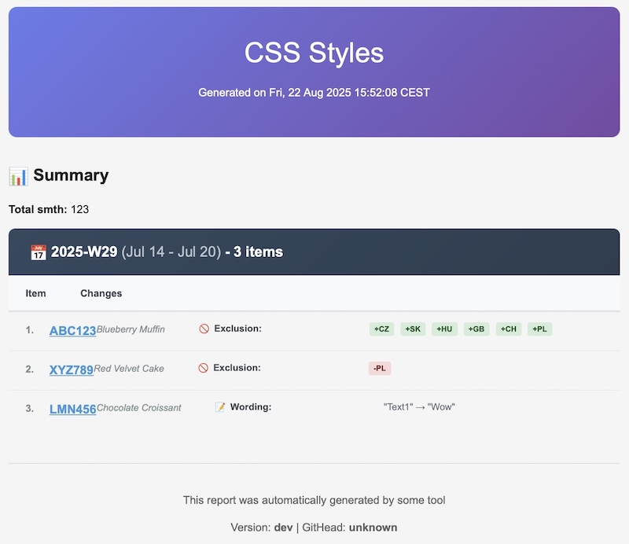
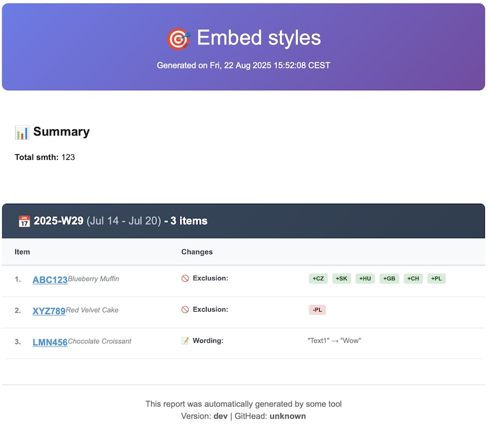

# Sending Styled HTML Emails with Go: Fixing Gmail’s CSS Limitations
> | golang |


## Problem statement

I need to implement email sending component. You crafted "advanced" HTML template and CSS styles.


But when you sent it GMail client renders it like this:


🤬 WTF?

> Gmail (both web and app) strips or ignores a lot of `<style>` blocks, advanced selectors, and modern CSS features. It only supports a restricted set of inline CSS. That’s why your nice HTML looks broken.

## Send sample email via Go

```bash
SENDER_EMAIL="your@email.com" \
RECEIVER_EMAIL="recipient@email.com" \
SENDER_PASSWORD="your_app_password" \
go run sendme.go email.html
```

<details>
<summary>
See <code>sendme.go</code>
</summary>

  ```go
    package main

    import (
        "fmt"
        "log"
        "net/smtp"
        "os"
    )

    // SENDER_EMAIL="your@email.com" SENDER_PASSWORD="your_app_password" RECEIVER_EMAIL="recipient@email.com" go run sendme.go <html_file>
    func main() {
        // Gmail SMTP settings
        smtpServer := "smtp.gmail.com"
        smtpPort := "587"
        senderEmail := os.Getenv("SENDER_EMAIL")
        senderPassword := os.Getenv("SENDER_PASSWORD")
        receiverEmail := os.Getenv("RECEIVER_EMAIL")

        if senderEmail == "" || senderPassword == "" || receiverEmail == "" {
            log.Fatal("SENDER_EMAIL, SENDER_PASSWORD, and RECEIVER_EMAIL environment variables must be set")
        }

        // Get HTML file path from command line argument
        if len(os.Args) < 2 {
            log.Fatal("Usage: go run sendme.go <html_file>")
        }
        filePath := os.Args[1]

        // Load HTML from external file
        htmlBytes, err := os.ReadFile(filePath)
        if err != nil {
            log.Fatalf("Failed to read %s: %v", filePath, err)
        }
        html := string(htmlBytes)

        // Create the email message
        msg := "From: " + senderEmail + "\r\n" +
            "To: " + receiverEmail + "\r\n" +
            "Subject: Test HTML Email\r\n" +
            "MIME-Version: 1.0\r\n" +
            "Content-Type: text/html; charset=\"UTF-8\"\r\n" +
            "\r\n" + html

        // Set up authentication information.
        auth := smtp.PlainAuth("", senderEmail, senderPassword, smtpServer)

        // Send the email
        err = smtp.SendMail(
            smtpServer+":"+smtpPort,
            auth,
            senderEmail,
            []string{receiverEmail},
            []byte(msg),
        )
        if err != nil {
            log.Fatalf("Failed to send email: %v", err)
        }

        fmt.Println("Email sent successfully!")
    }
  ```
</details>

<details>
<summary>
See sample <code>email.html</code> file
</summary>

  ```html
    <!DOCTYPE html>
    <html lang="en">

    <head>
        <meta charset="UTF-8">
        <meta name="viewport" content="width=device-width, initial-scale=1.0">
        <title>Item Validation Report</title>
        <style>
            body {
                font-family: Arial, Helvetica, sans-serif;
                max-width: 1200px;
                margin: 0 auto;
                padding: 20px;
                background-color: #f5f5f5;
            }
            .header {
                background: linear-gradient(135deg, #667eea 0%, #764ba2 100%);
                color: white;
                padding: 30px;
                border-radius: 10px;
                margin-bottom: 30px;
                text-align: center;
            }
            .header h1 {
                margin: 0 0 10px;
                font-size: 2.5em;
                font-weight: 300;
            }
            .summary {
                background: white;
                padding: 20px;
                border-radius: 8px;
                margin-bottom: 30px;
                box-shadow: 0 2px 10px rgba(0 0 0 / 10%);
            }
            .week-group {
                margin-bottom: 40px;
            }
            .week-header {
                background: linear-gradient(135deg, #34495e 0%, #2c3e50 100%);
                color: white;
                padding: 15px 25px;
                border-radius: 8px 8px 0 0;
                margin-bottom: 0;
            }
            .week-header h3 {
                margin: 0;
                font-size: 1.3em;
                font-weight: 600;
            }
            .date-range {
                font-weight: 300;
                opacity: 0.75;
                color: #ecf0f1;
                vertical-align: baseline;
                display: inline-block;
            }
            .items-table {
                background: white;
                border-radius: 0 0 8px 8px;
                box-shadow: 0 2px 10px rgba(0 0 0 / 10%);
                overflow: hidden;
            }
            .table-header {
                display: flex;
                background-color: #f8f9fa;
                border-bottom: 2px solid #dee2e6;
                padding: 12px 0;
                font-weight: 600;
                font-size: 0.9em;
                color: #495057;
            }
            .table-row {
                display: flex;
                border-bottom: 1px solid #e9ecef;
                padding: 12px 0;
                transition: background-color 0.2s;
            }
            .table-row:hover {
                background-color: #f8f9fa;
            }
            .table-row:last-child {
                border-bottom: none;
            }
            .col-item {
                flex: 0 0 200px;
                padding: 0 20px;
                display: flex;
                align-items: center;
                text-align: left;
            }
            .col-changes {
                flex: 1;
                padding: 0 20px;
                text-align: left;
            }
            .item-index {
                font-weight: 700;
                font-size: 0.9em;
                color: #7f8c8d;
                margin-right: 8px;
                min-width: 20px;
            }
            .item-info {
                display: flex;
                flex-direction: column;
                gap: 2px;
            }
            .item-id {
                font-weight: 600;
                font-size: 1.1em;
                color: #2c3e50;
            }
            .item-name {
                font-weight: 400;
                font-size: 0.85em;
                color: #7f8c8d;
                font-style: italic;
            }
            .item-id a {
                color: #3498db;
                text-decoration: underline;
                font-weight: 600;
                transition: all 0.2s ease;
                cursor: pointer;
            }
            .item-id a:hover {
                color: #2980b9;
                text-decoration: underline;
                background-color: rgba(52 152 219 / 10%);
                padding: 2px 4px;
                border-radius: 3px;
            }
            .change-item-compact {
                margin-bottom: 8px;
                font-size: 0.85em;
                line-height: 1.4;
                text-align: left;
                display: flex;
                align-items: flex-start;
            }
            .change-item-compact:last-child {
                margin-bottom: 0;
            }
            .change-icon {
                font-size: 0.9em;
                margin-right: 6px;
                flex-shrink: 0;
            }
            .change-label {
                font-weight: 600;
                color: #495057;
                width: 180px;
                flex-shrink: 0;
            }
            .change-value {
                color: #6c757d;
                text-align: left;
                flex: 1;
            }
            .change-added-inline {
                background-color: #d4edda;
                color: #155724;
                padding: 2px 6px;
                border-radius: 3px;
                font-size: 0.8em;
                font-weight: 600;
                margin: 0 2px;
                display: inline-block;
            }
            .change-removed-inline {
                background-color: #f8d7da;
                color: #721c24;
                padding: 2px 6px;
                border-radius: 3px;
                font-size: 0.8em;
                font-weight: 600;
                margin: 0 2px;
                display: inline-block;
            }
            .footer {
                text-align: center;
                color: #666;
                margin-top: 40px;
                padding: 20px;
                border-top: 1px solid #ddd;
            }
        </style>
    </head>

    <body>
        <div class="header">
            <h1>CSS Styles</h1>
            <p>Generated on Fri, 22 Aug 2025 15:52:08 CEST</p>
        </div>
        <div class="summary">
            <h2>📊 Summary</h2>
            <p><strong>Total smth:</strong> 123</p>
        </div>
        <div class="week-group">
            <div class="week-header">
                <h3>📅 2025-W29 <span class="date-range">(Jul 14 - Jul 20)</span> - 3 items</h3>
            </div>
            <div class="items-table">
                <div class="table-header">
                    <div class="col-item">Item</div>
                    <div class="col-changes">Changes</div>
                </div>
                <div class="table-row">
                    <div class="col-item">
                        <div class="item-index">1.</div>
                        <div class="item-info">
                            <div class="item-id"> <a href="#" target="_blank">ABC123</a> </div>
                            <div class="item-name">Blueberry Muffin</div>
                        </div>
                    </div>
                    <div class="col-changes">
                        <div class="change-item-compact"> <span class="change-icon">🚫</span> <span class="change-label">Exclusion:</span> <span class="change-value"> <span class="change-added-inline">+CZ</span> <span class="change-added-inline">+SK</span> <span class="change-added-inline">+HU</span> <span class="change-added-inline">+GB</span> <span class="change-added-inline">+CH</span> <span class="change-added-inline">+PL</span> </span> </div>
                    </div>
                </div>
                <div class="table-row">
                    <div class="col-item">
                        <div class="item-index">2.</div>
                        <div class="item-info">
                            <div class="item-id"> <a href="#" target="_blank">XYZ789</a> </div>
                            <div class="item-name">Red Velvet Cake</div>
                        </div>
                    </div>
                    <div class="col-changes">
                        <div class="change-item-compact"> <span class="change-icon">🚫</span> <span class="change-label">Exclusion:</span> <span class="change-value"> <span class="change-removed-inline">-PL</span> </span> </div>
                    </div>
                </div>
                <div class="table-row">
                    <div class="col-item">
                        <div class="item-index">3.</div>
                        <div class="item-info">
                            <div class="item-id"> <a href="#" target="_blank">LMN456</a> </div>
                            <div class="item-name">Chocolate Croissant</div>
                        </div>
                    </div>
                    <div class="col-changes">
                        <div class="change-item-compact"> <span class="change-icon">📝</span> <span class="change-label">Wording:</span> <span class="change-value">"Text1" → "Wow"</span> </div>
                    </div>
                </div>
            </div>
        </div>
        
    
        <div class="footer">
            <p>This report was automatically generated by some tool</p>
            <p>Version: <b>dev</b> | GitHead: <b>unknown</b></p>
        </div>
    </body>

    </html>
  ```
</details>

## How to fix?

1. **Inline all CSS styles** (see [`juice`](https://github.com/Automattic/juice), [`premailer`](https://github.com/premailer/premailer), [`go-premailer`](https://github.com/vanng822/go-premailer) libraries)
2. Avoid **flexbox/grid** → Gmail doesn’t support them. Instead, use tables for layout (old-school, but still standard for emails).
3. **Simplify selectors**. Don’t rely on .class .nested-class. Gmail may ignore deep selectors. Inline is safest.

### 1. Use `go-premailer` library

My demo app is in Go, that's why I've picked [`go-premailer`](https://github.com/vanng822/go-premailer).

- Apply the following changes to `sendme.go`


```diff
--- a/sendme.go
+++ b/sendme.go
@@ -5,6 +5,8 @@ import (
        "log"
        "net/smtp"
        "os"
+
+       "github.com/vanng822/go-premailer/premailer"
 )
 
 // SENDER_EMAIL="your@email.com" SENDER_PASSWORD="your_app_password" RECEIVER_EMAIL="recipient@email.com" go run sendme.go <html_file>
@@ -31,7 +33,7 @@ func main() {
        if err != nil {
                log.Fatalf("Failed to read %s: %v", filePath, err)
        }
-       html := string(htmlBytes)
+       html := doPremail(htmlBytes)
 
        // Create the email message
        msg := "From: " + senderEmail + "\r\n" +
@@ -58,3 +60,16 @@ func main() {
 
        fmt.Println("Email sent successfully!")
 }
+
+func doPremail(html []byte) string {
+       prem, err := premailer.NewPremailerFromBytes(html, premailer.NewOptions())
+       if err != nil {
+               log.Fatal(err)
+       }
+
+       result, err := prem.Transform()
+       if err != nil {
+               log.Fatal(err)
+       }
+       return result
+}
```

- Send email



No so bad, ugly, but better than with stripped styles. 

### 2. Use LLM to inline CSS styles

- inline CSS styles with LLM `email_inline_styles.html`

<details>
<summary>
See <code>email_inline_styles.html</code> file with inlined CSS styles
</summary>

```html
    <!DOCTYPE html>
    <html lang="en">

    <head>
        <meta charset="UTF-8">
        <meta name="viewport" content="width=device-width, initial-scale=1.0">
        <title>Item Validation Report</title>
        <!-- All styles are now inline for Gmail compatibility -->
    </head>

    <body>
        <div style="background:#667eea;background:linear-gradient(135deg,#667eea 0%,#764ba2 100%);color:#fff;padding:30px;border-radius:10px;margin-bottom:30px;text-align:center;">
            <h1 style="margin:0 0 10px;font-size:2.5em;font-weight:300;">🎯 Embed styles</h1>
            <p style="margin:0;">Generated on Fri, 22 Aug 2025 15:52:08 CEST</p>
        </div>
        <div style="background:#fff;padding:20px;border-radius:8px;margin-bottom:30px;box-shadow:0 2px 10px rgba(0,0,0,0.1);">
            <h2 style="margin-top:0;">📊 Summary</h2>
            <p><strong>Total smth:</strong> 123</p>
        </div>
        <div style="margin-bottom:40px;">
            <div style="background:#34495e;background:linear-gradient(135deg,#34495e 0%,#2c3e50 100%);color:#fff;padding:15px 25px;border-radius:8px 8px 0 0;margin-bottom:0;">
                <h3 style="margin:0;font-size:1.3em;font-weight:600;">📅 2025-W29 <span style="font-weight:300;opacity:0.75;color:#ecf0f1;vertical-align:baseline;display:inline-block;">(Jul 14 - Jul 20)</span> - 3 items</h3>
            </div>
            <table style="width:100%;background:#fff;border-radius:0 0 8px 8px;box-shadow:0 2px 10px rgba(0,0,0,0.1);overflow:hidden;border-collapse:collapse;">
                <tr style="background:#f8f9fa;border-bottom:2px solid #dee2e6;padding:12px 0;font-weight:600;font-size:0.9em;color:#495057;">
                    <td style="padding:12px 20px;font-weight:600;">Item</td>
                    <td style="padding:12px 20px;font-weight:600;">Changes</td>
                </tr>
                <tr style="border-bottom:1px solid #e9ecef;">
                    <td style="padding:12px 20px;min-width:200px;display:flex;align-items:center;text-align:left;">
                        <span style="font-weight:700;font-size:0.9em;color:#7f8c8d;margin-right:8px;min-width:20px;">1.</span>
                        <span style="display:flex;flex-direction:column;gap:2px;">
                            <span style="font-weight:600;font-size:1.1em;color:#2c3e50;"><a href="#" target="_blank" style="color:#3498db;text-decoration:underline;font-weight:600;">ABC123</a></span>
                            <span style="font-weight:400;font-size:0.85em;color:#7f8c8d;font-style:italic;">Blueberry Muffin</span>
                        </span>
                    </td>
                    <td style="padding:12px 20px;text-align:left;">
                        <div style="margin-bottom:8px;font-size:0.85em;line-height:1.4;text-align:left;display:flex;align-items:flex-start;">
                            <span style="font-size:0.9em;margin-right:6px;">🚫</span>
                            <span style="font-weight:600;color:#495057;width:180px;">Exclusion:</span>
                            <span style="color:#6c757d;text-align:left;flex:1;">
                                <span style="background:#d4edda;color:#155724;padding:2px 6px;border-radius:3px;font-size:0.8em;font-weight:600;margin:0 2px;display:inline-block;">+CZ</span>
                                <span style="background:#d4edda;color:#155724;padding:2px 6px;border-radius:3px;font-size:0.8em;font-weight:600;margin:0 2px;display:inline-block;">+SK</span>
                                <span style="background:#d4edda;color:#155724;padding:2px 6px;border-radius:3px;font-size:0.8em;font-weight:600;margin:0 2px;display:inline-block;">+HU</span>
                                <span style="background:#d4edda;color:#155724;padding:2px 6px;border-radius:3px;font-size:0.8em;font-weight:600;margin:0 2px;display:inline-block;">+GB</span>
                                <span style="background:#d4edda;color:#155724;padding:2px 6px;border-radius:3px;font-size:0.8em;font-weight:600;margin:0 2px;display:inline-block;">+CH</span>
                                <span style="background:#d4edda;color:#155724;padding:2px 6px;border-radius:3px;font-size:0.8em;font-weight:600;margin:0 2px;display:inline-block;">+PL</span>
                            </span>
                        </div>
                    </td>
                </tr>
                <tr style="border-bottom:1px solid #e9ecef;">
                    <td style="padding:12px 20px;min-width:200px;display:flex;align-items:center;text-align:left;">
                        <span style="font-weight:700;font-size:0.9em;color:#7f8c8d;margin-right:8px;min-width:20px;">2.</span>
                        <span style="display:flex;flex-direction:column;gap:2px;">
                            <span style="font-weight:600;font-size:1.1em;color:#2c3e50;"><a href="#" target="_blank" style="color:#3498db;text-decoration:underline;font-weight:600;">XYZ789</a></span>
                            <span style="font-weight:400;font-size:0.85em;color:#7f8c8d;font-style:italic;">Red Velvet Cake</span>
                        </span>
                    </td>
                    <td style="padding:12px 20px;text-align:left;">
                        <div style="margin-bottom:8px;font-size:0.85em;line-height:1.4;text-align:left;display:flex;align-items:flex-start;">
                            <span style="font-size:0.9em;margin-right:6px;">🚫</span>
                            <span style="font-weight:600;color:#495057;width:180px;">Exclusion:</span>
                            <span style="color:#6c757d;text-align:left;flex:1;">
                                <span style="background:#f8d7da;color:#721c24;padding:2px 6px;border-radius:3px;font-size:0.8em;font-weight:600;margin:0 2px;display:inline-block;">-PL</span>
                            </span>
                        </div>
                    </td>
                </tr>
                <tr style="border-bottom:1px solid #e9ecef;">
                    <td style="padding:12px 20px;min-width:200px;display:flex;align-items:center;text-align:left;">
                        <span style="font-weight:700;font-size:0.9em;color:#7f8c8d;margin-right:8px;min-width:20px;">3.</span>
                        <span style="display:flex;flex-direction:column;gap:2px;">
                            <span style="font-weight:600;font-size:1.1em;color:#2c3e50;"><a href="#" target="_blank" style="color:#3498db;text-decoration:underline;font-weight:600;">LMN456</a></span>
                            <span style="font-weight:400;font-size:0.85em;color:#7f8c8d;font-style:italic;">Chocolate Croissant</span>
                        </span>
                    </td>
                    <td style="padding:12px 20px;text-align:left;">
                        <div style="margin-bottom:8px;font-size:0.85em;line-height:1.4;text-align:left;display:flex;align-items:flex-start;">
                            <span style="font-size:0.9em;margin-right:6px;">📝</span>
                            <span style="font-weight:600;color:#495057;width:180px;">Wording:</span>
                            <span style="color:#6c757d;text-align:left;flex:1;">"Text1" → "Wow"</span>
                        </div>
                    </td>
                </tr>
            </table>
        </div>
        <div style="text-align:center;color:#666;margin-top:40px;padding:20px;border-top:1px solid #ddd;">
            <p style="margin:0;">This report was automatically generated by some tool</p>
            <p style="margin:0;">Version: <b>dev</b> | GitHead: <b>unknown</b></p>
        </div>
    </body>

    </html>
```
</details>

- send email

```bash
SENDER_EMAIL="your@email.com" \
RECEIVER_EMAIL="recipient@email.com" \
SENDER_PASSWORD="your_app_password" \
go run sendme.go email_inline_styles.html
```



## Summary

- Gmail strips most modern CSS - so inline styles are the only reliable way.
- Manually embedding styles is painful and error-prone
- Using a library like[`go-premailer`](https://github.com/vanng822/go-premailer) or an external tool makes emails maintainable.
- Expect trade-offs: some layouts (e.g., flexbox, grid) still won’t render properly, so keep your HTML email design simple.
