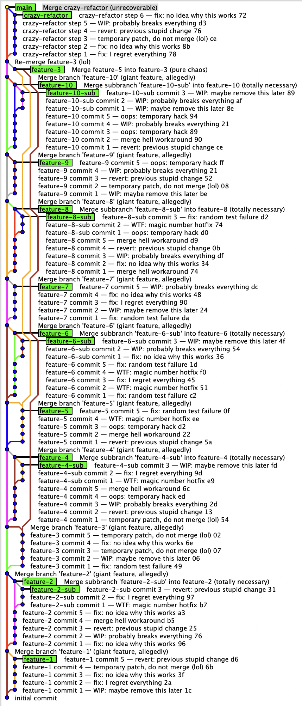
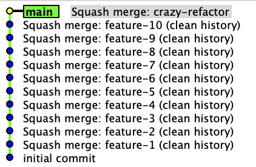
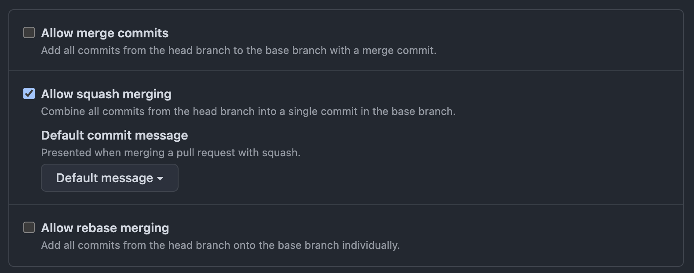

# The Problem with Merge Commits in Trunk-Based Development
<!-- tags: thoughts -->

*This post is about pain, human nature and careless attitudes toward code history.*  

Imagine you joined a new team. The team practices trunk-based development, i.e. long-lived feature branches are rather the exception.
All good till you open the Git history in each repository.

And you see this  

instead of this  

**Note, for both cases `main` branch contains the same number of commits.**

---

So many things have gone wrong: 

- polluted history with meaningless commit messages, which "might be useful" based on the author's strong opinion ("fix", "revert", "oops", "failed tests", "merge main" and so on)
- nobody asked themselves "do we really need this?"
- navigating this mess is nearly impossible - we usually don't even try
- people preserve useless commits because "we can't control everybody"

You can't fix human nature, but you can create an environment where this mess will be almost impossible to do:

Let's assume you are using Github. To enforce clean history, you need to:

1. **Enable** "Allow squash merging"
2. **Disable** "Allow merge commits" and "Allow rebase merging"

This configuration ensures that all commits in the feature branch are combined into one single commit on the target branch, making it impossible for developers to pollute the history with merge commits.

**Pros**

- clean history - every feature = 1 commit
- easy to revert
- encourage small PRs and reduce noise to the max
- no need to *police* merge garbage-makers 

**Cons**

- Loses commit history from the branch (no micro-changes or evolution)
- The "one commit" might be too big if you squashed sloppy work
- Makes `git bisect` less effective
- Hides co-author contributions unless explicitly noted

## Miscellaneous 

1. I intentionally avoided `rebase`, because I am not a big fan of it.
2. I think big and/or long-lived feature branches shouldn't be squashed, but they must be cleaned up before merging.

## Summary 

Choose **squash merging** *when*:

- people are careless about the quality of their own commits
- clean history matters more than granular change tracking
