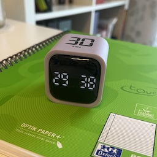
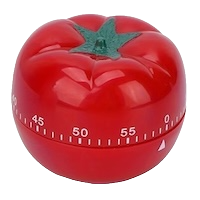
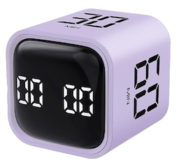

# A Boring Pomodoro Timer
<!-- tags: pomodoro -->

My phone timer annoyed me more than it helped.

I’ve been using Pomodoro for years (details here [How I use the Pomodoro technique in 2025](../2025/2025-05-12-pomodoro.md)), but one thing kept bothering me - **unlocking the phone breaks focus**.

Over the years, I embraced the *"less is more"* philosophy, and my phone no longer fits my Pomodoro flow.

Pomodoro itself is *"less is more"*: one task, one timer, one constraint.

In the past, I’ve tried a classic kitchen timer:

| Cons | Pros |
|------|------|
| Loud ticking | Simple to the max |
| No preset time periods - setting the “right” duration requires attention | |

I wasn't looking for "features". I was looking for constraints. 

A timer should remove decisions, not add them.

What I need: 3-4 preset time periods and a simple, intuitive interface. And I found it. 

- Rotating Cube Timer  
- Predefined durations: 5, 10, 30, and 60 minutes - perfectly fit my Pomodoro setup  
- Just flip it: start, pause, reset  
- Boring. Nothing more.

If a Pomodoro timer asks for attention, it’s already doing too much. This one doesn’t.