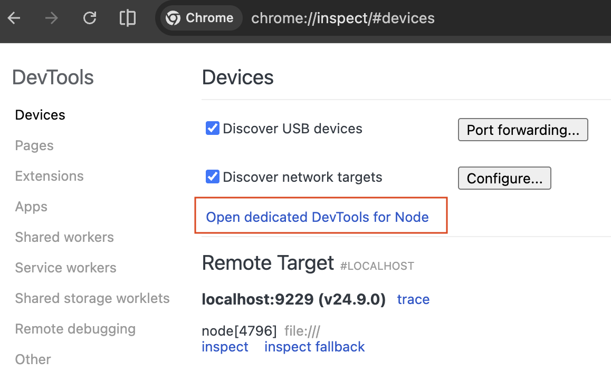
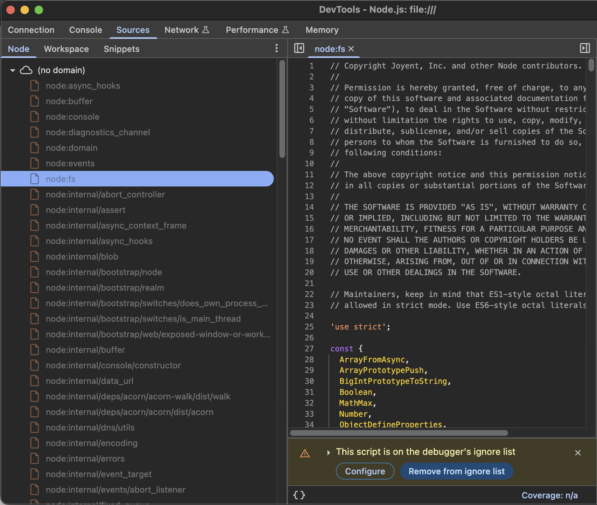

# How Node.js Embeds Built-in JS Modules
<!-- tags: node.js, til -->


**TL;DR** *Node.js* embeds many of its built-in JavaScript modules (the sources under `lib/`, including `lib/internal/*`) into the `node` executable as static C++ arrays. Since 2018, Node.js no longer compiles these sources from scratch at runtime — during the build process, the JavaScript is pre-compiled into a **V8 code cache** (bytecode + metadata), which is also embedded in the binary. At runtime, Node.js simply deserializes the bytecode from this cache, skipping the expensive parsing and compilation steps entirely.

*Terminology note*: here “built-in modules” means Node’s built-ins like `fs`/`http` (not the ECMAScript language built-ins like `Array.prototype.map`).

Based on the sources below:

1. The built-in JS files (`lib/*.js`) are encoded into C++ byte arrays during build.
2. Alongside the raw source, a **V8 code cache** (pre-compiled bytecode) is also embedded in the binary. The raw source is kept primarily for debugging purposes and generating readable stack traces; the cached bytecode is what is actually deserialized at runtime.
3. At runtime, Node.js deserializes the bytecode from the cache — no parsing or JIT compilation needed for core modules.
4. They're stored inside the Node executable rather than loaded from disk.

## How the Embedding Works (Build Time)

Node’s build includes a step that converts JavaScript sources from `lib/` into a generated C++ translation unit (commonly called `node_javascript.cc` in build artifacts). That generated C++ file is then compiled and linked into the final `node` executable.

The converter is [`tools/js2c.cc`](https://github.com/nodejs/node/blob/main/tools/js2c.cc).


## Internal vs Public Modules

The `BuiltinLoader` distinguishes between two types of embedded modules:

1. **Public modules** (e.g., `fs`, `http`, `crypto`, `os`)
   - Can be loaded via `require('fs')` from user code
   - Exposed API surface

2. **Internal modules** (e.g., `lib/internal/*`)
   - Cannot be `require()`d from user applications
   - Used internally by Node.js core
   - Access restricted by the loader

Both types are embedded using the same [`js2c`](https://github.com/nodejs/node/blob/main/tools/js2c.cc) process, but runtime access rules differ.

## How Node Loads an Embedded Module (Runtime)

Conceptually, when you do `require('fs')` (or `require('node:fs')`), Node detects that the request refers to a built-in module and asks the built-in loader for its source.

At a high level:

1. Node identifies the request as a built-in.
2. `BuiltinLoader` returns the module's source from the embedded in-memory table (not from disk).
3. V8 **deserializes the pre-compiled bytecode** from the embedded code cache rather than parsing and compiling the source from scratch (Node wraps modules in a function like CommonJS modules).
4. Node executes it and caches the resulting module exports.

For a detailed, source-linked walkthrough of the real call chain, Joyee Cheung’s post in the references is the best starting point.

## Embedding Benefits

1. **Performance** - Faster startup, no disk I/O for core modules
2. **Distribution** - Single binary is easier to distribute
3. **Integrity** - In the default build, core JS sources aren’t read from disk, so you can’t swap out `lib/*.js` without rebuilding
4. **Self-Contained Runtime** - No external dependencies needed for core functionality

## Nuances (Worth Knowing)

- **"Embedded sources" isn't the whole story:** there are two distinct build-time optimizations worth separating:
  - **V8 Code Cache**: During the build, Node.js pre-compiles each built-in module's JavaScript into bytecode and embeds that cache in the binary. At runtime, the bytecode is deserialized directly, saving the parsing and compilation cost entirely. This integration was originally proposed by Yang Guo (a V8 engineer) and implemented by Joyee Cheung in 2018 — the change that made Node.js startup noticeably faster.
  - **V8 Startup Snapshots**: Goes a step further by actually *pre-executing* bootstrap routines at build time (setting up globals like `process`, `setTimeout`, etc.) and saving the resulting V8 heap context as a blob. At runtime, Node.js deserializes this heap snapshot, completely skipping the execution of those bootstrap steps. See V8: [Custom startup snapshots](https://v8.dev/blog/custom-startup-snapshots).
- **You *can* build Node to load JS from disk:** Node supports a build option that produces a binary without embedded JS files and loads them from a directory instead. See [BUILDING.md](https://github.com/nodejs/node/blob/main/BUILDING.md#loading-js-files-from-disk-instead-of-embedding).
- **JS modules vs native code:** embedding covers the JavaScript sources in `lib/`, but many built-ins also depend on native (C/C++) code and bindings (for example filesystem, crypto, compression, inspector). Those native parts are compiled and linked separately; embedding doesn’t mean “everything is JS”.


## References

- **2025 - Evolving the Node.js module loader** ([talk](https://www.youtube.com/watch?v=qC_gA6he3aI), [slides](https://www.igalia.com/downloads/slides/JoyeeCheung-EvolvingTheNodejsModuleLoader.pdf)) by [Joyee Cheung](https://github.com/joyeecheung)
- [2021 - How does Node.js load its built-in/native modules?](https://joyeecheung.github.io/blog/2021/07/06/how-does-node-js-load-its-builtins-native-modules) by [Joyee Cheung](https://github.com/joyeecheung)
- [Stack Overflow: Are JS files in node/lib used during compilation of the node executable?](https://stackoverflow.com/questions/53680439/are-js-files-in-node-lib-used-during-compilation-of-the-node-executable)
- Node.js source:
   - [`node.gyp`](https://github.com/nodejs/node/blob/main/node.gyp) — Node’s top-level build configuration; it hooks the `js2c`-generated C++ into the final `node` executable (not to be confused with [`node-gyp`](https://github.com/nodejs/node-gyp), which builds native addons)
   - [`tools/js2c.cc`](https://github.com/nodejs/node/blob/main/tools/js2c.cc)
- [node/BUILDING.md - Loading JS files from disk instead of embedding](https://github.com/nodejs/node/blob/main/BUILDING.md#loading-js-files-from-disk-instead-of-embedding)
> The resulting binary won't include any JS files and will try to load them from the specified directory. 


## Appendix A - Node.js Built-in modules

- Ref: [Node.js Doc - Built-in modules](https://nodejs.org/api/modules.html#built-in-modules)

> Node.js has several modules compiled into the binary. ...
> 
> The built-in modules are defined within the Node.js source and are located in the `lib/` folder.
> 
> Built-in modules can be identified using the node: prefix, in which case it bypasses the require cache. For instance, `require('node:http')` will always return the built in HTTP module, even if there is require.cache entry by that name.
> 
> Some built-in modules are always preferentially loaded if their identifier is passed to `require()`. For instance, `require('http')` will always return the built-in HTTP module, even if there is a file by that name.
> 
> The list of all the built-in modules can be retrieved from [`module.builtinModules`](https://nodejs.org/api/module.html#modulebuiltinmodules). The modules being all listed without the node: prefix, except those that mandate such prefix (as explained in the next section).


```js
➜ # Print a clean list of all built-in module names
node -e "console.log(require('module').builtinModules)"
[
  '_http_agent',         '_http_client',        '_http_common',
  '_http_incoming',      '_http_outgoing',      '_http_server',
  '_stream_duplex',      '_stream_passthrough', '_stream_readable',
  '_stream_transform',   '_stream_wrap',        '_stream_writable',
  '_tls_common',         '_tls_wrap',           'assert',
  'assert/strict',       'async_hooks',         'buffer',
  'child_process',       'cluster',             'console',
  'constants',           'crypto',              'dgram',
  'diagnostics_channel', 'dns',                 'dns/promises',
  'domain',              'events',              'fs',
  'fs/promises',         'http',                'http2',
  'https',               'inspector',           'inspector/promises',
  'module',              'net',                 'os',
  'path',                'path/posix',          'path/win32',
  'perf_hooks',          'process',             'punycode',
  'querystring',         'readline',            'readline/promises',
  'repl',                'stream',              'stream/consumers',
  'stream/promises',     'stream/web',          'string_decoder',
  'sys',                 'timers',              'timers/promises',
  'tls',                 'trace_events',        'tty',
  'url',                 'util',                'util/types',
  'v8',                  'vm',                  'wasi',
  'worker_threads',      'zlib',                'node:sea',
  'node:sqlite',         'node:test',           'node:test/reporters'
]
```

## Appendix B - Node.js Inspector

Because the JS is converted into byte arrays inside C++ source, you can't realistically "read" it by opening the node binary in a text editor.

You can apply the **"inspector"** trick 

1. Run `node --inspect`.
2. Open Chrome and go to `chrome://inspect`.
3. Click "Open dedicated DevTools for Node".
4. Go to the **Sources** tab.
5. Under "Node", you will see a folder called **`node:internal`**.

**Sample**

```shell
node --inspect
Debugger listening on ws://127.0.0.1:9229/a5b189d2-6358-4fa9-9f71-7e82c835fff8
For help, see: https://nodejs.org/en/docs/inspector
Welcome to Node.js v24.9.0.
Type ".help" for more information.
```





Here you can inspect/read JS files embedded in the **Node.js** binary: both *public* and *internal*.
