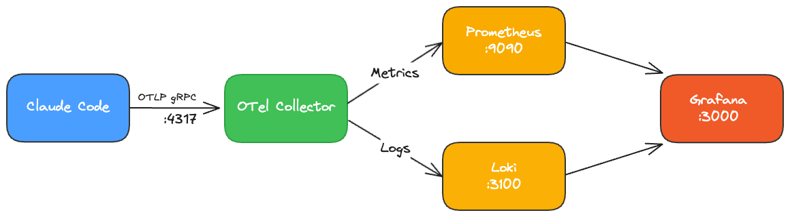
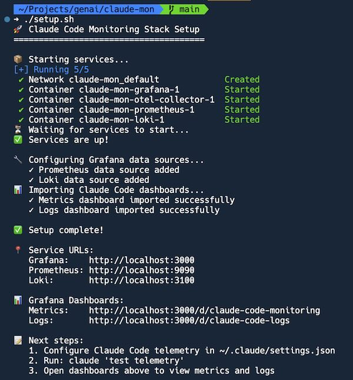
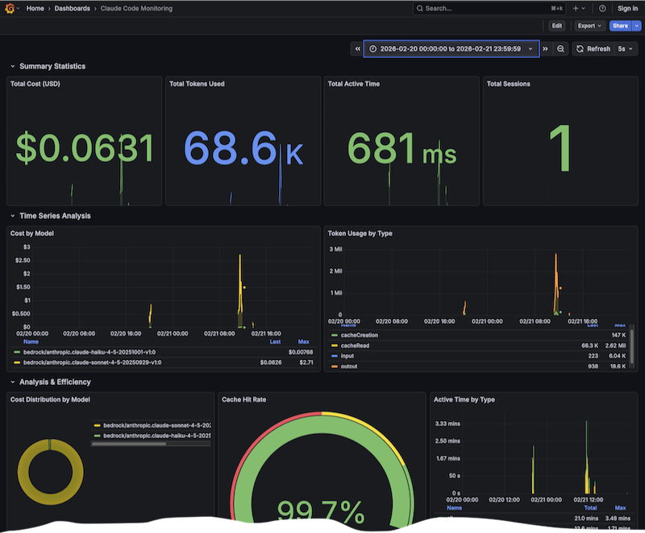
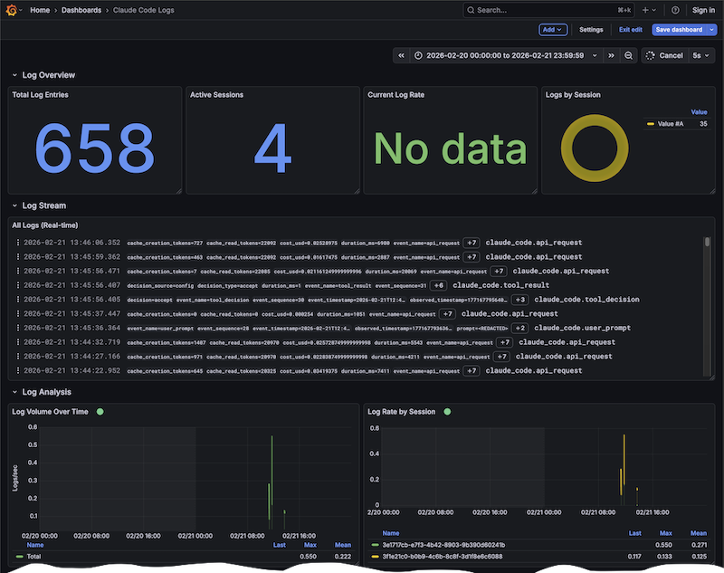

# How to Monitor Claude Code with OpenTelemetry
<!-- tags: claude code, otel, grafana, prometheus, observability, monitoring  -->


**TL;DR**: Claude Code is powerful but you have minimal visibility into costs, token usage, or development patterns. I pre-configured a 5-minute OpenTelemetry monitoring stack (Prometheus + Loki + Grafana) that shows exactly where your money goes and how effective prompt caching really is.

## The Problem

Claude Code gives you no built-in visibility into:

- Which models are eating your budget
- Whether prompt caching is actually saving you money
- How many tokens you're burning through daily
- Development velocity metrics (lines changed, commits, PRs)

## The Solution

I configured an observability stack using industry-standard tools:



**Architecture:**

- **Claude Code** exports telemetry via OpenTelemetry Protocol (OTLP)
- **OTel Collector** receives metrics and logs, routes them appropriately
- **Prometheus** stores time-series metrics (costs, tokens, cache rates)
- **Loki** stores logs (session logs, real-time activity)
- **Grafana** visualizes everything with pre-built dashboards

All configuration, automation, and dashboards are in the GitHub repo: [halyph/claude-mon](https://github.com/halyph/claude-mon).

## Quick Demo

One command:

```bash
git clone https://github.com/halyph/claude-mon.git
cd claude-mon
./setup.sh
```



Wait 2 minutes for setup to complete, then open `http://localhost:3000`. Default credentials: `admin/admin`.

## What You Get

### Two Grafana Dashboards

**Metrics Dashboard**



16 panels:

- **Cost tracking**: Total spend by model, cost distribution pie chart
- **Token usage**: Input/output/cache tokens over time
- **Cache effectiveness**: Hit rate gauge showing cache read/write ratios
- **Development activity**: Lines changed, commits created, PRs opened
- **Code edits**: Accept/reject decisions by tool and language

**Logs Dashboard**



Real-time log streaming with:

- Live session activity (refreshes every 5 seconds)
- Log volume over time
- Per-session filtering
- Model-based categorization

**NOTE**: Dashboards are pre-configured templates. Customize as needed.

## Key Metrics Reference

Claude Code exports these metrics (converted to Prometheus format):

| Metric | What It Measures | Why It Matters |
|--------|-----------------|----------------|
| `claude_code_cost_usage_total` | Cost in USD by model/session | Budget tracking, model comparison |
| `claude_code_token_usage_total` | Tokens by type (input/output/cache) | Optimize prompts, track cache effectiveness |
| `claude_code_active_time_total` | Session duration (user/cli) | Understand usage patterns |
| `claude_code_lines_of_code_count` | Lines added/removed | Development velocity |
| `claude_code_commit_count` | Git commits created | Productivity metric |
| `claude_code_code_edit_tool_decision` | Accept/reject by tool/language | Quality tracking |

All metrics include standard labels: `model`, `session_id`, `terminal_type`, `user_id`, `type`.

## Data Persistence

Docker volumes preserve all historical data:

- `prometheus-data`: Metrics time-series
- `loki-data`: Log streams
- `grafana-data`: Dashboards and settings

```bash
docker-compose down      # Stops services, keeps data
docker-compose down -v   # Stops services, deletes data
```

## References

- **GitHub Repo**: [halyph/claude-mon](https://github.com/halyph/claude-mon) - Full setup, configuration, and dashboards
- **Claude Code Docs**: [Monitoring & Usage](https://code.claude.com/docs/en/monitoring-usage) - Official telemetry documentation
- [**OpenTelemetry**](https://opentelemetry.io/) - OTLP protocol and collectors
- [**Prometheus**](https://prometheus.io/) - Time-series metrics database
- [**Grafana**](https://grafana.com/) - Visualization and dashboards
