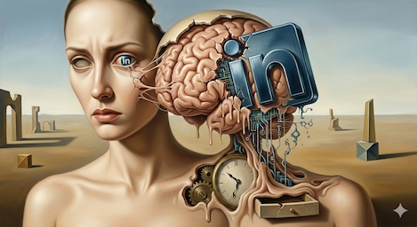

# LinkedIn and road to hell
<!-- tags: thoughts -->

⚠️ **WARNING**: It is a rant, skip it to protect your sanity.

I guess many of you read total bullshit posts on LinkedIn with zero meaning.
It's like a fart into the water.  
You read text, a lot of text which has no sense. 

---

Today I asked ChatGPT, and it led me to a *"better"* place in hell.

**"Write me typical bullshit LinkedIn post"**

>Thrilled to share a quick reflection from my journey over the past few weeks.
>
>I’ve been thinking a lot about growth, ownership, and what it really means to *show up* every day—not just for your team, but for yourself.
>
>We often talk about outcomes, but rarely about the invisible work:
>– the late nights no one sees
>– the uncomfortable conversations
>– the moments you choose long-term impact over short-term comfort
>
>One thing that’s become clear to me: **progress isn’t linear, but intentionality compounds.**
>
>By focusing on small, consistent improvements, I’ve seen how quickly things can start to shift—not just in results, but in mindset.
>
>Grateful for the people around me who challenge, support, and inspire me daily. You know who you are 🙏
>
>If there’s one takeaway I’d share, it’s this:
>👉 Don’t wait for perfect conditions. Start where you are, use what you have, and keep moving forward.
>
>Curious—what’s one small habit that’s made a big difference for you recently?
>
> \#growth \#leadership \#mindset \#learning \#careerdevelopment

**nice, now write about ppl**

>Lately, I’ve been reflecting on people.
>
>Not titles. Not roles. Not org charts. Just… people.
>
>It’s easy to get caught up in deliverables and deadlines, but at the end of the day, everything we >build is shaped by the people around us:
>– the ones who challenge our thinking
>– the ones who quietly support us
>– the ones who bring energy into the room (or the Slack channel)
>
>One thing I’m learning: **you can’t separate outcomes from relationships.**
>The strongest teams I’ve seen aren’t just aligned on goals—they’re aligned on trust.
>
>And trust isn’t built in big moments. It’s built in the small ones:
>– following through when it’s inconvenient
>– giving credit when no one is watching
>– listening, even when you disagree
>
>We spend so much time optimizing processes, tools, and frameworks…
>but the real multiplier is how we show up for each other.
>
>Grateful for the people who make work feel a little more human.
>
>What’s one thing you appreciate about someone you work with right now?
>
> \#people \#teamwork \#leadership \#culture \#gratitude

---

Well, I am ready to be LinkedIn shit poster.

⁉️ **What if LinkedIn "influencers" and "thought leaders" write this content themselves and genuinely believe it is insightful and valuable?**

But there is more: many people "like" this kind of content. 🫣 We are cooked.
