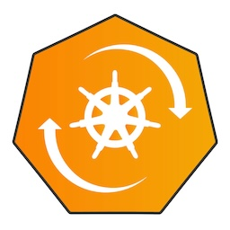
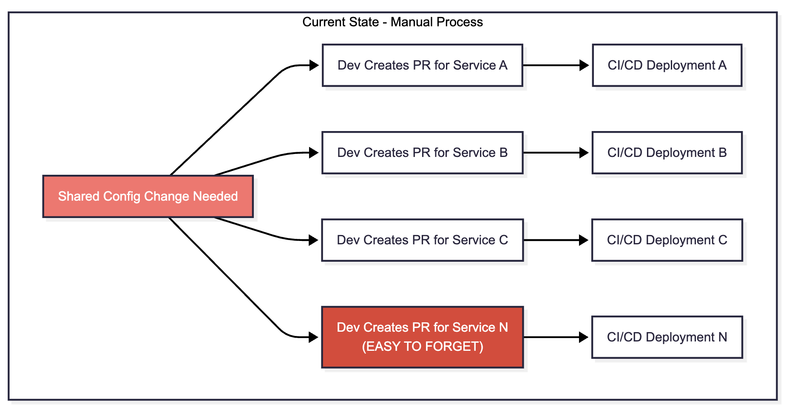
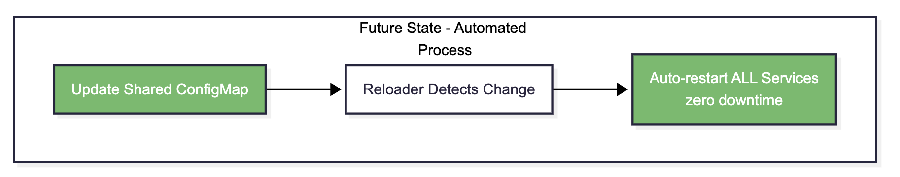
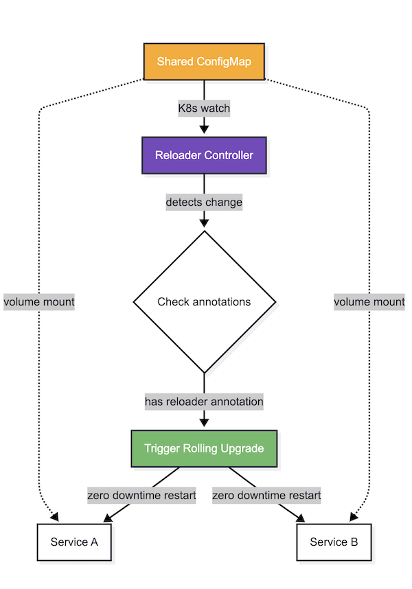
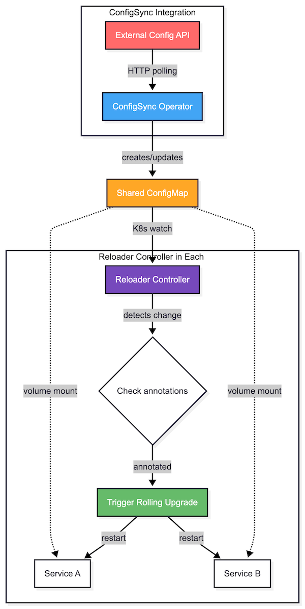

# Automating Kubernetes ConfigMap Updates with Reloader
<!-- tags: kubernetes -->



## The Problem

Managing shared configuration across multiple Kubernetes services is error-prone:

- Multiple PRs required to update each service
- Easy to forget which services need updates
- Separate CI/CD deployments for each service
- High risk of inconsistency



## Solution: Kubernetes ConfigMaps

Shared **ConfigMaps** are ideal, but by default ConfigMap updates **don't trigger pod restarts** - pods keep running with stale values.

The solution: use a Kubernetes controller that automatically restarts pods when ConfigMaps change.

[**Reloader**](https://github.com/stakater/reloader) is a Kubernetes controller that automatically triggers rollouts when referenced ConfigMaps or Secrets are updated.

The updated process:



**Impact:**

- **Before:** N pull requests, N deployments, N opportunities to forget
- **After:** 1 pull request, 1 ConfigMap update, automatic rollout to all services

## Implementation



**Benefits:**

- Automatic service restarts when ConfigMaps change
- Zero manual intervention
- Battle-tested solution (9k+ GitHub stars)
- Minimal changes to existing services

### Future Enhancement: External Config Sync

For full automation, a **ConfigSync** operator could fetch configs from external APIs (e.g., GitHub raw URLs, REST API) and sync them to ConfigMaps. Combined with **Reloader**, this enables end-to-end automation:   

    External API → ConfigMap → Automatic Service Restart.




## Sample

**Note:** The following YAML files use `{{ VARIABLE }}` placeholders for environment-specific values. Replace these with your actual values before deployment.

### Reloader Deployment

```yaml
# Reloader Complete Deployment - All-in-One
#
# What Reloader Monitors:
#   - ConfigMaps (enabled) - watches for changes and restarts workloads
#   - Secrets (disabled via --resources-to-ignore=secrets)
#
# Workload Types Configured:
#   - Deployments ✅ - standard stateless applications (THIS IS WHAT WE USE)
#   - StatefulSets ✅ - stateful applications with persistent storage
#   - DaemonSets ⚠️ - read-only (can monitor but won't restart them)
#   - CronJobs ❌ - ignored (see --ignored-workload-types flag)
#   - Jobs ❌ - ignored (see --ignored-workload-types flag)
#
# Note: DaemonSets have list/get permissions only (no update/patch)
# to avoid RBAC permission issues while keeping logs clean
#
# Expected Behavior:
#   ✅ Watches ConfigMaps in specified namespace (e.g. my-namespace)
#   ✅ Restarts Deployments/StatefulSets when their ConfigMaps change
#   ✅ Clean logs with no errors
#
# Deploy: kubectl apply -f reloader-complete.yaml
# Watch: kubectl logs -f deployment/reloader -n {{ NAMESPACE }}
# Verify: kubectl get pods -n {{ NAMESPACE }}
---
apiVersion: apps/v1
kind: Deployment
metadata:
  name: {{ APPLICATION }}
  namespace: {{ NAMESPACE }}
  labels:
    application: {{ APPLICATION_ID }}
    component: controller
    team: {{ TEAM_ID }}
spec:
  replicas: {{ REPLICAS }}
  revisionHistoryLimit: 2
  selector:
    matchLabels:
      application: {{ APPLICATION_ID }}
      component: controller
      team: {{ TEAM_ID }}
  template:
    metadata:
      labels:
        application: {{ APPLICATION_ID }}
        component: controller
        team: {{ TEAM_ID }}
    spec:
      serviceAccountName: reloader
      securityContext:
        runAsNonRoot: true
        runAsUser: 65534
        seccompProfile:
          type: RuntimeDefault
      containers:
        - name: reloader
          image: "{{ DOCKER_REGISTRY }}/{{ IMAGE_PATH }}"
          imagePullPolicy: IfNotPresent
          args:
            # Ignore secrets to avoid permission errors and only watch ConfigMaps
            - --resources-to-ignore=secrets
            - --log-format=json
            - --ignored-workload-types=jobs,cronjobs
            - --log-level={{ LOG_LEVEL }}
          
          # Namespace filtering - Choose ONE approach:
          #
          # Option 1: KUBERNETES_NAMESPACE env variable (recommended for explicit namespaces)
          #   - Use when: You know exact namespace names
          #   - Example: env var KUBERNETES_NAMESPACE="my-ns,another-ns"
          #   - Simpler, explicit list of namespaces
          #
          # Option 2: --namespace-selector flag (for dynamic label-based selection)
          #   - Use when: You want to select namespaces by labels
          #   - Example: --namespace-selector="env=production,team=myteam"
          #   - Automatically includes new namespaces matching labels
          #
          #   - --namespace-selector="kubernetes.io/metadata.name=myteam"                  # Comma separated namespace labels
          #   - --resource-label-selector="team=myteam,environment in (live,staging-main)" # Comma separated resource labels
          #   - --reload-on-create=true   # Add this line to enable reload on create
          #   - --reload-on-delete=true   # Add this line to enable reload on delete
          #   - --resources-to-ignore="secrets"
          env:
            - name: GOMAXPROCS
              valueFrom:
                resourceFieldRef:
                  resource: limits.cpu
                  divisor: '1'
            - name: GOMEMLIMIT
              valueFrom:
                resourceFieldRef:
                  resource: limits.memory
                  divisor: '1'
            - name: RELOADER_NAMESPACE
              valueFrom:
                fieldRef:
                  fieldPath: metadata.namespace
            - name: RELOADER_DEPLOYMENT_NAME
              value: {{ APPLICATION }}
            # Monitor specific namespace(s) - see comments above for --namespace-selector alternative
            - name: KUBERNETES_NAMESPACE
              value: "{{ WATCH_NAMESPACES }}" # Single namespace, or comma-separated: "ns1,ns2"
          ports:
            - name: http
              containerPort: 9090
          livenessProbe:
            httpGet:
              path: /live
              port: http
            timeoutSeconds: 5
            failureThreshold: 5
            periodSeconds: 10
            successThreshold: 1
            initialDelaySeconds: 10
          readinessProbe:
            httpGet:
              path: /metrics
              port: http
            timeoutSeconds: 5
            failureThreshold: 5
            periodSeconds: 10
            successThreshold: 1
            initialDelaySeconds: 10
          securityContext:
            allowPrivilegeEscalation: false
            capabilities:
              drop:
                - ALL
            readOnlyRootFilesystem: true
          resources:
            limits:
              cpu: {{ CPU_LIMIT }}
              memory: {{ MEMORY_LIMIT }}
            requests:
              cpu: {{ CPU_REQUEST }}
              memory: {{ MEMORY_REQUEST }}
---
apiVersion: v1
kind: Namespace
metadata:
  name: {{ NAMESPACE }}

---
apiVersion: rbac.authorization.k8s.io/v1
kind: ClusterRole
metadata:
  name: reloader-role
rules:
  - apiGroups:
      - ""
    resources:
      - configmaps
    verbs:
      - list
      - get
      - watch
      - create
      - update
  - apiGroups:
      - "apps"
    resources:
      - deployments
      - statefulsets
    verbs:
      - list
      - get
      - update
      - patch
  - apiGroups:
      - "apps"
    resources:
      - daemonsets
    verbs:
      - list
      - get
  - apiGroups:
      - "extensions"
    resources:
      - deployments
    verbs:
      - list
      - get
      - update
      - patch
  - apiGroups:
      - "extensions"
    resources:
      - daemonsets
    verbs:
      - list
      - get
  - apiGroups:
      - "batch"
    resources:
      - cronjobs
    verbs:
      - list
      - get
  - apiGroups:
      - "batch"
    resources:
      - jobs
    verbs:
      - create
      - delete
      - list
      - get
  - apiGroups:
      - ""
    resources:
      - events
    verbs:
      - create
      - patch

---
apiVersion: rbac.authorization.k8s.io/v1
kind: ClusterRoleBinding
metadata:
  name: reloader-role-binding
roleRef:
  apiGroup: rbac.authorization.k8s.io
  kind: ClusterRole
  name: reloader-role
subjects:
  - kind: ServiceAccount
    name: reloader
    namespace: {{ NAMESPACE }}
---
# ServiceAccount for Reloader
#
# Why this is required:
#   - Provides identity for Reloader pod to authenticate with Kubernetes API
#   - Connected to ClusterRole via ClusterRoleBinding for RBAC permissions
#   - Grants permissions to watch ConfigMaps and update/patch Deployments
#   - Without this, pod runs with default ServiceAccount (no permissions)
#
# Used in deployment.yaml: spec.serviceAccountName: reloader
apiVersion: v1
kind: ServiceAccount
metadata:
  name: reloader
  namespace: {{ NAMESPACE }}
```

### Simple App with Reloader Auto-Reload
```yaml
# This demonstrates how Reloader automatically restarts pods on ConfigMap changes
#
# Prerequisites: Deploy reloader-complete.yaml first
#
# Deploy: kubectl apply -f example-auto-reload.yaml
# Watch: kubectl logs -f deployment/app-auto-reload -n my-namespace
# Update: kubectl patch configmap app-config-auto -n my-namespace --type merge -p '{"data":{"APP_VERSION":"2.0.0"}}'
# Observe: Reloader will trigger a rolling restart automatically!

---
apiVersion: v1
kind: Namespace
metadata:
  name: my-namespace

---
apiVersion: v1
kind: ConfigMap
metadata:
  name: app-config-auto
  namespace: my-namespace
data:
  APP_NAME: "MyApp"
  APP_VERSION: "1.0.0"
  LOG_LEVEL: "info"
  FEATURE_FLAG_X: "false"

---
apiVersion: apps/v1
kind: Deployment
metadata:
  name: app-auto-reload
  namespace: my-namespace
  labels:
    app: app-auto-reload
  annotations:
    # Reloader will watch ALL ConfigMaps/Secrets used by this deployment
    reloader.stakater.com/auto: "true"

    # Alternative 1: Watch specific ConfigMaps only
    # configmap.reloader.stakater.com/reload: "app-config-auto"
    #
    # Alternative 2: Watch all ConfigMaps
    # configmap.reloader.stakater.com/auto: "true"
    #
    # IgnoreResourceAnnotation is an annotation to ignore changes in secrets/configmaps
    # reloader.stakater.com/ignore: "true"
    #
    # Comma separated list of configmaps that excludes detecting changes
    # configmaps.exclude.reloader.stakater.com/reload: "app-config-auto"

    # Allows to specify exactly which ConfigMaps should trigger a reload
    # configmap.reloader.stakater.com/reload: "my-config,shared-config"  

spec:
  replicas: 1
  selector:
    matchLabels:
      app: app-auto-reload
  template:
    metadata:
      labels:
        app: app-auto-reload
    spec:
      containers:
        - name: app
          image: ubuntu:24.04
          command:
            - /bin/sh
            - -c
            - |
              echo "================================================"
              echo "  Application Started"
              echo "  Pod: $HOSTNAME"
              echo "  Start Time: $(date)"
              echo "================================================"
              echo ""

              # Print initial ConfigMap values
              echo "=== Initial Configuration ==="
              for file in /config/*; do
                if [ -f "$file" ]; then
                  printf "  %-20s : %s\n" "$(basename "$file")" "$(cat "$file")"
                fi
              done
              echo "============================="
              echo ""

              echo "App is running..."
              echo "When ConfigMap changes, Reloader will restart this pod."
              echo ""

              # Keep running and show uptime periodically
              while true; do
                uptime_sec=$(awk '{print int($1)}' /proc/uptime)
                echo "[$(date '+%H:%M:%S')] App is healthy (uptime: ${uptime_sec}s)"
                sleep 30
              done
          volumeMounts:
            - name: config-volume
              mountPath: /config
              readOnly: true
          resources:
            limits:
              cpu: "100m"
              memory: "64Mi"
            requests:
              cpu: "10m"
              memory: "64Mi"
      volumes:
        - name: config-volume
          configMap:
            name: app-config-auto
```