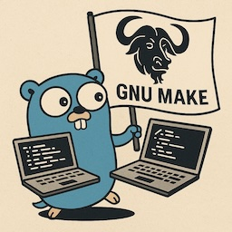

# Standardizing Go Build Systems Across 15 Microservices with Claude Code
<!-- tags: golang, claude code, make  -->



## TL;DR

I used **Claude Code** to standardize build systems across 15+ Go microservices, maintaining 100% test pass rates.

**Key results:**

- 81% reduction in Makefile boilerplate (170 → 30 lines)
- Developer onboarding: 1 hour → 15 minutes
- Zero production incidents

**The technique:** Feed Claude Code reference repos using `@../service-a/Makefile` syntax - don't ask it to invent, ask it to extract proven patterns.

## The Problem: When Build Systems Diverge

Go lacks [Maven](https://maven.apache.org/), [Gradle](https://gradle.org/), or [sbt](https://www.scala-sbt.org/) equivalents. While Java has standardized build tools that enforce consistency, Go teams rely on:

- **Makefiles** for build automation
- **External binaries** like [`mockery`](https://github.com/vektra/mockery) (code generation) and [`golangci-lint`](https://github.com/golangci/golangci-lint) (linting)
- Tools installed either globally or project-local

This works fine for a single service. But when you have 10+ services, each 90% similar but 100% inconsistent, you end up with a maintenance nightmare.

### The Developer Onboarding Problem

Here's what a new developer experienced trying to run tests on their first day:

```bash
1. git clone <repo>
2. make test
   ❌ golangci-lint: command not found

3. brew install golangci-lint  # (installs wrong version)
4. make test
   ❌ Error: mockery: command not found

5. brew install mockery
6. make generate
   ❌ Mocks not found (expected in different folder)
7. make test
   ❌ Tests fail in CI (different tool versions)

8. 1 hour later: still not running
```

**This happened to EVERY new team member.**

The root causes:

- **Makefile duplication**: ~170 lines per repo, 95% identical
- **Mock inconsistency**: 50% of services didn't commit mocks → CI randomly failed
- **Global tool dependencies**: Version chaos across developer machines
- **Copy-paste errors**: CI/CD configuration diverged over time

## The Secret: Reference Repo Pattern

**Don't ask Claude Code to invent solutions - ask it to extract patterns from proven implementations.**

**Instead of:**
> "Claude, figure out how to build Go services"

**We used:**
> "Claude, study these 3 working repos and extract common patterns"

```bash
@../service-a/Makefile
@../service-b/Makefile
@../service-c/Makefile
```

**Why this works:** Copies proven patterns, reduces hallucination risk, tests verify immediately.

## The Journey: Two Phases

### Phase 1: Standardize Individual Repos (8 repos)

**The Approach:**

1. **First migration**: Manual + Claude Code on one service, document decisions in migration guide
2. **Parallel execution**: Used tmux with 6-8 panes, each running one Claude Code session referencing `@MIGRATION_GUIDE.md` (30-45 minutes per service)

**What got standardized:**

- Tools as code dependencies (see [Manage Go CLI tools via Go modules and tools.go](../2023/2023-11-27-tools-go.md))
- Mocks committed to repository (see [Golang: Do you commit your generated mocks to repo?](../2023/2023-01-17-commit-go-gen-mock.md))
- Multi-arch builds with single Dockerfile (amd64 + arm64)
- Consistent Makefile structure

### Phase 2: Extract Common Components (7 repos)

Claude Code analyzed 9 repositories and discovered Makefiles were 95% identical (~170 lines each): same build functions, Docker patterns, tools, and quality gates.

**Result:** Extracted to [go-service-common-make](https://github.com/halyph/go-service-common-make)  

**Architecture:**

```text
go-service-common-make/
├── common.mk              # Entry point
├── common.build.mk        # Multi-arch builds
├── common.docker.mk       # Docker buildx
├── common.tools.mk        # Tools installation
├── common.quality.mk      # Test, lint, generate
└── common.help.mk         # Help system
```

**Per-repo Makefile:**

```makefile
COMMON_MAKE_VERSION := v1.0.0
COMMON_MAKE_REPO    := git@github.com:halyph/go-service-common-make.git

.common-make/common.mk: .common-make/.version-$(COMMON_MAKE_VERSION)
.common-make/.version-$(COMMON_MAKE_VERSION):
	@rm -rf .common-make
	@git clone --depth=1 --branch $(COMMON_MAKE_VERSION) \
	           $(COMMON_MAKE_REPO) .common-make
	@rm -rf .common-make/.git
	@touch .common-make/.version-$(COMMON_MAKE_VERSION)

APPLICATION := my-service
include .common-make/common.mk
```

**Phase 2 Results:**

All services built successfully on first try. Nearly all tests passed—the one failure was pre-existing lint issue unrelated to migration.

## Key Takeaways

**What made this work:**

- **Reference repos eliminate AI guesswork** - Feed Claude proven implementations using `@path/to/file` syntax instead of asking it to invent solutions
- **Standardize first, extract later** - Get individual repos working before creating shared components. This validates patterns before extracting them
- **Sub-agents for exploration** - Used sub-agents when analyzing across 9+ repositories to avoid context limits in main session

## References

### GitHub Repositories

- [go-service-blueprint](https://github.com/halyph/go-service-blueprint)
- [go-service-common-make](https://github.com/halyph/go-service-common-make)

### Related Blog Posts

- [Manage Go CLI tools via Go modules and tools.go](../2023/2023-11-27-tools-go.md)
- [Golang: Do you commit your generated mocks to repo?](../2023/2023-01-17-commit-go-gen-mock.md)
