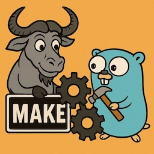
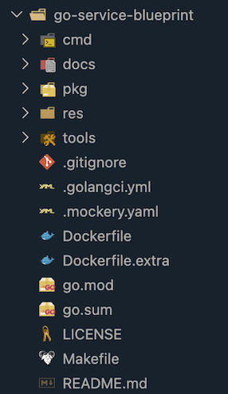
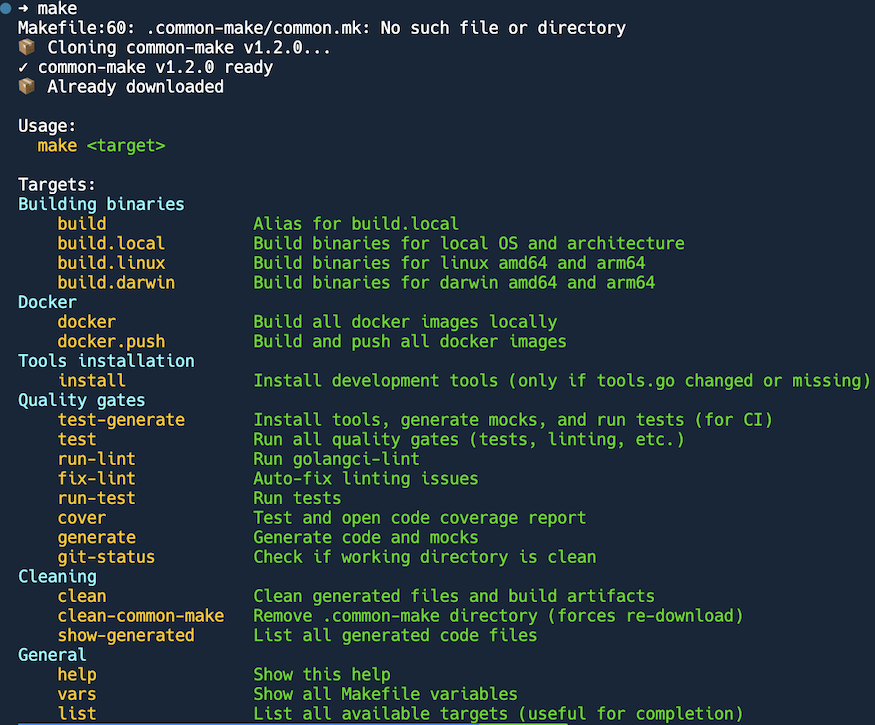
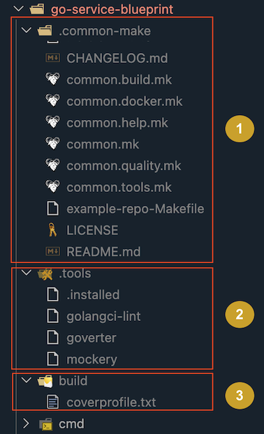

# common-make: Zero-Setup Build Automation for Go Services
<!-- tags: golang, make  -->



## TL;DR

In my previous [post](../2026/2026-04-23-standardizing-go-build-systems.md) I explained the need for [common-make](https://github.com/halyph/go-service-common-make). Here I'm going to present main features which might motivate you to apply the similar approaches in your day-to-day work.

**Main features**:

1. **No manual work** - after `git clone`, everything works out of the box
2. **Dependency auto-install** - all related tools will be downloaded in background

After setup, developers get 20+ make targets (`make help`) including multi-arch builds, auto-linting, and code generation - all without configuration.


## Typical workflow

### `Makefile` setup

We assume each Go-service uses the following `Makefile` (see extended sample [go-service-blueprint](https://github.com/halyph/go-service-blueprint)).

This file contains only the essentials:

```make
# Capture built-in Make variables (required for 'make vars' to work)
VARS_OLD := $(.VARIABLES)

# ============================================
# Common Makefile Configuration
# ============================================
COMMON_MAKE_VERSION := v1.2.0
COMMON_MAKE_REPO := git@github.com:halyph/go-service-common-make.git

# Auto-download common-make if missing
.common-make/common.mk: .common-make/.version-$(COMMON_MAKE_VERSION)
	@echo "📦 Already downloaded"

.common-make/.version-$(COMMON_MAKE_VERSION):
	@echo "📦 Cloning common-make $(COMMON_MAKE_VERSION)..."
	@rm -rf .common-make
	@# Try quiet clone first (suppresses git warnings), fallback to verbose if it fails (for debugging)
	@git clone --depth=1 --branch $(COMMON_MAKE_VERSION) --single-branch --quiet $(COMMON_MAKE_REPO) .common-make 2>/dev/null || \
		git clone --depth=1 --branch $(COMMON_MAKE_VERSION) --single-branch $(COMMON_MAKE_REPO) .common-make || \
		(echo "❌ Failed to clone common-make repository" && exit 1)
	@rm -rf .common-make/.git
	@touch .common-make/.version-$(COMMON_MAKE_VERSION)
	@echo "✓ common-make $(COMMON_MAKE_VERSION) ready"

# ============================================
# Application Configuration
# ============================================
APPLICATION := go-service-blueprint

# ============================================
# Include Common Makefile
# ============================================
include .common-make/common.mk
```

### Normal flow

Initially the project folder doesn't have `.dot` sub-folders:



Run `make` to auto-download tooling:



Run `make test`. This command depends on tools, so they will be downloaded automatically:

```shell
➜ make test
Installing tools from /Users/oivasiv/Projects/comm-make-prj/go-service-blueprint/tools/tools.go
go install github.com/golangci/golangci-lint/cmd/golangci-lint
go install github.com/jmattheis/goverter/cmd/goverter
go install github.com/vektra/mockery/v2
PATH="/Users/oivasiv/Projects/comm-make-prj/go-service-blueprint/.tools:$PATH" golangci-lint --version
golangci-lint has version v1.61.0 built with go1.26.2 from (unknown, modified: ?, mod sum: "h1:VvbOLaRVWmyxCnUIMTbf1kDsaJbTzH20FAMXTAlQGu8=") on (unknown)
PATH="/Users/oivasiv/Projects/comm-make-prj/go-service-blueprint/.tools:$PATH" golangci-lint run /Users/oivasiv/Projects/comm-make-prj/go-service-blueprint/cmd/cli /Users/oivasiv/Projects/comm-make-prj/go-service-blueprint/cmd/server /Users/oivasiv/Projects/comm-make-prj/go-service-blueprint/pkg/handler /Users/oivasiv/Projects/comm-make-prj/go-service-blueprint/pkg/handler/dto /Users/oivasiv/Projects/comm-make-prj/go-service-blueprint/pkg/model /Users/oivasiv/Projects/comm-make-prj/go-service-blueprint/pkg/model/converter /Users/oivasiv/Projects/comm-make-prj/go-service-blueprint/pkg/model/converter/generated /Users/oivasiv/Projects/comm-make-prj/go-service-blueprint/pkg/repository /Users/oivasiv/Projects/comm-make-prj/go-service-blueprint/pkg/repository/converter /Users/oivasiv/Projects/comm-make-prj/go-service-blueprint/pkg/repository/converter/generated /Users/oivasiv/Projects/comm-make-prj/go-service-blueprint/pkg/repository/entity /Users/oivasiv/Projects/comm-make-prj/go-service-blueprint/pkg/service/factorial
go test -race -count=1 -mod=readonly -cover -coverprofile build/coverprofile.txt -tags=integration /Users/oivasiv/Projects/comm-make-prj/go-service-blueprint/cmd/cli /Users/oivasiv/Projects/comm-make-prj/go-service-blueprint/cmd/server /Users/oivasiv/Projects/comm-make-prj/go-service-blueprint/pkg/handler /Users/oivasiv/Projects/comm-make-prj/go-service-blueprint/pkg/handler/dto /Users/oivasiv/Projects/comm-make-prj/go-service-blueprint/pkg/model /Users/oivasiv/Projects/comm-make-prj/go-service-blueprint/pkg/model/converter /Users/oivasiv/Projects/comm-make-prj/go-service-blueprint/pkg/model/converter/generated /Users/oivasiv/Projects/comm-make-prj/go-service-blueprint/pkg/repository /Users/oivasiv/Projects/comm-make-prj/go-service-blueprint/pkg/repository/converter /Users/oivasiv/Projects/comm-make-prj/go-service-blueprint/pkg/repository/converter/generated /Users/oivasiv/Projects/comm-make-prj/go-service-blueprint/pkg/repository/entity /Users/oivasiv/Projects/comm-make-prj/go-service-blueprint/pkg/service/factorial
        github.com/halyph/go-service-blueprint/cmd/cli          coverage: 0.0% of statements
        github.com/halyph/go-service-blueprint/cmd/server               coverage: 0.0% of statements
        github.com/halyph/go-service-blueprint/pkg/handler              coverage: 0.0% of statements
?       github.com/halyph/go-service-blueprint/pkg/handler/dto  [no test files]
ok      github.com/halyph/go-service-blueprint/pkg/model        1.758s  coverage: [no statements]
ok      github.com/halyph/go-service-blueprint/pkg/model/converter      1.892s  coverage: 87.5% of statements
        github.com/halyph/go-service-blueprint/pkg/model/converter/generated            coverage: 0.0% of statements
ok      github.com/halyph/go-service-blueprint/pkg/repository   5.088s  coverage: 66.7% of statements
?       github.com/halyph/go-service-blueprint/pkg/repository/converter [no test files]
        github.com/halyph/go-service-blueprint/pkg/repository/converter/generated               coverage: 0.0% of statements
?       github.com/halyph/go-service-blueprint/pkg/repository/entity    [no test files]
ok      github.com/halyph/go-service-blueprint/pkg/service/factorial    1.532s  coverage: 100.0% of statements
```

At the end you should see something like this:



After running tests, your project structure includes three new directories:

1. `.common-make` is shallow `git clone` of `go-service-common-make` repo
2. `.tools` contains dependent development tools, see `.common-make/common.tools.mk` and `tools/` folder
3. `build` contains build artifacts (e.g. code coverage report or binaries)

### Tips for Daily Development

**LOCAL_COMMON_MAKE for testing** (advanced): When developing changes to **common-make** itself, you can use a local version. This requires adding the `LOCAL_COMMON_MAKE` `ifdef` block to your Makefile (see [go-service-blueprint Makefile](https://github.com/halyph/go-service-blueprint/blob/master/Makefile) for full example):

```bash
make LOCAL_COMMON_MAKE=../go-service-common-make test
```

This allows testing modifications before pushing to the shared repository.

**Quick verification**: Use `make vars` to inspect all available variables and confirm configuration.


## Using a Different **common-make** Version

1. Update `COMMON_MAKE_VERSION` based on [go-service-common-make/tags](https://github.com/halyph/go-service-common-make/tags)
2. Run `make` or any `make <target>`. It will automatically update local `common-make` installation

## Troubleshooting

**Issue:** Failed to clone **common-make** repository

- Verify SSH access to GitHub: `ssh -T git@github.com`
- Check version exists: visit [tags page](https://github.com/halyph/go-service-common-make/tags)

**Issue:** Tools not being installed

- Clean and reinstall: `make clean && make install`
- Verify `tools/tools.go` exists in your repository

**Issue:** Need to force update **common-make**

- Run: `make clean-common-make` (forces re-download on next make invocation)

## References

### GitHub Repositories

- [go-service-**common-make**](https://github.com/halyph/go-service-common-make) - Shared Makefile library
- [go-service-blueprint](https://github.com/halyph/go-service-blueprint) - Example implementation

### Related Blog Posts

- [Standardizing Go Build Systems Across 15 Microservices with Claude Code](../2026/2026-04-23-standardizing-go-build-systems.md)
- [Manage Go CLI tools via Go modules and tools.go](../2023/2023-11-27-tools-go.md)
- [Golang: Do you commit your generated mocks to repo?](../2023/2023-01-17-commit-go-gen-mock.md)
