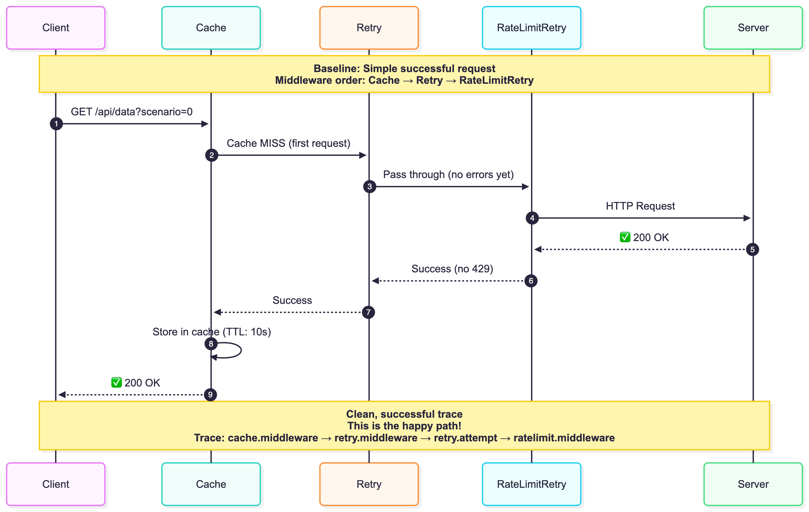
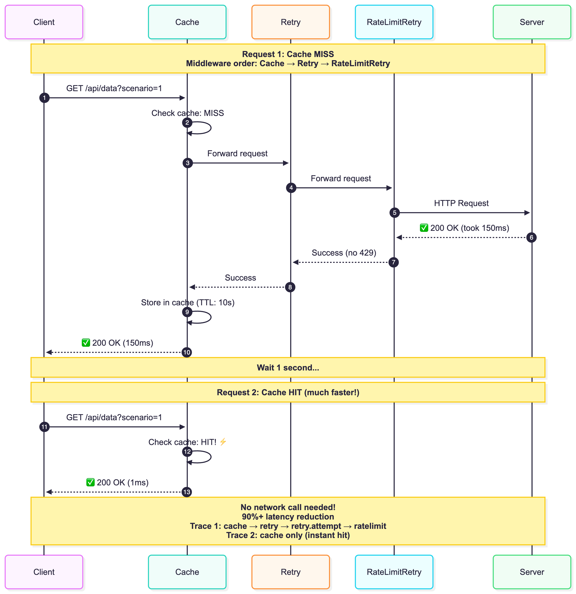
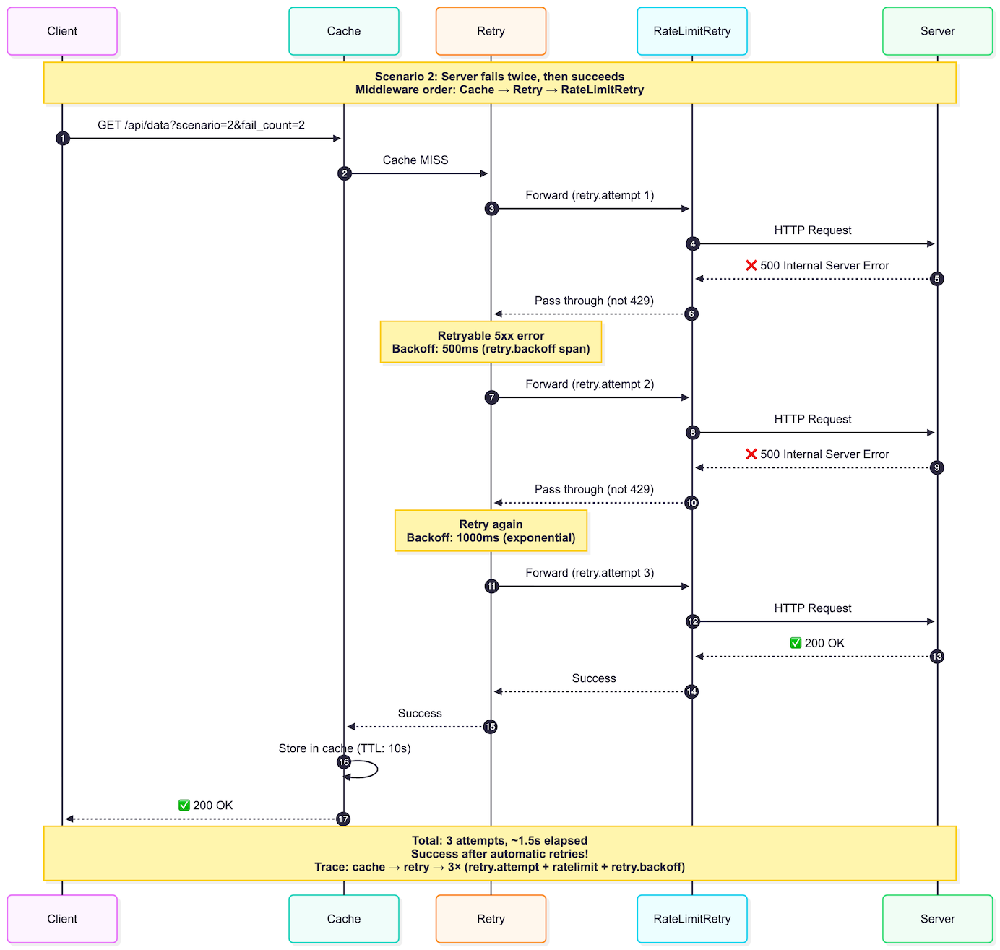
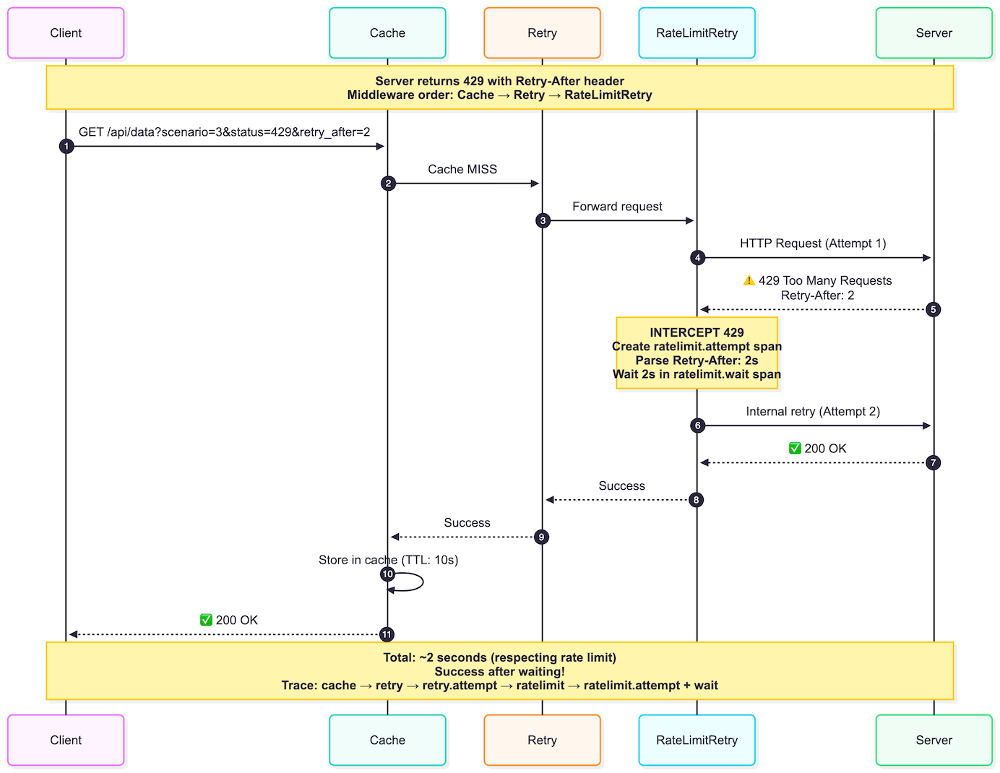
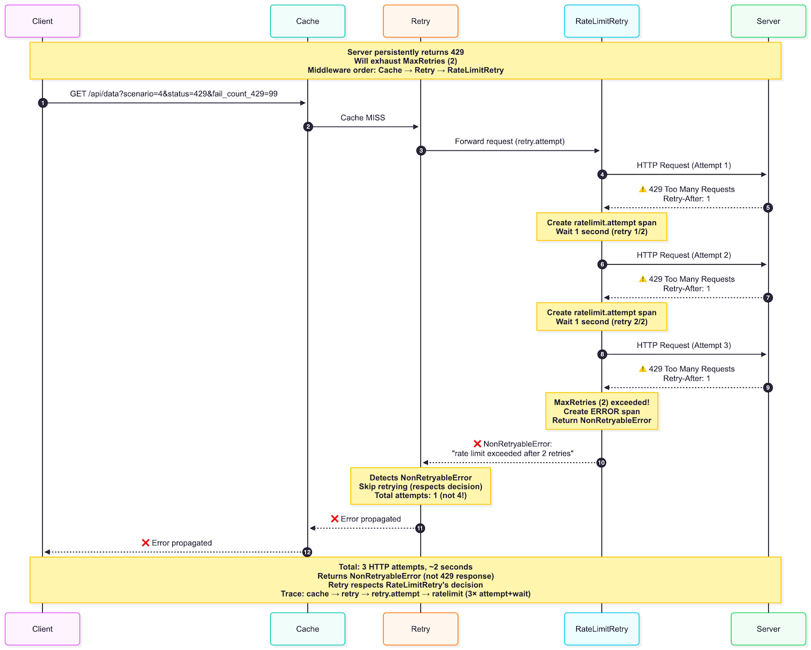
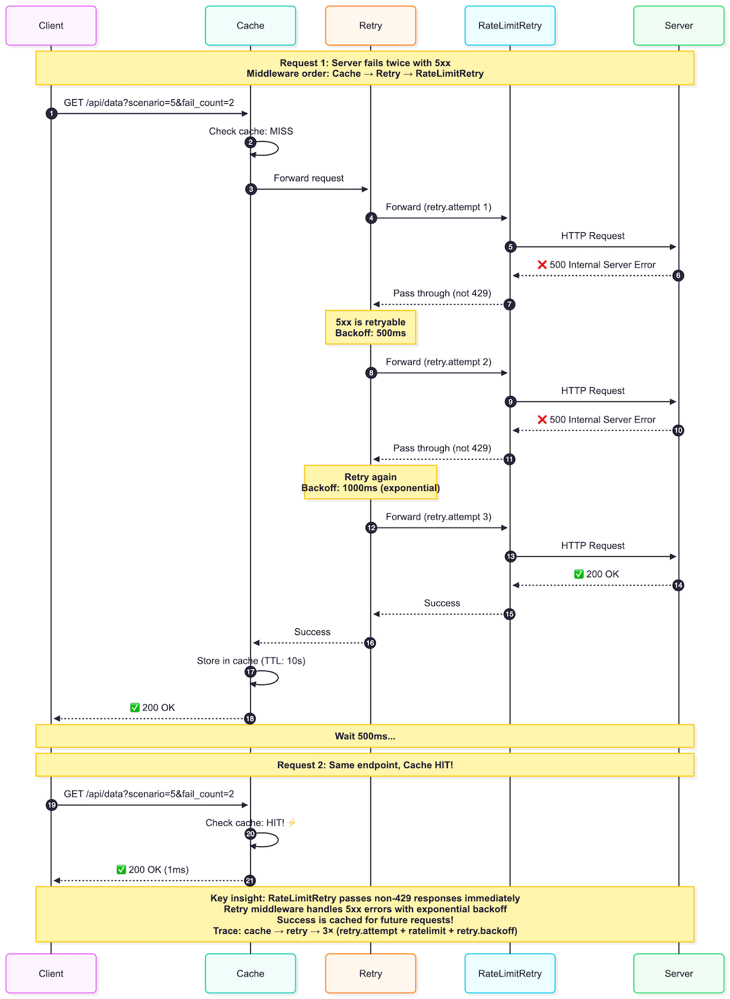
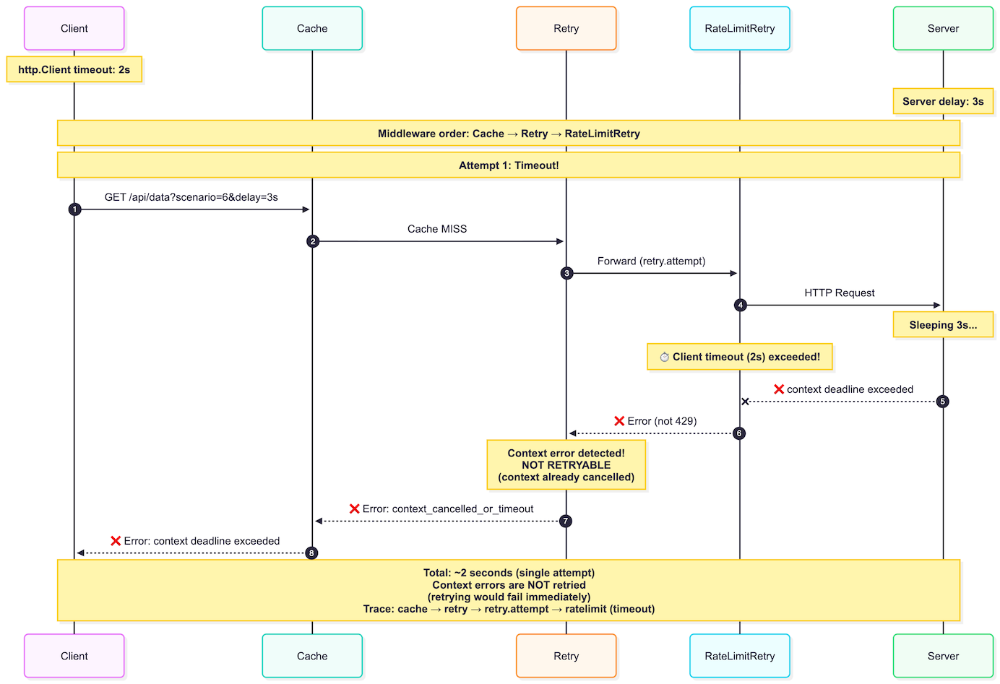
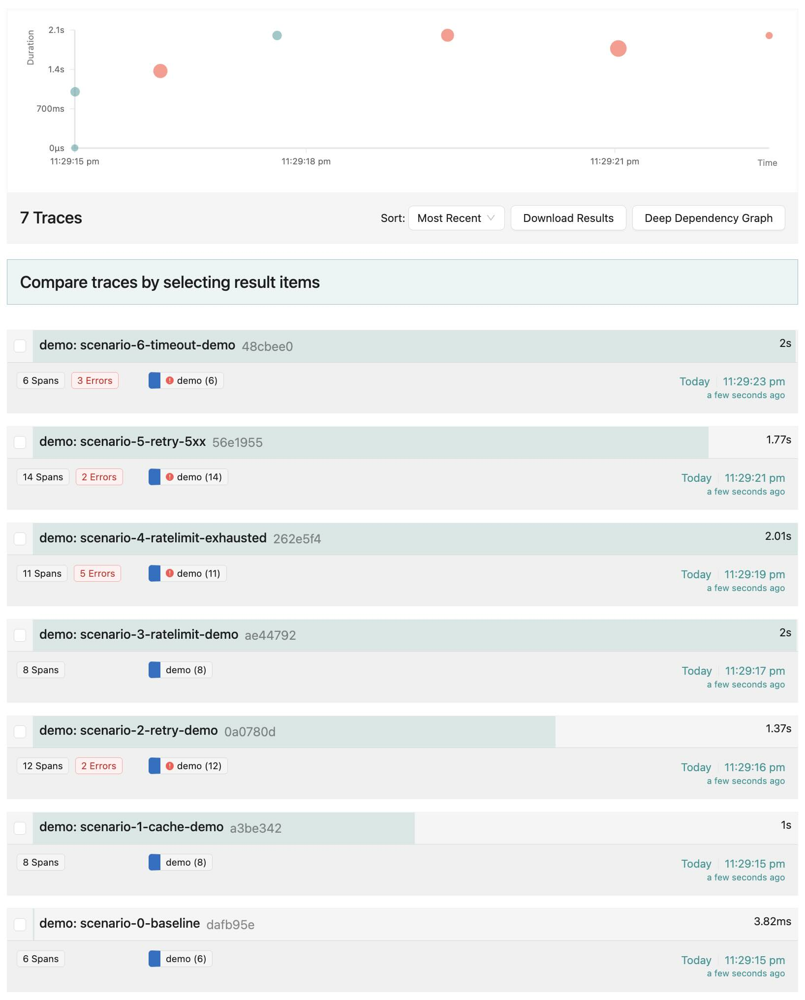
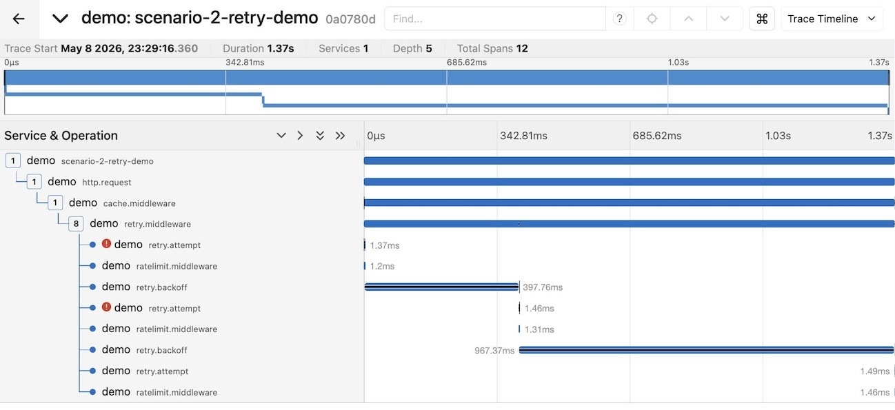

# Building Resilient HTTP Clients in Go: A Middleware Journey
<!-- tags: golang -->


Building reliable HTTP clients means handling failures gracefully. This post shows how a simple retry middleware evolved into a robust three-layer system: *Cache*, *Retry*, and *RateLimitRetry*.

## The Starting Point: Basic Retry

Initially, we had just retry logic with exponential backoff:

```go
func createHTTPClient(tracer trace.Tracer, timeout time.Duration) *http.Client {
    baseClient := &http.Client{Timeout: timeout}
    
    return middleware.WrapClient(baseClient,
        middleware.Retry(middleware.RetryConfig{
            MaxRetries: 3,
            Backoff: middleware.NewExponentialBackoff(
                500*time.Millisecond, // Initial interval
                5*time.Second,        // Max interval
                30*time.Second,       // Max elapsed time
            ),
            Tracer: tracer,
        }),
    )
}
```

This handles transient failures (5xx errors) but has limitations:

- Every request hits the external API
- Rate limits (429) get treated like any other retry
- No awareness of `Retry-After` headers

## The Evolution: Adding Cache + RateLimitRetry

The enhanced version adds two specialized middleware layers:

```go
func createHTTPClient(tracer trace.Tracer, timeout time.Duration) *http.Client {
    baseClient := &http.Client{Timeout: timeout}
    
    return middleware.WrapClient(baseClient,
        middleware.Cache(middleware.CacheConfig{
            TTL:    10 * time.Second,
            Tracer: tracer,
        }),
        middleware.Retry(middleware.RetryConfig{
            MaxRetries: 3,
            Backoff: middleware.NewExponentialBackoff(
                500*time.Millisecond,
                5*time.Second,
                30*time.Second,
            ),
            Tracer: tracer,
        }),
        middleware.RateLimitRetry(middleware.RateLimitRetryConfig{
            MaxRetries:        2,
            MaxRetryAfterWait: 10 * time.Second,
            DefaultRetryAfter: 2 * time.Second,
            Tracer:            tracer,
        }),
    )
}
```

**Middleware order matters**: Cache → Retry → RateLimitRetry

## Why This Design?

**Cache first** - When a response is cached, the request never reaches retry or rate limit layers. Cache hits return in ~1ms vs 100ms+ for API calls.

**RateLimitRetry** - HTTP 429 isn't a failure, it's intentional throttling. The `Retry-After` header tells you exactly when to retry - no guessing with exponential backoff. For 5xx errors, it passes through to the general Retry middleware.

**Separation of concerns** - Each middleware handles one failure type. OpenTelemetry tracing shows exactly which layer handled each request.

## Scenarios: The Middleware in Action

All scenarios use the complete middleware chain shown above.

### Scenario 0: Baseline



Happy path - request flows through all layers, succeeds.

### Scenario 1: Cache Hit/Miss



First request (MISS): 150ms. Second request (HIT): instant.

### Scenario 2: Retry with 5xx



Server returns 500 twice, then succeeds with exponential backoff.

### Scenario 3: Rate Limit Handling



429 with `Retry-After: 2` → waits 2s → retries → succeeds.

### Scenario 4: Rate Limit Exhaustion



Persistent 429s exhaust retry limit, fails gracefully.

### Scenario 5: 5xx Passes Through



RateLimitRetry passes 5xx to Retry (no RateLimitRetry spans). Success gets cached.

### Scenario 6: Timeout



Client timeout exceeded - fails fast, no retry.

## See It in Action

Want to see how these middleware patterns work in real code?  
The complete implementation with a live demo is ready to run: **[demo-http-middleware-patterns](https://github.com/halyph/demo-http-middleware-patterns)**

### What You Get

- **Production-ready middleware** - *Cache*, *Retry*, and *RateLimitRetry* using battle-tested libraries ([jellydator/ttlcache](https://github.com/jellydator/ttlcache), [cenkalti/backoff](https://github.com/cenkalti/backoff))
- **Visual debugging** - OpenTelemetry traces show exactly how requests flow through the middleware layers
- **7 interactive scenarios** - See cache hits, exponential backoff, rate limit handling, and edge cases in action

### Run the Demo

One command launches everything:

```shell
➜ make demo
go build -o bin/demo cmd/demo/main.go
go build -o bin/api cmd/external-api/main.go
docker-compose up -d
[+] Running 1/1
 ✔ Container jaeger  Started                                                                                                                                                                        0.2s 
Stopping any existing API instances...
Starting API...
# Run API in background, discard output, save PID to file
# bin/api > /dev/null 2>&1 & - runs API in background, discards stdout/stderr
# echo $! > /tmp/http-middleware-api.pid - saves PID of last background process to file
Running demo...
2026/05/08 23:29:15 🚀 HTTP Middleware Demo (With Middleware) - Starting...
2026/05/08 23:29:15 ✅ Tracer initialized, connected to OTLP endpoint
2026/05/08 23:29:15 ✅ HTTP client configured with middleware:
2026/05/08 23:29:15    1. Cache (TTL: 10s)
2026/05/08 23:29:15    2. Retry (max 3 retries, exponential backoff)
2026/05/08 23:29:15    3. Rate Limit Retry (max 2 retries, max wait 10s)
2026/05/08 23:29:15 
================================================================================
2026/05/08 23:29:15 Running Demo Scenarios with Middleware
2026/05/08 23:29:15 ================================================================================

2026/05/08 23:29:15 📌 Scenario 0: Baseline - Successful Request
2026/05/08 23:29:15    Simple request with no issues (green trace)
2026/05/08 23:29:15    ⏳ Making successful request...
2026/05/08 23:29:15    ✅ Success (took 3ms)
2026/05/08 23:29:15    This is your baseline - a clean, successful trace!
2026/05/08 23:29:15 
2026/05/08 23:29:15 📌 Scenario 1: Cache Demonstration
2026/05/08 23:29:15    Testing cache hit/miss behavior
2026/05/08 23:29:15    ⏳ Request 1: Should be cache MISS...
2026/05/08 23:29:15    ✅ Success - Cache MISS (took 0ms)
2026/05/08 23:29:16    ⏳ Request 2: Should be cache HIT...
2026/05/08 23:29:16    ✅ Success - Cache HIT (much faster!) (took 0ms)
2026/05/08 23:29:16 
2026/05/08 23:29:16 📌 Scenario 2: Retry Demonstration
2026/05/08 23:29:16    Server will fail 2 times, then succeed
2026/05/08 23:29:16    ⏳ Making request (will retry automatically)...
2026/05/08 23:29:17    ✅ Success after retries (took 1369ms)
2026/05/08 23:29:17    Check Jaeger to see retry attempts with backoff!
2026/05/08 23:29:17 
2026/05/08 23:29:17 📌 Scenario 3: Rate Limit Retry Demonstration
2026/05/08 23:29:17    Server will return 429, middleware will retry after delay
2026/05/08 23:29:17    ⏳ Making request (will get 429, then retry)...
2026/05/08 23:29:19    ✅ Success after rate limit retry (took 2003ms)
2026/05/08 23:29:19 
2026/05/08 23:29:19 📌 Scenario 4: Rate Limit Retry Exhaustion
2026/05/08 23:29:19    Server will persistently return 429, MaxRetries will be exceeded
2026/05/08 23:29:19    Config: MaxRetries=2, so total 3 attempts (initial + 2 retries)
2026/05/08 23:29:19    ⏳ Making request (will exhaust retries)...
2026/05/08 23:29:19    Attempt 1: 429 → Wait 1s
2026/05/08 23:29:19    Attempt 2: 429 → Wait 1s (retry 1/2)
2026/05/08 23:29:19    Attempt 3: 429 → Wait 1s (retry 2/2)
2026/05/08 23:29:19    Give up: MaxRetries exceeded
2026/05/08 23:29:21    ⚠️  Expected failure: request failed: Get "http://localhost:8081/api/data?scenario=4&status=429&retry_after=1&fail_count_429=99": rate limit exceeded after 2 retries
2026/05/08 23:29:21    (took 2006ms total - ~3 seconds)
2026/05/08 23:29:21    Check Jaeger to see all retry attempts marked as ERROR!
2026/05/08 23:29:21 
2026/05/08 23:29:21 📌 Scenario 5: Cache MISS → 5xx → Retry → Success → Cache
2026/05/08 23:29:21    Demonstrates architectural separation: RateLimitRetry silently passes 5xx to Retry
2026/05/08 23:29:21    Note: No RateLimitRetry spans in trace (only handles 429)
2026/05/08 23:29:21    ⏳ Request 1: Cache MISS, will get 5xx errors...
2026/05/08 23:29:23    ✅ Success after retries (took 1269ms)
2026/05/08 23:29:23    5xx errors passed through RateLimitRetry to Retry middleware
2026/05/08 23:29:23    ⏳ Request 2: Same endpoint, should hit cache now...
2026/05/08 23:29:23    ✅ Success from cache - Much faster! (took 0ms)
2026/05/08 23:29:23 
2026/05/08 23:29:23 📌 Scenario 6: Client Timeout Demonstration
2026/05/08 23:29:23    Tests what happens when http.Client timeout is exceeded
2026/05/08 23:29:23    Client timeout: 2s, Server delay: 3s
2026/05/08 23:29:23    ⏳ Request 1: Server delay (3s) > Client timeout (2s)
2026/05/08 23:29:23    Expecting: Multiple timeout errors, then failure
2026/05/08 23:29:25    ⚠️  Expected timeout failure: request failed: Get "http://localhost:8081/api/data?scenario=6&delay=3s": request failed due to context cancellation after 1 attempts: context deadline exceeded (Client.Timeout exceeded while awaiting headers)
2026/05/08 23:29:25    (took 2001ms total - includes retry attempts)
2026/05/08 23:29:25    Check Jaeger: Each retry.attempt shows context deadline exceeded
2026/05/08 23:29:25 
2026/05/08 23:29:25 
⏳ Waiting for traces to be exported to Jaeger...
2026/05/08 23:29:30 
================================================================================
2026/05/08 23:29:30 ✅ Demo Complete!
2026/05/08 23:29:30 ================================================================================
2026/05/08 23:29:30 
📊 Open Jaeger UI to see traces:
2026/05/08 23:29:30    http://localhost:16686
2026/05/08 23:29:30    1. Select service: demo
2026/05/08 23:29:30    2. Click 'Find Traces'
2026/05/08 23:29:30    3. Explore traces - you'll see:
2026/05/08 23:29:30       - Cache hits and misses
2026/05/08 23:29:30       - Retry attempts with backoff
2026/05/08 23:29:30       - Rate limit handling
2026/05/08 23:29:30       - Middleware layers in action!
2026/05/08 23:29:30 
Stopping API...
```

This builds binaries, starts Jaeger, executes all 7 scenarios, and opens the trace UI. The sequence diagrams in this post? They come straight from those traces.

Perfect for understanding middleware patterns visually or adapting the code for your own projects.

See all traces in **Jaeger**



Sample trace for **Scenario 2: Retry with 5xx**


