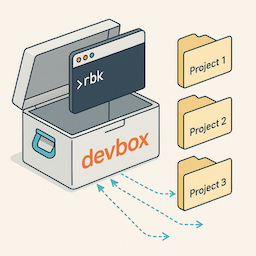

# devbox: Personal Makefile Extensions Without Team Conflicts
<!-- tags: make, devex -->



## TL;DR

**devbox** is a pattern for extending project Makefiles with personal development workflows without polluting team repositories.

**Key benefits:**

- Personal targets (e.g., `rbk build-proc`, `rbk run-main`, `rbk run-worker` - **define any targets you need**) coexist with team targets (`make test`, `make build`)
- No git history pollution - extensions live in separate repo, symlinked to projects
- Shared utilities (credentials, env files, scripts) across multiple services
- Zero impact on team workflow

Standardizing Makefiles across teams is good ([common-make](2026-05-05-common-make.md)), but some requirements are too specific to personal dev flow. **devbox** lets you extend, not replace.

**Each service gets its own devbox Makefile** that you can freely customize with targets specific to that service's architecture (event processors, workers, multiple apps, etc.).

## The Problem: When Personal Needs Diverge

After [standardizing build systems](2026-04-23-standardizing-go-build-systems.md) with [common-make](2026-05-05-common-make.md), I needed:

- Multiple env configs per service (`.env.test`, `.env.local`, `.env.proc`)
- Quick rebuilds without full test suite (`build-main`, `build-proc`)
- Shared credentials and helper scripts across 10+ microservices
- Custom environment variable loading

These are valuable for personal productivity but don't belong in the team's Makefile.

## The Solution: **devbox** Pattern

**devbox** is a separate git repository that extends project Makefiles via symlinks:

```text
~/Projects/company/
├── devbox/                    # Personal tooling repo
│   ├── Makefile_devbox        # Common devbox targets
│   ├── _scripts/              # Shared utilities
│   │   ├── env-args.sh        # Load env files (key utility!)
│   │   ├── db-tunnel.sh       # SSH tunnel to remote DB
│   │   ├── get-credentials.sh # Fetch from secret store
│   │   └── jwt-decode.sh      # Debug auth tokens
│   ├── service-a/             # Per-service customization
│   │   ├── Makefile           # Service-specific devbox targets
│   │   ├── .env               # Local environment config
│   │   └── .env.proc          # Event processor config
│   └── service-b/
│       ├── Makefile
│       └── .env
│
├── service-a/
│   ├── Makefile               # Team's standard Makefile
│   └── .devbox -> ../devbox   # Symlink (gitignored)
│
└── service-b/
    ├── Makefile
    └── .devbox -> ../devbox
```

## How It Works

### 1. The `rbk` Alias

Add to your shell profile (`~/.zshrc` or `~/.bashrc`):

```bash
alias rbk='f(){ (cd . && make -f .devbox/$(pwd | xargs basename)/Makefile "$@");  unset -f f; }; f'
```

### 2. Three-Layer Makefile Architecture

Example:

```makefile
# In devbox/service-a/Makefile

include .devbox/Makefile_devbox        # Layer 1: Common devbox targets
include $(CURR_DIR)/Makefile           # Layer 2: Team's standard Makefile

## Layer 3: Service-specific devbox targets

EVENT_PROCESSOR_NAME := event-processor
EVENT_PROCESSOR_DIR := ./cmd/$(EVENT_PROCESSOR_NAME)

.PHONY: build-proc
build-proc: ## Build event-processor (no tests)
	CGO_ENABLED=0 go build $(BUILD_FLAGS) -ldflags="$(LINK_FLAGS)" \
		-o build/$(EVENT_PROCESSOR_NAME) $(EVENT_PROCESSOR_DIR)

.PHONY: run-proc
run-proc: build-proc  ## Run event-processor with .env.proc
	$(shell $(DBOX_DIR_NAME)/_scripts/env-args.sh \
		$(DBOX_DIR_NAME)/$(SUB_DUR)/.env.proc) \
		build/$(EVENT_PROCESSOR_NAME) consume --adapter nakadi
```

**Result:** You get both team targets (`make test`) and personal targets (`rbk run-proc`).

Each service can have completely different devbox targets based on its architecture. One service might have `build-proc` and `run-proc` for event processing, another might have `build-worker` for background jobs, or `build-cli` for command-line tools. You define whatever makes sense for each service.

### 3. Environment File Loading: `env-args.sh`

The key utility - dead simple env file loader without overengineering:

```bash
#!/bin/bash
# devbox/_scripts/env-args.sh

ENV_FILE_PATH=$1
env cat $ENV_FILE_PATH | egrep -v "(^#.*|^$)" | xargs -0 | tr '\n' ' '
```

**Usage in Makefile:**

```makefile
run-proc: build-proc
	$(shell .devbox/_scripts/env-args.sh .devbox/service-a/.env.proc) \
		build/event-processor consume
```

## Setup Instructions

### Initial Setup

1. **Create devbox repository:**

    ```bash
    cd ~/Projects/company
    mkdir devbox && cd devbox
    git init
    ```

2. **Create base structure:**

    Create `Makefile_devbox`:

    ```makefile
    .DEFAULT_GOAL := help
    CURR_DIR := $(shell pwd)
    DBOX_DIR_NAME := .devbox
    SUB_DUR := $(shell pwd | xargs basename)
    
    .PHONY: env
    env: ## Show environment info
    	@echo CURR_DIR=$(CURR_DIR)
    	@echo DBOX_DIR_NAME=$(DBOX_DIR_NAME)
    	$(shell env cat $(DBOX_DIR_NAME)/$(SUB_DUR)/.env | xargs -0)
    ```

    Create `_scripts/env-args.sh`:

    ```bash
    #!/bin/bash
    ENV_FILE_PATH=$1
    env cat $ENV_FILE_PATH | egrep -v "(^#.*|^$)" | xargs -0 | tr '\n' ' '
    ```

    ```bash
    chmod +x _scripts/env-args.sh
    ```

3. **Add `rbk` alias:**

    ```bash
    echo "alias rbk='f(){ (cd . && make -f .devbox/\$(pwd | xargs basename)/Makefile \"\$@\");  unset -f f; }; f'" >> ~/.zshrc
    source ~/.zshrc
    ```

### Add Service to devbox

For each service you want to extend:

```bash
cd ~/Projects/company/devbox
mkdir service-a
```

Create `service-a/Makefile`:

```makefile
include .devbox/Makefile_devbox
include $(CURR_DIR)/Makefile

APP_NAME := app
APP_DIR := ./cmd/$(APP_NAME)

.PHONY: build-main
build-main: ## Build main app (no tests)
	CGO_ENABLED=0 go build $(BUILD_FLAGS) -ldflags="$(LINK_FLAGS)" \
		-o build/$(APP_NAME) $(APP_DIR)

.PHONY: run-main
run-main: build-main  ## Run with .env
	$(shell $(DBOX_DIR_NAME)/_scripts/env-args.sh \
		$(DBOX_DIR_NAME)/$(SUB_DUR)/.env) build/$(APP_NAME)
```

Create `service-a/.env`:

```env
# Local development environment
DB_HOST=localhost
DB_USER=postgres
DB_PASSWORD=postgres
DB_NAME=service_a_test
ADDRESS=localhost:8080
ENABLE_TRACING=true
```

Link from service to devbox:

```bash
cd ~/Projects/company/devbox
ln -s $(pwd) ~/Projects/company/service-a/.devbox
```

### Verify Setup

```bash
cd ~/Projects/company/service-a

# Test team's standard targets (still work!)
make test
make build

# Test devbox targets
rbk help        # Shows both team and devbox targets
rbk env         # Shows your custom environment
rbk build-main  # Quick build without tests
rbk run-main    # Run with your .env
```

## When NOT to Use **devbox**

**Don't use **devbox** for:**

- Targets that everyone on team needs (add to team Makefile)
- Production deployment logic (belongs in team's CI/CD)
- Anything that should be standardized across team

**DO use **devbox** for:**

- Personal iteration shortcuts
- Local-only configurations
- Development convenience targets
- Cross-service helper scripts

## Conclusion

**devbox** lets you extend standardized Makefiles without forcing personal preferences on the team. Standardize the foundation, extend where workflows diverge.

## References

### Related Blog Posts

- [common-make: Zero-Setup Build Automation for Go Services](2026-05-05-common-make.md)
- [Standardizing Go Build Systems Across 15 Microservices with Claude Code](2026-04-23-standardizing-go-build-systems.md)

### Key Files

- `devbox/Makefile_devbox` - Common **devbox** targets
- `devbox/_scripts/env-args.sh` - Simple env file loader
- `devbox/<service>/Makefile` - Per-service extensions
