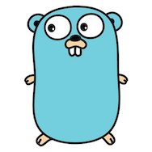

---
tags:
  - golang
---

# Go useful links

 

 

## Official

- [cmd/go](https://pkg.go.dev/cmd/go)
  - [Environment variables](https://pkg.go.dev/cmd/go#hdr-Environment_variables)
  - [`go test` Testing flags](https://pkg.go.dev/cmd/go#hdr-Testing_flags)

## Miscellaneous

- [Go: A Documentary](https://golang.design/history/) is a collection of interesting (publicly observable) issues, discussions, proposals, CLs, and talks from the Go development process, which intends to offer a comprehensive reference of the Go **history**.
